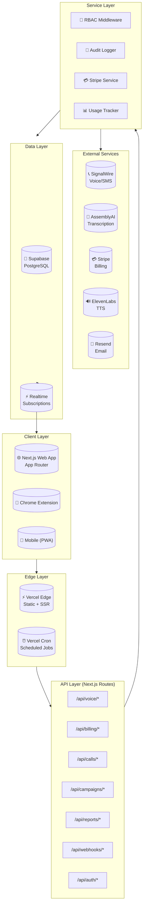
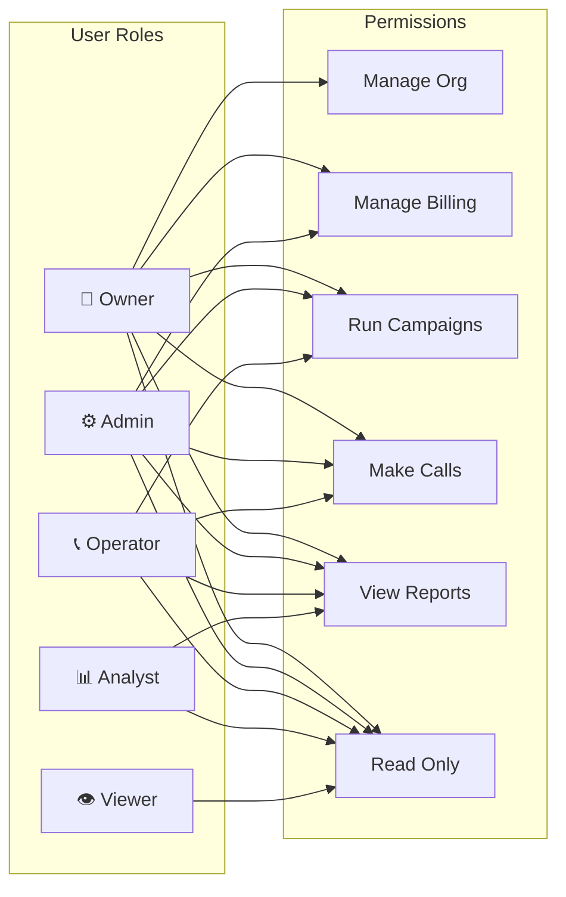
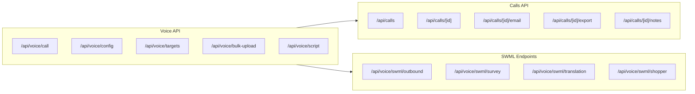
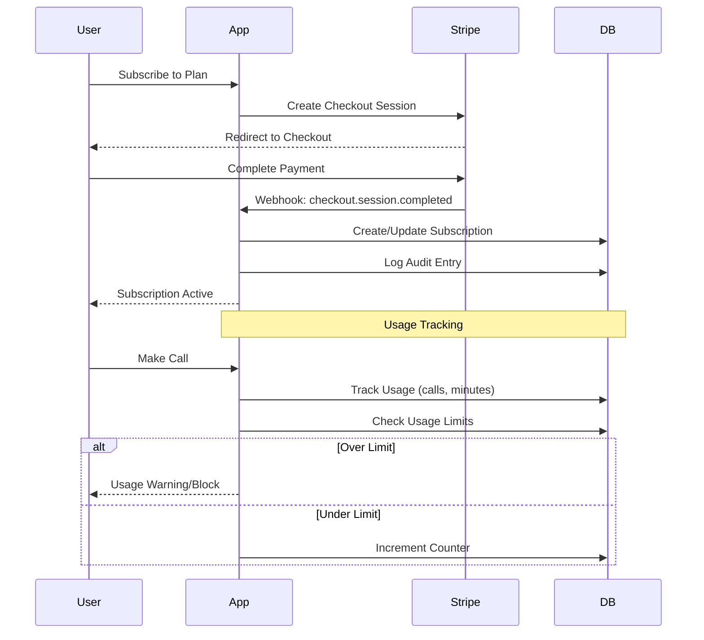
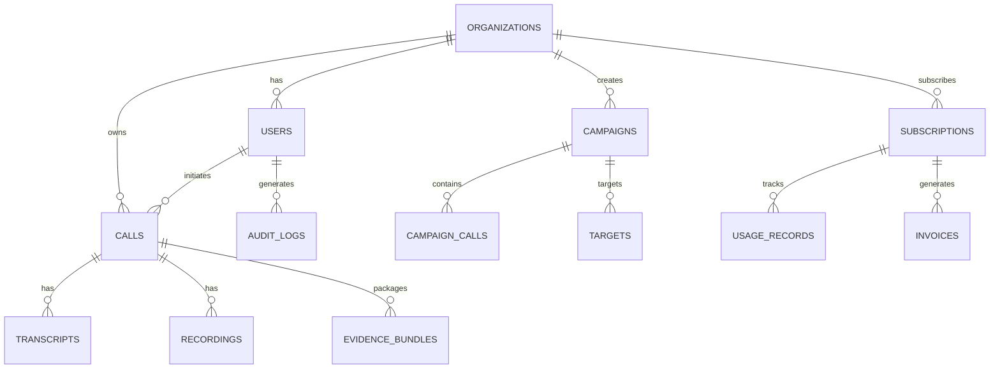
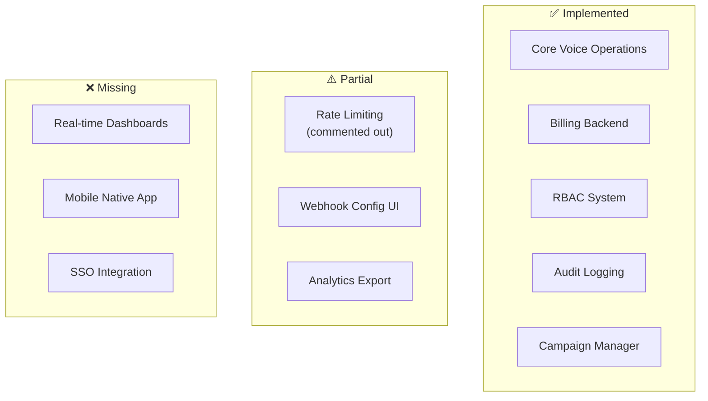

# Wordis Bond - Architecture Documentation

**Last Updated:** January 17, 2026  
**Version:** 3.0  
**Build Status:** ✅ **PASSING** (All TypeScript errors resolved)

---

## 📊 Executive Summary

Wordis Bond is the **System of Record for Business Conversations** - a platform that captures, verifies, and preserves spoken words with evidence-grade integrity. This document reflects the current state after the January 17, 2026 build fixes.

### Build Status Summary

| Metric | Status |
|--------|--------|
| **Build** | ✅ Passing |
| **TypeScript** | ✅ No type errors |
| **Static Pages** | 31 routes generated |
| **Dynamic API Routes** | 96+ endpoints |
| **Database Tables** | 47+ tables |

---

## 🏗️ System Architecture

### High-Level Architecture Diagram



---

## 📁 Directory Structure

```
gemini-project/
├── 📁 app/                    # Next.js App Router
│   ├── 📄 layout.tsx          # Root layout with providers
│   ├── 📄 page.tsx            # Landing page
│   ├── 📁 api/                # 96+ API routes
│   │   ├── 📁 auth/           # NextAuth endpoints
│   │   ├── 📁 billing/        # Stripe integration
│   │   ├── 📁 calls/          # Call management
│   │   ├── 📁 campaigns/      # Campaign management
│   │   ├── 📁 reports/        # Report generation
│   │   ├── 📁 voice/          # Voice operations
│   │   └── 📁 webhooks/       # External webhooks
│   ├── 📁 dashboard/          # Main dashboard
│   ├── 📁 voice/              # Voice operations UI
│   ├── 📁 campaigns/          # Campaign management UI
│   ├── 📁 reports/            # Report builder UI
│   ├── 📁 settings/           # User/org settings
│   └── 📁 analytics/          # Analytics dashboard
│
├── 📁 components/             # React components
│   ├── 📁 ui/                 # Design system (shadcn-style)
│   ├── 📁 voice/              # Voice-specific components
│   ├── 📁 settings/           # Settings components
│   ├── 📁 billing/            # Billing components
│   └── 📁 reports/            # Report components
│
├── 📁 lib/                    # Shared utilities
│   ├── 📄 rbac.ts             # Role-based access control
│   ├── 📁 audit/              # Audit logging system
│   ├── 📁 services/           # Business logic services
│   │   ├── 📄 stripeService.ts
│   │   └── 📄 usageTracker.ts
│   ├── 📁 signalwire/         # SignalWire integration
│   └── 📁 errors/             # Error handling
│
├── 📁 hooks/                  # React hooks
│   ├── 📄 useRBAC.ts          # Role-based access hook
│   └── 📄 useVoiceConfig.ts   # Voice configuration hook
│
├── 📁 types/                  # TypeScript definitions
│   └── 📄 app-error.ts        # Error types
│
└── 📁 ARCH_DOCS/              # Architecture documentation
```

---

## 🔐 Authentication & Authorization

### RBAC Architecture



### Role Definitions

| Role | Permissions | Use Case |
|------|-------------|----------|
| **Owner** | Full access, billing, team management | Account owner |
| **Admin** | All except ownership transfer | Team leads |
| **Operator** | Campaigns, calls, reports | Daily operations |
| **Analyst** | Reports, read-only access | Data analysis |
| **Viewer** | Read-only access | Stakeholders |

---

## 📊 API Endpoint Map

### Voice Operations



### Billing Flow



---

## 🗄️ Database Schema Overview

### Core Tables (47+)



### Key Tables

| Table | Purpose | Records |
|-------|---------|---------|
| `organizations` | Multi-tenant orgs | Per customer |
| `users` | User accounts | Per member |
| `calls` | Call records | High volume |
| `transcripts` | Call transcriptions | Per call |
| `recordings` | Audio recordings | Per call |
| `campaigns` | Outbound campaigns | Per org |
| `subscriptions` | Stripe subscriptions | Per org |
| `usage_records` | Usage metering | High volume |
| `audit_logs` | Compliance audit trail | High volume |

---

## 🔧 Recent Build Fixes (January 17, 2026)

### Issues Resolved

| Issue | Fix Applied | Files Modified |
|-------|-------------|----------------|
| `requireRole` wrong signature | Changed `requireRole('owner', 'admin')` → `requireRole(['owner', 'admin'])` | 10+ API routes |
| Badge variant mismatch | Changed `destructive` → `error`, `outline` → `secondary` | 5 components |
| AppError signature | Added backward-compatible constructor overload | `types/app-error.ts` |
| Select component API | Created Radix-based Select + NativeSelect wrapper | `components/ui/select.tsx` |
| Dialog missing exports | Added DialogContent, DialogHeader, DialogFooter, etc. | `components/ui/dialog.tsx` |
| Button asChild support | Added Radix Slot integration | `components/ui/button.tsx` |
| `@supabase/auth-helpers` deprecated | Migrated to `@supabase/ssr` | `CampaignProgress.tsx` |
| UserRole type mismatch | Added `analyst` to role prop types | 4 settings components |

### New Files Created

| File | Purpose |
|------|---------|
| `lib/audit/auditLogger.ts` | Centralized audit logging system |
| `components/ui/native-select.tsx` | Native HTML select for simple dropdowns |

---

## 🚧 Known Gaps & Recommendations

### Architecture Gaps



### Priority Recommendations

| Priority | Gap | Recommendation |
|----------|-----|----------------|
| 🔴 HIGH | Rate Limiting disabled | Re-implement using proper pattern |
| 🟡 MEDIUM | Webhook UI incomplete | Build settings UI for webhook config |
| 🟡 MEDIUM | Error monitoring | Add Sentry or similar |
| 🟢 LOW | Mobile app | PWA covers most use cases |

---

## 📈 Metrics & Monitoring

### Build Metrics

| Metric | Value |
|--------|-------|
| Static Pages | 31 |
| Dynamic Routes | 96+ |
| Bundle Size (shared) | 87.6 kB |
| Largest Page | /voice (209 kB) |

### Runtime Considerations

- API routes use dynamic rendering (cookies/headers)
- Static pages are pre-rendered at build time
- Real-time features use Supabase subscriptions

---

## 🔗 Quick Links

- **Full Architecture**: [ARCH_DOCS/01-CORE/COMPREHENSIVE_ARCHITECTURE_WITH_VISUALS.md](ARCH_DOCS/01-CORE/COMPREHENSIVE_ARCHITECTURE_WITH_VISUALS.md)
- **Quick Reference**: [ARCH_DOCS/QUICK_REFERENCE.md](ARCH_DOCS/QUICK_REFERENCE.md)
- **Feature Docs**: [ARCH_DOCS/02-FEATURES/](ARCH_DOCS/02-FEATURES/)
- **Error Handling**: [ARCH_DOCS/01-CORE/ERROR_HANDLING_PLAN.txt](ARCH_DOCS/01-CORE/ERROR_HANDLING_PLAN.txt)

---

## ✅ Build Verification

To verify the build:

```bash
npm run build
```

Expected output:
- ✓ Compiled successfully
- ✓ Linting and checking validity of types
- ✓ Generating static pages (31/31)
- Route summary with static (○) and dynamic (ƒ) indicators

---

*Document generated after successful build on January 17, 2026*
