# Business Architecture — Word Is Bond

**TOGAF Phase:** B — Business Architecture  
**Deliverable:** Business Capability Model, Value Stream Map, Actor Catalog  
**Version:** 1.0  
**Date:** February 13, 2026  
**Last Reviewed:** February 13, 2026  
**Status:** Current

---

## 1. Business Capability Model

A business capability is *what* the organization does — independent of how, who, or where.

```mermaid
mindmap
  root((Word Is Bond<br/>Voice Intelligence<br/>Platform))
    Voice Operations
      Outbound Calling
      Inbound Calling
      WebRTC Browser Calls
      PSTN Termination
      Call Recording
      Answering Machine Detection
      IVR Systems
      Call Bridging
      Call Disposition
    Intelligence & AI
      Real-Time Transcription
      Live Translation EN↔ES
      Sentiment Analysis
      Likelihood-to-Pay Scoring
      AI Summarization
      Agent Copilot
      Proactive Alerts
      Auto-Task Generation
    Collections Management
      Account Lifecycle
      Payment Processing
      Promise-to-Pay Tracking
      Task Management
      Portfolio Analytics
      CSV Bulk Import
    Campaign Management
      Predictive Dialing
      Queue Management
      Campaign Analytics
      Objection Rebuttal Library
      Note Templates
    Compliance & Governance
      FDCPA Guardrails
      TCPA Compliance
      HIPAA Controls
      PII Redaction
      Audit Logging
      Evidence Integrity
      SOC 2 Tracking
      DNC Management
    Analytics & Reporting
      KPI Dashboards
      Custom Report Builder
      Scorecards
      Usage Metering
      Performance Analytics
    Identity & Access
      Session-Based Auth
      RBAC 9-Role Hierarchy
      Multi-Tenant Isolation
      Organization Management
      Team Management
    Revenue & Billing
      Subscription Management
      Plan-Based Feature Gating
      Usage Tracking
      Payment Processing
      Dunning Management
    Platform Operations
      Edge Deployment
      Health Monitoring
      Database Management
      Security Controls
      CI/CD Pipeline
```

---

## 2. Business Capability Map (Tabular)

| Level 0 | Level 1 | Level 2 | Maturity | Plan Gate |
|---------|---------|---------|----------|-----------|
| **Voice Operations** | Outbound Calling | Single dial, bulk campaign, branded DID | ✅ Mature | Free+ |
| | Inbound Calling | IVR routing, webhook processing | ✅ Mature | Free+ |
| | WebRTC Calls | Browser-based with mic filtering | ✅ Mature | Free+ |
| | Call Recording | R2 storage, legal hold, chain of custody | ✅ Mature | Pro+ |
| | AMD | Answering machine detection + human routing | ✅ Mature | Business+ |
| | Call Bridging | Conference, transfer, warm handoff | ✅ Mature | Pro+ |
| **Intelligence** | Transcription | Real-time via AssemblyAI + batch | ✅ Mature | Pro+ |
| | Translation | EN↔ES real-time pipeline | ✅ Mature | Business+ |
| | Sentiment Analysis | Call-level sentiment scoring | ✅ Mature | Pro+ |
| | LTP Scoring | Likelihood-to-pay predictive model | ✅ Mature | Business+ |
| | Bond AI Chat | 3-tier assistant (chat/alerts/copilot) | ✅ Mature | Pro+ |
| | Auto-Task | AI generates follow-up tasks from calls | ✅ Mature | Business+ |
| **Collections** | Account CRUD | Full lifecycle with soft-delete | ✅ Mature | Free+ |
| | Payments | Record, balance auto-update | ✅ Mature | Free+ |
| | Promise-to-Pay | Date/amount tracking, follow-up workflow | ✅ Mature | Pro+ |
| | CSV Import | Bulk import with validation | ✅ Mature | Pro+ |
| | Portfolio Stats | Recovery rate, aging, performance | ✅ Mature | Pro+ |
| **Campaigns** | Predictive Dialing | Algorithm-driven outbound | ✅ Mature | Business+ |
| | Queue Management | Priority-based agent assignment | ✅ Mature | Pro+ |
| | Analytics | Campaign ROI, contact rates | ✅ Mature | Pro+ |
| **Compliance** | FDCPA | Disclosure tracking, mini-Miranda | ✅ Mature | Free+ |
| | Audit Logging | Every mutation logged (old/new values) | ✅ Mature | Free+ |
| | PII Redaction | Regex pipeline before AI/logging | ✅ Mature | Free+ |
| | SOC 2 | Certification tracking dashboard | ✅ Mature | Enterprise |
| | Evidence Integrity | Immutable artifacts, chain of custody | ✅ Mature | Business+ |
| **Analytics** | Dashboards | Real-time KPI panels | ✅ Mature | Free+ |
| | Report Builder | Custom queries, scheduled exports | ✅ Mature | Pro+ |
| | Scorecards | Agent/team performance grading | ✅ Mature | Pro+ |
| **Identity** | Authentication | Session-based, PBKDF2, CSRF | ✅ Mature | Free+ |
| | RBAC | 9 roles, 58 permissions, hierarchy | ✅ Mature | Free+ |
| | Multi-Tenancy | RLS on 50+ tables, org isolation | ✅ Mature | Free+ |
| | Teams | Department hierarchy, assignments | ✅ Mature | Pro+ |
| **Billing** | Subscriptions | Stripe integration, plan lifecycle | ✅ Mature | Free+ |
| | Feature Gating | Plan-based capability unlock | ✅ Mature | Free+ |
| | Usage Metering | Calls, minutes, recordings tracked | ✅ Mature | Free+ |
| **Platform** | Edge Deploy | Cloudflare Pages + Workers | ✅ Mature | — |
| | Monitoring | P0/P1/P2 alerting tiers | ✅ Mature | — |
| | Security | WAF, rate limiting, RLS, encryption | ✅ Mature | — |

---

## 3. Value Stream: Call → Revenue

This is the primary value-generating flow — a debt collection outbound call that results in a payment commitment.

```mermaid
flowchart LR
    subgraph PREPARE["1. Prepare"]
        Login["Agent Login"]
        Queue["Review Queue<br/>or Campaign"]
        Account["Select Account<br/>View History"]
    end

    subgraph CONNECT["2. Connect"]
        Dial["Dial Consumer<br/>(WebRTC/PSTN)"]
        AMD2["AMD Check<br/>Human vs Machine"]
        Disclose["Mini-Miranda<br/>FDCPA Disclosure"]
    end

    subgraph CONVERSE["3. Converse"]
        Record["Record Call<br/>→ R2 Storage"]
        Transcribe["Transcribe<br/>→ AssemblyAI"]
        Translate["Translate<br/>(if Spanish)"]
        Assist["AI Copilot<br/>Suggestions"]
    end

    subgraph RESOLVE["4. Resolve"]
        Negotiate["Negotiate<br/>Payment Terms"]
        Promise["Create Promise-<br/>to-Pay"]
        Payment["Record Payment<br/>Update Balance"]
        Disposition["Set Disposition<br/>Code"]
    end

    subgraph ANALYZE["5. Analyze"]
        Score["Sentiment +<br/>LTP Score"]
        Summary["AI Summary<br/>+ Auto-Tasks"]
        Report["Dashboard<br/>KPI Update"]
        Audit["Audit Trail<br/>Sealed"]
    end

    subgraph BILL["6. Bill"]
        Track["Track Usage<br/>(minutes, calls)"]
        Meter["Stripe Metered<br/>Billing"]
        Invoice["Monthly<br/>Invoice"]
    end

    PREPARE --> CONNECT --> CONVERSE --> RESOLVE --> ANALYZE --> BILL

    style PREPARE fill:#e3f2fd
    style CONNECT fill:#f1f8e9
    style CONVERSE fill:#fff3e0
    style RESOLVE fill:#fce4ec
    style ANALYZE fill:#f3e5f5
    style BILL fill:#e0f7fa
```

**Value Stream Metrics:**

| Stage | Key Metric | Target |
|-------|-----------|--------|
| Prepare | Time-to-first-dial | <30 seconds |
| Connect | Contact rate | >40% |
| Converse | Avg handle time | <5 min |
| Resolve | Promise-to-pay rate | >25% |
| Analyze | Compliance score | 100% |
| Bill | Revenue per agent/hour | >$50 |

---

## 4. Actor Catalog

```mermaid
flowchart TB
    subgraph HUMAN["Human Actors"]
        Owner["🏢 Owner<br/>Full org control<br/>Billing, settings"]
        Admin["⚙️ Admin<br/>System config<br/>User management"]
        Manager["📊 Manager<br/>Team oversight<br/>Reports, coaching"]
        Compliance["🔒 Compliance<br/>Audit review<br/>Evidence access"]
        Agent["📞 Agent<br/>Call execution<br/>Collections work"]
        Viewer["👁️ Viewer<br/>Read-only<br/>Dashboard access"]
    end

    subgraph SYSTEM["System Actors"]
        WorkersAPI["⚡ Workers API<br/>Request processing<br/>Business logic"]
        CronJobs["⏰ Cron Triggers<br/>Scheduled tasks<br/>Sync, cleanup"]
        Webhooks["🔗 Webhook Handler<br/>Telnyx events<br/>Stripe events"]
        AIEngine["🤖 AI Engine<br/>Transcription<br/>Analysis, scoring"]
    end

    subgraph EXTERNAL["External Actors"]
        Consumer["👤 Consumer/Debtor<br/>Call recipient<br/>PSTN phone"]
        Telnyx2["📱 Telnyx<br/>Voice provider<br/>Call events"]
        Stripe2["💳 Stripe<br/>Billing provider<br/>Payment events"]
        AIProviders["🧠 AI Providers<br/>Grok, Groq, OpenAI<br/>AssemblyAI"]
    end

    Owner --> Admin
    Admin --> Manager
    Manager --> Agent
    Compliance -.->|"Read-only audit"| Agent

    style HUMAN fill:#e3f2fd
    style SYSTEM fill:#e8f5e9
    style EXTERNAL fill:#fff3e0
```

### Actor-to-Capability Matrix

| Actor | Voice Ops | Collections | Campaigns | Compliance | Analytics | Billing | Admin |
|-------|-----------|-------------|-----------|------------|-----------|---------|-------|
| **Owner** | Execute | Full CRUD | Full CRUD | Full access | Full | Manage | Full |
| **Admin** | Execute | Full CRUD | Full CRUD | Full access | Full | View | Config |
| **Manager** | Monitor | Read + Assign | Manage | View audit | Full | View | Teams |
| **Compliance** | Review recordings | Read | Read | **Full access** | Compliance | — | — |
| **Agent** | **Execute** | Create + Update | Execute | View own | Own metrics | — | — |
| **Viewer** | — | Read (masked) | Read | — | Dashboard | — | — |
| **System (Cron)** | Scheduled calls | Balance sync | Queue process | Auto-audit | Aggregate | Usage report | — |
| **Webhook Handler** | Event processing | — | — | Log events | — | Process payments | — |
| **AI Engine** | Transcribe + score | — | — | PII redact | Analyze | — | — |

---

## 5. Business Services Catalog

| Service | Description | API Endpoints | SLA |
|---------|-------------|---------------|-----|
| **Voice Service** | Call initiation, recording, transcription | `/api/voice/*` (12 endpoints) | p95 <500ms |
| **Collections Service** | Account CRUD, payments, tasks, import | `/api/collections/*` (15 endpoints) | p95 <200ms |
| **Campaign Service** | Campaign management, queue, analytics | `/api/campaigns/*` (8 endpoints) | p95 <300ms |
| **Translation Service** | Real-time EN↔ES translation pipeline | `/api/voice/live-translation/*` | p95 <1000ms |
| **Analytics Service** | Dashboards, reports, scorecards | `/api/analytics/*`, `/api/reports/*` | p95 <500ms |
| **Identity Service** | Auth, RBAC, sessions, organizations | `/api/auth/*`, `/api/organizations/*` | p95 <100ms |
| **Billing Service** | Subscriptions, usage, Stripe webhooks | `/api/billing/*` | p95 <300ms |
| **Compliance Service** | Audit logs, PII redaction, evidence | `/api/compliance/*`, `/api/evidence/*` | p95 <200ms |
| **AI Service** | Bond AI chat, alerts, copilot, scoring | `/api/bond-ai/*` | p95 <2000ms |
| **Team Service** | Teams, members, departments | `/api/teams/*` | p95 <200ms |

---

## 6. Subscription Tiers & Feature Matrix

| Feature | Free | Pro | Business | Enterprise |
|---------|------|-----|----------|------------|
| Voice calling (WebRTC) | ✅ | ✅ | ✅ | ✅ |
| Call recording | — | ✅ | ✅ | ✅ |
| AI transcription | — | ✅ | ✅ | ✅ |
| Live translation | — | — | ✅ | ✅ |
| AMD + predictive dialing | — | — | ✅ | ✅ |
| Bond AI copilot | — | ✅ | ✅ | ✅ |
| Custom reports | — | ✅ | ✅ | ✅ |
| SOC 2 compliance dashboard | — | — | — | ✅ |
| CRM integrations (future) | — | HubSpot | + Salesforce | + Custom |
| Team management | Basic | Full | Full | Full |
| Audit log retention | 30 days | 1 year | 3 years | 7 years |

---

## 7. Market Context

| Dimension | Detail |
|-----------|--------|
| **Target Market** | SMB/mid-market call centers (10-200 employees) |
| **ICP** | $1M-$20M ARR sales/collection organizations needing Gong.ai alternative |
| **Price Point** | $29-$99/user/month |
| **Total Addressable Market** | ~$5B voice AI market |
| **Base Operating Cost** | ~$300/month + usage |
| **Key Differentiator** | System of Record for conversations — evidentiary integrity, AI-as-notary, compliance-first |
| **Verticals** | Debt collection, accounts receivable, insurance, real estate, financial services |

---

## References

- [ARCHITECTURE_VISION.md](../ARCHITECTURE_VISION.md) — Business goals and stakeholder map
- [APPLICATION_FUNCTIONS.md](../APPLICATION_FUNCTIONS.md) — Complete feature inventory
- [06-REFERENCE/FEATURE_GATING.md](../06-REFERENCE/FEATURE_GATING.md) — Plan tier details
- [02-FEATURES/FUTURE_INTEGRATIONS.md](../02-FEATURES/FUTURE_INTEGRATIONS.md) — Planned CRM integrations
- [05-AI/COST_OPTIMIZATION_STRATEGY.md](../05-AI/COST_OPTIMIZATION_STRATEGY.md) — Unit economics
