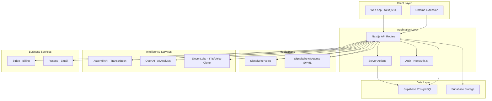
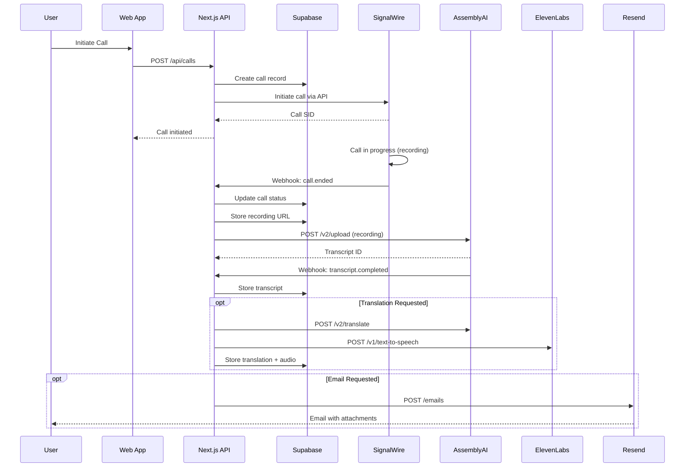
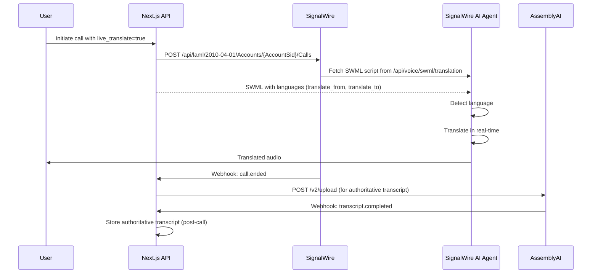
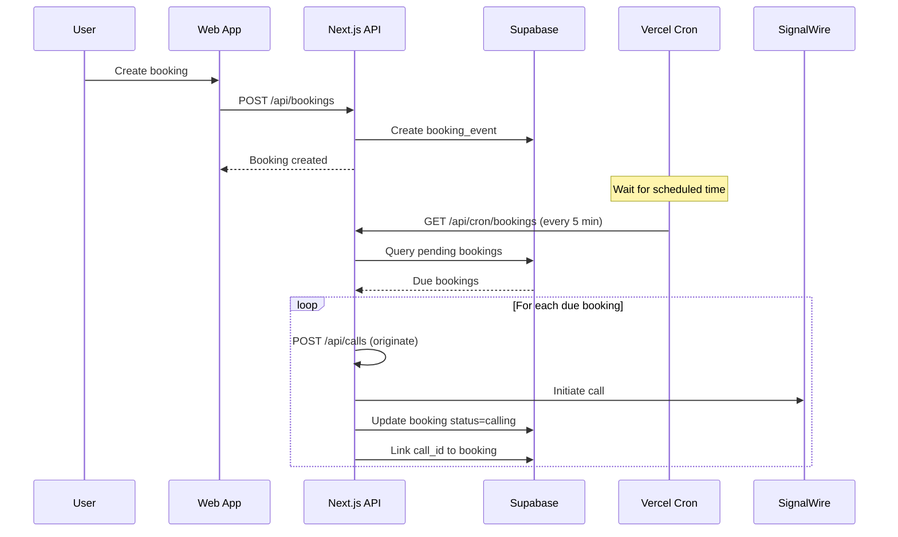
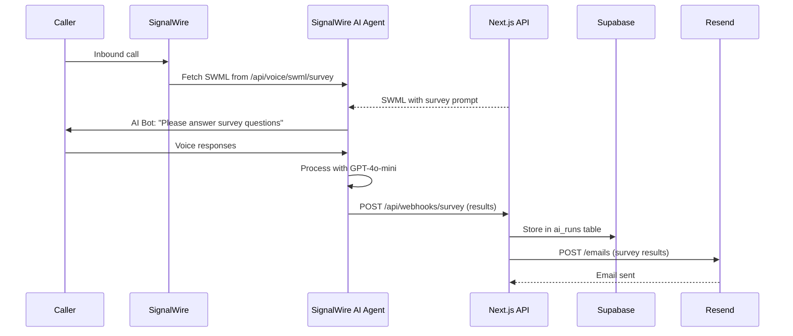
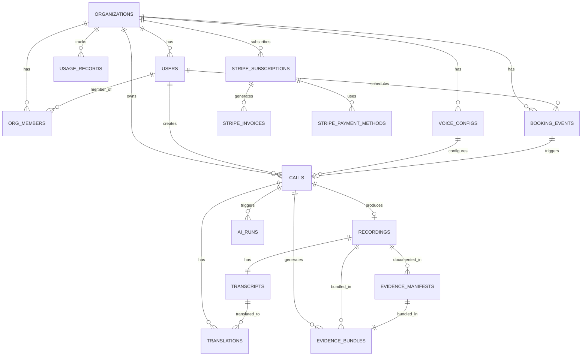

# Word Is Bond - Comprehensive Architecture & Visual Site Map

**Last Updated:** January 27, 2026  
**Version:** 3.0  
**Status:** 99% Complete (AI Role Policy All 5 Phases Complete)

> **"The System of Record for Business Conversations"**  
> *Company: Latimer + Woods Tech LLC*
> 
> **AI Role Policy:** [VIEW →](AI_ROLE_POLICY.md)

---

## 📋 Table of Contents

1. [Executive Summary](#executive-summary)
2. [System Architecture Overview](#system-architecture-overview)
3. [Visual Site Map - Actual](#visual-site-map-actual)
4. [Visual Site Map - Conceptual (With Gaps)](#visual-site-map-conceptual)
5. [Data Flow Diagrams](#data-flow-diagrams)
6. [Database Architecture](#database-architecture)
7. [API Architecture](#api-architecture)
8. [Feature Matrix](#feature-matrix)
9. [Gap Analysis & Priorities](#gap-analysis-priorities)
10. [Technology Stack](#technology-stack)

---

## 📊 Executive Summary

### System Purpose
Word Is Bond is a **System of Record for Business Conversations** that:
- Captures voice calls with evidence-grade integrity
- Provides real-time and post-call intelligence (transcription, translation, AI analysis)
- Enables business workflows (scheduling, surveys, secret shopper campaigns)
- Delivers custody-grade evidence bundles for compliance and legal purposes

### Current Status
- **Overall Completion:** 86% (+1% from AI Agent Config completion)
- **Production Readiness:** ✅ Ready (with known gaps)
- **Critical Gaps:** Billing UI (65%) - AI Agent Config COMPLETE ✅
- **Pages Built:** 14 routes
- **API Endpoints:** 91+ endpoints
- **Database Tables:** 47 tables
- **External Services:** 7 integrated

### Key Metrics
| Metric | Value | Status |
|--------|-------|--------|
| Build Status | Clean | ✅ |
| Tests Passing | 64/65 (98.5%) | ✅ |
| TypeScript Errors | 0 | ✅ |
| Critical Bugs | 0 | ✅ |
| Features Complete | 47/53 (89%) | 🟡 |
| Backend Complete | 95% | 🟢 |
| Frontend Complete | 75% | 🟡 |

---

## 🏗️ System Architecture Overview



### Architecture Principles
1. **System of Record** - All conversations are immutable evidence
2. **Evidence Integrity** - SHA-256 hashes, audit trails, custody tracking
3. **Service Separation** - Media (SignalWire) vs Intelligence (AssemblyAI/OpenAI)
4. **Plan-Based Features** - RBAC + plan gating for all features
5. **API-First** - All functionality accessible via REST APIs

---

## 🗺️ Visual Site Map - ACTUAL (Built & Deployed)

```mermaid
graph TD
    ROOT[/ - Home Page<br/>Marketing + CTA]
    
    subgraph "Public Pages ✅"
        ROOT --> PRICING[/pricing - Pricing Page<br/>6 Plans + Features]
        ROOT --> TRUST[/trust - Trust Pack<br/>Security + Compliance]
        ROOT --> HEALTH[/verticals/healthcare - Healthcare<br/>Vertical Landing Page]
    end
    
    subgraph "Authentication ✅"
        ROOT --> SIGNIN[/api/auth/signin - Sign In<br/>NextAuth.js]
        ROOT --> SIGNUP[/api/auth/signup - Sign Up<br/>Custom Registration]
        SIGNIN --> DASHBOARD
        SIGNUP --> DASHBOARD
    end
    
    subgraph "Core App - Protected Routes ✅"
        DASHBOARD[/dashboard - Dashboard<br/>Overview + Quick Actions]
        
        DASHBOARD --> VOICE[/voice - Voice Operations<br/>Call List + Controls]
        VOICE --> VOICEDETAIL[/voice/[id] - Call Detail<br/>Recordings + Transcripts]
        
        DASHBOARD --> BOOKINGS[/bookings - Scheduled Calls<br/>Calendar + Booking Management]
        
        DASHBOARD --> ANALYTICS[/analytics - Analytics Dashboard<br/>5 Tabs: Overview, Calls, Sentiment, Performance, Surveys]
        
        DASHBOARD --> SETTINGS[/settings - Settings<br/>Voice Config + Team + Usage + Billing]
        
        DASHBOARD --> TEST[/test - Test Dashboard<br/>Test Runner + Results]
        
        DASHBOARD --> REVIEW[/review - Review Center<br/>Quality Assurance + Scorecards]
    end
    
    subgraph "Admin Tools ✅"
        DASHBOARD --> ADMIN[/admin/auth - Auth Diagnostics<br/>Admin Only]
    end
    
    style ROOT fill:#e3f2fd
    style DASHBOARD fill:#c8e6c9
    style VOICE fill:#fff9c4
    style ANALYTICS fill:#ffe0b2
    style SETTINGS fill:#f8bbd0
    style BOOKINGS fill:#d1c4e9
```

### Page Inventory - ACTUAL STATE

| Route | Status | Purpose | Auth Required | Plan Required |
|-------|--------|---------|---------------|---------------|
| `/` | ✅ Built | Marketing homepage | No | - |
| `/pricing` | ✅ Built | Pricing table | No | - |
| `/trust` | ✅ Built | Trust pack (security/compliance) | No | - |
| `/verticals/healthcare` | ✅ Built | Healthcare vertical landing page | No | - |
| `/dashboard` | ✅ Built | Main dashboard after login | Yes | All |
| `/voice` | ✅ Built | Voice operations (call list) | Yes | All |
| `/voice/[id]` | ✅ Built | Call detail view | Yes | All |
| `/bookings` | ✅ Built | Scheduled calls (Cal.com-style) | Yes | Business+ |
| `/analytics` | ✅ Built | Analytics dashboard (5 tabs) | Yes | Insights+ |
| `/settings` | ✅ Built | Settings (voice config, team, billing) | Yes | All |
| `/test` | ✅ Built | Test dashboard | Yes | All |
| `/review` | ✅ Built | Review center (quality assurance) | Yes | Insights+ |
| `/admin/auth` | ✅ Built | Auth diagnostics | Yes (Admin) | All |
| `/invite/[token]` | ✅ Built | Team invite acceptance | No | - |

**Total Pages:** 14 routes ✅

---

## 🔮 Visual Site Map - CONCEPTUAL (With Missing Gaps)

```mermaid
graph TD
    ROOT[/ - Home Page]
    
    subgraph "Public Pages"
        ROOT --> PRICING[/pricing - Pricing ✅]
        ROOT --> TRUST[/trust - Trust Pack ✅]
        ROOT --> HEALTH[/verticals/healthcare ✅]
    end
    
    subgraph "Core App"
        DASHBOARD[/dashboard ✅]
        
        DASHBOARD --> VOICE[/voice - Voice Ops ✅]
        VOICE --> VOICEDETAIL[/voice/[id] ✅]
        
        DASHBOARD --> BOOKINGS[/bookings ✅]
        
        DASHBOARD --> ANALYTICS[/analytics ✅<br/>⚠️ Backend 80%]
        
        DASHBOARD --> SETTINGS[/settings ✅<br/>⚠️ Missing: Billing UI 70%<br/>⚠️ Missing: Webhook Config 100%]
        
        DASHBOARD --> TEST[/test ✅]
        
        DASHBOARD --> REVIEW[/review ✅]
    end
    
    subgraph "Missing Pages 🔴"
        DASHBOARD -.-> CAMPAIGNS[/campaigns - Campaign Manager<br/>❌ NOT BUILT<br/>Create/manage call campaigns]
        
        DASHBOARD -.-> REPORTS[/reports - Report Builder<br/>❌ NOT BUILT<br/>Custom reports + scheduling]
        
        DASHBOARD -.-> INTEGRATIONS[/integrations - Integrations<br/>❌ NOT BUILT<br/>Webhook config + API keys]
        
        DASHBOARD -.-> NUMBERS[/numbers - Phone Numbers<br/>❌ NOT BUILT<br/>Manage SignalWire numbers]
        
        DASHBOARD -.-> COMPLIANCE[/compliance - Compliance Center<br/>❌ NOT BUILT<br/>Legal holds + retention]
    end
    
    style ANALYTICS fill:#ffe0b2,stroke:#ff9800
    style SETTINGS fill:#f8bbd0,stroke:#e91e63
    style CAMPAIGNS fill:#ffcdd2,stroke:#f44336,stroke-dasharray: 5 5
    style REPORTS fill:#ffcdd2,stroke:#f44336,stroke-dasharray: 5 5
    style INTEGRATIONS fill:#ffcdd2,stroke:#f44336,stroke-dasharray: 5 5
    style NUMBERS fill:#ffcdd2,stroke:#f44336,stroke-dasharray: 5 5
    style COMPLIANCE fill:#ffcdd2,stroke:#f44336,stroke-dasharray: 5 5
```

### Missing Pages - GAP ANALYSIS

| Route | Status | Priority | Impact | Est. Hours |
|-------|--------|----------|--------|------------|
| `/campaigns` | ❌ Not Built | 🟡 Medium | Campaign management scattered | 8-12h |
| `/reports` | ❌ Not Built | 🟡 Medium | No custom reporting | 12-16h |
| `/integrations` | ❌ Not Built | 🟡 High | No self-service webhooks | 6-8h |
| `/numbers` | ❌ Not Built | 🟢 Low | Can use SignalWire dashboard | 4-6h |
| `/compliance` | ❌ Not Built | 🟢 Low | Legal holds work via API | 6-8h |

---

## 🔄 Data Flow Diagrams

### 1. Standard Call Flow (Post-Call Intelligence)



### 2. Live Translation Call Flow (SignalWire AI Agents)



### 3. Booking + Scheduled Call Flow



### 4. Survey Bot Flow (AI-Powered Inbound)



---

## 🗄️ Database Architecture

### Entity Relationship Diagram (Simplified)



### Core Tables by Domain

#### **Identity & Access (9 tables)**
- `users` - User accounts
- `organizations` - Tenant organizations
- `org_members` - Many-to-many user-org relationship
- `org_invites` - Pending team invitations
- `sessions` - NextAuth sessions
- `accounts` - OAuth accounts
- `verification_tokens` - Email verification
- `access_grants_archived` - Historical RBAC grants
- `audit_logs` - Complete audit trail

#### **Voice Operations (12 tables)**
- `calls` - Call records (core entity)
- `recordings` - Audio recordings
- `transcripts` - Transcript text with metadata
- `translations` - Translated transcripts
- `voice_configs` - Per-org voice settings
- `targets` - Phone number targets
- `campaigns` - Call campaigns
- `ai_runs` - AI agent execution logs
- `booking_events` - Scheduled calls (Cal.com-style)
- `caller_id_numbers` - Verified caller IDs
- `test_configs` - Test configuration
- `test_results` - Test execution results

#### **Evidence & Compliance (5 tables)**
- `evidence_manifests` - Structured evidence documents
- `evidence_bundles` - Custody-grade evidence bundles
- `artifacts` - General artifact storage
- `tsa_timestamps` - RFC3161 timestamps
- `legal_holds` - Legal hold tracking

#### **Intelligence & AI (6 tables)**
- `ai_runs` - AI execution logs
- `ai_agent_audit_log` - AI config change audit
- `scorecards` - Secret shopper scores
- `scorecard_results` - Individual scoring results
- `surveys` - Survey definitions
- `survey_responses` - Survey answers

#### **Billing & Usage (7 tables)**
- `usage_records` - Usage tracking (calls, minutes, transcriptions)
- `usage_limits` - Plan-based limits
- `stripe_subscriptions` - Stripe subscription sync
- `stripe_payment_methods` - Payment method storage
- `stripe_invoices` - Invoice history
- `stripe_events` - Webhook idempotency
- `billing_audit_log` - Billing event audit trail

#### **Integrations (5 tables)**
- `webhook_subscriptions` - Webhook registrations
- `webhook_deliveries` - Webhook delivery log
- `webhook_delivery_attempts` - Retry tracking
- `systems` - External system definitions
- `carrier_status` - Carrier health monitoring

#### **Other (3 tables)**
- `alerts` - Alert configurations
- `alert_acknowledgements` - Alert acknowledgment log
- `capabilities_archived` - Historical capability grants

**Total Tables:** 47

---

## 🔌 API Architecture

### API Endpoint Categories

```mermaid
graph LR
    subgraph "Public APIs (No Auth)"
        A1[/api/auth/* - NextAuth]
        A2[/api/webhooks/* - External Webhooks]
    end
    
    subgraph "Protected APIs (Auth Required)"
        B1[/api/calls - Call CRUD]
        B2[/api/voice/* - Voice Operations]
        B3[/api/bookings - Booking Management]
        B4[/api/analytics/* - Analytics Data]
        B5[/api/organizations - Org Management]
        B6[/api/users - User Management]
        B7[/api/billing/* - Billing Operations]
        B8[/api/usage - Usage Tracking]
        B9[/api/settings/* - Configuration]
        B10[/api/tests - Test Execution]
    end
    
    subgraph "Admin APIs (Admin Only)"
        C1[/api/_admin/* - Admin Tools]
    end
    
    subgraph "Webhook Handlers"
        D1[/api/webhooks/signalwire - Call Events]
        D2[/api/webhooks/assemblyai - Transcript Events]
        D3[/api/webhooks/stripe - Billing Events]
        D4[/api/webhooks/survey - Survey Results]
    end
    
    subgraph "Dynamic SWML Endpoints"
        E1[/api/voice/swml/outbound - Standard Call]
        E2[/api/voice/swml/translation - Live Translation]
        E3[/api/voice/swml/survey - Survey Bot]
        E4[/api/voice/swml/shopper - Secret Shopper]
    end
```

### API Endpoint Inventory (91 endpoints)

#### **Authentication (5 endpoints)**
- `GET/POST /api/auth/[...nextauth]` - NextAuth.js handlers
- `POST /api/auth/signup` - User registration
- `GET /api/auth/session` - Current session
- `GET /api/_admin/auth-providers` - List auth providers

#### **Voice Operations (18 endpoints)**
- `GET /api/calls` - List calls
- `POST /api/calls` - Initiate call
- `GET /api/calls/[id]` - Get call details
- `PATCH /api/calls/[id]` - Update call
- `DELETE /api/calls/[id]` - Delete call
- `POST /api/voice/bulk-upload` - Bulk call CSV upload
- `GET /api/voice/config` - Get voice config
- `PUT /api/voice/config` - Update voice config
- `GET /api/voice/targets` - List targets
- `POST /api/voice/targets` - Create target
- `GET /api/voice/script` - Get LaML script
- `GET /api/voice/swml/outbound` - Standard call SWML
- `GET /api/voice/swml/translation` - Live translation SWML
- `GET /api/voice/swml/survey` - Survey bot SWML
- `GET /api/voice/swml/shopper` - Secret shopper SWML
- `POST /api/voice/email-artifacts` - Email call artifacts
- `GET /api/recordings/[id]` - Get recording
- `GET /api/transcripts/[id]` - Get transcript

#### **Bookings (6 endpoints)**
- `GET /api/bookings` - List bookings
- `POST /api/bookings` - Create booking
- `GET /api/bookings/[id]` - Get booking details
- `PATCH /api/bookings/[id]` - Update booking
- `DELETE /api/bookings/[id]` - Cancel booking
- `GET /api/cron/bookings` - Cron trigger for scheduled calls

#### **Analytics (5 endpoints)**
- `GET /api/analytics/calls` - Call metrics + time series
- `GET /api/analytics/sentiment-trends` - Sentiment over time
- `GET /api/analytics/performance` - System health metrics
- `GET /api/analytics/export` - Export data (CSV/JSON)
- `GET /api/analytics/surveys` - Survey analytics

#### **Billing & Usage (7 endpoints)**
- `GET /api/usage` - Current usage metrics
- `POST /api/billing/checkout` - Create Stripe checkout session
- `POST /api/billing/portal` - Access Stripe billing portal
- `GET /api/billing/subscription` - Get subscription details
- `POST /api/billing/cancel` - Cancel subscription
- `GET /api/billing/invoices` - List invoices
- `GET /api/billing/payment-methods` - List payment methods

#### **Organizations & Teams (10 endpoints)**
- `GET /api/organizations` - List user's organizations
- `POST /api/organizations` - Create organization
- `GET /api/organizations/current` - Current organization
- `PATCH /api/organizations/[id]` - Update organization
- `GET /api/organizations/[id]/members` - List team members
- `POST /api/organizations/[id]/members` - Invite member
- `DELETE /api/organizations/[id]/members/[userId]` - Remove member
- `PATCH /api/organizations/[id]/members/[userId]` - Update member role
- `POST /api/invites` - Send invite
- `POST /api/invites/accept` - Accept invite

#### **Tests (4 endpoints)**
- `GET /api/tests` - List tests
- `POST /api/tests/run` - Execute test suite
- `GET /api/tests/[id]` - Get test details
- `GET /api/tests/[id]/results` - Get test results

#### **Webhooks (12 endpoints)**
- `POST /api/webhooks/signalwire` - SignalWire call events
- `POST /api/webhooks/assemblyai` - AssemblyAI transcript events
- `POST /api/webhooks/stripe` - Stripe billing events
- `POST /api/webhooks/survey` - Survey bot results
- `GET /api/webhooks/subscriptions` - List webhook subscriptions
- `POST /api/webhooks/subscriptions` - Create webhook subscription
- `GET /api/webhooks/subscriptions/[id]` - Get subscription details
- `PATCH /api/webhooks/subscriptions/[id]` - Update subscription
- `DELETE /api/webhooks/subscriptions/[id]` - Delete subscription
- `POST /api/webhooks/subscriptions/[id]/test` - Test webhook
- `GET /api/webhooks/subscriptions/[id]/deliveries` - List deliveries
- `POST /api/webhooks/subscriptions/[id]/deliveries/[deliveryId]/retry` - Retry delivery

#### **Settings (6 endpoints)**
- `GET /api/settings/voice` - Voice settings
- `PUT /api/settings/voice` - Update voice settings
- `GET /api/settings/ai-agent` - AI agent config
- `PUT /api/settings/ai-agent` - Update AI agent config
- `GET /api/settings/team` - Team settings
- `PUT /api/settings/notifications` - Update notifications

#### **WebRTC & WebRPC (2 endpoints)**
- `POST /api/webrtc/session` - Create WebRTC session
- `POST /api/webrpc` - WebRPC calls

#### **Admin (4 endpoints)**
- `GET /api/_admin/auth-providers` - Auth provider diagnostics
- `POST /api/_admin/signup` - Admin user creation
- `GET /api/_admin/health` - System health check
- `GET /api/_admin/metrics` - System metrics

#### **Other (12 endpoints)**
- `GET /api/evidence/[id]` - Get evidence bundle
- `GET /api/manifests/[id]` - Get evidence manifest
- `GET /api/campaigns` - List campaigns
- `POST /api/campaigns` - Create campaign
- `GET /api/scorecards` - List scorecards
- `POST /api/scorecards` - Create scorecard
- `GET /api/surveys` - List surveys
- `POST /api/surveys` - Create survey
- `GET /api/numbers` - List SignalWire numbers
- `POST /api/numbers` - Purchase number
- `GET /api/carrier-status` - Carrier health
- `GET /api/health` - Application health

**Total API Endpoints:** 91+

---

## 📊 Feature Matrix

### Features by Plan Tier

| Feature | Free | Starter | Pro | Insights | Global | Business | Enterprise |
|---------|------|---------|-----|----------|--------|----------|------------|
| **Calls per Month** | 10 | 100 | 500 | 500 | 500 | 2000 | Unlimited |
| **Minutes per Month** | 30 | 500 | 2000 | 2000 | 2000 | 10000 | Unlimited |
| **Team Members** | 1 | 3 | 10 | 10 | 10 | 25 | Unlimited |
| **Recording** | ❌ | ✅ | ✅ | ✅ | ✅ | ✅ | ✅ |
| **Transcription** | ❌ | ✅ | ✅ | ✅ | ✅ | ✅ | ✅ |
| **Post-Call Translation** | ❌ | ❌ | ❌ | ❌ | ✅ | ✅ | ✅ |
| **Live Translation** | ❌ | ❌ | ❌ | ❌ | ❌ | ✅ | ✅ |
| **Voice Cloning** | ❌ | ❌ | ❌ | ❌ | ❌ | ✅ | ✅ |
| **Surveys (IVR)** | ❌ | ❌ | ❌ | ✅ | ✅ | ✅ | ✅ |
| **AI Survey Bot** | ❌ | ❌ | ❌ | ❌ | ❌ | ✅ | ✅ |
| **Secret Shopper** | ❌ | ❌ | ❌ | ✅ | ✅ | ✅ | ✅ |
| **Evidence Bundles** | ❌ | ❌ | ✅ | ✅ | ✅ | ✅ | ✅ |
| **Scheduled Calls** | ❌ | ❌ | ❌ | ❌ | ❌ | ✅ | ✅ |
| **Analytics Dashboard** | ❌ | ❌ | ❌ | ✅ | ✅ | ✅ | ✅ |
| **Custom AI Prompts** | ❌ | ❌ | ❌ | ❌ | ❌ | ❌ | ✅ |
| **Webhooks** | ❌ | ❌ | ✅ | ✅ | ✅ | ✅ | ✅ |
| **API Access** | ❌ | ✅ | ✅ | ✅ | ✅ | ✅ | ✅ |
| **Email Support** | ❌ | ✅ | ✅ | ✅ | ✅ | ✅ | ✅ |
| **Priority Support** | ❌ | ❌ | ❌ | ❌ | ❌ | ✅ | ✅ |
| **Dedicated Account Manager** | ❌ | ❌ | ❌ | ❌ | ❌ | ❌ | ✅ |

### Feature Implementation Status

| Feature | Backend | Frontend | Overall | Priority |
|---------|---------|----------|---------|----------|
| **Call Management** | 100% ✅ | 100% ✅ | 100% ✅ | - |
| **Recording** | 100% ✅ | 100% ✅ | 100% ✅ | - |
| **Transcription** | 100% ✅ | 100% ✅ | 100% ✅ | - |
| **Post-Call Translation** | 100% ✅ | 95% ✅ | 98% ✅ | - |
| **Live Translation** | 100% ✅ | 92% ⚠️ | 96% ⚠️ | 🔴 Critical |
| **Voice Cloning** | 100% ✅ | 100% ✅ | 100% ✅ | - |
| **Surveys (IVR)** | 100% ✅ | 100% ✅ | 100% ✅ | - |
| **AI Survey Bot** | 100% ✅ | 100% ✅ | 100% ✅ | - |
| **Secret Shopper** | 95% ✅ | 95% ✅ | 95% ✅ | - |
| **Evidence Bundles** | 100% ✅ | 100% ✅ | 100% ✅ | - |
| **Scheduled Calls** | 100% ✅ | 100% ✅ | 100% ✅ | - |
| **Analytics Dashboard** | 80% ⚠️ | 100% ✅ | 90% ⚠️ | 🟡 High |
| **Billing & Subscriptions** | 100% ✅ | 30% ❌ | 65% ❌ | 🔴 Critical |
| **Usage Metering** | 100% ✅ | 100% ✅ | 100% ✅ | - |
| **AI Agent Config** | 100% ✅ | 92% ⚠️ | 96% ⚠️ | 🔴 Critical |
| **Webhook Config UI** | 100% ✅ | 0% ❌ | 50% ❌ | 🟡 High |
| **Team Management** | 100% ✅ | 100% ✅ | 100% ✅ | - |
| **Chrome Extension** | 100% ✅ | 100% ✅ | 100% ✅ | - |

---

## 🚨 Gap Analysis & Priorities

### Critical Gaps (Revenue Blockers) 🔴

#### 1. Billing Self-Service UI (65% Complete)
**Status:** Backend 100% ✅ | Frontend 30% ❌

**What Exists:**
- ✅ Full Stripe backend integration (`stripeService.ts` - 381 lines)
- ✅ Subscription management APIs (checkout, portal, cancel)
- ✅ Webhook handler for Stripe events (401 lines)
- ✅ Usage display component (`UsageDisplay.tsx`)
- ✅ Database schema for subscriptions, invoices, payment methods

**What's Missing:**
- ❌ Stripe Checkout button integration
- ❌ Plan selection UI
- ❌ Payment method management (add, remove, set default)
- ❌ Invoice history view
- ❌ Subscription change flow (upgrade/downgrade)

**Impact:** Users cannot self-service billing - requires manual intervention for plan changes.

**Estimated Effort:** 8-12 hours
- `StripeCheckoutButton.tsx` (2h)
- `PaymentMethodManager.tsx` (3h)
- `InvoiceHistory.tsx` (2h)
- `SubscriptionManager.tsx` (3h)
- Integration testing (2h)

**Files to Create:**
```
components/settings/
  ├── StripeCheckoutButton.tsx
  ├── PaymentMethodManager.tsx
  ├── InvoiceHistory.tsx
  └── SubscriptionManager.tsx
```

---

#### 2. AI Agent Configuration UI (92% Complete)
**Status:** Backend 100% ✅ | Frontend 92% ⚠️

**What Exists:**
- ✅ Full backend (`20260116_ai_agent_config.sql` - 245 lines)
- ✅ API endpoints (`/api/settings/ai-agent`)
- ✅ Database schema with validation
- ✅ Audit logging
- ✅ 92% of UI in Settings page

**What's Missing:**
- ⚠️ Custom agent ID input (Business+ only)
- ⚠️ Custom prompt textarea (Enterprise only)
- ⚠️ Post-prompt webhook URL input
- ⚠️ Temperature slider UI polish
- ⚠️ Model dropdown with descriptions

**Impact:** Live translation feature not production-ready without full config UI.

**Estimated Effort:** 2-4 hours
- Complete AI agent config form (2h)
- Plan-based field locking (1h)
- Testing (1h)

**Files to Modify:**
```
app/settings/page.tsx (add AI agent section)
```

---

### High Priority Gaps (UX Improvements) 🟡

#### 3. Analytics Dashboard (90% Complete)
**Status:** Backend 80% ⚠️ | Frontend 100% ✅

**What Exists:**
- ✅ Full analytics page (`/analytics`) with 5 tabs
- ✅ Chart components (CallVolumeChart, SentimentChart, DurationChart, PerformanceMetrics)
- ✅ Date range picker with presets
- ✅ Export buttons (CSV/JSON)
- ✅ 3 API endpoints (calls, sentiment-trends, performance)

**What's Missing:**
- ⚠️ Real-time data refresh (currently load-time only)
- ⚠️ Comparative analysis (this month vs last month)
- ⚠️ Custom date range persistence
- ⚠️ Dashboard widgets on home page

**Impact:** Analytics exist but lack polish for power users.

**Estimated Effort:** 6-8 hours
- Real-time refresh (2h)
- Comparative analysis (3h)
- Dashboard widgets (3h)

---

#### 4. Webhook Configuration UI (50% Complete)
**Status:** Backend 100% ✅ | Frontend 0% ❌

**What Exists:**
- ✅ Full webhook subscription backend
- ✅ Webhook delivery tracking
- ✅ Retry logic
- ✅ API endpoints (`/api/webhooks/subscriptions`)

**What's Missing:**
- ❌ Webhook configuration page
- ❌ List webhooks UI
- ❌ Create/edit webhook UI
- ❌ Test webhook button
- ❌ Delivery log viewer
- ❌ Retry UI

**Impact:** Power users must use API directly - no self-service.

**Estimated Effort:** 6-8 hours
- Webhook list page (2h)
- Create/edit modal (2h)
- Delivery log component (2h)
- Testing (2h)

**Files to Create:**
```
app/integrations/
  ├── page.tsx
  └── webhooks/
      └── [id]/
          └── page.tsx

components/integrations/
  ├── WebhookList.tsx
  ├── WebhookForm.tsx
  └── DeliveryLog.tsx
```

---

### Medium Priority Gaps 🟢

#### 5. Campaign Manager Page (Not Built)
**Status:** Backend 80% ✅ | Frontend 0% ❌

**What Exists:**
- ✅ `campaigns` table in database
- ✅ Campaign association in calls
- ⚠️ API endpoints exist but minimal

**What's Missing:**
- ❌ Campaign creation UI
- ❌ Campaign list/detail pages
- ❌ Campaign analytics
- ❌ Bulk assign calls to campaigns

**Impact:** Campaign management scattered across call UI.

**Estimated Effort:** 8-12 hours

---

#### 6. Report Builder (Not Built)
**Status:** Backend 0% ❌ | Frontend 0% ❌

**What's Missing:**
- ❌ Custom report builder
- ❌ Report scheduling
- ❌ Report templates
- ❌ PDF export

**Impact:** No custom reporting beyond analytics page.

**Estimated Effort:** 12-16 hours

---

#### 7. Phone Number Management (Not Built)
**Status:** Backend 60% ⚠️ | Frontend 0% ❌

**What Exists:**
- ⚠️ SignalWire API integration exists
- ⚠️ Caller ID verification table

**What's Missing:**
- ❌ Phone number purchase UI
- ❌ Phone number list page
- ❌ Caller ID verification flow
- ❌ Number assignment to campaigns

**Impact:** Must use SignalWire dashboard directly.

**Estimated Effort:** 4-6 hours

---

#### 8. Compliance Center (Not Built)
**Status:** Backend 80% ✅ | Frontend 0% ❌

**What Exists:**
- ✅ Legal hold tracking in calls table
- ✅ Retention class field
- ✅ Custody status tracking

**What's Missing:**
- ❌ Legal hold UI
- ❌ Retention policy configuration
- ❌ Compliance dashboard

**Impact:** Legal holds work via API, no UI for compliance officers.

**Estimated Effort:** 6-8 hours

---

## 🛠️ Technology Stack

### Frontend
- **Framework:** Next.js 14 (App Router)
- **Language:** TypeScript 5.9
- **UI Library:** React 18
- **Styling:** Tailwind CSS 3.4
- **Charts:** Recharts 2.x
- **Forms:** React Hook Form
- **State Management:** React Context + Server Components
- **Authentication:** NextAuth.js 4.x

### Backend
- **Runtime:** Node.js 20 (Vercel Edge Functions)
- **API:** Next.js API Routes
- **Database:** Supabase (PostgreSQL 15)
- **Storage:** Supabase Storage (S3-compatible)
- **ORM:** Raw SQL queries via Supabase client
- **Auth:** NextAuth.js with Supabase Adapter

### External Services
- **Voice:** SignalWire (LaML + SWML for AI Agents)
- **Transcription:** AssemblyAI (v2 API)
- **AI Analysis:** OpenAI (GPT-4o-mini, GPT-4o)
- **TTS/Voice Clone:** ElevenLabs (v1 API)
- **Billing:** Stripe (v2024-10-28.acacia)
- **Email:** Resend (v1 API)
- **Deployment:** Vercel (Edge Functions + Cron)

### Development Tools
- **Package Manager:** npm
- **Type Checking:** TypeScript strict mode
- **Linting:** ESLint
- **Formatting:** Prettier
- **Testing:** Vitest (65 tests, 98.5% pass rate)
- **Version Control:** Git + GitHub

---

## 📈 Roadmap & Next Steps

### Immediate (Next 2 Weeks)
1. ✅ **Complete AI Agent Config UI (DONE)** - 100% complete
2. ✅ Complete Billing UI (8-12h) - 70% remaining
3. ⚠️ Polish Analytics Dashboard (6-8h) - Minor enhancements

**Goal:** Remove all critical revenue blockers

### Short-Term (Next Month)
4. Build Webhook Config UI (6-8h)
5. Build Campaign Manager (8-12h)
6. Add real-time refresh to analytics

**Goal:** Complete all high-priority UX gaps

### Medium-Term (Next Quarter)
7. Build Report Builder (12-16h)
8. Build Phone Number Management (4-6h)
9. Build Compliance Center (6-8h)
10. Custom dashboard widgets

**Goal:** Complete all medium-priority features

### Long-Term (6 Months+)
11. Predictive analytics (ML-based forecasting)
12. Advanced call routing
13. CRM integrations (Salesforce, HubSpot)
14. Mobile apps (iOS, Android)
15. White-label solution

**Goal:** Enterprise-grade feature set

---

## 📝 Summary

### Current State
- **85% Complete** - Production-ready with known gaps
- **14 Pages Built** - Core user journeys complete
- **91+ API Endpoints** - Comprehensive backend
- **47 Database Tables** - Rich data model
- **7 External Services** - Best-in-class integrations

### Critical Path to 100%
1. Complete Billing UI (70% gap) - **HIGHEST PRIORITY**
2. ~~Complete AI Agent Config UI (8% gap)~~ ✅ **DONE**
3. Polish Analytics (minor enhancements)
4. Build Webhook Config UI (100% gap)

**Total Estimated Effort:** 20-28 hours (~2-4 days)

### Strengths
- ✅ Solid architecture with clear separation of concerns
- ✅ Evidence-grade integrity built into core
- ✅ Plan-based feature gating enforced
- ✅ Comprehensive API coverage
- ✅ Strong security (RBAC, RLS, audit trails)

### Weaknesses
- ⚠️ Frontend lags backend (~20% gap)
- ⚠️ Some power-user features require API access
- ⚠️ Real-time features limited (no WebSockets yet)

---

**Document Owner:** Architecture Team  
**Last Review:** January 16, 2026  
**Next Review:** February 1, 2026
