# Data Flow & Lifecycle

**TOGAF Phase:** C — Data Architecture  
**Version:** 1.0  
**Date:** February 13, 2026  
**Status:** Current Production State

---

## End-to-End Data Lifecycle

```mermaid
flowchart TB
    subgraph CREATE["1️⃣ Data Creation"]
        UserInput["User Input<br/>Forms, CSV Upload"]
        VoiceStream["Voice Stream<br/>Telnyx WebRTC/PSTN"]
        WebhookEvent["Webhook Events<br/>Telnyx, Stripe"]
        AIGenerated["AI Generated<br/>Transcriptions, Summaries"]
    end

    subgraph VALIDATE["2️⃣ Validation & Sanitization"]
        ZodValidation["Zod Schema Validation<br/>Type checking, constraints"]
        PIIRedaction["PII Redaction Pipeline<br/>SSN, CC#, DOB masked<br/>BEFORE AI processing"]
        InputSanitize["Input Sanitization<br/>SQL parameterization<br/>XSS prevention"]
    end

    subgraph PROCESS["3️⃣ Processing"]
        AuthCheck["Auth + RBAC Check<br/>Session validation<br/>Permission enforcement"]
        BusinessLogic["Business Logic<br/>Hono route handlers<br/>53 route files"]
        AIProcessing["AI Processing<br/>Transcription → Translation<br/>Scoring → Summarization"]
        AuditWrite["Audit Log Write<br/>old_value / new_value<br/>Fire-and-forget"]
    end

    subgraph STORE["4️⃣ Storage (Multi-Tier)"]
        HotDB["🔥 Hot: PostgreSQL<br/>Neon Serverless<br/>149 Tables + RLS<br/>Active business data"]
        WarmKV["♨️ Warm: Cloudflare KV<br/>Sessions (7-day TTL)<br/>Rate limits (1-min TTL)<br/>Idempotency (24hr TTL)"]
        ColdR2["❄️ Cold: Cloudflare R2<br/>Audio recordings<br/>Evidence bundles<br/>Report exports"]
    end

    subgraph DELIVER["5️⃣ Delivery"]
        APIResponse["API JSON Response<br/>snake_case keys<br/>{ success, data }"]
        SSEStream["SSE Stream<br/>Real-time translation<br/>Live transcription"]
        WebRTCMedia["WebRTC Media<br/>Voice audio<br/>Agent ↔ Consumer"]
        FileDownload["File Download<br/>R2 signed URLs<br/>Reports, recordings"]
    end

    subgraph ARCHIVE["6️⃣ Retention & Archival"]
        AuditRetain["Audit Logs<br/>Retained indefinitely<br/>Immutable after write"]
        RecordingRetain["Recordings<br/>Per compliance policy<br/>Minimum 2 years"]
        SessionExpire["Sessions<br/>7-day TTL<br/>Auto-expire in KV + DB"]
        RateLimitExpire["Rate Limits<br/>1-minute window<br/>Auto-expire in KV"]
    end

    subgraph DELETE["7️⃣ Deletion"]
        SoftDelete["Soft Delete<br/>deleted_at timestamp<br/>Recoverable 30 days"]
        HardDelete["Hard Delete<br/>After retention period<br/>GDPR right to erasure"]
        TenantWipe["Tenant Wipe<br/>Organization deletion<br/>Cascading purge"]
    end

    CREATE --> VALIDATE --> PROCESS --> STORE --> DELIVER
    STORE --> ARCHIVE --> DELETE

    style CREATE fill:#e8f5e9
    style VALIDATE fill:#fff3e0
    style PROCESS fill:#e3f2fd
    style STORE fill:#f3e5f5
    style DELIVER fill:#e0f7fa
    style ARCHIVE fill:#fce4ec
    style DELETE fill:#ffebee
```

---

## Data Classification Matrix

| Classification | Examples | Storage | Encryption | Access Control | Retention |
|---------------|----------|---------|------------|---------------|-----------|
| **🔴 Restricted (PII/PHI)** | SSN, DOB, medical info, CC numbers | PostgreSQL (RLS) | TLS transit + encrypted at rest | org_id isolation + role check | Per compliance (2-7 years) |
| **🟠 Confidential** | Phone numbers, email, account balances, payment history | PostgreSQL (RLS) | TLS transit + encrypted at rest | org_id isolation + role check | Per business policy |
| **🟡 Internal** | Call recordings, transcriptions, AI summaries | R2 + PostgreSQL | TLS transit + R2 encryption | org_id + signed URLs | 2+ years (evidence) |
| **🟢 Public** | Static UI assets, marketing content, API docs | Cloudflare CDN | TLS transit | Public | Indefinite |

---

## Critical Data Flows

### Flow 1: Outbound Call → Recording → Transcription

### Flow 2: PII Protection Pipeline

```mermaid
flowchart LR
    Input["Raw Input<br/>(may contain PII)"]
    
    subgraph REDACT["PII Redaction Pipeline"]
        SSN["SSN Regex<br/>XXX-XX-XXXX → [REDACTED]"]
        CC["Credit Card<br/>16-digit → [REDACTED]"]
        DOB["Date of Birth<br/>MM/DD/YYYY → [REDACTED]"]
        Phone["Phone (in text)<br/>Context-based"]
        Email["Email Regex<br/>user@domain → [REDACTED]"]
    end

    SafeData["Sanitized Data"]
    
    subgraph CONSUMERS["Safe Consumers"]
        AI["AI Providers<br/>(Grok, Groq, OpenAI)"]
        Logs["Structured Logs"]
        Analytics["Analytics Pipeline"]
    end

    Input --> REDACT --> SafeData --> CONSUMERS

    style Input fill:#ffebee
    style REDACT fill:#fff3e0
    style SafeData fill:#e8f5e9
    style CONSUMERS fill:#e3f2fd
```

### Flow 3: Stripe Billing Lifecycle

### Flow 4: Live Translation Pipeline

```mermaid
sequenceDiagram
    participant Agent as English Agent
    participant UI as Translation UI
    participant API as Workers API
    participant Telnyx as Telnyx
    participant ASM as AssemblyAI
    participant Groq as Groq LLM
    participant DB as Neon PostgreSQL

    Agent->>UI: Start translated call
    UI->>API: POST /api/voice/call (translate=true)
    API->>Telnyx: Create call + media stream
    
    Note over Telnyx,ASM: Continuous audio stream
    Telnyx->>ASM: Audio (WebSocket)
    ASM-->>API: English transcript chunk
    API->>Groq: Translate EN→ES
    Groq-->>API: Spanish translation
    API->>UI: SSE: { original, translated }
    API->>DB: INSERT translations
    
    Note over API,Groq: Reverse direction
    ASM-->>API: Spanish transcript chunk  
    API->>Groq: Translate ES→EN
    Groq-->>API: English translation
    API->>UI: SSE: { original, translated }
```

---

## Data Integrity Controls

| Control | Implementation | Verification |
|---------|---------------|-------------|
| **Referential Integrity** | Foreign keys on all relationship columns | Schema validation tests |
| **Tenant Isolation** | RLS policies on 50+ tables | `organization_id` in every WHERE |
| **Audit Trail** | `writeAuditLog()` on all mutations | `old_value` / `new_value` columns |
| **Immutability** | Evidence artifacts sealed after creation | `ARTIFACT_AUTHORITY_CONTRACT.md` |
| **Idempotency** | `idempotency()` middleware on writes | `X-Idempotency-Key` header |
| **Parameterized SQL** | All queries use `$1, $2, $3` placeholders | Code review + lint rules |
| **Input Validation** | Zod schemas on all API inputs | `schemas.ts` (30+ schemas) |
| **PII Protection** | Regex redaction before AI/logs | `pii-redactor.ts` pipeline |

---

## Storage Architecture

---

## References

- [01-CORE/DATABASE_SCHEMA_REGISTRY.md](../01-CORE/DATABASE_SCHEMA_REGISTRY.md) — Logical/physical data model
- [06-REFERENCE/DATABASE_TABLE_AUDIT.md](../06-REFERENCE/DATABASE_TABLE_AUDIT.md) — Complete table inventory
- [03-INFRASTRUCTURE/SECURITY_HARDENING.md](SECURITY_HARDENING.md) — PII redaction details
- [01-CORE/ARTIFACT_AUTHORITY_CONTRACT.md](../01-CORE/ARTIFACT_AUTHORITY_CONTRACT.md) — Data immutability policy
- [01-CORE/SYSTEM_OF_RECORD_COMPLIANCE.md](../01-CORE/SYSTEM_OF_RECORD_COMPLIANCE.md) — Evidence integrity
