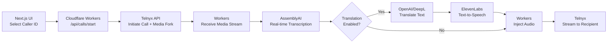
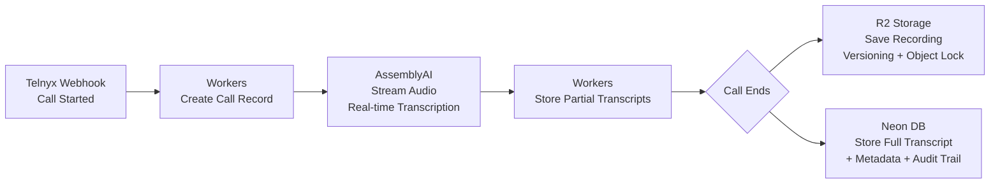
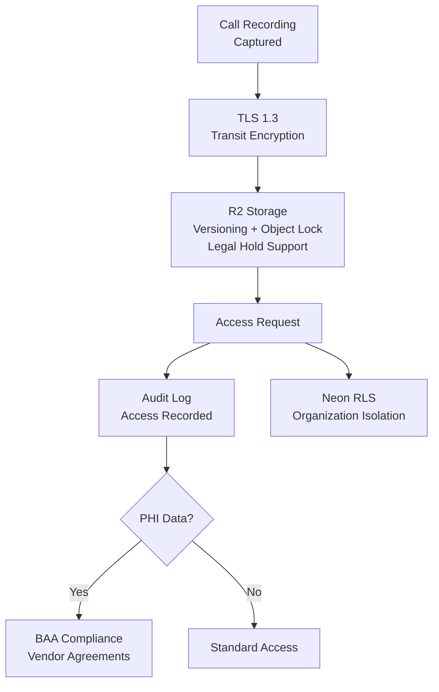

# Final Recommended Production Stack (2026)

**TOGAF Phase:** D — Technology Architecture  

This document is the canonical, consolidated architecture for the product (final, authoritative as of Jan 2026). Use this file as the single source of truth for architecture decisions, tech choices, and high-level flows.

## Stack Summary

- Frontend / UI: Next.js (App Router) + Cloudflare Pages — global edge, SSR + static, preview deploys
- API / Serverless Logic: Cloudflare Workers — low-latency glue, webhook proxying, realtime orchestration
- Database: Neon Postgres (serverless) + Hyperdrive — full Postgres, RLS, branching
- Media Storage: Cloudflare R2 — zero/low egress, versioning for legal holds
- Telephony / Calls: Telnyx (CPaaS) — branded DIDs, media streams
- Transcription: AssemblyAI (realtime + batch)
- Text-to-Speech: ElevenLabs (streaming)
- LLM / AI: Grok (xAI) for advanced reasoning + Groq (Llama 4 Scout) for cost-optimized tasks + OpenAI (GPT-4o-mini) fallback
- Live Translation: AssemblyAI → Groq/OpenAI → ElevenLabs (Workers glue)
- Authentication: Custom session-based auth with CSRF protection (Workers API)
- Background Jobs: Cloudflare Queues + Cron Triggers
- Security / Edge: Cloudflare WAF, Turnstile, Rate Limiting, Access
- Observability: Cloudflare Analytics Engine + Logpush → SIEM integration; Neon query logs → Cloudflare Hyperdrive metrics

## Principles
- Fully serverless / edge-native (no Docker/VPS)
- Zero/low egress (R2 + Cloudflare edge)
- Minimal ops (Neon + Cloudflare managed)
- Compliance-first (RLS, audit logs, R2 immutability/versioning)
- Realtime-capable (Workers + AssemblyAI + ElevenLabs streaming)
- Cost-predictable: usage-based for minutes/storage, flat for frontend basic compute

## Cost Guidance (moderate-scale estimates)
- Neon: $10–$60/mo
- R2: $5–$50/mo
- Telnyx: $50–$300+/mo (minutes + numbers)
- AssemblyAI: $20–$150/mo
- ElevenLabs: $10–$80/mo
- Cloudflare (Pages + Workers + WAF): $0–$50/mo

## High-Level Flows

### Outbound Call Flow

### Inbound Call Flow

### Compliance & Security Flow

## Responsibilities by Layer
- Pages/Frontend: UI, client fetch to `/api/*`, static assets
- Workers: API endpoints, webhook receivers, realtime orchestration, Hyperdrive queries
- Neon: tenant-isolated data, indexes, branching for dev/staging
- R2: durable media, evidence bundles, lifecycle rules
- External APIs: Telnyx, AssemblyAI, ElevenLabs, Grok (xAI), Groq (Llama 4 Scout), OpenAI (fallback)

## Security & Compliance Notes
**TOGAF ADM Alignment**: Phase D (Tech Arch) via serverless stack; Phase H (Governance) via RLS/WAF/audit logs.

**SOC2 Controls**: CC6.1 (RLS), CC7.2 (Logpush), CC9.2 (R2 versioning for retention).

**HIPAA Compliance**: PHI encryption (Neon at-rest/transit, R2 SSE-KMS); BAAs with Neon/Cloudflare Enterprise/Telnyx/AssemblyAI; §164.312(e)(2)(ii) audit logs for access.

- Enforce Neon RLS per `current_organization_id` session binding
- Use signed, short-lived URLs for R2 access where possible
- Write extensive audit logs for recording access, legal holds, exports
- Apply object lock / frozen lifecycle when legal hold is active

**Resilience**: Multi-region DR: Neon + Cloudflare Global (RPO 5min, RTO 15min); Durable Objects for call state.

**Vendor BAAs Required**: Neon (HIPAA-eligible), Cloudflare (Enterprise plan), Telnyx (BAA available), AssemblyAI/ElevenLabs (confirm BAA).

## Actionable Next Steps (short)
1. Make `ARCH_DOCS/FINAL_STACK.md` the canonical reference in 00-README.md
2. Implement `ARCH_DOCS/CLI_CHECKS.md` to validate connectivity to all services
3. Follow `ARCH_DOCS/MIGRATION_PLAN.md` for code + infra migration steps
4. Provision `ARCH_DOCS/COMPLIANCE_MAPPING.md` for standards traceability.

---

Maintained by: Architecture Team
Last updated: 2026-02-13

