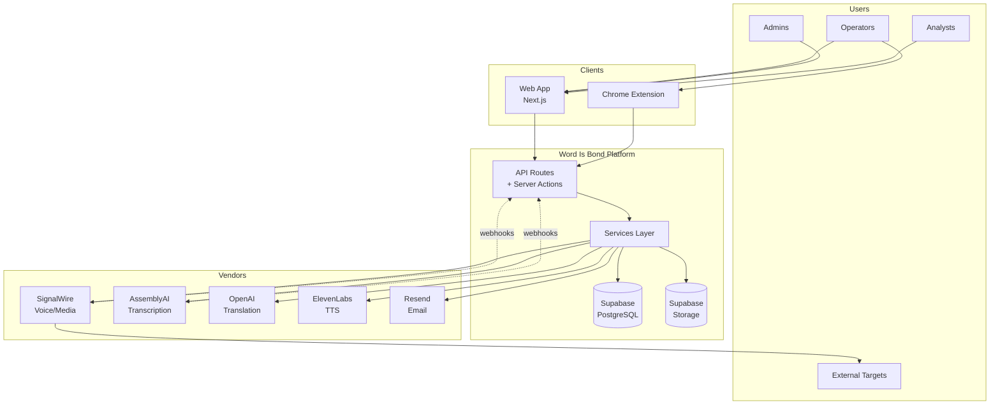

# Wordis Bond - Full System Architecture

**Product:** Wordis Bond  
**Company:** Latimer + Woods Tech LLC  
**Version:** 1.5.1  
**Last Updated:** January 17, 2026  
**Status:** Production with Identified Gaps (82% Complete)

> **Brand Position:** "The System of Record for Business Conversations"

---

## Table of Contents

1. [Executive Summary](#1-executive-summary)
2. [Site Map - Actual vs Conceptual](#2-site-map---actual-vs-conceptual)
3. [System Context Diagram](#3-system-context-diagram)
4. [Application Architecture](#4-application-architecture)
5. [Component Hierarchy](#5-component-hierarchy)
6. [Data Flow Diagrams](#6-data-flow-diagrams)
7. [Database Schema Overview](#7-database-schema-overview)
8. [API Surface](#8-api-surface)
9. [Gap Analysis](#9-gap-analysis)
10. [Roadmap](#10-roadmap)

---

## 1. Executive Summary

Wordis Bond is **the System of Record for Business Conversations** - a platform that captures, verifies, and preserves spoken words so that intent, truth, and accountability never disappear.

> *"Most platforms move calls. Some analyze them. Wordis Bond remembers them."*

### Core Principles
- **Voice-first, call-rooted design** - The call is the root entity; every artifact attaches to it
- **Evidence-grade by default** - Every conversation becomes a verifiable artifact
- **SignalWire-first v1** - SignalWire handles media execution
- **Canonical transcripts** - AssemblyAI is authoritative for post-call processing
- **Evidence immutability** - Manifests and bundles are append-only, cryptographically hashed
- **Capability-driven gating** - Plans control features, not UI visibility

### Technology Stack

```
┌─────────────────────────────────────────────────────────────────┐
│                         PRESENTATION                            │
│  Next.js 14 (App Router) + React + TypeScript + Tailwind CSS   │
└─────────────────────────────────────────────────────────────────┘
                               │
┌─────────────────────────────────────────────────────────────────┐
│                        CONTROL PLANE                            │
│     API Routes + Server Actions + NextAuth + RBAC Middleware    │
└─────────────────────────────────────────────────────────────────┘
                               │
┌─────────────────────────────────────────────────────────────────┐
│                         SERVICES                                │
│  Call Orchestration │ Evidence │ Translation │ Scoring │ Email │
└─────────────────────────────────────────────────────────────────┘
                               │
┌─────────────────────────────────────────────────────────────────┐
│                         DATA PLANE                              │
│           Supabase (PostgreSQL + Storage + Realtime)            │
└─────────────────────────────────────────────────────────────────┘
                               │
┌─────────────────────────────────────────────────────────────────┐
│                       EXTERNAL VENDORS                          │
│  SignalWire │ AssemblyAI │ ElevenLabs │ OpenAI │ Resend │ Stripe│
└─────────────────────────────────────────────────────────────────┘
```

---

## 2. Site Map - Actual vs Conceptual

### 2.1 Actual Implemented Pages

```
┌─────────────────────────────────────────────────────────────────────────────┐
│                            WORD IS BOND - SITE MAP                          │
│                              (ACTUAL - BUILT)                               │
└─────────────────────────────────────────────────────────────────────────────┘

                                    /
                           ┌───────┴───────┐
                           │   Landing     │
                           │   (page.tsx)  │
                           └───────┬───────┘
                                   │
        ┌──────────┬───────────┬───┴───┬───────────┬───────────┐
        │          │           │       │           │           │
   /dashboard  /voice    /bookings  /settings   /test     /review
        │          │           │       │           │           │
   ┌────┴────┐ ┌───┴───┐  ┌────┴────┐ │      ┌────┴────┐ ┌────┴────┐
   │Dashboard│ │ Voice │  │Bookings │ │      │  Test   │ │ Review  │
   │  Home   │ │  Ops  │  │Calendar │ │      │Dashboard│ │  Mode   │
   └─────────┘ └───────┘  └─────────┘ │      └─────────┘ └─────────┘
                                      │
              ┌───────┬───────┬───────┼───────┬───────┐
              │       │       │       │       │       │
         call-config ai-ctrl quality team  billing compliance
              │       │       │       │       │       │
         ┌────┴────┐  │  ┌────┴────┐  │       │   (hidden)
         │Targets  │  │  │Shopper  │  │       │
         │CallerID │  │  │Scripts  │  │       │
         └─────────┘  │  │Scorecard│  │       │
                      │  └─────────┘  │       │
                 ┌────┴────┐     ┌────┴────┐  │
                 │Transcr  │     │ Team    │  │
                 │Translat │     │ Mgmt    │  │
                 │Surveys  │     └─────────┘  │
                 └─────────┘                  │
                                        ┌────┴────┐
                                        │Billing  │
                                        │(stub)   │
                                        └─────────┘

    OTHER PAGES:
    ┌────────────┐  ┌────────────┐  ┌────────────┐  ┌────────────┐
    │  /admin    │  │  /pricing  │  │  /trust    │  │  /invite   │
    │   /auth    │  │            │  │            │  │  /[token]  │
    └────────────┘  └────────────┘  └────────────┘  └────────────┘

    VERTICAL:
    ┌─────────────────┐
    │   /verticals    │
    │   /healthcare   │
    └─────────────────┘
```

### 2.2 Conceptual Pages (Not Yet Built)

```
┌─────────────────────────────────────────────────────────────────────────────┐
│                            WORD IS BOND - SITE MAP                          │
│                           (CONCEPTUAL - PLANNED)                            │
└─────────────────────────────────────────────────────────────────────────────┘

                                    /
                           ┌───────┴───────┐
                           │   Landing     │
                           │   (public)    │
                           └───────┬───────┘
                                   │
        ┌──────────┬───────────┬───┴───┬───────────┬───────────┐
        │          │           │       │           │           │
   /dashboard  /voice    /bookings  /settings  /analytics  /admin
        │          │           │       │           │           │
   ┌────┴────┐ ┌───┴───┐  ┌────┴────┐ │      ┌────┴────┐ ┌────┴────┐
   │Overview │ │Calls  │  │Calendar │ │      │Analytics│ │ Admin   │
   │Alerts   │ │List   │  │Upcoming │ │      │Reports  │ │ Panel   │
   │Metrics  │ │Detail │  │History  │ │      │Surveys  │ │ Users   │
   └─────────┘ │Active │  │Create   │ │      │Scores   │ │ Orgs    │
              └───────┘  └─────────┘ │      └─────────┘ │ Billing │
                                      │                  └─────────┘
              ┌───────┬───────┬───────┼───────┬───────┬───────┐
              │       │       │       │       │       │       │
         call-cfg ai-ctrl quality team  billing integr webhooks
              │       │       │       │       │       │       │
         ┌────┴────┐  │  ┌────┴────┐  │       │   ┌───┴───┐  │
         │Targets  │  │  │Scripts  │  │       │   │Slack  │  │
         │CallerID │  │  │Scorecard│  │       │   │CRM    │  │
         │Numbers  │  │  │Templates│  │       │   │Zapier │  │
         │Default  │  │  │Alerts   │  │       │   └───────┘  │
         └─────────┘  │  └─────────┘  │       │              │
                      │               │       │         ┌────┴────┐
                 ┌────┴────┐     ┌────┴────┐  │         │Webhooks │
                 │Transcr  │     │Members  │  │         │Subscrip │
                 │Translat │     │Roles    │  │         │Logs     │
                 │Surveys  │     │Invites  │  │         └─────────┘
                 │Live TL  │     └─────────┘  │
                 │Cloning  │                  │
                 └─────────┘             ┌────┴────┐
                                         │Stripe   │
                                         │Plans    │
                                         │Invoices │
                                         └─────────┘

    MISSING PAGES (GAPS):
    ┌────────────┐  ┌────────────┐  ┌────────────┐  ┌────────────┐
    │ /analytics │  │ /webhooks  │  │ /integrat  │  │ /admin     │
    │            │  │ (config)   │  │ ions       │  │ (full)     │
    └────────────┘  └────────────┘  └────────────┘  └────────────┘
```

### 2.3 Page Status Matrix

| Page | Status | Description | Priority |
|------|--------|-------------|----------|
| `/` | BUILT | Landing page with call initiation | - |
| `/dashboard` | BUILT | Overview with metrics widgets | - |
| `/voice` | BUILT | Full voice operations center | - |
| `/bookings` | BUILT | Calendar booking management | - |
| `/settings` | BUILT | Multi-tab settings (6 tabs) | - |
| `/test` | BUILT | Test dashboard with KPIs | - |
| `/review` | BUILT | Review mode for calls | - |
| `/pricing` | BUILT | Pricing page | - |
| `/trust` | BUILT | Trust/compliance page | - |
| `/admin/auth` | BUILT | Auth admin page | - |
| `/invite/[token]` | BUILT | Team invite acceptance | - |
| `/analytics` | **GAP** | Dedicated analytics page | Medium |
| `/webhooks` | **GAP** | Webhook configuration UI | Medium |
| `/integrations` | **GAP** | Third-party integrations | Low |
| `/admin` (full) | **GAP** | Full admin panel | Low |

---

## 3. System Context Diagram



**ASCII Version:**

```
┌──────────────────────────────────────────────────────────────────────────┐
│                               USERS                                      │
│    ┌──────────┐  ┌──────────┐  ┌──────────┐  ┌──────────────────┐       │
│    │Operators │  │ Admins   │  │ Analysts │  │ External Targets │       │
│    └────┬─────┘  └────┬─────┘  └────┬─────┘  └────────▲─────────┘       │
└─────────│─────────────│─────────────│─────────────────│─────────────────┘
          │             │             │                 │
          ▼             ▼             ▼                 │
┌─────────────────────────────────────────────────────────────────────────┐
│                            CLIENTS                                       │
│         ┌─────────────────────┐    ┌─────────────────────┐              │
│         │  Web App (Next.js)  │    │  Chrome Extension   │              │
│         └──────────┬──────────┘    └──────────┬──────────┘              │
└────────────────────│──────────────────────────│─────────────────────────┘
                     │                          │
                     ▼                          ▼
┌─────────────────────────────────────────────────────────────────────────┐
│                     WORD IS BOND PLATFORM                                │
│  ┌─────────────────────────────────────────────────────────────────┐    │
│  │                    API Routes + Server Actions                   │    │
│  │         (NextAuth + RBAC Middleware + Rate Limiting)            │    │
│  └───────────────────────────┬─────────────────────────────────────┘    │
│                              │                                           │
│  ┌───────────────────────────▼─────────────────────────────────────┐    │
│  │                      SERVICES LAYER                              │    │
│  │  ┌─────────┐ ┌─────────┐ ┌───────────┐ ┌────────┐ ┌──────────┐ │    │
│  │  │  Call   │ │Evidence │ │Translation│ │Scoring │ │  Email   │ │    │
│  │  │Orchestr │ │ Bundle  │ │  + TTS    │ │Shopper │ │ Delivery │ │    │
│  │  └────┬────┘ └────┬────┘ └─────┬─────┘ └───┬────┘ └────┬─────┘ │    │
│  └───────│──────────│────────────│────────────│───────────│────────┘    │
│          │          │            │            │           │             │
│  ┌───────▼──────────▼────────────▼────────────▼───────────▼────────┐    │
│  │                         DATA PLANE                               │    │
│  │        ┌────────────────────┐  ┌────────────────────┐           │    │
│  │        │ Supabase PostgreSQL │  │  Supabase Storage  │           │    │
│  │        │  (calls, recordings │  │ (audio, artifacts) │           │    │
│  │        │   ai_runs, etc.)   │  └────────────────────┘           │    │
│  │        └────────────────────┘                                    │    │
│  └──────────────────────────────────────────────────────────────────┘    │
└─────────────────────────────────────────────────────────────────────────┘
                     │              │               │
                     ▼              ▼               ▼
┌─────────────────────────────────────────────────────────────────────────┐
│                         EXTERNAL VENDORS                                 │
│  ┌───────────┐ ┌───────────┐ ┌─────────┐ ┌───────────┐ ┌──────────┐    │
│  │ SignalWire│ │AssemblyAI │ │ OpenAI  │ │ElevenLabs │ │  Resend  │    │
│  │(Voice/PSTN)│ │(Transcript)│ │(Translat)│ │   (TTS)   │ │ (Email)  │    │
│  │    ▲      │ │     ▲     │ │         │ │           │ │          │    │
│  └────│──────┘ └─────│─────┘ └─────────┘ └───────────┘ └──────────┘    │
│       │              │                                                   │
│       └──────────────┴────── webhooks ─────────────────────────────────▶│
└─────────────────────────────────────────────────────────────────────────┘
```

---

## 4. Application Architecture

### 4.1 Directory Structure

```
gemini-project/
├── app/                          # Next.js App Router
│   ├── page.tsx                  # Landing page
│   ├── layout.tsx                # Root layout
│   ├── globals.css               # Global styles
│   │
│   ├── api/                      # API Routes (~50 routes)
│   │   ├── voice/                # Voice operations (10)
│   │   ├── webhooks/             # External webhooks (4)
│   │   ├── calls/                # Call management (8)
│   │   ├── auth/                 # Authentication (4)
│   │   ├── health/               # Health checks (6)
│   │   ├── surveys/              # Survey management (1)
│   │   ├── analytics/            # Analytics endpoints (1)
│   │   ├── scorecards/           # Scorecard alerts (1)
│   │   ├── bookings/             # Booking management (2)
│   │   ├── team/                 # Team management (2)
│   │   └── ...                   # Other endpoints
│   │
│   ├── actions/                  # Server Actions
│   │   ├── calls/                # Call actions
│   │   └── ai/                   # AI trigger actions
│   │
│   ├── services/                 # Business Logic Services
│   │   ├── translation.ts        # Translation orchestration
│   │   ├── scoring.ts            # Scorecard scoring
│   │   ├── evidenceBundle.ts     # Evidence bundling
│   │   ├── emailService.ts       # Email delivery
│   │   └── ...
│   │
│   └── [pages]/                  # Page routes
│       ├── dashboard/
│       ├── voice/
│       ├── settings/
│       ├── bookings/
│       ├── test/
│       ├── review/
│       └── ...
│
├── components/                   # React Components (~60)
│   ├── voice/                    # Voice-specific (30)
│   ├── dashboard/                # Dashboard widgets (2)
│   ├── settings/                 # Settings panels (1)
│   ├── team/                     # Team management (1)
│   ├── ui/                       # Shared UI (14)
│   ├── layout/                   # Layout components (1)
│   ├── tour/                     # Product tour (5)
│   └── ...
│
├── lib/                          # Shared Libraries
│   ├── signalwire/               # SignalWire integrations
│   ├── crypto/                   # Canonical hashing
│   ├── errors/                   # Error handling
│   ├── utils/                    # Retry, circuit breaker
│   ├── supabaseAdmin.ts          # DB client
│   ├── auth.ts                   # NextAuth config
│   ├── rbac.ts                   # RBAC utilities
│   └── ...
│
├── hooks/                        # React Hooks
│   ├── useRBAC.ts
│   ├── useRealtime.ts
│   ├── useVoiceConfig.tsx
│   └── useCallDetails.ts
│
├── types/                        # TypeScript Types
│   ├── app-error.ts
│   ├── tier1-features.ts
│   └── next-auth.d.ts
│
├── migrations/                   # Database Migrations (~55)
├── tests/                        # Test Suites (~17 files)
├── ARCH_DOCS/                    # Architecture Documentation
└── chrome-extension/             # Browser Extension
```

### 4.2 Layer Responsibilities

```
┌─────────────────────────────────────────────────────────────────────────┐
│ PRESENTATION LAYER                                                       │
│ • React components render UI                                            │
│ • Hooks manage client state                                             │
│ • No direct database access                                             │
│ • Calls API routes or server actions                                    │
├─────────────────────────────────────────────────────────────────────────┤
│ CONTROL LAYER                                                            │
│ • API routes handle HTTP requests                                       │
│ • Server actions handle form submissions                                │
│ • Authentication via NextAuth                                           │
│ • Authorization via RBAC middleware                                     │
│ • Rate limiting and idempotency                                         │
├─────────────────────────────────────────────────────────────────────────┤
│ SERVICE LAYER                                                            │
│ • Business logic orchestration                                          │
│ • External vendor integration                                           │
│ • Evidence manifest/bundle creation                                     │
│ • Translation and scoring pipelines                                     │
├─────────────────────────────────────────────────────────────────────────┤
│ DATA LAYER                                                               │
│ • Supabase PostgreSQL for structured data                               │
│ • Supabase Storage for media files                                      │
│ • RLS policies for tenant isolation                                     │
│ • Audit logging for all writes                                          │
└─────────────────────────────────────────────────────────────────────────┘
```

---

## 5. Component Hierarchy

### 5.1 Voice Operations (Main Feature)

```
VoiceOperationsClient
├── VoiceHeader
│   └── ExecutionControls
│       ├── Target selector
│       ├── Call button
│       └── Modulation toggles
│
├── CallList
│   └── Call row items
│       ├── Status badge
│       ├── Duration
│       └── Quick actions
│
├── ActiveCallPanel
│   ├── Call status
│   ├── Timer
│   └── End call button
│
├── CallDetailView (when call selected)
│   ├── ArtifactViewer
│   │   ├── RecordingPlayer
│   │   ├── TranscriptView
│   │   ├── TranslationView
│   │   ├── SurveyResults
│   │   └── ScoreView
│   │
│   ├── CallTimeline
│   ├── CallNotes
│   ├── CallDisposition
│   └── EvidenceManifestView
│
├── CallModulations (inline panel)
│   ├── Recording toggle
│   ├── Transcription toggle
│   ├── Translation settings
│   │   ├── Language selectors
│   │   └── Live translation toggle
│   └── Survey settings
│       └── Question list
│
└── RecentTargets
    └── Target quick-select
```

### 5.2 Settings Page Structure

```
SettingsPage
├── AppShell (layout)
│   └── Navigation
│
├── Tab Navigation
│   ├── Call Configuration
│   ├── AI & Intelligence
│   ├── Quality Assurance
│   ├── Team & Access
│   ├── Billing
│   └── Compliance (hidden)
│
├── Tab: Call Configuration
│   ├── VoiceTargetManager
│   └── CallerIdManager
│
├── Tab: AI & Intelligence
│   ├── AIControlSection
│   │   ├── Transcription toggle
│   │   └── Translation toggle
│   └── SurveyBuilder
│
├── Tab: Quality Assurance
│   ├── ShopperScriptManager
│   └── ScorecardTemplateLibrary
│
├── Tab: Team & Access
│   └── TeamManagement
│
├── Tab: Billing
│   ├── Current plan display
│   ├── Usage metrics (stub)
│   └── Plan upgrade options
│
└── Tab: Compliance
    └── RetentionSettings
```

### 5.3 Dashboard Structure

```
DashboardHome
├── MetricsRow
│   ├── MetricCard (Total Calls)
│   ├── MetricCard (Active Calls)
│   ├── MetricCard (Avg Duration)
│   └── MetricCard (Success Rate)
│
├── SurveyAnalyticsWidget
│   ├── Total surveys
│   ├── Average score
│   └── Response rate
│
├── ScorecardAlerts
│   └── Alert list with scores
│
└── RecentCallsPreview
    └── Call list (last 5)
```

---

## 6. Data Flow Diagrams

### 6.1 Call Execution Flow

```
┌─────────────────────────────────────────────────────────────────────────┐
│                        CALL EXECUTION FLOW                               │
└─────────────────────────────────────────────────────────────────────────┘

User clicks "Call"
        │
        ▼
┌───────────────────┐
│  UI: Voice Ops    │──────────────────────────────────────────┐
│  (Click handler)  │                                          │
└─────────┬─────────┘                                          │
          │ POST /api/voice/call                               │
          ▼                                                    │
┌───────────────────┐                                          │
│  API Route        │                                          │
│  - Rate limit     │                                          │
│  - Idempotency    │                                          │
│  - Auth check     │                                          │
└─────────┬─────────┘                                          │
          │                                                    │
          ▼                                                    │
┌───────────────────┐                                          │
│ startCallHandler  │                                          │
│ (Server Action)   │                                          │
│  - Validate input │                                          │
│  - Check org      │                                          │
│  - Gen call ID    │◄─────────────────────────────────────────┘
└─────────┬─────────┘       (server generates UUID)
          │
    ┌─────┴─────┐
    ▼           ▼
┌────────┐  ┌────────────┐
│Supabase│  │ SignalWire │
│INSERT  │  │ API Call   │
│calls   │  │ (LaML/SWML)│
└────────┘  └──────┬─────┘
                   │
                   ▼
          ┌───────────────┐
          │ Phone Call    │
          │ (PSTN)        │
          └───────┬───────┘
                  │
    ┌─────────────┼─────────────┐
    │             │             │
    ▼             ▼             ▼
┌────────┐  ┌──────────┐  ┌──────────┐
│Status  │  │Recording │  │Survey    │
│Webhook │  │ Stored   │  │Responses │
└────┬───┘  └────┬─────┘  └────┬─────┘
     │           │              │
     ▼           ▼              ▼
┌─────────────────────────────────────┐
│         /api/webhooks/signalwire    │
│  - Update call status               │
│  - Store recording URL              │
│  - Trigger transcription            │
└─────────────────┬───────────────────┘
                  │
                  ▼
┌─────────────────────────────────────┐
│           AssemblyAI                │
│  - Transcribe recording             │
│  - Detect language                  │
└─────────────────┬───────────────────┘
                  │ webhook
                  ▼
┌─────────────────────────────────────┐
│       /api/webhooks/assemblyai      │
│  - Store transcript                 │
│  - Trigger translation (if enabled) │
│  - Create evidence manifest         │
└─────────────────────────────────────┘
```

### 6.2 Evidence Bundle Flow

```
┌─────────────────────────────────────────────────────────────────────────┐
│                       EVIDENCE BUNDLE FLOW                               │
└─────────────────────────────────────────────────────────────────────────┘

Call Completion
        │
        ▼
┌───────────────────┐
│ Collect Artifacts │
│ - Recording URL   │
│ - Transcript JSON │
│ - Translation     │
│ - Survey results  │
│ - Scores          │
└─────────┬─────────┘
          │
          ▼
┌───────────────────┐
│ Create Manifest   │
│ (evidence_manifests)
│ - Artifact refs   │
│ - Timestamps      │
│ - Provenance      │
└─────────┬─────────┘
          │
          ▼
┌───────────────────┐
│ Compute Hashes    │
│ - Canonical JSON  │
│ - SHA-256 hash    │
│ - Per-artifact    │
└─────────┬─────────┘
          │
          ▼
┌───────────────────┐
│ Create Bundle     │
│ (evidence_bundles)│
│ - bundle_payload  │
│ - bundle_hash     │
│ - manifest_hash   │
└─────────┬─────────┘
          │
          ▼ (optional)
┌───────────────────┐
│ RFC3161 Timestamp │
│ (if TSA proxy set)│
│ - External anchor │
└─────────┬─────────┘
          │
          ▼
┌───────────────────┐
│ Record Provenance │
│ (artifact_provenance)
│ - Producer        │
│ - Version         │
│ - Input refs      │
└───────────────────┘
```

### 6.3 Translation Pipeline

```
┌─────────────────────────────────────────────────────────────────────────┐
│                      TRANSLATION PIPELINE                                │
└─────────────────────────────────────────────────────────────────────────┘

                    ┌─────────────────────┐
                    │  Post-Call Trigger  │
                    │  (AssemblyAI done)  │
                    └──────────┬──────────┘
                               │
              ┌────────────────┼────────────────┐
              │                │                │
              ▼                ▼                ▼
      ┌───────────┐    ┌───────────┐    ┌───────────┐
      │ Check     │    │ Check     │    │ Check     │
      │ translate │    │ plan gate │    │ languages │
      │ enabled   │    │ (business+)│   │ differ    │
      └─────┬─────┘    └─────┬─────┘    └─────┬─────┘
            │                │                │
            └────────────────┼────────────────┘
                             │
                     ┌───────▼───────┐
                     │ Call OpenAI   │
                     │ for text      │
                     │ translation   │
                     └───────┬───────┘
                             │
                     ┌───────▼───────┐
                     │ Store in      │
                     │ ai_runs       │
                     │ (translation) │
                     └───────┬───────┘
                             │
                     ┌───────▼───────┐
                     │ Generate TTS  │
                     │ (ElevenLabs)  │
                     │ Optional      │
                     └───────┬───────┘
                             │
                     ┌───────▼───────┐
                     │ Store audio   │
                     │ URL in        │
                     │ recordings    │
                     └───────────────┘
```

---

## 7. Database Schema Overview

### 7.1 Core Tables

```
┌─────────────────────────────────────────────────────────────────────────┐
│                         CORE SCHEMA (Simplified)                         │
└─────────────────────────────────────────────────────────────────────────┘

┌──────────────────┐
│   organizations  │
│  ────────────────│
│  id (PK)         │
│  name            │
│  plan            │◄────────────────┐
│  settings        │                 │
└────────┬─────────┘                 │
         │ 1:N                       │
         ▼                           │
┌──────────────────┐                 │
│      users       │                 │
│  ────────────────│                 │
│  id (PK)         │                 │
│  email           │                 │
│  organization_id │─────────────────┘
└────────┬─────────┘
         │ 1:N
         ▼
┌──────────────────┐         ┌──────────────────┐
│      calls       │────────►│    recordings    │
│  ────────────────│  1:1    │  ────────────────│
│  id (PK)         │         │  id (PK)         │
│  organization_id │         │  call_id (FK)    │
│  status          │         │  url             │
│  started_at      │         │  duration_seconds│
│  ended_at        │         │  transcript_id   │
│  call_sid        │         └────────┬─────────┘
│  custody_status  │                  │ 1:N
│  evidence_compl. │                  ▼
└────────┬─────────┘         ┌──────────────────┐
         │ 1:N               │  transcript_ver. │
         ▼                   │  ────────────────│
┌──────────────────┐         │  id (PK)         │
│     ai_runs      │         │  recording_id    │
│  ────────────────│         │  version         │
│  id (PK)         │         │  text            │
│  call_id (FK)    │         │  language        │
│  model           │         └──────────────────┘
│  status          │
│  output (JSONB)  │
└──────────────────┘

┌──────────────────┐         ┌──────────────────┐
│evidence_manifests│────────►│ evidence_bundles │
│  ────────────────│  1:1    │  ────────────────│
│  id (PK)         │         │  id (PK)         │
│  recording_id    │         │  manifest_id     │
│  manifest (JSON) │         │  bundle_payload  │
│  version         │         │  bundle_hash     │
│  created_at      │         │  tsa_status      │
└──────────────────┘         │  tsa_token       │
                             └──────────────────┘
```

### 7.2 Supporting Tables

| Table | Purpose | Records From |
|-------|---------|--------------|
| `voice_configs` | Per-org voice settings | Settings page |
| `voice_targets` | Phone numbers to call | Settings page |
| `caller_id_numbers` | Verified caller IDs | Settings page |
| `booking_events` | Scheduled calls | Bookings page |
| `audit_logs` | All system writes | Automatic |
| `webhook_subscriptions` | Custom webhooks | Settings page |
| `org_members` | Membership + roles | Team management |
| `team_invites` | Pending invites | Team management |
| `shopper_scripts` | QA scripts | Settings page |
| `scored_recordings` | Scorecard results | Auto-scoring |
| `alerts` | Score alert rules | Settings page |

---

## 8. API Surface

### 8.1 API Route Summary

```
┌─────────────────────────────────────────────────────────────────────────┐
│                          API ROUTES (~50 total)                          │
└─────────────────────────────────────────────────────────────────────────┘

VOICE OPERATIONS (10)
├── POST   /api/voice/call              # Initiate call
├── POST   /api/voice/bulk-upload       # Bulk CSV upload
├── GET    /api/voice/config            # Get voice config
├── PUT    /api/voice/config            # Update voice config
├── GET    /api/voice/script            # Get LaML script
├── POST   /api/voice/laml/outbound     # LaML callback
├── POST   /api/voice/swml/outbound     # SWML callback
├── POST   /api/voice/swml/survey       # Survey SWML
├── POST   /api/voice/swml/translation  # Live translation SWML
└── GET/POST /api/voice/targets         # Manage targets

WEBHOOKS (4)
├── POST   /api/webhooks/signalwire     # SignalWire status
├── POST   /api/webhooks/assemblyai     # AssemblyAI transcripts
├── POST   /api/webhooks/survey         # Survey completion
└── POST   /api/webhooks/subscriptions  # Webhook delivery

CALLS (8)
├── GET    /api/calls                   # List calls
├── GET    /api/calls/[id]              # Get call details
├── POST   /api/calls/start             # Start call (alt)
├── POST   /api/calls/recordModulationIntent
├── GET    /api/calls/[id]/timeline     # Call timeline
├── POST   /api/calls/[id]/notes        # Add notes
├── POST   /api/calls/[id]/disposition  # Set disposition
├── POST   /api/calls/[id]/email        # Email artifacts
└── GET    /api/calls/[id]/export       # Export bundle

AUTH (4)
├── GET/POST /api/auth/[...nextauth]    # NextAuth
├── POST   /api/auth/signup             # User signup
├── POST   /api/auth/unlock             # Account unlock
└── GET    /api/auth/debug              # Auth debug

HEALTH (6)
├── GET    /api/health                  # System health
├── GET    /api/health/env              # Env check
├── GET    /api/health/user             # User lookup
├── GET    /api/health/auth-adapter     # Auth adapter
├── GET    /api/health/auth-providers   # Auth providers
└── GET    /api/health/resilience       # Circuit breakers

SURVEYS & ANALYTICS (3)
├── GET/POST/DELETE /api/surveys        # Survey CRUD
├── GET    /api/analytics/surveys       # Survey analytics
└── GET    /api/survey/ai-results       # AI survey results

SCORECARDS (2)
├── GET    /api/scorecards              # List scorecards
└── GET    /api/scorecards/alerts       # Score alerts

BOOKINGS (2)
├── GET/POST /api/bookings              # Booking CRUD
└── GET/PUT/DELETE /api/bookings/[id]   # Booking by ID

TEAM (2)
├── GET/POST /api/team/members          # Team members
└── POST   /api/team/invite             # Send invite

ADMIN (3)
├── POST   /api/_admin/signup           # Admin signup
├── GET    /api/_admin/auth-providers   # Admin providers
└── GET    /api/rbac/context            # RBAC context

OTHER (8)
├── GET    /api/audit-logs              # Audit logs
├── GET    /api/campaigns               # Campaigns
├── GET    /api/shopper/scripts         # Shopper scripts
├── GET    /api/recordings/[id]         # Recording access
├── POST   /api/realtime/subscribe      # Realtime sub
├── GET    /api/users/[userId]/organization
├── POST   /api/tts/generate            # ElevenLabs TTS
├── POST   /api/audio/upload            # Audio upload
└── POST   /api/audio/transcribe        # Audio transcribe
```

---

## 9. Gap Analysis

### 9.1 Feature Gaps

| Gap | Severity | Description | Recommendation |
|-----|----------|-------------|----------------|
| **Analytics Page** | Medium | No dedicated analytics dashboard | Create `/analytics` page with survey/score trends |
| **Webhook Config UI** | Medium | API exists but no UI for configuration | Add to Settings > Integrations tab |
| **Billing Integration** | Medium | Billing tab is stub only | Integrate Stripe for payments |
| **Admin Panel** | Low | Limited admin functionality | Build full admin panel for super users |
| **Integration Hub** | Low | No third-party integrations UI | Slack, CRM, Zapier connectors |
| **Mobile Responsiveness** | Low | Desktop-first design | Improve mobile layouts |

### 9.2 Technical Gaps

| Gap | Severity | Description | Recommendation |
|-----|----------|-------------|----------------|
| **Live Translation Config** | High | Requires manual env var setup | Add UI for SignalWire AI Agent ID |
| **TSA Proxy** | Medium | RFC3161 timestamping needs proxy | Document or build TSA proxy function |
| **Rate Limit Dashboard** | Low | No visibility into rate limits | Add rate limit metrics to health |
| **Error Dashboard** | Low | Errors logged but not visualized | Create error analytics page |

### 9.3 Documentation Gaps

| Gap | Severity | Description | Recommendation |
|-----|----------|-------------|----------------|
| **API Documentation** | Medium | No OpenAPI/Swagger spec | Generate OpenAPI schema |
| **User Guide** | Medium | No end-user documentation | Create user-facing docs |
| **Deployment Runbook** | Low | Basic deployment notes exist | Expand with troubleshooting |

### 9.4 Gap Visualization

```
┌─────────────────────────────────────────────────────────────────────────┐
│                         FEATURE COMPLETENESS                             │
└─────────────────────────────────────────────────────────────────────────┘

VOICE OPERATIONS
[██████████████████████████████████████████████████] 100% Complete

RECORDING & TRANSCRIPTION
[██████████████████████████████████████████████████] 100% Complete

POST-CALL TRANSLATION
[████████████████████████████████████████████░░░░░] 90% Complete
                                              └─ Voice cloning UI gap

LIVE TRANSLATION
[████████████████████████████████░░░░░░░░░░░░░░░░░] 70% Complete
                                └─ Config UI gap, AI Agent setup

SURVEYS
[████████████████████████████████████████████████░░] 95% Complete
                                              └─ Webhook emission done

SECRET SHOPPER
[████████████████████████████████████████████████░░] 95% Complete
                                              └─ Alert rules UI

EVIDENCE BUNDLES
[██████████████████████████████████████████████████] 100% Complete

BOOKINGS
[██████████████████████████████████████████████████] 100% Complete

TEAM MANAGEMENT
[██████████████████████████████████████████████████] 100% Complete

BILLING
[████████████░░░░░░░░░░░░░░░░░░░░░░░░░░░░░░░░░░░░░░] 25% Complete
             └─ Stub only, needs Stripe integration

ANALYTICS
[██████████████████░░░░░░░░░░░░░░░░░░░░░░░░░░░░░░░░] 40% Complete
                   └─ Widgets exist, no dedicated page

WEBHOOKS
[██████████████████████████████████░░░░░░░░░░░░░░░░] 70% Complete
                                   └─ No config UI

INTEGRATIONS
[████░░░░░░░░░░░░░░░░░░░░░░░░░░░░░░░░░░░░░░░░░░░░░░] 10% Complete
     └─ Chrome extension only
```

---

## 10. Roadmap

### 10.1 Immediate Priorities (Sprint 1-2)

1. **Live Translation Config UI** - Add SignalWire AI Agent configuration to Settings
2. **Billing Integration** - Connect Stripe for plan management
3. **Analytics Page** - Create dedicated `/analytics` with survey/score dashboards

### 10.2 Short-term (Sprint 3-4)

4. **Webhook Configuration UI** - Settings tab for custom webhooks
5. **API Documentation** - Generate OpenAPI spec
6. **Mobile Responsiveness** - Improve responsive layouts

### 10.3 Medium-term (Sprint 5-8)

7. **Integration Hub** - Slack, CRM connectors
8. **Admin Panel** - Full admin capabilities
9. **User Documentation** - End-user guides

---

## Appendix A: Environment Variables

```bash
# Required
NEXT_PUBLIC_SUPABASE_URL=
NEXT_PUBLIC_SUPABASE_ANON_KEY=
SUPABASE_SERVICE_ROLE_KEY=
SIGNALWIRE_PROJECT_ID=
SIGNALWIRE_TOKEN=
SIGNALWIRE_SPACE=
SIGNALWIRE_NUMBER=
NEXTAUTH_SECRET=
NEXTAUTH_URL=
NEXT_PUBLIC_APP_URL=

# Intelligence (Recommended)
ASSEMBLYAI_API_KEY=
OPENAI_API_KEY=
ELEVENLABS_API_KEY=

# Live Translation (Optional)
SIGNALWIRE_AI_AGENT_ID=
TRANSLATION_LIVE_ASSIST_PREVIEW=true

# Email (Optional)
RESEND_API_KEY=

# Evidence (Optional)
RFC3161_TSA_PROXY_URL=

# Auth Providers (Optional)
GOOGLE_CLIENT_ID=
GOOGLE_CLIENT_SECRET=
```

---

**Document Version:** 1.0.0  
**Last Updated:** January 16, 2026  
**Author:** Architecture Team
