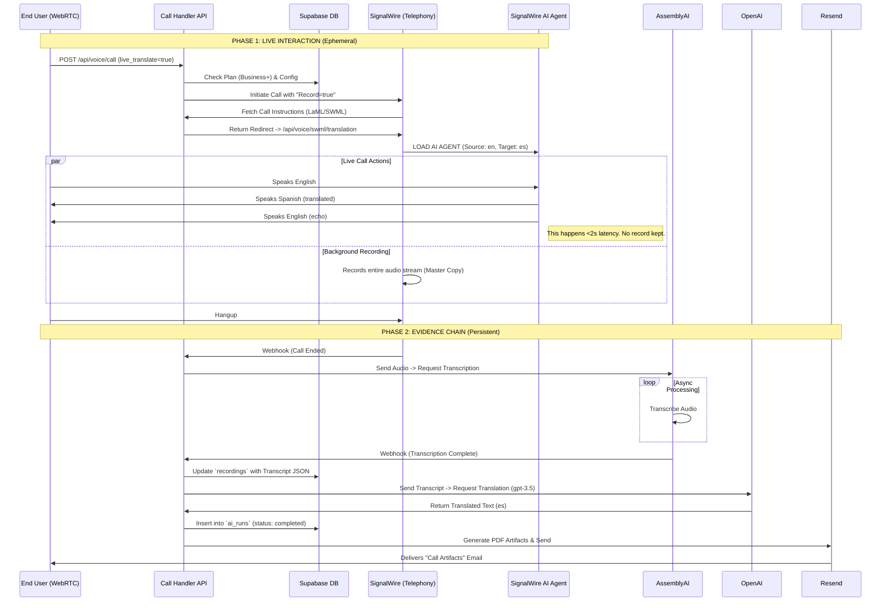

# Live Translation System Flow
**Architecture: Dual Pipeline Strategy**

This document outlines the system architecture for the "Live Translation" feature. Per the `MASTER_ARCHITECTURE`, the system uses a **Dual Pipeline** approach to satisfy two distinct requirements: **Low-Latency Live Interaction** (Voice) and **High-Fidelity Evidence Records** (Text/Audit).

## 1. High-Level Concept

The system splits the call into two parallel workflows:

| Pipeline | **Live Agent (The "Chatbot")** | **Evidence Engine (The "Record")** |
| :--- | :--- | :--- |
| **Purpose** | Facilitate conversation in real-time. | Create a legally defensible permanent record. |
| **Technology** | SignalWire AI Agent (SWML) | AssemblyAI (Transcription) + OpenAI (Translation) |
| **Latency** | < 2 Seconds (Conversational) | Post-Call (Async) |
| **Output** | Ephemeral Voice Audio | Database Rows, PDF Artifacts, Email |
| **Storage** | None (Vanishes on hangup) | Immutable `ai_runs` and `recordings` tables |

---

## 2. Detailed System Flow

## 3. Component Breakdown

### A. The "Chatbot" (Session Layer)
- **File:** `app/api/voice/swml/translation/route.ts`
- **Config:** `lib/signalwire/ai-agent-config.ts`
- **Function:** It instructs the SignalWire cloud to attach an AI Agent ("bot") to the phone line.
- **Why it's needed:** A normal phone call cannot "think" or "translate". You need an active bot bridging the two parties.
- **Constraint:** It does not save its own output. If the system crashes, this data is gone.

### B. The "Scribe" (Data Layer)
- **File:** `app/api/webhooks/assemblyai/route.ts`
- **Service:** `app/services/translation.ts`
- **Function:**
    1.  **AssemblyAI** listens to the *recording* (not the live call) and writes down every word.
    2.  **OpenAI** reads that written transcript and translates it definitively.
- **Why it's needed:** We need a perfect, searchable, and printable document for legal/business records ("Evidence").
- **Reliability:** Decoupled from the live call. Even if the live bot stutters, the recording is safe, and the transcript can be regenerated.

## 4. Configuration Flags

To enable this flow, the following settings in `voice_configs` must be true:

1.  `record` = `true` (Enables the Evidence Engine)
2.  `transcribe` = `true` (Enables AssemblyAI)
3.  `live_translate` = `true` (Enables the Chatbot/SWML)
4.  `translate_from` / `translate_to` (Defines languages)
5.  **Plan Tier:** Must be `Business` or `Enterprise`.

## 5. Failure Modes

-   **Quota Exceeded:** If OpenAI fails (Phase 2), the user still heard the translation during the call (Phase 1), but the email (Phase 2) will say "Translation Failed" and the PDF will be missing the Spanish text.
-   **Webhook Failures:** If AssemblyAI fails to callback, the "Evidence" chain breaks, but the live call was unaffected.
