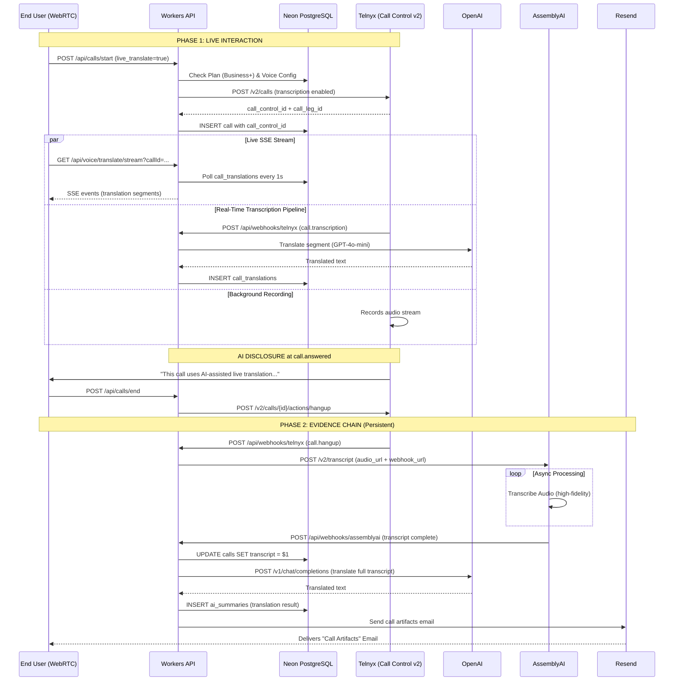

# Live Translation System Flow

**Architecture: Telnyx + OpenAI Pipeline (Real-Time)**  
**Last Updated:** February 2026  
**Status:** ✅ Production (Telnyx Call Control v2 + Real-Time Transcription)

This document outlines the system architecture for the "Live Translation" feature. The system uses **Telnyx Call Control v2** for telephony and real-time transcription, and **OpenAI GPT-4o-mini** for translation — all orchestrated through **Cloudflare Workers**.

> **Architecture Note (v4.24+):** Uses Telnyx native transcription (`call.transcription` events)
> instead of external WebSocket relay. No Durable Objects, no AssemblyAI real-time API needed.
> This is the lowest-latency path achievable within Cloudflare Workers constraints.

## 1. High-Level Concept

The system splits the call into two parallel workflows:

| Pipeline       | **Live Translation (SSE Stream)**               | **Evidence Engine (Async Record)**            |
| :------------- | :---------------------------------------------- | :-------------------------------------------- |
| **Purpose**    | Stream real-time translation segments to the UI | Create a legally defensible permanent record  |
| **Technology** | Telnyx Transcription → OpenAI → DB → SSE        | AssemblyAI (Post-call) + OpenAI (Translation) |
| **Latency**    | ~2-3 seconds end-to-end per utterance           | Post-call (async webhook)                     |
| **Output**     | SSE events to client                            | Database rows, audit trail                    |
| **Storage**    | `call_translations` table                       | `recordings`, `ai_summaries` tables           |

---

## 2. Detailed System Flow

## 3. Component Breakdown

### A. Live Translation Stream (SSE)

- **File:** `workers/src/routes/live-translation.ts`
- **Endpoint:** `GET /api/voice/translate/stream?callId=...`
- **Function:** Opens an SSE connection that polls the `call_translations` table every second
- **Plan Gating:** Requires `business` plan (live_translation feature)
- **Auth:** `requireAuth()` middleware + org-scoped query
- **Rate Limited:** `voiceRateLimit` middleware
- **Audit Logged:** Stream start and completion events

### B. Translation Processor (Real-Time)

- **File:** `workers/src/lib/translation-processor.ts`
- **Function:** `translateAndStore()` — receives transcription text, calls OpenAI GPT-4o-mini, writes to `call_translations`
- **Latency:** ~0.3-0.5s per segment (OpenAI call + DB write)
- **Fallback:** On translation failure, stores original text with `[Translation unavailable]` prefix
- **Helper:** `getTranslationConfig()` — checks if live translation is enabled for an org

### C. Transcription Webhook Handler (Real-Time)

- **File:** `workers/src/routes/webhooks.ts` (`handleCallTranscription`)
- **Event:** Telnyx `call.transcription` webhook events
- **Function:** Receives transcription segments, looks up call org, calls `translateAndStore()`
- **Pipeline:** Telnyx transcription → OpenAI translation → DB INSERT → SSE delivery
- **Security:** HMAC signature verification via `TELNYX_WEBHOOK_SECRET`

### D. Transcription Engine (Async Post-Call)

- **File:** `workers/src/routes/webhooks.ts` (AssemblyAI handler)
- **Service:** AssemblyAI `/v2/transcript` API
- **Function:**
  1. **AssemblyAI** receives the recorded audio URL and produces a word-level transcript
  2. Webhook delivers result to Workers, which updates the call record
- **Security:** HMAC signature verification via `ASSEMBLYAI_WEBHOOK_SECRET`

### E. Translation Engine (Post-Processing)

- **File:** `workers/src/routes/ai-llm.ts`
- **Service:** OpenAI Chat Completions API
- **Function:** Takes the completed transcript and produces a high-fidelity translation
- **Output:** Stored in `ai_summaries` table with org scoping

### F. Call Origination (Transcription-Enabled)

- **Files:** `workers/src/routes/calls.ts`, `workers/src/routes/webrtc.ts`, `workers/src/routes/voice.ts`
- **Service:** Telnyx Call Control v2 `POST /v2/calls`
- **Function:** Originates calls with `transcription` config when `live_translate=true`
- **Transcription Config:** `{ transcription_engine: 'B', transcription_tracks: 'both' }`
- **AI Disclosure:** `handleCallAnswered()` plays disclosure message via Telnyx `speak` action

### G. Frontend Components

- **LiveTranslationPanel:** `components/voice/LiveTranslationPanel.tsx` — SSE consumer, renders translation feed
- **LiveTranslationFeed:** `components/voice/VoiceOperationsClient.tsx` — Conditional wrapper, checks voice config
- **CallModulations:** `components/voice/CallModulations.tsx` — Translation mode toggle (live/post_call)

## 4. Configuration Flags

To enable this flow, the following settings in `voice_configs` must be true:

1. `record` = `true` (Enables audio capture)
2. `transcribe` = `true` (Enables AssemblyAI webhook)
3. `live_translate` = `true` (Enables SSE translation stream)
4. `translate_from` / `translate_to` (Defines language pair)
5. **Plan Tier:** Must be `Business` or `Enterprise`

## 5. Failure Modes

- **Telnyx Call Failure:** If call origination fails, DB record is rolled back and user receives error
- **SSE Timeout:** Stream auto-closes after 30 minutes (1800 heartbeats)
- **AssemblyAI Failure:** Retry scheduler re-submits up to 3 times; call still has live translation
- **OpenAI Quota Exceeded:** Translation fails gracefully; transcript is still available
- **Webhook Delivery Failure:** Evidence chain breaks but live call experience is unaffected

## 6. Key Files

| Component             | File                                         | Purpose                                            |
| --------------------- | -------------------------------------------- | -------------------------------------------------- |
| SSE Stream            | `workers/src/routes/live-translation.ts`     | Real-time translation delivery via SSE             |
| Translation Processor | `workers/src/lib/translation-processor.ts`   | OpenAI translation + DB write                      |
| Webhooks              | `workers/src/routes/webhooks.ts`             | Telnyx transcription + AssemblyAI callbacks        |
| Call Control          | `workers/src/routes/calls.ts`                | Start/end calls via Telnyx (transcription-enabled) |
| WebRTC                | `workers/src/routes/webrtc.ts`               | Browser-based calling (transcription-enabled)      |
| Voice Config          | `workers/src/routes/voice.ts`                | Voice config management + call placement           |
| AI Proxy              | `workers/src/routes/ai-llm.ts`               | OpenAI post-call translation                       |
| Frontend Panel        | `components/voice/LiveTranslationPanel.tsx`  | SSE consumer + UI                                  |
| Frontend Feed         | `components/voice/VoiceOperationsClient.tsx` | Conditional rendering wrapper                      |
| Config UI             | `components/voice/CallModulations.tsx`       | Translation mode toggle                            |

## 7. Latency Budget

| Step                          | Component        | Estimated Latency           |
| ----------------------------- | ---------------- | --------------------------- |
| Speech → Telnyx transcription | Telnyx Engine B  | ~0.5-1.0s                   |
| Webhook delivery              | Telnyx → Workers | ~0.05s                      |
| OpenAI translation            | GPT-4o-mini      | ~0.3-0.5s                   |
| DB write                      | Neon PostgreSQL  | ~0.05s                      |
| SSE poll interval             | Workers → Client | ~0-1.0s (avg 0.5s)          |
| **Total end-to-end**          |                  | **~1.5-3.0s per utterance** |
