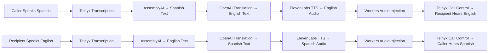

# Voice-to-Voice Translation Architecture

## Overview

Extends the existing text-only live translation to full voice-to-voice translation using ElevenLabs TTS for real-time audio injection into active calls.

## Current State

- ✅ Text transcription (Telnyx → AssemblyAI)
- ✅ Text translation (OpenAI GPT-4o-mini)
- ✅ Text display (SSE → LiveTranslationPanel)
- ❌ Audio synthesis (ElevenLabs TTS)
- ❌ Audio injection (Telnyx Call Control)

## Target State

- Speech → Text → Translated Text → Translated Speech → Audio Injection
- Real-time voice translation during active calls
- Support for voice cloning and synthetic voices

## Architecture Flow



## Implementation Plan

### Phase 1: TTS Integration

1. Add ElevenLabs API client
2. Create voice synthesis processor
3. Add audio storage to R2
4. Update database schema for audio URLs

### Phase 2: Audio Injection

1. Implement Telnyx audio playback commands
2. Add call state management for bidirectional translation
3. Create audio queue/buffer system

### Phase 3: UI/UX Updates

1. Add voice-to-voice mode toggle
2. Voice selection interface
3. Real-time audio status indicators

### Phase 4: Testing & Optimization

1. Latency optimization (< 2s end-to-end)
2. Audio quality testing
3. Error handling and fallbacks

## Technical Components

### New Files

- `workers/src/lib/tts-processor.ts` - ElevenLabs integration
- `workers/src/lib/audio-injector.ts` - Telnyx audio injection
- `workers/src/routes/voice-to-voice.ts` - Voice mode configuration

### Modified Files

- `workers/src/lib/translation-processor.ts` - Add TTS pipeline
- `workers/src/routes/webhooks.ts` - Handle audio injection
- `workers/src/lib/schemas.ts` - Voice-to-voice config options
- `components/voice/CallModulations.tsx` - UI controls

### Database Schema Updates

```sql
ALTER TABLE call_translations ADD COLUMN translated_audio_url TEXT;
ALTER TABLE call_translations ADD COLUMN audio_duration_ms INTEGER;
ALTER TABLE voice_configs ADD COLUMN voice_to_voice BOOLEAN DEFAULT FALSE;
ALTER TABLE voice_configs ADD COLUMN elevenlabs_voice_id TEXT;
ALTER TABLE voice_configs ADD COLUMN elevenlabs_api_key TEXT;
```

## API Integrations

### ElevenLabs TTS

- Model: `eleven_monolingual_v1`
- Voice settings: stability=0.5, similarity_boost=0.8
- Output format: MP3, 44.1kHz
- Latency target: < 1s per segment

### Telnyx Call Control

- Command: `playback_start`
- Audio URL: Cloudflare R2 signed URL
- Playback mode: `say` with audio URL
- Queue management: FIFO with overlap prevention

## Configuration Options

### Voice Selection

- Pre-built voices (21 languages)
- Voice cloning (premium feature)
- Gender/style preferences

### Translation Modes

- `text_only`: Current implementation
- `voice_overlay`: Text + voice injection
- `voice_only`: Voice injection without text display

### Quality Settings

- Latency vs quality trade-off
- Audio compression options
- Fallback voice selection

## Cost Analysis

### Per Minute Costs (estimated)

- Telnyx: $0.015/min (additional for audio injection)
- ElevenLabs: $0.30/min (premium voices)
- OpenAI: $0.002/min (translation)
- AssemblyAI: $0.015/min (transcription)
- R2 Storage: $0.015/GB

### Total Cost per Hour: ~$2.00

## Compliance Considerations

### HIPAA/PHI

- Audio files treated as PHI data
- R2 encryption and access controls
- Audit logging for audio access
- Automatic deletion policies

### Data Retention

- Audio files: 30 days (configurable)
- Text transcripts: 7 years (compliance)
- Access logs: 7 years

## Testing Strategy

### Unit Tests

- TTS processor latency benchmarks
- Audio injection command formatting
- Error handling and fallbacks

### Integration Tests

- End-to-end voice translation pipeline
- Audio quality assessment
- Network latency simulation

### Load Testing

- Concurrent call capacity
- Peak audio processing load
- Database connection pooling

## Rollout Plan

### Beta Phase (Week 1-2)

- Internal testing with known contacts
- Latency and quality optimization
- Bug fixes and stability improvements

### Limited Release (Week 3-4)

- Select beta customers
- Usage monitoring and analytics
- Customer feedback collection

### Full Launch (Week 5+)

- All customers with Business plan+
- Marketing and documentation updates
- Ongoing performance monitoring

## Success Metrics

### Technical KPIs

- End-to-end latency: < 2.5s
- Audio quality: MOS score > 4.0
- Error rate: < 1%
- Uptime: 99.9%

### Business KPIs

- Feature adoption rate: > 30%
- Customer satisfaction: > 4.5/5
- Cost per translation minute: < $0.50

## Risk Mitigation

### Technical Risks

- Audio synchronization issues
- TTS latency spikes
- Telnyx API limitations

### Business Risks

- Higher costs than projected
- Customer adoption challenges
- Competitive feature parity

### Mitigation Strategies

- Fallback to text-only mode
- Cost monitoring and alerts
- Gradual feature rollout
- Customer success team support</content>
  <parameter name="filePath">c:\Users\Ultimate Warrior\My project\gemini-project\ARCH_DOCS\02-FEATURES\VOICE_TO_VOICE_TRANSLATION.md
