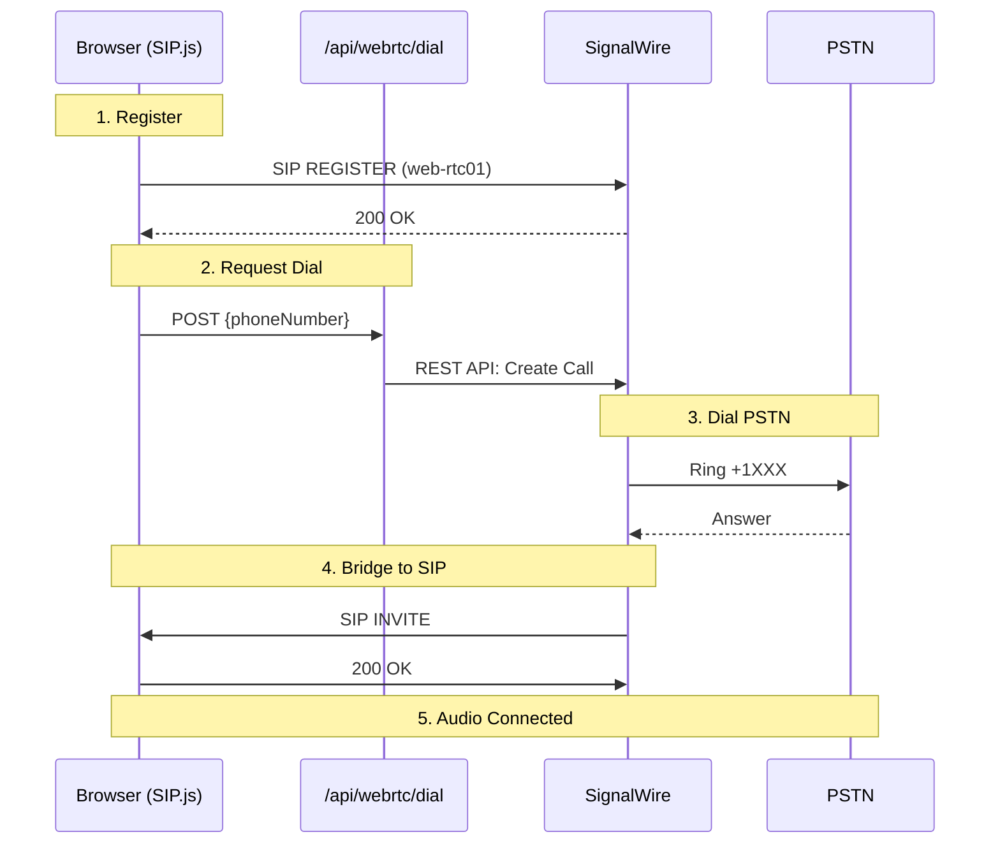

# WebRTC to PSTN Bridge Architecture

**Status**: Production  
**Last Updated**: 2026-01-21

## Overview

This document describes the architecture for browser-based PSTN calling using SIP.js and SignalWire.

> [!IMPORTANT]
> The SIP endpoint (`web-rtc01`) does NOT have a PSTN dial plan. Direct SIP INVITE to PSTN numbers will fail. Server-side dial is required.

---

## Architecture: Hybrid Server-Side Dial



---

## Key Components

### 1. SIP.js Hook (`hooks/useWebRTC.ts`)

**Purpose**: Browser-based SIP client

| Function | Description |
|----------|-------------|
| `connect()` | Register with SignalWire SIP server |
| `makeCall(phoneNumber)` | Call server to dial PSTN |
| `onInvite` delegate | Accept incoming calls from server bridge |
| `hangUp()` | Send SIP BYE |

**Important**: The `onInvite` delegate MUST accept incoming calls. These are the bridged PSTN calls from the server.

### 2. Dial Endpoint (`/api/webrtc/dial`)

**Purpose**: Server-side PSTN dialing

**LAML Template**:
```xml
<Response>
  <Dial callerId="+12027711933" answerOnBridge="true" timeout="30">
    <Number>+1XXXXXXXXXX</Number>
    <Sip>sip:web-rtc01@blackkryptonians-*.sip.signalwire.com</Sip>
  </Dial>
</Response>
```

> [!IMPORTANT]
> Both `<Number>` (PSTN) AND `<Sip>` (browser) must be inside `<Dial>` for bridging. Using only one will not create a bridge.

| Attribute | Purpose |
|-----------|---------|
| `answerOnBridge="true"` | Don't bridge audio until SIP endpoint answers |
| `timeout="30"` | Wait 30s for SIP endpoint to answer |
| `action` | Webhook called when dial completes |

### 3. Session Endpoint (`/api/webrtc/session`)

**Purpose**: Returns SIP credentials to browser

Returns:
- `sip_username`: `web-rtc01`
- `sip_password`: From env
- `sip_domain`: `blackkryptonians-589c9fd2c624.sip.signalwire.com`
- `websocket_url`: `wss://blackkryptonians.signalwire.com`
- `ice_servers`: STUN/TURN servers

---

## Environment Variables

| Variable | Purpose | Example |
|----------|---------|---------|
| `SIGNALWIRE_PROJECT_ID` | API auth | `ca1fd3cb-...` |
| `SIGNALWIRE_TOKEN` | API auth | `PT...` |
| `SIGNALWIRE_SPACE` | SignalWire space | `blackkryptonians.signalwire.com` |
| `SIGNALWIRE_NUMBER` | Caller ID | `+12027711933` |
| `SIGNALWIRE_SIP_USERNAME` | SIP user | `web-rtc01` |
| `SIGNALWIRE_SIP_PASSWORD` | SIP auth | Secret |
| `SIGNALWIRE_SIP_DOMAIN` | SIP domain | `*.sip.signalwire.com` |
| `SIGNALWIRE_WEBSOCKET_URL` | WSS endpoint | `wss://...signalwire.com` |

---

## Testing Checklist

### Pre-Flight
- [ ] Caller ID (`SIGNALWIRE_NUMBER`) is verified/owned in SignalWire dashboard
- [ ] SIP endpoint `web-rtc01` exists in SignalWire → SIP → Endpoints
- [ ] SIP domain has WebRTC enabled

### Test Flow
1. [ ] Browser loads → SIP.js registers → status shows "Ready"
2. [ ] Check SignalWire dashboard → SIP → Endpoints → `web-rtc01` shows "Online"
3. [ ] Click "Call" in browser → check Vercel logs for "PSTN call initiated"
4. [ ] Check SignalWire → Calls → outbound leg to PSTN, status "in-progress"
5. [ ] PSTN phone rings → answer it
6. [ ] Browser should receive incoming call (SIP INVITE) → answer it
7. [ ] Audio should flow bidirectionally
8. [ ] Hangup either side → webhook fires → DB updates to "completed"

---

## Troubleshooting

### Call Connects But No Audio

**Cause**: Missing `answerOnBridge="true"` or codec mismatch, or **browser not sending local audio**

**Fix**: 
- Ensure LAML has `answerOnBridge="true"`
- **CRITICAL**: Browser must add local microphone stream to peer connection
- Check SIP.js uses Opus/G.711 codecs
- Verify microphone permission granted

**Symptoms**: Call connects, both sides answer, but no audio passes. Call hangs up after 10-13 seconds.

**Root Cause**: Browser accepts incoming SIP INVITE but doesn't attach local stream to RTCPeerConnection, causing one-way or no audio.

### SIP INVITE Rejected / Call Terminates Immediately

**Cause**: SIP endpoint has no PSTN dial plan (fixed by server-side dial)

**Fix**: Use `/api/webrtc/dial` instead of direct SIP INVITE

### PSTN Rings But Browser Doesn't

**Cause**: SIP registration failed or WebRTC not enabled

**Fix**:
- Check SIP.js console for "REGISTER 200 OK"
- Enable WebRTC in SignalWire SIP domain settings
- Verify credentials match dashboard

### 403 Forbidden on Dial

**Cause**: Caller ID not verified

**Fix**: Add/verify `SIGNALWIRE_NUMBER` in SignalWire → Phone Numbers → Verified Caller IDs

### Webhook Not Hit

**Cause**: `action` URL not reachable

**Fix**: Ensure `NEXT_PUBLIC_APP_URL` is correct and publicly accessible

### "end_reason": "error" in SignalWire Logs

**Causes**:
1. SIP endpoint not registered
2. Wrong SIP domain
3. Authentication failure

**Fix**: Verify SIP credentials in SignalWire dashboard

---

## Files

| File | Purpose |
|------|---------|
| `hooks/useWebRTC.ts` | SIP.js browser client |
| `app/api/webrtc/session/route.ts` | Returns SIP credentials |
| `app/api/webrtc/dial/route.ts` | Server-side PSTN dial |
| `app/api/voice/bridge/route.ts` | PSTN-to-PSTN bridge |
