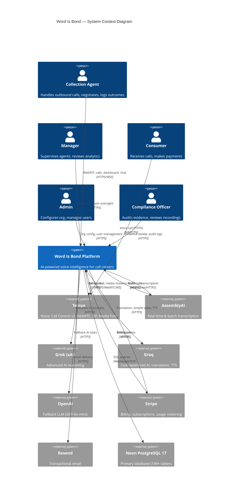
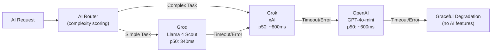

# Integration Context Diagram

**TOGAF Phase:** D — Technology Architecture  
**Deliverable:** Integration Architecture, System-of-Systems Context  
**Version:** 1.0  
**Date:** February 13, 2026  
**Last Reviewed:** February 13, 2026  
**Status:** Active

---

## System-of-Systems Context

Word Is Bond sits at the center of 15 external system interfaces, 3 inbound webhook channels, 7 scheduled jobs, and 53+ API route groups.

---

## Platform Boundary Diagram

```mermaid
flowchart TB
    subgraph Internet["☁️ Public Internet"]
        Browser["Agent Browser"]
        Phone["Consumer Phone (PSTN)"]
    end

    subgraph CF["Cloudflare Edge (296+ PoPs)"]
        DNS["DNS"]
        WAF["WAF / DDoS"]
        Turnstile["Turnstile (Bot Check)"]
        
        subgraph Pages["Cloudflare Pages"]
            UI["Next.js 15 Static Export<br/>85 pages"]
        end
        
        subgraph Workers["Cloudflare Workers"]
            API["Hono 4.7 API<br/>53+ route groups"]
            Scheduled["Scheduled Jobs<br/>4 cron schedules, 7 jobs"]
            QueueConsumer["Queue Consumer<br/>Transcription processing"]
        end
        
        subgraph Bindings["Worker Bindings (zero network hop)"]
            R2["R2 Object Storage<br/>Recordings, evidence, exports"]
            KV["KV Store<br/>Sessions, rate limits, DLQ"]
            Queues["Queues<br/>Transcription queue + DLQ"]
            Hyperdrive["Hyperdrive<br/>Connection pooling (100 conns)"]
        end
    end
    
    subgraph External["External Services"]
        Telnyx["Telnyx<br/>Call Control v2 / WebRTC / SIP / Media Fork"]
        AssemblyAI["AssemblyAI<br/>Real-time + batch transcription"]
        Grok["Grok (xAI)<br/>Advanced reasoning"]
        Groq["Groq<br/>Translation / TTS"]
        OpenAI["OpenAI<br/>GPT-4o-mini fallback"]
        ElevenLabs["ElevenLabs<br/>Premium TTS (backup)"]
        Stripe["Stripe<br/>Billing / Subscriptions"]
        Resend["Resend<br/>Transactional email"]
    end

    subgraph DB["Database Layer"]
        Neon["Neon PostgreSQL 17<br/>149+ tables, RLS enforced<br/>WebSocket primary"]
    end

    Browser -->|HTTPS| DNS
    DNS --> WAF
    WAF --> Turnstile
    Turnstile --> UI
    Turnstile --> API
    Browser -->|WebRTC| Telnyx
    Phone -->|PSTN/SIP| Telnyx

    API -->|binding| R2
    API -->|binding| KV
    API -->|binding| Queues
    API -->|TCP pool| Hyperdrive
    Hyperdrive -->|TCP| Neon
    API -->|WebSocket| Neon
    Scheduled -->|WebSocket| Neon
    QueueConsumer -->|HTTPS| AssemblyAI

    API -->|HTTPS| Telnyx
    API -->|WebSocket| AssemblyAI
    API -->|HTTPS| Grok
    API -->|HTTPS| Groq
    API -->|HTTPS| OpenAI
    API -->|HTTPS| ElevenLabs
    API -->|HTTPS| Stripe
    API -->|HTTPS| Resend

    Telnyx -->|Webhook| API
    Stripe -->|Webhook| API
    AssemblyAI -->|Webhook| API
```

---

## Integration Inventory

### External Systems (15 interfaces)

| # | System | Protocol(s) | Direction | Authentication | Criticality |
|---|--------|------------|-----------|---------------|-------------|
| 1 | Telnyx Call Control v2 | HTTPS (REST) | Bidirectional | API Key v2 | **Critical** |
| 2 | Telnyx WebRTC Gateway | WebRTC (DTLS-SRTP) | Bidirectional | JWT (per-session) | **Critical** |
| 3 | Telnyx SIP Trunking | SIP/PSTN | Bidirectional | Connection ID + API Key | **Critical** |
| 4 | Telnyx Media Fork | WebSocket | Outbound | API Key v2 | **Critical** |
| 5 | AssemblyAI | WebSocket + HTTPS | Bidirectional | API Key | **Critical** |
| 6 | Neon PostgreSQL 17 | WebSocket (primary) | Bidirectional | Connection string | **Critical** |
| 7 | Stripe | HTTPS | Bidirectional | Secret Key / Webhook HMAC-SHA256 | **Critical** |
| 8 | Cloudflare Hyperdrive | TCP (pooled) | Bidirectional | Auto-managed | **High** |
| 9 | Cloudflare R2 | Worker binding | Bidirectional | Internal binding | **High** |
| 10 | Cloudflare KV | Worker binding | Bidirectional | Internal binding | **High** |
| 11 | Cloudflare Queues | Worker binding | Bidirectional | Internal binding | **High** |
| 12 | Grok (xAI) | HTTPS | Outbound | API Key | **High** |
| 13 | Groq (Llama 4 Scout) | HTTPS | Outbound | API Key | **High** |
| 14 | OpenAI (GPT-4o-mini) | HTTPS | Outbound | API Key | **Medium** |
| 15 | Resend | HTTPS | Outbound | API Key | **Medium** |

### Inbound Webhook Channels

| Endpoint | Source | Verification | Events |
|----------|--------|-------------|--------|
| `POST /webhooks/telnyx` | Telnyx | Ed25519 signature (`TELNYX_PUBLIC_KEY`) | `call.initiated`, `call.answered`, `call.hangup`, `call.recording.saved`, media events |
| `POST /webhooks/stripe` | Stripe | HMAC-SHA256 (`STRIPE_WEBHOOK_SECRET`) | `invoice.paid`, `invoice.payment_failed`, subscription lifecycle |
| `POST /webhooks/assemblyai` | AssemblyAI | Auth header (`ASSEMBLYAI_WEBHOOK_SECRET`) | Transcription completed |

### Scheduled Jobs (Cron)

| Schedule | Job | External Systems |
|----------|-----|-----------------|
| `*/5 * * * *` | `retry_transcriptions` | AssemblyAI |
| `0 * * * *` | `cleanup_sessions` | Neon |
| `0 * * * *` | `flush_audit_dlq` | Neon, KV |
| `0 0 * * *` | `aggregate_usage` | Neon |
| `0 6 * * *` | `process_payments` | Stripe, Neon |
| `0 6 * * *` | `dunning_escalation` | Stripe, Resend, Neon |
| `0 6 * * *` | `prevention_scan` | Neon |

### Async Queue Processing

| Queue | Consumer | Purpose | Config |
|-------|---------|---------|--------|
| `wordisbond-transcription` | `handleQueueBatch()` | Transcription + analysis pipeline | Batch: 5, Retries: 3 |
| `wordisbond-transcription-dlq` | Manual replay | Failed transcription jobs | — |

---

## AI Provider Failover Chain

---

## Data Exchange Summary

| Flow | Volume (est.) | Latency Target | SLA |
|------|--------------|---------------|-----|
| Agent → API (HTTPS) | ~100 req/min peak per org | < 200ms p95 | 99.9% |
| API → Neon (SQL) | ~500 queries/min peak | < 50ms p95 | 99.95% (Neon SLA) |
| API → Telnyx (Call Control) | ~50 calls/hour peak per org | < 500ms p95 | 99.95% (Telnyx SLA) |
| Telnyx → Agent (WebRTC) | Continuous during call | < 150ms RTT | Best-effort |
| API → AI Providers | ~200 req/min peak | < 2000ms p95 | Best-effort (failover) |
| Stripe Webhooks → API | ~10/hour per org | Process < 5s | 3 retries by Stripe |
| Cron Jobs | 7 jobs across 4 schedules | Per-job SLA | Self-healing retries |

---

## API Route Groups (53+)

| Domain | Routes | Auth Required |
|--------|--------|--------------|
| **Health** | `/health`, `/api/health` | No |
| **Auth** | `/api/auth` | No (login), Yes (session) |
| **Core CRUD** | `/api/organizations`, `/api/users`, `/api/teams`, `/api/team` | Yes |
| **Voice** | `/api/calls`, `/api/voice`, `/api/webrtc`, `/api/dialer`, `/api/ivr`, `/api/recordings`, `/api/audio`, `/api/tts`, `/api/caller-id` | Yes |
| **AI** | `/api/bond-ai`, `/api/ai/transcribe`, `/api/ai/llm`, `/api/ai/router`, `/api/ai-config`, `/api/ai-toggle`, `/api/sentiment` | Yes |
| **Translation** | `/api/voice/translate` (SSE) | Yes |
| **Billing** | `/api/billing`, `/api/payments`, `/api/usage` | Yes |
| **Analytics** | `/api/analytics`, `/api/reports`, `/api/scorecards`, `/api/productivity` | Yes |
| **Campaigns** | `/api/campaigns`, `/api/surveys`, `/api/dnc`, `/api/collections` | Yes |
| **Compliance** | `/api/compliance`, `/api/audit-logs`, `/api/audit`, `/api/retention` | Yes |
| **Admin** | `/api/_admin`, `/api/admin/metrics`, `/api/rbac`, `/api/feature-flags` | Yes (admin role) |
| **Other** | `/api/bookings`, `/api/onboarding`, `/api/shopper`, `/api/feedback`, `/api/crm`, `/api/import`, `/api/capabilities`, `/api/call-capabilities`, `/api/reliability`, `/api/internal`, `/api/manager` | Yes |
| **Webhooks** | `/webhooks/*`, `/api/webhooks/*` | Signature verification |
| **Test** | `/api/test` | Conditional |

---

## Future Integrations (Planned)

| System | Purpose | Phase | Dependency |
|--------|---------|-------|-----------|
| Deepgram | Backup transcription (ASR failover) | Phase 2 | AssemblyAI outage risk |
| Twilio | Backup voice (vendor redundancy) | Phase 3 | Telnyx tier/availability risk |
| Salesforce CRM | Enterprise CRM sync | Phase 2 | Customer demand |
| HubSpot CRM | Mid-market CRM sync | Phase 2 | Customer demand |
| DocuSign | Digital signatures for agreements | Phase 3 | Compliance requirement |
| Plaid | Bank verification for payments | Phase 3 | Payment validation |
| AWS S3 | Backup storage (geo-redundancy) | Phase 2 | Disaster recovery |

---

## References

- [NETWORK_TOPOLOGY.md](NETWORK_TOPOLOGY.md) — Infrastructure topology + security zones
- [FINAL_STACK.md](../FINAL_STACK.md) — Technology stack decisions
- [FUTURE_INTEGRATIONS.md](FUTURE_INTEGRATIONS.md) — Planned integration roadmap
- [DATA_FLOW_LIFECYCLE.md](../01-CORE/DATA_FLOW_LIFECYCLE.md) — End-to-end data flows
- [RISK_REGISTER.md](../07-GOVERNANCE/RISK_REGISTER.md) — Vendor dependency risks
