# Network Topology & Infrastructure Map

**TOGAF Phase:** D — Technology Architecture  
**Version:** 1.0  
**Date:** February 13, 2026  
**Status:** Current Production State

---

## Infrastructure Topology

```mermaid
flowchart TB
    subgraph "End Users"
        Agent["Collection Agent<br/>Chrome/Edge Browser<br/>WebRTC + UI"]
        Manager["Manager/Admin<br/>Browser<br/>Dashboard + Reports"]
        Debtor["Debtor/Consumer<br/>PSTN Phone<br/>Inbound/Outbound"]
    end

    subgraph "DNS & Edge (Cloudflare)"
        DNS["Cloudflare DNS<br/>wordis-bond.com<br/>wordisbond-api.adrper79.workers.dev"]
        WAF["Cloudflare WAF<br/>DDoS Protection<br/>Bot Management"]
        CDN["Cloudflare CDN<br/>Global Edge Cache<br/>296+ PoPs"]
    end

    subgraph "Compute (Cloudflare Workers)"
        Pages["Cloudflare Pages<br/>Static Site Hosting<br/>Next.js 15 Static Export<br/>HTML/CSS/JS Bundle"]
        Workers["Cloudflare Workers<br/>Hono 4.7 API<br/>53 Route Files<br/>Edge Runtime"]
        KV["Cloudflare KV<br/>Session Store<br/>Rate Limit Counters<br/>Idempotency Keys"]
        Hyperdrive["Cloudflare Hyperdrive<br/>TCP Connection Pool<br/>DB Query Cache"]
    end

    subgraph "Storage (Cloudflare R2)"
        R2["Cloudflare R2<br/>Object Storage<br/>S3-Compatible API"]
        R2Audio["📁 Audio Recordings<br/>.wav/.mp3"]
        R2Evidence["📁 Evidence Bundles<br/>.zip/.pdf"]
        R2Exports["📁 Report Exports<br/>.csv/.xlsx"]
    end

    subgraph "Database (Neon)"
        NeonPG["Neon PostgreSQL 17<br/>Serverless (WebSocket)<br/>149+ Tables<br/>50+ RLS Policies<br/>us-east-2 Region"]
        NeonPool["Neon Connection Pooler<br/>PgBouncer<br/>Transaction Mode"]
    end

    subgraph "Voice (Telnyx)"
        TelnyxSIP["Telnyx SIP Trunking<br/>PSTN Origination/Termination"]
        TelnyxCC["Telnyx Call Control v2<br/>Webhook-Driven<br/>AMD, IVR, Bridge"]
        TelnyxWebRTC["Telnyx WebRTC Gateway<br/>TelnyxRTC v2.25.17<br/>JWT Auth"]
        TelnyxDID["Branded DIDs<br/>Caller ID Numbers"]
    end

    subgraph "AI Services"
        AssemblyAI["AssemblyAI<br/>Real-time Transcription<br/>WebSocket Streams<br/>Entity Detection"]
        GrokAI["Grok (xAI)<br/>Advanced LLM<br/>Bond AI Chat + Copilot<br/>Complex Reasoning"]
        GroqAI["Groq (Llama 4 Scout)<br/>Cost-Optimized LLM<br/>Translation + Simple Tasks<br/>p50: 340ms"]
        OpenAI["OpenAI GPT-4o-mini<br/>Universal Fallback<br/>Summarization"]
        ElevenLabs["ElevenLabs<br/>Voice Cloning TTS<br/>Premium Backup"]
    end

    subgraph "Billing"
        Stripe["Stripe<br/>Subscription Management<br/>Usage Metering<br/>Webhook Events"]
    end

    subgraph "Email"
        Resend["Resend<br/>Transactional Email<br/>Password Reset<br/>Notifications"]
    end

    %% User connections
    Agent -->|HTTPS| DNS
    Manager -->|HTTPS| DNS
    Debtor -->|PSTN| TelnyxSIP

    %% Edge routing
    DNS --> WAF
    WAF --> CDN
    CDN -->|Static Assets| Pages
    CDN -->|/api/* Requests| Workers

    %% Workers → Storage
    Workers -->|Sessions, Rate Limits| KV
    Workers -->|Audio, Evidence, Exports| R2
    R2 --- R2Audio
    R2 --- R2Evidence
    R2 --- R2Exports

    %% Workers → Database
    Workers -->|WebSocket (Primary)| NeonPG
    Workers -->|TCP Pool (Fallback)| Hyperdrive
    Hyperdrive -->|Pooled TCP| NeonPool
    NeonPool --> NeonPG

    %% Workers → Voice
    Workers -->|Call Control API| TelnyxCC
    Workers -->|JWT Tokens| TelnyxWebRTC
    Agent -->|WebRTC Media| TelnyxWebRTC
    TelnyxCC --> TelnyxSIP
    TelnyxCC --> TelnyxDID

    %% Workers → AI
    Workers -->|Transcription Stream| AssemblyAI
    Workers -->|Complex Reasoning| GrokAI
    Workers -->|Translation, Simple| GroqAI
    Workers -->|Fallback| OpenAI
    Workers -->|TTS Premium| ElevenLabs

    %% Workers → Billing/Email
    Workers -->|Subscriptions| Stripe
    Workers -->|Email| Resend
    Stripe -->|Webhooks| Workers

    %% Telnyx webhooks
    TelnyxCC -->|Call Events| Workers

    style Agent fill:#e1f5fe
    style Manager fill:#e1f5fe
    style Debtor fill:#fff3e0
    style DNS fill:#f3e5f5
    style WAF fill:#fce4ec
    style CDN fill:#f3e5f5
    style Pages fill:#e8f5e9
    style Workers fill:#e8f5e9
    style KV fill:#e8f5e9
    style Hyperdrive fill:#e8f5e9
    style R2 fill:#e8f5e9
    style NeonPG fill:#fff3e0
    style NeonPool fill:#fff3e0
    style TelnyxSIP fill:#f1f8e9
    style TelnyxCC fill:#f1f8e9
    style TelnyxWebRTC fill:#f1f8e9
    style Stripe fill:#e0f2f1
    style Resend fill:#e0f2f1
```

---

## Security Zones & Trust Boundaries

```mermaid
flowchart TB
    subgraph UNTRUSTED["🔴 Untrusted Zone (Public Internet)"]
        Browser["Browser Client"]
        Phone["PSTN Phone"]
    end

    subgraph EDGE["🟡 Edge Zone (Cloudflare Network)"]
        WAF2["WAF + DDoS<br/>IP Filtering<br/>Bot Protection"]
        CDN2["CDN + Pages<br/>Static Assets Only<br/>No Secrets"]
    end

    subgraph API["🟢 API Zone (Workers Runtime)"]
        AuthMW["Auth Middleware<br/>requireAuth()<br/>Session Validation"]
        RateLimit["Rate Limiter<br/>Per-Endpoint Throttle<br/>429 Protection"]
        CSRF["CSRF Protection<br/>Token Validation"]
        RBAC["RBAC Enforcement<br/>9 Roles, 58 Permissions"]
        PII["PII Redactor<br/>Regex Pipeline<br/>Before AI/Logging"]
        Validation["Zod Validation<br/>Input Sanitization<br/>Parameterized SQL"]
    end

    subgraph DATA["🔵 Data Zone (Encrypted at Rest)"]
        DB["PostgreSQL<br/>RLS Policies<br/>org_id Isolation<br/>TLS in Transit"]
        Storage["R2 Storage<br/>Encrypted at Rest<br/>Signed URLs"]
        Sessions["KV Sessions<br/>7-Day TTL<br/>Fingerprint Bound"]
    end

    subgraph EXTERNAL["🟠 External Zone (Third-Party APIs)"]
        Voice["Telnyx<br/>Webhook Signature Verify"]
        AI["AI Providers<br/>API Key Auth<br/>No PII Sent"]
        Billing["Stripe<br/>Webhook Signature Verify"]
    end

    Browser -->|TLS 1.3| EDGE
    Phone -->|PSTN/SIP| Voice
    EDGE -->|Filtered Traffic| API
    AuthMW --> RateLimit --> CSRF --> RBAC --> PII --> Validation
    API -->|Parameterized Queries<br/>org_id Enforced| DATA
    API -->|API Keys<br/>PII Stripped| EXTERNAL

    style UNTRUSTED fill:#ffebee
    style EDGE fill:#fff8e1
    style API fill:#e8f5e9
    style DATA fill:#e3f2fd
    style EXTERNAL fill:#fff3e0
```



---

## Connection Inventory

| Source | Destination | Protocol | Auth Method | Encryption |
|--------|------------|----------|-------------|------------|
| Browser → Pages | HTTPS | None (public) | TLS 1.3 |
| Browser → Workers | HTTPS | Bearer Token (session) | TLS 1.3 |
| Workers → Neon | WebSocket | Connection string (NEON_PG_CONN) | TLS 1.3 |
| Workers → Hyperdrive | TCP | Connection string | TLS via Hyperdrive |
| Workers → R2 | Internal binding | Worker binding (no network) | Internal |
| Workers → KV | Internal binding | Worker binding (no network) | Internal |
| Workers → Telnyx API | HTTPS | API Key (v2) | TLS 1.3 |
| Workers → AssemblyAI | WebSocket | API Key | TLS 1.3 |
| Workers → Grok (xAI) | HTTPS | API Key | TLS 1.3 |
| Workers → Groq | HTTPS | API Key | TLS 1.3 |
| Workers → OpenAI | HTTPS | API Key | TLS 1.3 |
| Workers → ElevenLabs | HTTPS | API Key | TLS 1.3 |
| Workers → Stripe | HTTPS | Secret Key | TLS 1.3 |
| Workers → Resend | HTTPS | API Key | TLS 1.3 |
| Telnyx → Workers (webhook) | HTTPS | Webhook Signature | TLS 1.3 |
| Stripe → Workers (webhook) | HTTPS | Webhook Signature | TLS 1.3 |
| Agent ↔ Telnyx WebRTC | WebRTC (DTLS-SRTP) | JWT Token | DTLS + SRTP |

---

## Regions & Latency

| Component | Region | Expected Latency (from US East) |
|-----------|--------|-------------------------------|
| Cloudflare Pages/CDN | Global (296+ PoPs) | <10ms (cached) |
| Cloudflare Workers | Global (edge) | <5ms (compute) |
| Neon PostgreSQL | us-east-2 (Ohio) | ~15-30ms |
| Telnyx | US (multi-region) | ~20-50ms |
| AssemblyAI | US | ~100-200ms (streaming) |
| Grok (xAI) | US | ~500-2000ms (inference) |
| Groq | US | ~100-400ms (inference) |
| Stripe | US | ~100-200ms |

---

## Capacity & Limits

| Resource | Current Limit | Notes |
|----------|-------------|-------|
| Workers requests | 100K/day (free) → Unlimited (paid) | Paid plan active |
| Workers CPU time | 30ms (free) → 50ms (paid) per request | Sufficient for API |
| KV reads | 100K/day | Session validation |
| KV writes | 1K/day (free) → 100K (paid) | Session creation, rate limits |
| R2 storage | 10GB free, then $0.015/GB | Audio recordings primary cost |
| Neon compute | Autoscaling 0.25-4 CU | Scales with query load |
| Telnyx concurrent calls | ~10-20 (trial) → Unlimited (paid) | Upgrade path documented |
| Hyperdrive connections | 100 pooled connections | Shared across Workers |

---

## References

- [CLOUDFLARE_DEPLOYMENT.md](CLOUDFLARE_DEPLOYMENT.md) — Deployment configuration details
- [SECURITY_HARDENING.md](SECURITY_HARDENING.md) — Security controls implementation
- [TELNYX_ACCOUNT_TIER.md](TELNYX_ACCOUNT_TIER.md) — Voice platform limits
- [MONITORING.md](MONITORING.md) — Monitoring and alerting
