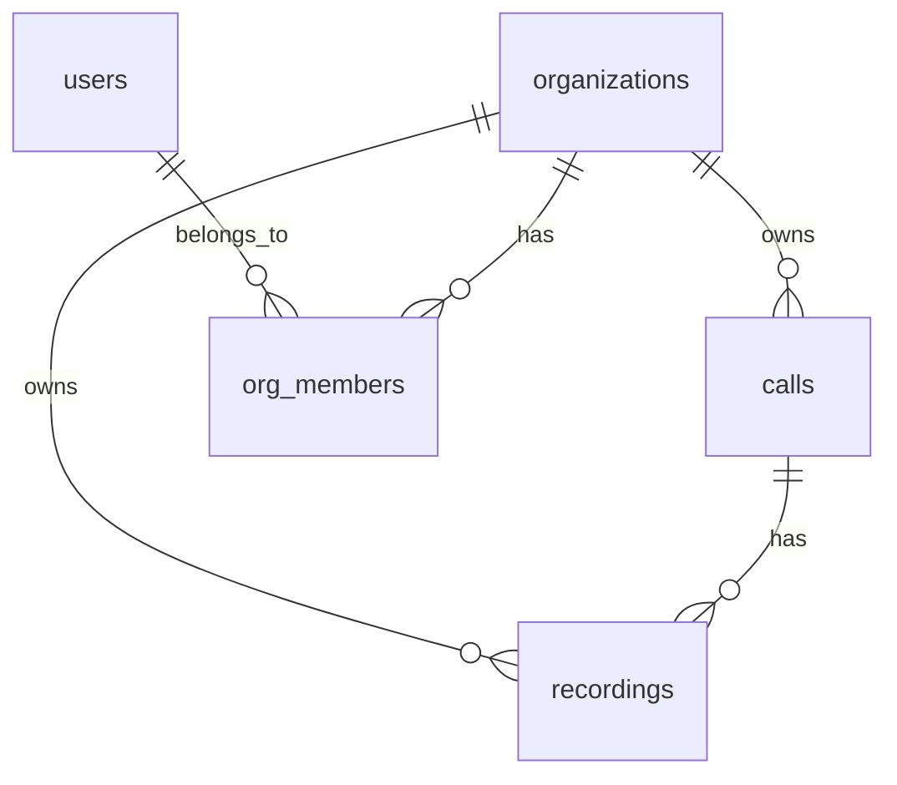

# DB Schema Reference

**Purpose:** Quick reference for agents to understand tables, relationships, without re-parsing migrations/code.

**Active Tables:** 47 (from docs/SCHEMA_ERD.md, last 2026-02-06)

## Key Categories & Relationships

**Full Table Summary (47 active):**

| Category         | Tables | Key Tables                                                     |
| ---------------- | ------ | -------------------------------------------------------------- |
| Auth/Identity    | 4      | `users`, `accounts`, `sessions`, `api_keys`                    |
| Tenancy          | 2      | `organizations`, `org_members`                                 |
| Core Calls       | 6      | `calls`, `call_outcomes`, `call_notes`, `call_timeline_events` |
| Recordings       | 3      | `recordings`, `transcriptions`, `ai_summaries`                 |
| Voice/Telephony  | 5      | `voice_configs`, `voice_targets`, `caller_ids`, `tts_audio`    |
| Campaigns        | 1      | `campaigns`                                                    |
| Team             | 3      | `teams`, `team_members`, `team_invites`                        |
| Billing          | 1      | `billing_events`                                               |
| Compliance/Audit | 4      | `audit_logs`, `retention_policies`, `legal_holds`              |
| AI/Bond AI       | 5      | `bond_ai_conversations`, `bond_ai_messages`, `bond_ai_alerts`  |
| Scorecards       | 3      | `scorecards`, `scorecard_templates`                            |
| Webhooks         | 3      | `webhook_subscriptions`, `webhook_deliveries`                  |
| RBAC             | 1      | `rbac_permissions`                                             |
| Surveys/Shopping | 3      | `surveys`, `shopper_scripts`                                   |
| Reports          | 2      | `reports`, `report_schedules`                                  |

**Insights:**

- **Core Entity:** `calls` (org-owned, disposition, legal_hold).
- **Joins:** `calls` JOIN `recordings` ON call_id; `org_members` for user roles.
- **Query Patterns:** `WHERE organization_id = current_setting('app.current_organization_id')`.
- **Indexes:** org_id, created_at DESC on calls/orgs.

**Multi-Tenant:** All via `organization_id` FK to `organizations.id`. RLS: `app.current_organization_id`.

## ERD (Mermaid)



**Access/Usage:** `workers/src/lib/db.ts#getDb(env)` → queries w/ RLS.

**Query Examples:**

```sql
-- Org calls
SELECT * FROM calls WHERE organization_id = ? ORDER BY started_at DESC;

-- User orgs
SELECT o.* FROM organizations o JOIN org_members m ON o.id = m.organization_id WHERE m.user_id = ?;
```

**Full:** `docs/SCHEMA_ERD.md` (Mermaid), `migrations/neon_schema.sql`.

---

_Generated by Cline for agent efficiency._
