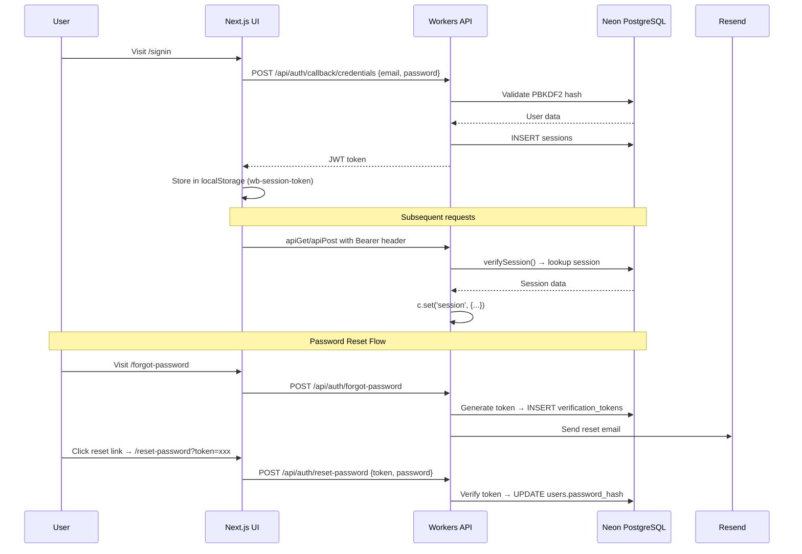
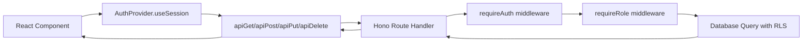
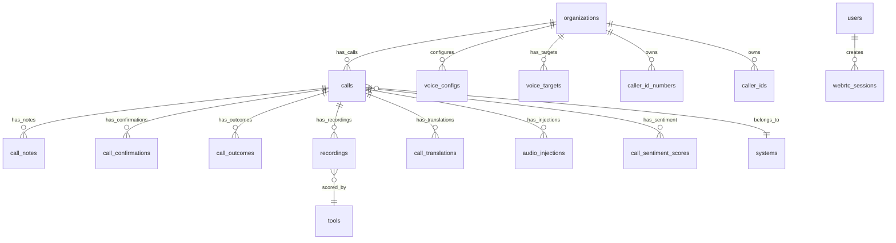
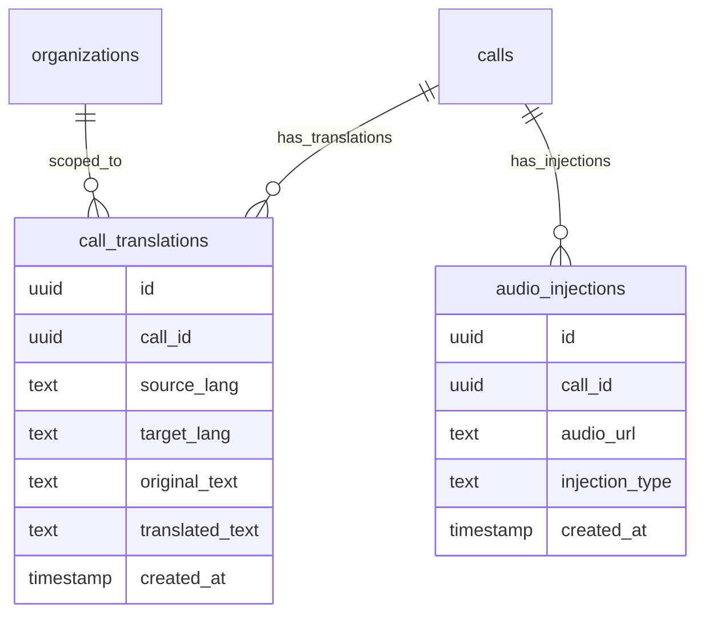
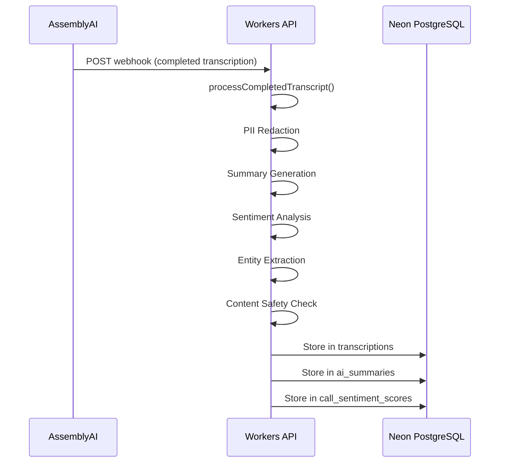
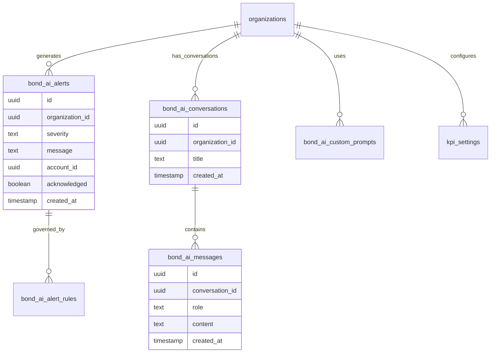
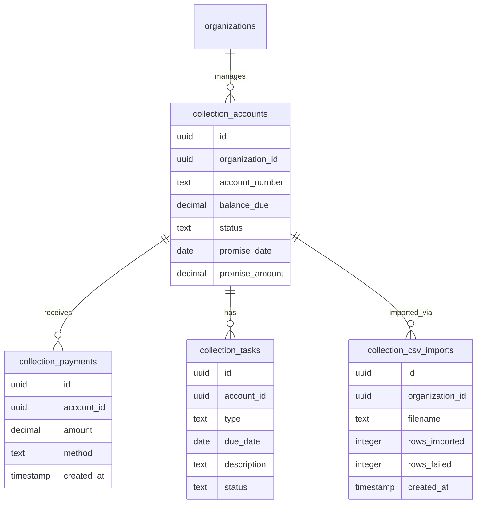

# Word Is Bond — Comprehensive Engineering Guide

> **TOGAF Phase:** Phase C (Information Systems Architecture) + Phase D (Technology Architecture)

**Last Updated:** February 13, 2026
**Platform Version:** v4.30
**Scope:** Complete feature-level engineering reference for all 31 application functions
**Companion Document:** `ARCH_DOCS/APPLICATION_FUNCTIONS.md`

---

## Table of Contents

- [1. Authentication & Session Management](#1-authentication--session-management)
- [2. Voice Operations & Call Management](#2-voice-operations--call-management)
- [3. Live Translation Pipeline](#3-live-translation-pipeline)
- [4. AI Intelligence Suite](#4-ai-intelligence-suite)
- [5. Bond AI Assistant](#5-bond-ai-assistant)
- [6. Cockpit — Agent Workspace](#6-cockpit--agent-workspace)
- [7. Predictive Dialer](#7-predictive-dialer)
- [8. Collections CRM](#8-collections-crm)
- [9. Campaign Management](#9-campaign-management)
- [10. Analytics & Reporting](#10-analytics--reporting)
- [11. Scorecard & QA System](#11-scorecard--qa-system)
- [12. Billing & Subscription Management](#12-billing--subscription-management)
- [13. Team & Organization Management](#13-team--organization-management)
- [14. Compliance & Security Center](#14-compliance--security-center)
- [15. IVR System](#15-ivr-system)
- [16. Webhook Management](#16-webhook-management)
- [17. CRM Integration Framework](#17-crm-integration-framework)
- [18. Feature Flag System](#18-feature-flag-system)
- [19. Onboarding Wizard](#19-onboarding-wizard)
- [20. Payment Plans & Dunning](#20-payment-plans--dunning)
- [21. Scheduling & Callbacks](#21-scheduling--callbacks)
- [22. Agent Productivity Tools](#22-agent-productivity-tools)
- [23. Sentiment Analysis](#23-sentiment-analysis)
- [24. Text-to-Speech (TTS)](#24-text-to-speech-tts)
- [25. Recording Management](#25-recording-management)
- [26. Data Retention & Legal Holds](#26-data-retention--legal-holds)
- [27. RBAC & Permissions](#27-rbac--permissions)
- [28. Admin & Platform Management](#28-admin--platform-management)
- [29. Infrastructure & DevOps](#29-infrastructure--devops)
- [30. Testing & Quality Assurance](#30-testing--quality-assurance)
- [31. UI/UX Framework](#31-uiux-framework)
- [Appendix A: Bug & Issue Audit](#appendix-a-bug--issue-audit)
- [Appendix B: Recommendations Matrix](#appendix-b-recommendations-matrix)

---

## 1. Authentication & Session Management

### Codebase Location

| Layer | File | Purpose |
|-------|------|---------|
| Backend Route | `workers/src/routes/auth.ts` | 12 auth endpoints |
| Backend Lib | `workers/src/lib/auth.ts` | `verifySession()`, `requireAuth()`, `requireRole()`, fingerprinting |
| Backend Lib | `workers/src/lib/schemas.ts` | Zod schemas: signup, login, forgot-password |
| Backend Lib | `workers/src/lib/email.ts` | Password reset, invite email templates (Resend) |
| Frontend | `components/AuthProvider.tsx` | `useSession()`, `signIn()`, `signOut()`, token management |
| Frontend | `components/ui/ProtectedGate.tsx` | Route-level auth guarding |
| Frontend Pages | `app/signin/`, `app/signup/`, `app/forgot-password/`, `app/reset-password/` | Auth UI |

### Flow Diagram



### API Request Flow



### Tests

| Test File | Coverage |
|-----------|----------|
| `tests/production/api-live.test.ts` | Auth endpoint connectivity |
| `tests/production/api.test.ts` | Auth integration flows |
| `tests/e2e/auth.setup.ts` | Playwright auth state setup |
| `tests/e2e/login.spec.ts` | Login E2E flow |
| `tests/load/authentication.js` | k6 auth load testing |

### Status: **ACTIVE** on website

### Database Elements

| Table | Key Columns | Purpose |
|-------|-------------|---------|
| `users` | `id`, `email`, `password_hash`, `organization_id`, `role`, `platform_role` | User accounts |
| `sessions` | `id`, `user_id`, `token`, `expires_at`, `fingerprint` | Active sessions |
| `verification_tokens` | `token`, `email`, `expires` | Password reset tokens |
| `login_attempts` | `email`, `ip`, `attempt_at`, `success` | Brute-force tracking |
| `

### RBAC Permission Matrix

```mermaid
flowchart TD
    A[User Action] --> B{Platform Role?}
    B -->|owner| C[Full Access]
    B -->|admin| D{Org Role?}
    D -->|owner| C
    D -->|admin| E[Org Admin + Billing]
    D -->|manager| F[Team + Campaign Mgmt]
    D -->|analyst| G[Read Analytics]
    D -->|operator| H[Call Operations]
    D -->|agent| I[Basic Agent Tasks]
    D -->|viewer| J[Read Only]
```auth_providers` | `provider`, `enabled`, `config` | Auth provider configuration |
| `api_keys` | `organization_id`, `key_hash`, `label`, `scopes` | API key authentication |
| `accounts` | `id`, `organization_id` | Base account records (retained for schema validation scripts) |

### Database Relationships

```mermaid
erDiagram
    organizations ||--o{ users : "has_members"
    users ||--o{ sessions : "creates"
    users ||--o{ api_keys : "owns"
    users ||--o{ accounts : "has"
    organizations ||--o{ auth_providers : "configures"
    users ||--o{ login_attempts : "tracked"
    users ||--o{ verification_tokens : "requests"
```

### Requirements & Dependencies

- **Resend** API key for email delivery (`RESEND_API_KEY`)
- **PBKDF2** password hashing (Node.js crypto, available in Workers)
- Rate limiters: `authRateLimit` (login), `registrationRateLimit` (signup)

### Activation Requirements

- `RESEND_API_KEY` env var for password reset emails
- `sessions` table must exist with proper indexes
- CORS config must include frontend origin

---

## 2. Voice Operations & Call Management

### Codebase Location

| Layer | File | Purpose |
|-------|------|---------|
| Backend Route | `workers/src/routes/calls.ts` | 18 call management endpoints |
| Backend Route | `workers/src/routes/voice.ts` | Voice targets, config, call initiation |
| Backend Route | `workers/src/routes/webrtc.ts` | WebRTC tokens, debug, dial |
| Backend Lib | `workers/src/lib/ai-call-engine.ts` | AI call state machine (KV-backed) |
| Backend Lib | `workers/src/lib/compliance-checker.ts` | Pre-dial compliance checks |
| Frontend | `components/voice/VoiceOperationsClient.tsx` (967 lines) | Main voice operations UI |
| Fmermaid
sequenceDiagram
    participant Agent
    participant Cockpit as Cockpit UI
    participant API as Workers API
    participant DB as Neon PostgreSQL
    participant Telnyx
    participant R2 as Cloudflare R2
    participant AssemblyAI

    Agent->>Cockpit: Click "Dial"
    Cockpit->>API: GET /api/compliance/pre-dial?phone=xxx
    API->>DB: Check DNC, consent, time-of-day, frequency, legal hold, bankruptcy
    DB-->>API: Compliance status
    API-->>Cockpit: Clear to dial

    Cockpit->>API: POST /api/calls/start {to, from, callerId}
    API->>DB: INSERT calls (status='initiated')
    DB-->>API: Call ID
    API->>Telnyx: POST Call Control v2 API
    Telnyx-->>API: Call SID

    Telnyx->>API: POST /webhooks/telnyx (call.answered)
    API->>DB: UPDATE calls status='in_progress'

    Telnyx->>API: POST /webhooks/telnyx (call.hangup)
    API->>DB: UPDATE calls status='completed'

    Telnyx->>API: POST /webhooks/telnyx (call.recording.saved)
    API->>R2: Store recording

    Telnyx->>API: POST /webhooks/telnyx (call.machine.detection)
    API->>DB: Store AMD result

    Note over Cockpit: WebRTC Flow
    Cockpit->>API: GET /api/webrtc/token
    API->>Telnyx: Request JWT
    Telnyx-->>API: JWT token (cached in KV)
    API-->>Cockpit: JWT token
    Cockpit->>Telnyx: WebRTC session
    Cockpit->>API: POST /api/webrtc/dial
    API->>Telnyx: Outbound dial

    Note over Agent: Call End Flow
    Agent->>Cockpit: Click Hang Up
    Cockpit->>API: POST /api/calls/:id/end
    API->>Cockpit: Show disposition modal
    Cockpit->>API: PUT /api/calls/:id/disposition
    API->>DB: UPDATE calls disposition
    Cockpit->>API: POST /api/calls/:id/outcome
    API->>DB: INSERT call_outcomes
    API->>AssemblyAI: POST webhook (if recording)
    AssemblyAI->>API: Transcription result
    API->>DB: Store transcription
```

### Database Relationships



### API Flow Diagram

```mermaid
flowchart TD
    A[Agent Action] --> B{Cockpit UI}
    B --> C[Compliance Check]
    C --> D[Call Initiation]
    D --> E[WebRTC Setup]
    E --> F[Call Management]
    F --> G[Disposition]
    G --> H[Transcription]

   mermaid
sequenceDiagram
    participant Caller
    participant Telnyx
    participant API as Workers API
    participant Groq
    participant DB as Neon PostgreSQL
    participant Frontend
    participant ElevenLabs

    Caller->>Telnyx: Speaks (Spanish)
    Telnyx->>Telnyx: Transcribes speech
    Telnyx->>API: POST /webhooks/telnyx (call.transcription)
    API->>Groq: translateAndStore() - Spanish → English
    Groq-->>API: Translated text
    API->>DB: INSERT call_translations
    Frontend->>API: GET /api/voice/translate/stream (SSE)
    API-->>Frontend: Server-Sent Events (real-time translation)

    Note over API: Optional Audio Injection
    API->>ElevenLabs: TTS request
    ElevenLabs-->>API: Audio file
    API->>Telnyx: Audio fork injection
```

### Database Relationships



### API Flow Diagram

```mermaid
flowchart TD
    A[Transcription Event] --> B[Webhook Handler]
    B --> C[Translation Processing]
    C --> D[Database Storage]
    D --> E[SSE Stream]
    E --> F[Frontend Display]
    F --> G{Audio Injection?}
   mermaid
flowchart TD
    A[AI Task Request] --> B{Task Classification}
    B -->|Chat| C{Complexity?}
    B -->|Summarize| D[Groq]
    B -->|Analyze| E{Complexity?}
    B -->|Translate| F[Groq]
    B -->|TTS| G{Provider Choice}

    C -->|Simple| D
    C -->|Complex| H[OpenAI GPT-4o-mini]
    E -->|Simple| D
    E -->|Complex| H
    G -->|Quality| I[ElevenLabs]
    G -->|Cost-effective| J[Grok/xAI]

    D --> K[Fast, Cheap]
    H --> L[Advanced Capabilities]
    I --> M[High Quality Voice]
    J --> N[Cost-effective TTS]
```



### Database Relationships

```mermaid
erDiagram
    organizations ||--o{ ai_configs : "configures"
    calls ||--o{ transcriptions : "has_transcriptions"
    transcriptions ||--o{ ai_summaries : "summarized"
    calls ||--o{ call_sentiment_scores : "analyzed"
    organizations ||--o{ ai_agent_audit_log : "logs"
    organizations ||--o{ ai_runs : "tracks"
    ai_configs {
        uuid id
        uuid organization_id
        jsonb config
        timestamp created_at
    }
    transcriptions {
        uuid id
        uuid call_id
        text content
        jsonb metadata
        timestamp created_at
    }
    ai_summaries {
        uuid id
        uuid transcription_id
   mermaid
flowchart TD
    subgraph "Tier 1 - Chat"
        A1[User] --> B1[POST /api/bond-ai/chat]
        B1 --> C1[buildSystemPrompt]
        C1 --> D1[OpenAI GPT-4o-mini]
        D1 --> E1[Store in DB]
    end

    subgraph "Tier 2 - Alerts"
        A2[Cron/Events] --> B2[AI Pattern Analysis]
        B2 --> C2[INSERT bond_ai_alerts]
        C2 --> D2[GET /api/bond-ai/alerts]
        D2 --> E2[BondAIAlertsPanel]
        E2 --> F2[PATCH /api/bond-ai/alerts/:id]
        F2 --> G2[POST /api/bond-ai/alerts/bulk-action]
    end

    subgraph "Tier 3 - Copilot"
        A3[SearchbarCopilot] --> B3[POST /api/bond-ai/copilot]
        B3 --> C3[Context-aware Response]
    end

    A1 --> A2
    A2 --> A3
```

### Database Relationships



### API Flow Diagram

```mermaid
flowchart TD
    A[Bond AI Request] --> B{Endpoint}
    B -->|Chat| C[POST /api/bond-ai/chat]
    B -->|Alerts| D[GET /api/bond-ai/alerts]
   mermaid
flowchart TD
    subgraph "Left Rail - Work Queue"
        A[fetchQueue()]
        A --> B[GET /api/collections?limit=25&sort=priority]
        B --> C[Account List]
        C --> D[AI-scored by likelihood]
    end

    subgraph "Center Stage - Call Center"
        E[CallCenter Component]
        E --> F[PreDialChecker]
        F --> G[useActiveCall Hook]
        G --> H[WebRTC/SIP Calling]
        H --> I[Live Transcript]
        I --> J[Disposition Bar]
        J --> K[Keyboard Shortcuts]
        K --> L[Ctrl+P: Payment Link]
        K --> M[Ctrl+N: Add Note]
        K --> N[Ctrl+B: Callback]
        K --> O[Ctrl+D: Dispute]
        K --> P[Ctrl+S: Save & Next]
    end

    subgraph "Right Rail - Context Panel"
        Q[ContextPanel]
        Q --> R[Account Info]
        R --> S[Payment Tools]
        S --> T[Compliance]
        T --> U[Quick Actions]
        U --> V[Modals]
        V --> W[PaymentLink]
        V --> X[AddNote]
        V --> Y[ScheduleCallback]
        V --> Z[FileDispute]
        V --> AA[TransferCall]
    end

    A --> E
    E --> Q
```

### Database Relationships

```mermaid
erDiagram
    organizations ||--o{ collection_accounts : "manages"
    collection_accounts ||--o{ collection_payments : "receives"
    collection_accounts ||--o{ collection_tasks : "has_tasks"
    collection_accounts ||--o{ collection_csv_imports : "imported_via"
    calls ||--o{ call_notes : "has_notes"
    calls ||--o{ call_outcomes : "has_outcomes"
    organizations ||--o{ compliance_violations : "tracks"
    organizations ||--o{ compliance_events : "logs"
    organizations ||--o{ dnc_lists : "maintains"
   mermaid
sequenceDiagram
    participant UI as Frontend UI
    participant API as Workers API
    participant DB as Neon PostgreSQL
    participant Telnyx

    UI->>API: POST /api/dialer/start {campaign_id, pacing_mode, max_concurrent}
    API->>API: startDialerQueue()
    API->>DB: Query campaign_calls WHERE status='pending'
    DB-->>API: Pending calls
    loop For each call
        API->>API: POST /api/calls/start
        API->>Telnyx: Call Control API
        Telnyx-->>API: AMD result
        alt Machine detected
            API->>DB: Skip call
        else Human detected
            API->>API: GET /api/dialer/agents
            API->>DB: Check agent availability
            DB-->>API: Available agents
            API->>Telnyx: Bridge call to agent
        end
    end

    UI->>API: POST /api/dialer/pause
    API->>API: Pause queue processing

    UI->>API: POST /api/dialer/stop
    API->>API: Stop and clean up

    UI->>API: GET /api/dialer/stats/:campaignId
    API->>DB: Real-time stats query
    DB-->>API: Stats data
    API-->>UI: Stats response

    UI->>API: PUT /api/dialer/agent-status
    API->>DB: Update agent availability

    UI->>API: GET /api/dialer/agents
    API->>DB: List agents and status
    DB-->>API: Agents data
    API-->>UI: Agents response
```

### Database Relationships

```mermaid
erDiagram
    organizations ||--o{ campaigns : "owns"
    campaigns ||--o{ campaign_calls : "contains"
    organizations ||--o{ dialer_agent_status : "tracks"
    campaigns {
        uuid id
        uuid organization_id
        text name
        text status
        timestamp created_at
    }
    campaign_calls {
        uuid id
        uuid campaign_id
        uuid account_id
        text status
   mermaid
flowchart TD
    subgraph "Account Lifecycle"
        A[Import CSV] --> B[POST /api/collections/import]
        B --> C[Validate Rows]
        C --> D[INSERT collection_accounts]
        D --> E[Log to collection_csv_imports]

        F[Work Account] --> G[GET /api/collections?limit=25&sort=priority]
        G --> H[Cockpit: Select Account]
        H --> I[PreDialChecker]
        I --> J[Call Initiation]
        J --> K[Disposition]

        L[Record Payment] --> M[POST /api/collections/:id/payments]
        M --> N[INSERT collection_payments]
        N --> O[UPDATE balance_due]
        O --> P{Balance = 0?}
        P -->|Yes| Q[Status → 'paid']

        R[Create Task] --> S[POST /api/collections/:id/tasks]
        S --> T[INSERT collection_tasks]

        U[Promise to Pay] --> V[UPDATE collection_accounts]
        V --> W[Set promise_date, promise_amount]
        W --> X[Daily Cron]
        X --> Y[Check Overdue Promises]
        Y --> Z[Create Follow-up Tasks]
    end
```

### Database Relationships



### API Flow Diagram

```mermaid
flowchart TD
    A[Collections Operation] --> B{Action}
    B -->|Import| C[POST /api/collections/import]
    B -->|List| D[GET /api/collections]
    B -->|Payment| E[POST /api/collections/:id/payments]
    B -->|Task| F[POST /api/collections/:id/tasks]
    B -->|Update| G[PUT /api/collections/:id]
    Flow Diagram

```mermaid
flowchart TD
    A[Campaign Management] --> B{Create Campaign}
    B --> C[POST /api/campaigns]
    C --> D[INSERT campaigns]

    A --> E[Add Accounts]
    E --> F[POST /api/campaigns/:id/accounts]
    F --> G[INSERT campaign_calls]

    A --> H[Sequence Builder]
    H --> I[POST /api/campaigns/sequences]
    I --> J[Configure Contact Sequence]

    A --> K[Survey Management]
    K --> L[POST /api/surveys]
    L --> M[INSERT surveys]
    M --> N[POST /api/surveys/:id/responses]
    N --> O[INSERT survey_responses]

    A --> P[Launch Dialer]
    P --> Q[POST /api/dialer/start]
    Q --> R[Campaign Calling]
```

### Database Relationships

```mermaid
erDiagram
    organizations ||--o{ campaigns : "owns"
    campaigns ||--o{ campaign_calls : "contains"
    campaigns ||--o{ surveys : "has"
    surveys ||--o{ survey_responses : "collects"
    campaigns {
        uuid id
        uuid organization_id
        text name
        text description
        text status
    Flow Diagram

```mermaid
flowchart TD
    A[Analytics Request] --> B{Type}
    B -->|Real-time| C[GET /api/analytics/realtime]
    B -->|Historical| D[GET /api/analytics/historical]
    B -->|Agent| E[GET /api/analytics/agents]
    B -->|Collections| F[GET /api/analytics/collections]
    B -->|Sentiment| G[GET /api/analytics/sentiment]

    C --> H[Live Data Query]
    D --> I[Aggregated Data]
    E --> J[Agent Performance]
    F --> K[Collection Metrics]
    G --> L[Sentiment Analysis]

    A --> M[Reports]
    M --> N[GET /api/reports]
    N --> O[Report Builder]
    O --> P[POST /api/reports/generate]
    P --> Q[Export Options]
    Q --> R[PDF/CSV/Excel]

    A --> S[Scheduled Reports]
    S --> T[GET /api/reports/schedules]
    T --> U[POST /api/reports/schedules]
    U --> V[Cron Execution]
    V --> W[Email Delivery]
```

### Database Relationships

```mermaid
erDiagram
    organizations ||--o{ reports : "generates"
    reports ||--o{ report_schedules : "schedules"
    organizations ||--o{ usage_stats : "aggregates"
    organizations ||--o{ reliability_metrics : "tracks"
    reports {
        uuid id
        uuid organization_id
    Flow Diagram

```mermaid
flowchart TD
    A[Call Recording] --> B[QA Review]
    B --> C[GET /api/review/calls]
    C --> D[Call Review Mode]
    D --> E[Scorecard Template]
    E --> F[Scoring Criteria]
    F --> G[Score Assignment]
    G --> H[POST /api/scorecards]
    H --> I[INSERT scorecards]

    A --> J[Alerts Generation]
    J --> K[Threshold Check]
    K --> L[INSERT scorecard_alerts]
    L --> M[Notification System]

    A --> N[Shopper Scripts]
    N --> O[GET /api/shopper/scripts]
    O --> P[Mystery Shopper Evaluation]
    P --> Q[Script Execution]
    Q --> R[POST /api/shopper/results]
    R --> S[INSERT test_results]

    A --> T[Coaching Queue]
    T --> U[Manager Review]
    U --> V[Feedback Loop]
    V --> W[Training Actions]
```

### Database Relationships

```mermaid
erDiagram
    organizations ||--o{ scorecards : "manages"
    scorecards ||--o{ scorecard_alerts : "generates"
    scorecards ||--o{ scored_recordings : "links"
    organizations ||--o{ shopper_scripts : "defines"
    shopper_scripts ||--o{ test_configs : "configures"
    test_configs ||--o{ test_results : "produces"
    recordings ||--o{ scored_recordings : "associated"
    tools ||--o{ scorecards : "used_for"
    tools ||--o{ recordings : "categorizes"
    scorecards {
        uuid id
        uuid organization_id
        uuid call_id
        uuid user_id
   mermaid
sequenceDiagram
    participant User
    participant UI as Next.js UI
    participant API as Workers API
    participant Stripe
    participant DB as Neon PostgreSQL

    User->>UI: Visit /pricing
    UI->>API: POST /api/billing/checkout { planId }
    API->>Stripe: Create Checkout Session
    Stripe-->>API: Session URL
    API-->>UI: Redirect to Stripe
    User->>Stripe: Complete payment
    Stripe->>API: POST /webhooks/stripe (checkout.session.completed)
    API->>DB: Process event → UPDATE organizations.plan
    API->>API: syncStripeData()
    API->>DB: Mirror to stripe_* tables

    Note over UI,DB: Feature Gating
    UI->>API: Protected endpoint
    API->>API: requirePlan('pro') middleware
    API->>DB: Check org.plan vs feature matrix
    alt Insufficient plan
        API-->>UI: 403 { error: 'Plan upgrade required' }
    end

    Note over API,DB: Usage Tracking
    API->>API: Cron: aggregate_usage (daily)
    API->>DB: Count calls, minutes, recordings per org
    API->>DB: INSERT usage_stats
```

### Database Relationships

```mermaid
erDiagram
    organizations ||--o{ stripe_events : "receives"
    organizations ||--o{ billing_events : "generates"
    organizations ||--o{ stripe_subscriptions : "has"
    organizations ||--o{ stripe_payment_methods : "owns"
    organizations ||--o{ stripe_invoices : "receives"
    stripe_events {
        uuid id
        uuid organization_id
        text event_type
        jsonb event_data
        boolean processed
        timestamp created_at
    }
    billing_events {
        uuid id
        uuid organization_id
        text event_type
        jsonb metadata
        timestamp created_at
    }
    stripe_subscriptions {
        uuid id
        uuid organization_id
        text stripe_subscription_id
        text status
        text plan_id
        timestamp created_at
    Flow Diagram

```mermaid
flowchart TD
    A[Team Management] --> B[Organization Creation]
    B --> C[POST /api/organizations]
    C --> D[INSERT organizations]
    D --> E[Owner Assignment]

    A --> F[Team Creation]
    F --> G[POST /api/teams]
    G --> H[INSERT teams]

    A --> I[Invite Members]
    I --> J[POST /api/teams/invites]
    J --> K[Generate Token]
    K --> L[INSERT team_invites]
    L --> M[Send Email]
    M --> N[Resend Invite]

    A --> O[Member Management]
    O --> P[PUT /api/teams/:id/members]
    P --> Q[INSERT org_members]
    Q --> R[Role Assignment]

    A --> S[Role Management]
    S --> T[GET /api/teams/roles]
    T --> U[PUT /api/teams/roles]
    U --> V[Permission Updates]

    A --> W[Org Switching]
    W --> X[GET /api/organizations]
    X --> Y[Switch Context]
    Y --> Z[Session Update]
```

### Database Relationships

```mermaid
erDiagram
    organizations ||--o{ org_members : "has_members"
    org_members ||--o{ users : "links"
    organizations ||--o{ teams : "contains"
    Flow Diagram

```mermaid
flowchart TD
    A[Compliance Check] --> B{Type}
    B -->|Pre-dial| C[GET /api/compliance/pre-dial]
    C --> D[DNC Check]
    D --> E[Consent Verification]
    E --> F[Time-of-day Rules]
    F --> G[Frequency Limits]
    G --> H[Legal Hold Check]
    H --> I[Bankruptcy Status]
    I --> J[Log Event]
    J --> K[INSERT compliance_events]

    B -->|PII Redaction| L[Transcription Processing]
    L --> M[Detect PII]
    M --> N[Redact Content]
    N --> O[Store Clean Version]

    B -->|Audit| P[GET /api/audit/logs]
    P --> Q[Query audit_logs]
    Q --> R[Filter by org_id]
    R --> S[Return Events]

    B -->|DNC Management| T[GET /api/dnc]
    T --> U[Query dnc_lists]
    U --> V[POST /api/dnc]
    V --> W[INSERT dnc_lists]

    B -->|Violations| X[GET /api/compliance/violations]
    X --> Y[Query compliance_violations]
    Y --> Z[Report Generation]
```

### Database Relationships

```mermaid
erDiagram
    organizations ||--o{ compliance_violations : "tracks"
    Flow Diagram

```mermaid
flowchart TD
    A[Inbound Call] --> B[Telnyx Webhook]
    B --> C[POST /webhooks/telnyx]
    C --> D[IVR Flow Engine]
    D --> E{Account Lookup}
    E -->|Found| F[Balance Check]
    E -->|Not Found| G[Transfer to Agent]

    F --> H{Payment Due?}
    H -->|Yes| I[Payment Options]
    I --> J[Credit Card]
    I --> K[Bank Transfer]
    I --> L[Promise to Pay]

    H -->|No| M[Account Status]
    M --> N[Transfer to Agent]

    J --> O[Stripe Payment]
    O --> P[Payment Success]
    P --> Q[Update Balance]

    K --> R[ACH Setup]
    Flow Diagram

```mermaid
flowchart TD
    A[Webhook Event] --> B[Event Generation]
    B --> C[Workers Route]
    C --> D[webhookRetry()]
    D --> E{Delivery Attempt}
    E -->|Success| F[Log Success]
    E -->|Failure| G[Retry Logic]
    G --> H{Retry Count < Max}
    H -->|Yes| I[Queue Retry]
    I --> J[Exponential Backoff]
    J --> E
    H -->|No| K[Log Failure]
    K --> L[INSERT webhook_failures]

    A --> M[Subscription Management]
    M --> N[POST /api/webhooks/subscriptions]
    N --> O[INSERT webhook_subscriptions]
    O --> P[Validate URL]
    P --> Q[Send Test Event]

    A --> R[Reliability Monitoring]
    R --> S[GET /api/reliability/metrics]
    S --> T[Calculate Success Rate]
    T --> U[Response Time Analysis]
    U --> V[Alert on Degradation]
```

### Database Relationships

```mermaid
erDiFlow Diagram

```mermaid
flowchart TD
    A[CRM Integration] --> B[Configuration]
    B --> C[POST /api/crm/integrations]
    C --> D[INSERT integrations]
    D --> E[API Key Storage]
    E --> F[Connection Test]

    A --> G[Data Sync]
    G --> H[POST /api/crm/sync]
    H --> I[Fetch CRM Data]
    I --> J[Map to Internal Schema]
    J --> K[INSERT crm_object_links]
    K --> L[Log Sync Event]
    L --> M[INSERT crm_sync_log]

    A --> N[Object Linking]
    N --> O[POST /api/crm/objects/link]
    O --> P[Associate CRM Object]
    P --> Q[Update collection_accounts]
    Q --> R[Bidirectional Sync]

    A --> S[Sync Monitoring]
    S --> T[GET /api/crm/sync/status]
    T --> U[Last Sync Time]
    U --> V[Error Reporting]
    V --> W[Retry Failed Syncs]
```

### Database Relationships

```mermaid
erDiagram
    organizations ||--o{ integrations : "configures"
    integrations ||--o{ crm_object_links : "manages"
    integrations ||--o{ crm_sync_log : "logs"
    collection_accounts ||--o{ crm_object_links : "links"
    crm_object_links {
        uuid id
        uuid integration_id
        text crm_object_type
        text crm_object_id
        uuid internal_id
        text internal_type
        timestamp linked_at
    }
    crm_sync_log {
        uuid id
        uuid integration_id
        text operation
        text status
        text error_message
        integer records_processed
        timestamp started_at
        timestamp completed_at
    }
    integrations {
        uuid id
        uuid organization_id
        text crm_type
        jsonb config
        boolean active
        timestamp created_at
    }
```

### API Flow Diagram

```mermaid
flowchart TD
    A[CRM Framework] --> B[Integration Setup]
    B --> C[POST /api/crm/integrations]
    C --> D[CRM Type Selection]
    D --> E[Salesforce/HubSpot/etc]

    A --> F[Object Management]
    F --> G[GET /api/crm/objects]
    F --> H[POST /api/crm/objects/link]
    F --> I[DELETE /api/crm/objects/:id]

    A --> J[Sync Operations]
    J --> K[POST /api/crm/sync]
    J --> L[GET /api/crm/sync/status]
    J --> M[POST /api/crm/sync/retry]

    A --> N[Field Mapping]
    N --> O[GET /api/crm/mappings]
    N --> P[PUT /api/crm/mappings]
    P --> Q[Custom Field Rules]
```
        integer attempt_count
        integer response_time_ms
        timestamp created_at
    }
    webhook_failures {
        uuid id
        uuid subscription_id
        text event_type
        text error_message
        jsonb request_payload
        timestamp failed_at
    }
    webhook_subscriptions {
        uuid id
        uuid organization_id
        text name
        text url
        jsonb headers
        jsonb events
        boolean active
        timestamp created_at
    }
```
Flow Diagram

```mermaid
flowchart TD
    A[Feature Flag Request] --> B{Flag Type}
    B -->|Global| C[GET /api/feature-flags/global]
    C --> D[Check platform_admin role]
    D --> E[Query global_feature_flags]
    E --> F[Return flag value]

    B -->|Org| G[GET /api/feature-flags/org]
    G --> H[Check session.organization_id]
    H --> I[Query org_feature_flags]
    I --> J{Fallback to global?}
    J -->|Yes| K[Check global if not set]
    J -->|No| L[Return org value]

    A --> M[Flag Management]
    M --> N[POST /api/feature-flags]
    N --> O[INSERT global_feature_flags]
    O --> P[Role validation]

    A --> Q[Flag Updates]
    Q --> R[PUT /api/feature-flags/:id]
    R --> S[Update flag value]
    S --> T[Cache invalidation]
Flow Diagram

```mermaid
flowchart TD
    A[New User Signup] --> B[Email Verification]
    B --> C[POST /api/auth/signup]
    C --> D[Send verification email]
    D --> E[User clicks link]
    E --> F[GET /auth/verify?token=xxx]
    F --> G[Mark email verified]

    A --> H[Onboarding Check]
    H --> I{Onboarding completed?}
    I -->|No| J[Redirect to /onboarding]
    I -->|Yes| K[Allow access]

    J --> L[7-Step Wizard]
    L --> M[Step 1: Account Setup]
    M --> N[Step 2: Phone Number]
    N --> O[Step 3: Team Invites]
    O --> P[Step 4: Collections Import]
    P --> Q[Step 5: Campaign Setup]
    Q --> R[Step 6: Compliance Review]
    R --> S[Step 7: Go Live]
Flow Diagram

```mermaid
flowchart TD
    A[Payment Plan Creation] --> B[POST /api/payments/plans]
    B --> C[INSERT payment_plans]
    C --> D[Calculate installments]
    D --> E[INSERT scheduled_payments]

    A --> F[Payment Processing]
    F --> G[Cron: process_payments]
    G --> H[Query due payments]
    H --> I[Payment gateway call]
    I --> J{Success?}
    J -->|Yes| K[Update balance]
    J -->|No| L[Log failure]

    A --> M[Dunning Process]
    M --> N[Cron: dunning_escalation]
    N --> O[Find overdue accounts]
    O --> P[Check dunning level]
    P --> Q[Send notice/email]
    Q --> R[INSERT dunning_events]
    R --> S[Escalate if needed]

    A --> T[Promise to Pay]
    T --> U[UPDATE collection_accounts]
    U --> V[Set promise_date]
    V --> W[Monitor compliance]
    W --> X{Broken promise?}
    X -->|Yes| Y[Trigger dunning]
    X -->|No| Z[Clear promise]
```

### Database Relationships

```mermaid
erDiagram
    Flow Diagram

```mermaid
flowchart TD
    A[Callback Request] --> B[POST /api/bookings]
    B --> C[Validate availability]
    C --> D[Check conflicts]
    D --> E[INSERT booking_events]
    E --> F[Send confirmation]
    F --> G[Calendar integration]

    A --> H[Follow-up Scheduling]
    H --> I[Agent selects time]
    I --> J[POST /api/bookings/followup]
    J --> K[Link to account]
    K --> L[Set reminder]

    A --> M[Booking Management]
    M --> N[GET /api/bookings]
    N --> O[Filter by status]
    O --> P[Display calendar]

    A --> Q[Booking Updates]
    Q --> R[PUT /api/bookings/:id]
    R --> S[Reschedule logic]
    S --> T[Notification update]

    A --> U[Automated Reminders]
    U --> V[Cron job]
    V --> W[Query upcoming bookings]
    Flow Diagram

```mermaid
flowchart TD
    A[Productivity Tools] --> B[Note Templates]
    B --> C[GET /api/productivity/templates]
    C --> D[Display library]
    D --> E[Agent selects template]
    E --> F[Insert into call notes]
    F --> G[POST /api/calls/:id/notes]

    A --> H[Objection Library]
    H --> I[GET /api/productivity/objections]
    I --> J[Search by objection type]
    J --> K[Show rebuttals]
    K --> L[Copy to clipboard]
    L --> M[Use in call]

    A --> N[Likelihood Scoring]
    N --> O[GET /api/productivity/scores]
    O --> P[Analyze account history]
    P --> Q[Calculate likelihood]
    Q --> R[Update queue priority]

    A --> S[Prevention Scan]
    S --> T[Cron: prevention_scan]
    T --> U[Identify at-risk accounts]
    U --> V[Generate tasks]
    V --> W[INSERT collection_tasks]

    A --> X[Daily Planner]
    X --> Y[GET /api/productivity/planner]
    Y --> Z[Aggregate KPIs]
    Z --> AA[Generate insights]
    Flow Diagram

```mermaid
flowchart TD
    A[Sentiment Analysis] --> B[Real-time Processing]
    B --> C[Transcription Webhook]
    C --> D[POST /webhooks/assemblyai]
    D --> E[sentimentProcessor.process()]
    E --> F[Groq API call]
    F --> G[Score utterance]
    G --> H[INSERT call_sentiment_scores]

    A --> I[Batch Processing]
    I --> J[Cron job]
    J --> K[Process completed calls]
    K --> L[Aggregate scores]
    L --> M[INSERT call_sentiment_summary]

    A --> N[Alert System]
    N --> O[Threshold check]
    O --> P{Score < threshold?}
    P -->|Yes| Q[Generate alert]
    Q --> R[INSERT sentiment_alert_configs]
    R --> S[Notify manager]

    A --> T[Dashboard Display]
    T --> U[GET /api/sentiment/dashboard]
    U --> V[Aggregate data]
    V --> W[Chart generation]
    W --> X[Real-time updates]
```

### Database Relationships

```mermaid
erDiFlow Diagram

```mermaid
flowchart TD
    A[TTS Request] --> B{Provider Selection}
    B -->|ElevenLabs| C[POST /api/tts/elevenlabs]
    B -->|Grok| D[POST /api/tts/grok]
    C --> E[ElevenLabs API]
    D --> F[Grok API]

    E --> G[Generate Audio]
    F --> G
    G --> H[Upload to R2]
    H --> I[INSERT tts_audio]
    I --> J[Return URL]

    A --> K[Audio Injection]
    K --> L[During Call]
    L --> M[POST /api/audio/inject]
    M --> N[Telnyx Audio Fork]
    N --> O[Play TTS to caller]

    A --> P[Audio Management]
    P --> Q[GET /api/audio/files]
    Q --> R[List generated audio]
    R --> S[Playback/Deletion]

    A --> T[Voice Cloning]
    T --> U[Upload sample]
    U --> V[ElevenLabs training]
    Flow Diagram

```mermaid
flowchart TD
    A[Recording Creation] --> B[Call Connected]
    B --> C[Telnyx recording start]
    C --> D[POST /webhooks/telnyx]
    D --> E[recording.saved event]
    E --> F[Download from Telnyx]
    F --> G[Upload to R2]
    G --> H[INSERT recordings]
    H --> I[Generate stream URL]

    A --> J[Recording Access]
    J --> K[GET /api/recordings]
    K --> L[List recordings]
    L --> M[Filter by call/date]
    M --> N[Return metadata]

    A --> O[Playback Request]
    O --> P[GET /api/recordings/stream/:id]
    P --> Q[Authenticate user]
    Q --> R[Check permissions]
    R --> S[Fetch from R2]
    S --> T[Stream audio]

    Flow Diagram

```mermaid
flowchart TD
    A[Retention Policy] --> B[Configuration]
    B --> C[POST /api/retention/policies]
    C --> D[INSERT retention_policies]
    D --> E[Set retention periods]
    E --> F[Apply to data types]

    A --> G[Legal Hold]
    G --> H[POST /api/retention/holds]
    H --> I[INSERT legal_holds]
    I --> J[Freeze data]
    J --> K[Prevent deletion]

    A --> L[Automated Cleanup]
    L --> M[Cron job]
    M --> N[Query expired data]
    N --> O{Check legal hold?}
    O -->|No hold| P[Delete data]
    O -->|Hold active| Q[Skip deletion]

    A --> R[Manual Deletion]
    R --> S[DELETE /api/retention/data]
    S --> T[Admin approval]
    T --> U[Audit logging]
    U --> V[Execute deletion]

    A --> W[Retention Audit]
    W --> X[GET /api/retention/audit]
    X --> Y[Review deletions]
    Y --> Z[Compliance reporting]
```

### Database Relationships

```mermaid
erDiagram
    organizations ||--o{ retention_policies : "defines"
    organizations ||--o{ legal_holds : "places"
    retention_policies {
        uuid id
        uuid organization_id
        text data_type
        integer retention_days
        boolean auto_delete
        timestamp created_at
    }
    legal_holds {
        uuid id
        uuid organization_id
        text case_number
        text description
        date hold_until
        boolean active
        timestamp created_at
    }
```

### API Flow Diagram

```mermaid
flowchart TD
    A[Retention Management] --> B[Policy CRUD]
    B --> C[GET /api/retention/policies]
    B --> D[POST /api/retention/policies]
    B --> E[PUT /api/retention/policies/:id]
    B --> F[DELETE /api/retention/policies/:id]

    A --> G[Legal Holds]
    G --> H[GET /api/retention/holds]
    G --> I[POST /api/retention/holds]
    G --> J[PUT /api/retention/holds/:id]
    G --> K[DELETE /api/retention/holds/:id]

    A --> L[Data Deletion]
    L --> M[POST /api/retention/delete]
    L --> N[Type selection]
    L --> O[Date range]
    L --> P[Execute cleanup]

    A --> Q[Audit Trail]
    Q --> R[GET /api/retention/audit]
    Q --> S[Deletion history]
    Q --> T[Compliance logs]
```
Flow Diagram

```mermaid
flowchart TD
    A[RBAC Check] --> B[API Request]
    B --> C[requireAuth middleware]
    C --> D[Verify session]
    D --> E[Extract user role]
    E --> F[requireRole middleware]
    F --> G{Check permission}
    G -->|Granted| H[Allow access]
    G -->|Denied| I[403 Forbidden]

    A --> J[Role Hierarchy]
    J --> K[platform_admin > owner > admin > operator > worker]
    K --> L[Inheritance check]
    L --> M[Higher roles include lower permissions]

    A --> N[Frontend Guards]
    N --> O[useRBAC hook]
    N --> P[RoleShell component]
    P --> Q[Conditional rendering]
    Q --> R[Menu item hiding]

    A --> S[Role Assignment]
    S --> T[PUT /api/rbac/roles]
    Flow Diagram

```mermaid
flowchart TD
    A[Admin Access] --> B[Role Check]
    B --> C{platform_admin?}
    C -->|Yes| D[Grant access]
    C -->|No| E[403 Forbidden]

    A --> F[Metrics Dashboard]
    F --> G[GET /api/admin/metrics]
    G --> H[Platform-wide stats]
    H --> I[Usage analytics]
    I --> J[Performance monitoring]

    A --> K[Auth Provider Management]
    K --> L[GET /api/admin/auth-providers]
    K --> M[PUT /api/admin/auth-providers/:id]
    M --> N[Provider configuration]
    N --> O[Enable/disable]

    A --> P[Cron Health]
    P --> Q[GET /api/internal/cron-health]
    Q --> R[Job status]
    Flow Diagram

```mermaid
flowchart TD
    A[Infrastructure Monitoring] --> B[Health Probes]
    B --> C[GET /api/health/db]
    C --> D[Neon connection test]
    D --> E[Query execution]

    B --> F[GET /api/health/kv]
    F --> G[Cloudflare KV check]
    G --> H[Read/write test]

    B --> G[GET /api/health/r2]
    I --> J[R2 bucket access]
    J --> K[Upload/download test]

    A --> L[Rate Limiting]
    L --> M[KV-backed counters]
    M --> N[Request throttling]
    N --> O[429 responses]

    A --> P[Idempotency]
    P --> Q[KV-backed tokens]
    Flow Diagram

```mermaid
flowchart TD
    A[Testing Pipeline] --> B[Unit Tests]
    B --> C[Vitest]
    C --> D[Component logic]
    D --> E[Utility functions]

    A --> F[Production Integration]
    F --> G[Real API calls]
    G --> H[No mocks]
    H --> I[Full stack validation]

    A --> J[E2E Tests]
    J --> K[Playwright]
    K --> L[Browser automation]
    L --> M[User journey testing]

    A --> N[Load Tests]
    N --> O[k6]
    O --> P[Performance testing]
    P --> Q[Scalability validation]

    A --> R[Manual Tests]
    R --> S[PowerShell scripts]
    S --> T[Complex scenarios]
    T --> U[Edge cases]

    A --> V[Schema Validation]
    V --> W[validate-schema-drift.ts]
    W --> X[Compare live vs code]
    X --> Y[Migration verification]

    A --> Z[Contract Testing]
    Z --> AA[API contract validation]
    AA --> BB[TypeScript types]
    BB --> CC[Schema extraction]
```

### API Flow Diagram

```mermaid
flowchart TD
    Flow Diagram

```mermaid
flowchart TD
    A[UI Framework] --> B[Root Layout]
    B --> C[app/layout.tsx]
    C --> D[Provider stack]
    D --> E[Theme provider]
    E --> F[Auth provider]
    F --> G[Error boundary]

    A --> H[Navigation]
    H --> I[RoleShell.tsx]
    I --> J[Role-based menus]
    J --> K[BottomNav.tsx]
    K --> L[Mobile navigation]
    L --> M[CommandPalette.tsx]
    M --> N[Cmd+K search]

    A --> O[Component Library]
    O --> P[components/ui/]
    P --> Q[23 primitives]
    Q --> R[Design system]
    R --> S[Consistent styling]

    A --> T[Tour System]
    T --> U[components/tour/]
    T --> V[5 components]
    V --> W[Product onboarding]
    W --> X[Interactive guides]

    A --> Y[Error Handling]
    Y --> Z[ErrorBoundary.tsx]
    Z --> AA[Global error catching]
    AA --> BB[User-friendly messages]
    BB --> CC[Fallback UI]
```

### API Flow Diagram

```mermaid
flowchart TD
    A[UI Architecture] --> B[Layout System]
    B --> C[AppShell.tsx]
    C --> D[Legacy navigation]
    D --> E[Sidebar layout]
    E --> F[Responsive design]

    A --> G[State Management]
    G --> H[React Context]
    G --> I[Custom hooks]
    I --> J[useApiQuery]
    J --> K[Data fetching]

    A --> L[Theming]
    L --> M[theme-provider.tsx]
    L --> N[Dark/light mode]
    N --> O[Tailwind CSS]
    O --> P[Custom variables]

    A --> Q[Component Composition]
    Q --> R[Higher-order components]
    Q --> S[Render props]
    S --> T[Flexible APIs]
``` C --> D[Live DB comparison]
    D --> E[Drift detection]

    A --> F[RLS Audit]
    F --> G[scripts/rls-audit.sql]
    F --> H[Policy coverage check]
    H --> I[Security validation]

    A --> J[Validation Orchestrator]
    J --> K[scripts/validate-all.ts]
    J --> L[L1-L3 validation]
    L --> M[Comprehensive checks]

    A --> N[API Contract]
    N --> O[tools/validate_api_contract.py]
    N --> P[Endpoint validation]
    P --> Q[Response schema check]

    A --> R[Schema Extraction]
    R --> S[tools/extract_schema.py]
    R --> T[TypeScript generation]
    T --> U[Type safety]
```
    H --> J[GET /api/config/features]
    J --> K[Runtime settings]

    A --> L[Monitoring]
    L --> M[GET /api/monitoring/metrics]
    L --> N[GET /api/monitoring/logs]
    N --> O[Structured logging]
    O --> P[JSON format]

    A --> Q[Maintenance]
    Q --> R[POST /api/maintenance/cleanup]
    Q --> S[POST /api/maintenance/optimize]
    S --> T[Database maintenance]
``
    A --> F[Organization Management]
    F --> G[GET /api/admin/organizations]
    F --> H[PUT /api/admin/organizations/:id]
    H --> I[Plan changes]
    I --> J[Feature toggles]

    A --> K[User Management]
    K --> L[GET /api/admin/users]
    K --> M[PUT /api/admin/users/:id/role]
    M --> N[Platform role assignment]

    A --> O[System Health]
    O --> P[GET /api/internal/health]
    O --> Q[GET /api/internal/cron-status]
    O --> R[GET /api/internal/queue-status]
    R --> S[Infrastructure monitoring]
``

```mermaid
erDiagram
    rbac_permissions {
        uuid id
        text role_name
        text permission
        text resource
        text action
        timestamp created_at
    }
    users ||--o{ org_members : "belongs_to"
    org_members {
        uuid id
        uuid organization_id
        uuid user_id
        text role
        timestamp joined_at
    }
    organizations ||--o{ org_members : "has_members"
```

### API Flow Diagram

```mermaid
flowchart TD
    A[RBAC System] --> B[Permission Check]
    B --> C[GET /api/rbac/check]
    C --> D[Role validation]
    D --> E[Permission lookup]
    E --> F[Boolean response]

    A --> G[Role Management]
    G --> H[GET /api/rbac/roles]
    G --> I[PUT /api/rbac/roles/:userId]
    I --> J[Role update]
    J --> K[Audit logging]

    A --> L[Permission Matrix]
    L --> M[GET /api/rbac/matrix]
    L --> N[Role-permission mapping]
    N --> O[UI display]

    A --> P[Session Context]
    P --> Q[session.platform_role]
    P --> R[session.organization_id]
    P --> S[Context-aware checks]
```
        uuid id
        uuid call_id
        text r2_key
        integer duration
        integer file_size
        text format
        timestamp created_at
    }
    scored_recordings {
        uuid id
        uuid recording_id
        uuid scorecard_id
        jsonb scores
        timestamp scored_at
    }
```

### API Flow Diagram

```mermaid
flowchart TD
    A[Recording API] --> B[List Recordings]
    B --> C[GET /api/recordings]
    C --> D[Pagination]
    D --> E[Filtering]
    E --> F[Sorting]

    A --> G[Stream Recording]
    G --> H[GET /api/recordings/stream/:id]
    H --> I[Authentication]
    I --> J[Authorization]
    J --> K[R2 streaming]

    A --> L[Recording Details]
    L --> M[GET /api/recordings/:id]
    M --> N[Metadata only]

    A --> O[Delete Recording]
    O --> P[DELETE /api/recordings/:id]
    P --> Q[Retention check]
    Q --> R[Soft delete]
    R --> S[Cleanup job]
```
    organizations ||--o{ audio_files : "uploads"
    calls ||--o{ audio_injections : "uses"
    transcriptions ||--o{ tts_audio : "converts"
    tts_audio {
        uuid id
        uuid organization_id
        text provider
        text voice_id
        text text_content
        text audio_url
        integer duration_ms
        timestamp created_at
    }
    audio_files {
        uuid id
        uuid organization_id
        text filename
        text r2_key
        text content_type
        integer file_size
        timestamp uploaded_at
    }
    audio_injections {
        uuid id
        uuid call_id
        text audio_url
        text injection_type
        timestamp injected_at
    }
```

### API Flow Diagram

```mermaid
flowchart TD
    A[TTS System] --> B[Synthesis]
    B --> C[POST /api/tts/synthesize]
    C --> D[Text input]
    D --> E[Voice selection]
    E --> F[Provider routing]

    A --> G[Audio Library]
    G --> H[GET /api/audio/library]
    G --> I[POST /api/audio/upload]
    I --> J[File storage]

    A --> K[Injection Control]
    K --> L[POST /api/audio/inject]
    K --> M[During live call]
    M --> N[Real-time playback]

    A --> O[Voice Management]
    O --> P[GET /api/tts/voices]
    O --> Q[POST /api/tts/voices/custom]
    Q --> R[Voice cloning]
```
        timestamp timestamp
        timestamp created_at
    }
    call_sentiment_summary {
        uuid id
        uuid call_id
        float average_score
        text overall_sentiment
        integer total_utterances
        timestamp created_at
    }
    sentiment_alert_configs {
        uuid id
        uuid organization_id
        text alert_type
        float threshold
        boolean enabled
        timestamp created_at
    }
```

### API Flow Diagram

```mermaid
flowchart TD
    A[Sentiment API] --> B[Real-time Scores]
    B --> C[GET /api/sentiment/realtime]
    C --> D[WebSocket stream]
    D --> E[Live updates]

    A --> F[Historical Analysis]
    F --> G[GET /api/sentiment/history]
    F --> H[GET /api/sentiment/trends]
    H --> I[Time-series data]

    A --> J[Alert Management]
    J --> K[GET /api/sentiment/alerts]
    J --> L[POST /api/sentiment/alerts]
    J --> M[PUT /api/sentiment/alerts/:id]

    A --> N[Configuration]
    N --> O[GET /api/sentiment/config]
    N --> P[PUT /api/sentiment/config]
    P --> Q[Threshold settings]
```
        jsonb variables
        timestamp created_at
    }
    objection_rebuttals {
        uuid id
        uuid organization_id
        text objection_type
        text rebuttal_text
        text category
        integer success_rate
        timestamp created_at
    }
```

### API Flow Diagram

```mermaid
flowchart TD
    A[Productivity API] --> B[Templates]
    B --> C[GET /api/productivity/templates]
    B --> D[POST /api/productivity/templates]
    B --> E[PUT /api/productivity/templates/:id]
    B --> F[DELETE /api/productivity/templates/:id]

    A --> G[Objections]
    G --> H[GET /api/productivity/objections]
    G --> I[POST /api/productivity/objections]
    G --> J[PUT /api/productivity/objections/:id]
    G --> K[DELETE /api/productivity/objections/:id]

    A --> L[Scoring]
    L --> M[GET /api/productivity/scores]
    L --> N[POST /api/productivity/scores/recalculate]

    A --> O[Planner]
    O --> P[GET /api/productivity/planner]
    O --> Q[GET /api/productivity/insights]
    Q --> R[AI-generated tips]
```
        uuid user_id
        uuid account_id
        text booking_type
        timestamp scheduled_at
        text status
        text notes
        timestamp created_at
        timestamp updated_at
    }
```

### API Flow Diagram

```mermaid
flowchart TD
    A[Booking System] --> B[Create Booking]
    B --> C[POST /api/bookings]
    C --> D[Availability check]
    D --> E[Conflict resolution]
    E --> F[Confirmation email]

    A --> G[List Bookings]
    G --> H[GET /api/bookings]
    H --> I[Calendar view]
    I --> J[Filtering options]

    A --> K[Update Booking]
    K --> L[PUT /api/bookings/:id]
    K --> M[PATCH /api/bookings/:id/status]
    M --> N[Status transitions]

    A --> O[Delete Booking]
    O --> P[DELETE /api/bookings/:id]
    P --> Q[Cancellation logic]
    Q --> R[Notification send]
```
        uuid organization_id
        text name
        decimal total_amount
        integer installments
        decimal interest_rate
        timestamp created_at
    }
    scheduled_payments {
        uuid id
        uuid account_id
        uuid plan_id
        decimal amount
        date due_date
        text status
        timestamp processed_at
    }
    dunning_events {
        uuid id
        uuid account_id
        text event_type
        text notice_type
        timestamp sent_at
    }
```

### API Flow Diagram

```mermaid
flowchart TD
    A[Payment Management] --> B[Plan Creation]
    B --> C[POST /api/payments/plans]
    C --> D[Installment calculation]
    D --> E[Schedule generation]

    A --> F[Payment Recording]
    F --> G[POST /api/payments]
    G --> H[Balance update]
    H --> I[Plan progress]

    A --> J[Dunning Management]
    J --> K[GET /api/payments/dunning]
    J --> L[POST /api/payments/dunning/override]
    L --> M[Manual intervention]

    A --> N[Promise Tracking]
    N --> O[PUT /api/collections/:id/promise]
    O --> P[Promise monitoring]
    P --> Q[Compliance alerts]
```al_member"
    organizations ||--o{ collection_accounts : "imports"
    organizations ||--o{ campaigns : "sets_up"
    users {
        uuid id
        text email
        boolean email_verified
        timestamp created_at
    }
    organizations {
        uuid id
        text name
        boolean onboarding_completed
        timestamp created_at
    }
    org_members {
        uuid id
        uuid organization_id
        uuid user_id
        text role
        timestamp joined_at
    }
```

### API Flow Diagram

```mermaid
flowchart TD
    A[Onboarding Wizard] --> B[Step Validation]
    B --> C[GET /api/onboarding/status]
    C --> D[Check completion status]
    D --> E[Return current step]

    A --> F[Step Completion]
    F --> G[POST /api/onboarding/step/:id]
    G --> H[Validate step data]
    H --> I[Execute step logic]
    I --> J[Mark step complete]
    J --> K[Advance to next step]

    A --> L[Phone Provisioning]
    L --> M[POST /api/onboarding/phone]
    M --> N[Telnyx API call]
    N --> O[Configure number]
    O --> P[Update org settings]

    A --> Q[Team Setup]
    Q --> R[POST /api/onboarding/team]
    R --> S[Send invites]
    S --> T[Track responses]
```
### Database Relationships

```mermaid
erDiagram
    global_feature_flags {
        uuid id
        text name
        text description
        boolean enabled
        jsonb config
        timestamp created_at
        timestamp updated_at
    }
    org_feature_flags {
        uuid id
        uuid organization_id
        text flag_name
        boolean enabled
        jsonb config
        timestamp created_at
        timestamp updated_at
    }
    organizations ||--o{ org_feature_flags : "overrides"
```

### API Flow Diagram

```mermaid
flowchart TD
    A[Feature Flag System] --> B[Global Flags]
    B --> C[GET /api/feature-flags/global]
    B --> D[POST /api/feature-flags/global]
    B --> E[PUT /api/feature-flags/global/:id]
    B --> F[DELETE /api/feature-flags/global/:id]

    A --> G[Org Flags]
    G --> H[GET /api/feature-flags/org]
    G --> I[POST /api/feature-flags/org]
    G --> J[PUT /api/feature-flags/org/:id]
    G --> K[DELETE /api/feature-flags/org/:id]

    A --> L[Flag Evaluation]
    L --> M[GET /api/feature-flags/evaluate]
    M --> N[Context-aware check]
    N --> O[Return boolean result]

    A --> P[Admin UI]
    P --> Q[app/admin/feature-flags/page.tsx]
    Q --> R[Flag management interface]
    R --> S[Real-time flag updates]
```
    B --> E[PUT /api/webhooks/subscriptions/:id]
    B --> F[DELETE /api/webhooks/subscriptions/:id]

    A --> G[Delivery History]
    G --> H[GET /api/webhooks/deliveries]
    H --> I[Filter by Status]
    I --> J[Pagination Support]

    A --> K[Failure Analysis]
    K --> L[GET /api/webhooks/failures]
    L --> M[Error Patterns]
    M --> N[Retry Recommendations]

    A --> O[Reliability Config]
    O --> P[GET /api/reliability/config]
    O --> Q[PUT /api/reliability/config]
    Q --> R[Monitoring Settings]
```
        uuid organization_id
        text name
        jsonb flow_definition
        boolean active
        timestamp created_at
    }
    inbound_phone_numbers {
        uuid id
        uuid organization_id
        text phone_number
        text purpose
        uuid ivr_flow_id
        timestamp configured_at
    }
    collection_accounts {
        uuid id
        uuid organization_id
        text account_number
        decimal balance_due
        text status
    }
```

### API Flow Diagram

```mermaid
flowchart TD
    A[IVR Management] --> B[Flow Configuration]
    B --> C[POST /api/ivr/flows]
    C --> D[Define IVR Logic]
    D --> E[JSON Flow Definition]

    A --> F[Phone Number Setup]
    F --> G[POST /api/ivr/numbers]
    G --> H[Telnyx Configuration]
    H --> I[Webhook Routing]

    A --> J[Flow Testing]
    J --> K[POST /api/ivr/test]
    K --> L[Simulate Call]
    L --> M[Flow Validation]

    A --> N[Analytics]
    N --> O[GET /api/ivr/analytics]
    O --> P[Call Flow Metrics]
    P --> Q[Conversion Tracking]
```
        uuid id
        uuid organization_id
        text violation_type
        text description
        text severity
        boolean resolved
        timestamp occurred_at
    }
    compliance_events {
        uuid id
        uuid organization_id
        text event_type
        jsonb details
        timestamp created_at
    }
    audit_logs {
        uuid id
        uuid organization_id
        uuid user_id
        text action
        jsonb old_value
        jsonb new_value
        timestamp created_at
    }
    dnc_lists {
        uuid id
        uuid organization_id
        text phone_number
        text source
        timestamp added_at
    }
    disclosure_logs {
        uuid id
        uuid organization_id
        uuid call_id
        text disclosure_type
        timestamp recorded_at
    }
```

### API Flow Diagram

```mermaid
flowchart TD
    A[Compliance Center] --> B[Pre-dial Checks]
    B --> C[GET /api/compliance/pre-dial]
    C --> D[Multi-factor Validation]
    D --> E[Compliance Decision]

    A --> F[PII Redaction]
    F --> G[Automatic Processing]
    G --> H[Content Sanitization]

    A --> I[Audit Trail]
    I --> J[GET /api/audit/logs]
    J --> K[Comprehensive Logging]
    K --> L[Security Monitoring]

    A --> M[DNC Management]
    M --> N[GET /api/dnc]
    M --> O[POST /api/dnc]
    M --> P[DELETE /api/dnc/:id]

    A --> Q[Violations Dashboard]
    Q --> R[GET /api/compliance/violations]
    R --> S[Resolution Tracking]
    S --> T[Compliance Reporting]
```
        uuid id
        uuid organization_id
        text name
        text description
        timestamp created_at
    }
    team_members {
        uuid id
        uuid team_id
        uuid user_id
        text role
        timestamp joined_at
    }
    team_invites {
        uuid id
        uuid organization_id
        uuid invited_by
        text email
        text token
        text status
        timestamp expires_at
    }
```

### API Flow Diagram

```mermaid
flowchart TD
    A[Team API] --> B[Organization CRUD]
    B --> C[POST /api/organizations]
    B --> D[GET /api/organizations]
    B --> E[PUT /api/organizations/:id]

    A --> F[Team CRUD]
    F --> G[POST /api/teams]
    F --> H[GET /api/teams]
    F --> I[PUT /api/teams/:id]
    F --> J[DELETE /api/teams/:id]

    A --> K[Member Management]
    K --> L[POST /api/teams/:id/members]
    K --> M[DELETE /api/teams/:id/members/:userId]

    A --> N[Invites]
    N --> O[POST /api/teams/invites]
    N --> P[GET /api/teams/invites]
    N --> Q[POST /api/teams/invites/:id/resend]
    N --> R[POST /api/teams/invites/:id/accept]
```
### API Flow Diagram

```mermaid
flowchart TD
    A[Billing Operation] --> B{Purchase Flow}
    B --> C[POST /api/billing/checkout]
    C --> D[Stripe Session]
    D --> E[Payment Completion]
    E --> F[Webhook Processing]
    F --> G[Plan Update]

    A --> H[Subscription Management]
    H --> I[GET /api/billing/subscription]
    I --> J[PUT /api/billing/subscription]
    J --> K[Plan Change]

    A --> L[Payment Methods]
    L --> M[GET /api/billing/payment-methods]
    M --> N[POST /api/billing/payment-methods]
    N --> O[Stripe Integration]

    A --> P[Invoices]
    P --> Q[GET /api/billing/invoices]
    Q --> R[Download PDF]

    A --> S[Usage]
    S --> T[GET /api/usage]
    T --> U[Meter Display]ted_at
    }
    test_results {
        uuid id
        uuid test_config_id
        jsonb results
        text status
        timestamp completed_at
    }
```

### API Flow Diagram

```mermaid
flowchart TD
    A[Scorecard System] --> B[Review Mode]
    B --> C[GET /api/review/calls]
    C --> D[Call Playback]
    D --> E[Scorecard Form]
    E --> F[POST /api/scorecards]

    A --> G[Template Management]
    G --> H[GET /api/scorecards/templates]
    H --> I[PUT /api/scorecards/templates/:id]

    A --> J[Shopper Scripts]
    J --> K[GET /api/shopper/scripts]
    K --> L[POST /api/shopper/scripts]
    L --> M[PUT /api/shopper/scripts/:id]

    A --> N[Coaching]
    N --> O[GET /api/command/coaching]
    O --> P[Manager Dashboard]
    P --> Q[Feedback Actions]
```
        timestamp created_at
    }
    reliability_metrics {
        uuid id
        uuid organization_id
        text endpoint
        float success_rate
        integer response_time_ms
        timestamp measured_at
    }
```

### API Flow Diagram

```mermaid
flowchart TD
    A[Analytics Hub] --> B[Real-time Dashboard]
    B --> C[WebSocket Updates]
    C --> D[Live Metrics]

    A --> E[Historical Reports]
    E --> F[Date Range Selection]
    F --> G[Data Aggregation]
    G --> H[Chart Generation]

    A --> I[Agent Leaderboard]
    I --> J[Performance Metrics]
    J --> K[Ranking Algorithm]

    A --> L[Collections Analytics]
    L --> M[KPI Calculations]
    M --> N[Trend Analysis]

    A --> O[Sentiment Deep-dive]
    O --> P[Sentiment Scores]
    P --> Q[Call Analysis]
```
    survey_responses {
        uuid id
        uuid survey_id
        uuid call_id
        jsonb answers
        timestamp created_at
    }
```

### API Flow Diagram

```mermaid
flowchart TD
    A[Campaign API] --> B{CRUD Operations}
    B -->|Create| C[POST /api/campaigns]
    B -->|Read| D[GET /api/campaigns]
    B -->|Update| E[PUT /api/campaigns/:id]
    B -->|Delete| F[DELETE /api/campaigns/:id]

    A --> G[Sequence Management]
    G --> H[GET /api/campaigns/sequences]
    G --> I[POST /api/campaigns/sequences]

    A --> J[Survey Management]
    J --> K[GET /api/surveys]
    J --> L[POST /api/surveys]
    J --> M[GET /api/surveys/:id/responses]
```
    I --> J[Initiate Calls]
    J --> K[AMD Check]
    K --> L[Agent Matching]
    L --> M[Bridge Call]

    D --> N[Pause Processing]
    E --> O[Stop & Cleanup]
    F --> P[Fetch Stats]
    G --> Q[Update Status]
    H --> R[List Agents]
        text method
        timestamp created_at
    }
    collection_tasks {
        uuid id
        uuid account_id
        text type
        date due_date
        text description
    }
```

### API Flow Diagram

```mermaid
flowchart TD
    A[Cockpit Load] --> B[GET /api/collections]
    B --> C[Queue Population]
    C --> D[Account Selection]
    D --> E[PreDialChecker]
    E --> F[GET /api/compliance/pre-dial]
    F --> G[Call Initiation]
    G --> H[POST /api/calls/start]
    H --> I[WebRTC Setup]
    I --> J[GET /api/webrtc/token]
    J --> K[Active Call]
    K --> L[Disposition]
    L --> M[PUT /api/calls/:id/disposition]
    M --> N[Quick Actions]
    N --> O[Various POST endpoints]
    E --> J[Provider Selection]
    J --> K[Groq/OpenAI]
    F --> L[Multi-provider Routing]
    G --> M[Live Call AI]
    H --> N[Config CRUD]

    I --> O[Webhook Processing]
    O --> P[Post-transcription Pipeline]
    P --> Q[Store Results]

    G --> T[PUT /api/calls/:id/disposition]
    T --> U[POST /api/calls/:id/outcome]

    H --> V[AssemblyAI Webhook]
    V --> W[Store Transcription]
    → Workers: POST to Telnyx Call Control v2 API
    → Telnyx sends webhook events → POST /webhooks/telnyx
      → call.answered → update calls status='in_progress'
      → call.hangup → update calls status='completed'
      → call.recording.saved → store in R2
      → call.machine.detection → AMD result
  → WebRTC flow:
    → GET /api/webrtc/token → Telnyx JWT (cached in KV, 5min TTL)
    → useWebRTC hook → browser WebRTC session
    → POST /api/webrtc/dial → outbound through WebRTC

Call End Flow:
  → Agent clicks Hang Up or POST /api/calls/:id/end
  → Call disposition modal → PUT /api/calls/:id/disposition
  → POST /api/calls/:id/outcome → call_outcomes row
  → If recording: POST /webhooks/assemblyai → transcription → post-processing
```

### Tests

| Test File | Coverage |
|-----------|----------|
| `tests/production/voice.test.ts` | Voice feature unit tests |
| `tests/production/voice-e2e.test.ts` | Voice end-to-end |
| `tests/production/voice-live.test.ts` | Live voice integration |
| `tests/production/bridge-call-flow.test.ts` | Bridge/3-way calling |
| `tests/production/bridge-crossing.test.ts` | Bridge crossing logic |
| `tests/production/amd.test.ts` | AMD testing |
| `tests/load/voice-calls.js` | k6 voice load test |

### Status: **ACTIVE** on website

### Database Elements

| Table | Key Columns | Purpose |
|-------|-------------|---------|
| `calls` | `id`, `organization_id`, `status`, `from_number`, `to_number`, `started_at`, `ended_at`, `call_sid`, `telnyx_call_control_id` | Call records |
| `call_notes` | `call_id`, `user_id`, `content` | Call notes |
| `call_confirmations` | `call_id`, `confirmation_type`, `confirmed_at` | Call confirmations |
| `call_outcomes` | `call_id`, `disposition`, `notes` | Call outcomes |
| `call_outcome_history` | `call_id`, `old_disposition`, `new_disposition` | Outcome audit trail |
| `recordings` | `call_id`, `r2_key`, `duration`, `file_size` | Recording metadata |
| `transcript_versions` | `transcription_id`, `version`, `content` | Transcript version history (frontend ReviewMode.tsx reference) |
| `voice_configs` | `organization_id`, `default_caller_id`, `recording_enabled` | Voice settings |
| `voice_targets` | `organization_id`, `phone_number`, `label` | Voice targets |
| `caller_id_numbers` | `organization_id`, `phone_number`, `verified` | Caller IDs |
| `webrtc_sessions` | `user_id`, `session_id`, `connected_at` | WebRTC sessions |
| `caller_ids` | `organization_id`, `phone_number`, `label` | Registered caller IDs (CRUD via caller-id.ts) |
| `systems` | `id`, `name` | System references (FK from `calls.system_id`) |

### Requirements & Dependencies

- **Telnyx** account with Call Control v2 API key (`TELNYX_API_KEY`)
- **Telnyx** connection for WebRTC (`TELNYX_CONNECTION_ID`)
- **Cloudflare R2** bucket for recordings (`RECORDINGS_BUCKET`)
- Telnyx webhook URL configured: `https://wordisbond-api.adrper79.workers.dev/webhooks/telnyx`

### Activation Requirements

- `TELNYX_API_KEY`, `TELNYX_CONNECTION_ID` env vars
- Telnyx messaging profile with webhook pointing to Workers
- R2 bucket binding in `wrangler.toml`
- `voice_configs` row for org with `recording_enabled=true` for recordings

---

## 3. Live Translation Pipeline

### Codebase Location

| Layer | File | Purpose |
|-------|------|---------|
| Backend Route | `workers/src/routes/live-translation.ts` | SSE stream + translation history |
| Backend Lib | `workers/src/lib/translation-processor.ts` | `translateAndStore()`, config management |
| Backend Lib | `workers/src/lib/groq-client.ts` | Groq LLM for translation |
| Backend Lib | `workers/src/lib/audio-injector.ts` | Inject translated audio into calls |
| Frontend | `components/voice/LiveTranslationPanel.tsx` | Live translation display |
| Frontend | `components/voice/LanguageDetectionIndicator.tsx` | Language indicator |
| Frontend | `components/voice/TranslationView.tsx` | Translation viewer |

### Flow Diagram

```
Caller speaks (Spanish) → Telnyx transcribes
  → POST /webhooks/telnyx (call.transcription event)
  → Workers: Groq translateAndStore()
    → Groq LLM: Spanish → English
    → INSERT into call_translations
  → Frontend: GET /api/voice/translate/stream (SSE)
    → Server-Sent Events push translated text in real-time
  → Optional: audio-injector → ElevenLabs TTS → Telnyx audio fork
```

### Tests

| Test File | Coverage |
|-----------|----------|
| `tests/production/translation-e2e.test.ts` | Translation end-to-end |
| `tests/production/translation-pipeline.test.ts` | Pipeline stages |
| `tests/production/translation-processor-osi.test.ts` | OSI model validation |
| `tests/voice-to-voice.test.ts` | Full V2V pipeline (mocked) |

### Status: **ACTIVE** on website (requires org-level enablement)

### Database Elements

| Table | Columns | Purpose |
|-------|---------|---------|
| `call_translations` | `call_id`, `source_lang`, `target_lang`, `original_text`, `translated_text`, `created_at` | Translation records |
| `audio_injections` | `call_id`, `audio_url`, `injection_type` | Audio injection tracking |

### Activation Requirements

- `GROQ_API_KEY` env var
- Organization must have translation enabled in `organization_config`
- ElevenLabs key for voice injection: `ELEVEN_LABS_API_KEY`

---

## 4. AI Intelligence Suite

### Codebase Location

| Layer | File | Purpose |
|-------|------|---------|
| Backend Route | `workers/src/routes/ai-transcribe.ts` | Transcription submit/status/result |
| Backend Route | `workers/src/routes/ai-llm.ts` | Chat, summarize, analyze |
| Backend Route | `workers/src/routes/ai-router.ts` | Multi-provider routing + TTS |
| Backend Route | `workers/src/routes/ai-config.ts` | AI config CRUD |
| Backend Route | `workers/src/routes/ai-toggle.ts` | Live call AI activation |
| Backend Lib | `workers/src/lib/ai-router.ts` | Provider selection, complexity analysis |
| Backend Lib | `workers/src/lib/ai-call-engine.ts` | AI call state machine |
| Backend Lib | `workers/src/lib/groq-client.ts` | Groq: chat, translate, sentiment |
| Backend Lib | `workers/src/lib/grok-voice-client.ts` | Grok/xAI TTS |
| Backend Lib | `workers/src/lib/prompt-sanitizer.ts` | Injection prevention |
| Backend Lib | `workers/src/lib/post-transcription-processor.ts` | Post-transcription pipeline |
| Backend Lib | `workers/src/lib/queue-consumer.ts` | Async transcription queue |
| Frontend | `components/voice/AITogglePanel.tsx` | AI on/off during calls |
| Frontend | `components/voice/TranscriptView.tsx` | Transcript display |

### Flow Diagram

```
AI Router Decision Tree:
  Task Classification → { chat, summarize, analyze, translate, tts }
  Complexity Analysis → { simple (Groq), complex (OpenAI), voice (ElevenLabs/Grok) }
  Provider Selection:
    simple + chat → Groq (fast, cheap)
    complex + analyze → OpenAI GPT-4o-mini
    tts → ElevenLabs (high quality) or Grok (cost-effective)

Post-Transcription Pipeline:
  AssemblyAI webhook → processCompletedTranscript()
    → PII redaction → summary generation → sentiment analysis
    → entity extraction → content safety check
    → Store results in: transcriptions, ai_summaries, call_sentiment_scores
```

### Tests

| Test File | Coverage |
|-----------|----------|
| `tests/production/e2e-transcription-workflow.test.ts` | Transcription E2E |
| `tests/production/pii-redaction.test.ts` | PII redaction |
| `tests/unit/ai-optimization.test.ts` | AI optimization logic |
| `tests/production/ai-optimization-l4.test.ts` | AI Level 4 |
| `tests/production/ai-analytics-isolation.test.ts` | Multi-tenant AI isolation |

### Status: **ACTIVE** — Plan-gated (Pro/Enterprise for chat/analyze, Starter for summarize)

### Database Elements

| Table | Purpose |
|-------|---------|
| `transcriptions` | Transcription results + metadata |
| `ai_summaries` | AI-generated call summaries |
| `ai_configs` | Organization AI configuration |
| `ai_agent_audit_log` | AI operation audit trail |
| `ai_runs` | AI invocation tracking |

### Activation Requirements

- `ASSEMBLYAI_API_KEY` for transcription
- `OPENAI_API_KEY` for GPT-4o-mini
- `GROQ_API_KEY` for Groq LLM
- `ELEVEN_LABS_API_KEY` for ElevenLabs TTS
- `GROK_API_KEY` for xAI TTS
- `TRANSCRIPTION_QUEUE` binding in wrangler.toml for async jobs
- Plan: Pro required for chat/analyze, Starter for summarize

---

## 5. Bond AI Assistant

### Codebase Location

| Layer | File | Purpose |
|-------|------|---------|
| Backend Route | `workers/src/routes/bond-ai.ts` | 14 endpoints (conversations, chat, alerts, copilot, insights) |
| Backend Lib | `workers/src/lib/bond-ai.ts` | Context builders, system prompts, KPI fetching |
| Frontend | `components/bond-ai/BondAIChat.tsx` | Chat interface |
| Frontend | `components/bond-ai/BondAIAlertsPanel.tsx` | Alerts dashboard |
| Frontend | `components/bond-ai/BondAICopilot.tsx` | Copilot sidebar |
| Frontend | `components/SearchbarCopilot.tsx` | Cmd+K copilot |
| Frontend Pages | `app/bond-ai/alerts/page.tsx` | Alerts page |

### Flow Diagram

```
3-Tier Architecture:
  Tier 1 — Chat:
    User → POST /api/bond-ai/chat { message, conversationId }
    → bond-ai.ts: buildSystemPrompt(orgStats, kpis, callHistory)
    → OpenAI GPT-4o-mini completion
    → Store in bond_ai_conversations + messages

  Tier 2 — Alerts:
    Cron/Events → AI analyzes patterns
    → INSERT bond_ai_alerts { severity, message, accountId }
    → GET /api/bond-ai/alerts → BondAIAlertsPanel renders
    → PATCH /api/bond-ai/alerts/:id (acknowledge)
    → POST /api/bond-ai/alerts/bulk-action

  Tier 3 — Copilot:
    SearchbarCopilot (Cmd+K) → POST /api/bond-ai/copilot { query }
    → Quick context-aware response (no conversation state)
```

### Tests

| Test File | Coverage |
|-----------|----------|
| `tests/production/deep-functional.test.ts` | Bond AI functional tests |
| `tests/production/ai-analytics-isolation.test.ts` | Multi-tenant AI isolation |

### Status: **ACTIVE** — Pro plan required for chat

### Database Elements

| Table | Purpose |
|-------|---------|
| `bond_ai_alerts` | AI-generated alerts (**NOTE: missing CREATE TABLE migration**) |
| `bond_ai_alert_rules` | Alert rule configurations (CRUD via bond-ai.ts) |
| `bond_ai_conversations` | Chat conversation threads |
| `bond_ai_messages` | Individual chat messages within conversations |
| `bond_ai_custom_prompts` | Custom prompt configurations (**NOT YET CREATED in prod**) |
| `kpi_settings` | KPI context settings for Bond AI analysis |

### Activation Requirements

- `OPENAI_API_KEY` for GPT-4o-mini
- Pro plan subscription
- `bond_ai_alerts` table must exist (currently no formal migration)

---

## 6. Cockpit — Agent Workspace

### Codebase Location

| Layer | File | Purpose |
|-------|------|---------|
| Frontend | `components/cockpit/Cockpit.tsx` (974 lines) | 3-column agent workspace |
| Frontend | `components/cockpit/DispositionBar.tsx` | Call disposition UI |
| Frontend | `components/cockpit/PreDialChecker.tsx` | Pre-dial compliance |
| Frontend | `components/cockpit/QuickActionModals.tsx` | Payment link, note, callback, dispute, transfer modals |
| Frontend | `components/cockpit/PaymentLinkGenerator.tsx` | Payment link creation |
| Frontend | `components/cockpit/PlanBuilder.tsx` | Payment plan builder |
| Frontend | `components/cockpit/WorkQueuePage.tsx` | Full-screen queue |
| Frontend Pages | `app/work/call/page.tsx` | Cockpit call page |
| Frontend Pages | `app/work/dialer/page.tsx` | Dialer page |
| Frontend Pages | `app/work/queue/page.tsx` | Queue browser |
| Frontend Pages | `app/work/payments/page.tsx` | Agent payment tracking |

### Flow Diagram

```
┌──────────────┬──────────────────────────┬──────────────────┐
│  WORK QUEUE   │     CALL CENTER          │  CONTEXT PANEL   │
│  (Left Rail)  │     (Center Stage)       │  (Right Rail)    │
│               │                          │                  │
│  fetchQueue() │  CallCenter component    │  ContextPanel    │
│  → GET /api/  │  → PreDialChecker        │  → Account info  │
│  collections  │  → useActiveCall hook    │  → Payment tools │
│  ?limit=25    │  → WebRTC/SIP calling    │  → Compliance    │
│  &sort=       │  → Live transcript       │  → Quick actions │
│  priority     │  → Disposition bar       │                  │
│               │                          │                  │
│  Account list │  Keyboard shortcuts:     │  Modals:         │
│  AI-scored    │  Ctrl+P = Payment Link   │  PaymentLink     │
│  by likelihood│  Ctrl+N = Add Note       │  AddNote         │
│               │  Ctrl+B = Callback       │  ScheduleCallback│
│               │  Ctrl+D = Dispute        │  FileDispute     │
│               │  Ctrl+S = Save & Next    │  TransferCall    │
└──────────────┴──────────────────────────┴──────────────────┘
```

### Tests

| Test File | Coverage |
|-----------|----------|
| `tests/production/collections.test.ts` | Queue data source |
| `tests/production/deep-functional.test.ts` | Cockpit functional flow |
| `tests/e2e/navigation.spec.ts` | Page loading E2E |

### Status: **ACTIVE** on website

### Database Elements

Uses Collections CRM tables (§8), Voice tables (§2), and Compliance tables (§14).

### Activation Requirements

- Authenticated user with org membership
- `organization_id` in session for queue loading
- Collections data loaded for queue to populate

---

## 7. Predictive Dialer

### Codebase Location

| Layer | File | Purpose |
|-------|------|---------|
| Backend Route | `workers/src/routes/dialer.ts` (257 lines) | 6 dialer endpoints |
| Backend Lib | `workers/src/lib/dialer-engine.ts` | Dialer logic, AMD, pacing |
| Frontend | `components/voice/DialerPanel.tsx` (283 lines) | **ORPHANED** — complete UI, never imported |

### Flow Diagram

```
POST /api/dialer/start { campaign_id, pacing_mode, max_concurrent }
  → dialer-engine: startDialerQueue()
    → Query campaign_calls WHERE status='pending'
    → For each: POST /api/calls/start
    → AMD check: if machine → skip, if human → connect
    → Agent pool: GET /api/dialer/agents
    → Match available agent → bridge call

POST /api/dialer/pause → pause queue processing
POST /api/dialer/stop → stop and clean up
GET /api/dialer/stats/:campaignId → real-time stats
PUT /api/dialer/agent-status → agent availability updates
GET /api/dialer/agents → list agents and status
```

### Tests

| Test File | Coverage |
|-----------|----------|
| `tests/production/v5-features.test.ts` | Dialer feature tests |
| `tests/production/amd.test.ts` | AMD integration |

### Status: **DORMANT** — Backend fully active, frontend `DialerPanel` is orphaned (never rendered)

### Database Elements

| Table | Purpose |
|-------|---------|
| `dialer_agent_status` | Agent availability tracking |
| `campaign_calls` | Campaign call queue |
| `campaigns` | Campaign metadata |

### Activation Requirements

- Wire `DialerPanel` into a page (e.g., `/campaigns/[id]/dialer` or within Cockpit)
- Campaign must exist with accounts assigned
- Telnyx Call Control API configured
- Agent status tracking initialized

---

## 8. Collections CRM

### Codebase Location

| Layer | File | Purpose |
|-------|------|---------|
| Backend Route | `workers/src/routes/collections.ts` (1104 lines) | 17+ collection endpoints |
| Backend Route | `workers/src/routes/import.ts` | Generic entity import |
| Backend Lib | `workers/src/lib/likelihood-scorer.ts` | Account scoring |
| Backend Lib | `workers/src/lib/prevention-scan.ts` | At-risk detection |
| Frontend Pages | `app/accounts/page.tsx` | Account portfolio |
| Frontend Pages | `app/accounts/[id]/page.tsx` | Account detail |
| Frontend Pages | `app/accounts/import/page.tsx` | CSV import |
| Frontend Pages | `app/accounts/disputes/page.tsx` | Account disputes |
| Frontend Pages | `app/voice-operations/accounts/page.tsx` | Legacy accounts view |
| Frontend | `components/voice/BulkImportWizard.tsx` | CSV import UI |
| Frontend | `components/voice/CollectionsAnalytics.tsx` | Collections analytics |
| Frontend | `components/analytics/CollectionsKPIs.tsx` | Collection KPIs |
| Frontend | `components/voice/PaymentHistoryChart.tsx` | Payment history chart |

### Flow Diagram

```
Account Lifecycle:
  Import CSV → POST /api/collections/import
    → Validate rows → INSERT collection_accounts → collection_csv_imports log

  Work Account:
    GET /api/collections?limit=25&sort=priority
    → Cockpit: select account → PreDialChecker → call → disposition

  Record Payment:
    POST /api/collections/:id/payments { amount, method }
    → INSERT collection_payments → UPDATE collection_accounts.balance_due
    → If balance_due = 0: status → 'paid'

  Create Task:
    POST /api/collections/:id/tasks { type, due_date, description }
    → INSERT collection_tasks

  Promise to Pay:
    UPDATE collection_accounts SET promise_date, promise_amount
    → Daily cron: check overdue promises → create follow-up tasks
```

### Tests

| Test File | Coverage |
|-----------|----------|
| `tests/production/collections.test.ts` | Collections CRM endpoints |
| `tests/production/csv-ingestion-e2e.test.ts` | CSV import pipeline |
| `tests/production/csv-validators.test.ts` | CSV validation |
| `tests/load/collections.js` | k6 collections load test |

### Status: **ACTIVE** on website

### Database Elements

| Table | Purpose |
|-------|---------|
| `collection_accounts` | Account records — balance, status, promise tracking |
| `collection_payments` | Payment records |
| `collection_tasks` | Follow-up tasks |
| `collection_csv_imports` | Import history/audit |

### Activation Requirements

- Organization membership
- Accounts imported (CSV or manual creation)
- `likelihood-scorer` uses account payment history for scoring

---

## 9. Campaign Management

### Codebase Location

| Layer | File | Purpose |
|-------|------|---------|
| Backend Route | `workers/src/routes/campaigns.ts` | 10 campaign endpoints |
| Backend Route | `workers/src/routes/surveys.ts` | 3 survey endpoints |
| Frontend Pages | `app/campaigns/page.tsx` | Campaign list |
| Frontend Pages | `app/campaigns/new/page.tsx` | Create campaign |
| Frontend Pages | `app/campaigns/sequences/page.tsx` | Sequence builder |
| Frontend Pages | `app/campaigns/surveys/page.tsx` | Survey management |
| Frontend | `components/campaigns/ContactSequenceEditor.tsx` | Multi-step sequence editor |
| Frontend | `components/voice/SurveyBuilder.tsx` | Survey builder |
| Frontend | `components/voice/SurveyResults.tsx` | Survey results |

### Tests

| Test File | Coverage |
|-----------|----------|
| `tests/production/feature-validation.test.ts` | Campaign feature validation |
| `tests/production/deep-functional.test.ts` | Campaign functional tests |

### Status: **ACTIVE** on website

### Database Elements

| Table | Purpose |
|-------|---------|
| `campaigns` | Campaign metadata |
| `campaign_calls` | Campaign-account association |
| `surveys` | Survey definitions (CSAT, NPS) |
| `survey_responses` | Survey response data |

### Activation Requirements

- Organization with at least one collection account
- Campaign creation requires `operator` or higher role

---

## 10. Analytics & Reporting

### Codebase Location

| Layer | File | Purpose |
|-------|------|---------|
| Backend Route | `workers/src/routes/analytics.ts` | 12 analytics endpoints |
| Backend Route | `workers/src/routes/reports.ts` | 7 report endpoints |
| Frontend Pages | `app/analytics/page.tsx` | Analytics hub |
| Frontend Pages | `app/analytics/agents/page.tsx` | Agent leaderboard |
| Frontend Pages | `app/analytics/collections/page.tsx` | Collections analytics |
| Frontend Pages | `app/analytics/me/page.tsx` | Personal scorecard |
| Frontend Pages | `app/analytics/sentiment/page.tsx` | Sentiment deep-dive |
| Frontend Pages | `app/reports/page.tsx` | Report builder |
| Frontend | `components/analytics/` (11 components) | Charts, metrics, dashboards |

### Tests

| Test File | Coverage |
|-----------|----------|
| `tests/production/ai-analytics-isolation.test.ts` | Multi-tenant analytics isolation |
| `tests/production/deep-functional.test.ts` | Analytics functional tests |

### Status: **ACTIVE** on website — Reports require Business plan

### Database Elements

| Table | Purpose |
|-------|---------|
| `reports` | Generated report metadata |
| `report_schedules` | Scheduled report configurations |
| `usage_stats` | Daily aggregated usage per org (cron-populated) |
| `reliability_metrics` | Webhook reliability metrics (VIEW, not table) |

### Activation Requirements

- Analytics: any authenticated user (scoped to org)
- Reports: Business plan required
- Export: stricter rate limiting applied

---

## 11. Scorecard & QA System

### Codebase Location

| Layer | File | Purpose |
|-------|------|---------|
| Backend Route | `workers/src/routes/scorecards.ts` | 4 scorecard endpoints |
| Backend Route | `workers/src/routes/shopper.ts` | 7 shopper script endpoints |
| Frontend Pages | `app/review/page.tsx` | Call review mode |
| Frontend Pages | `app/command/scorecards/page.tsx` | Manager scorecards |
| Frontend Pages | `app/command/coaching/page.tsx` | Coaching queue |
| Frontend Pages | `app/settings/quality/page.tsx` | QA settings |
| Frontend | `components/voice/ScorecardAlerts.tsx` | Alert notifications |
| Frontend | `components/voice/ScorecardTemplateLibrary.tsx` | Template management |
| Frontend | `components/voice/ShopperScriptManager.tsx` | Script management |

### Tests

| Test File | Coverage |
|-----------|----------|
| `tests/production/deep-functional.test.ts` | Scorecard functional tests |

### Status: **ACTIVE** on website

### Database Elements

| Table | Purpose |
|-------|---------|
| `scorecards` | Agent scorecards |
| `scorecard_alerts` | QA alerts (migration added 2026-02-13) |
| `scored_recordings` | Scored recording associations |
| `shopper_scripts` | Mystery shopper scripts |
| `test_configs` | Test configuration records (used for Bond AI analysis context) |
| `test_results` | Test result records (fed into Bond AI analysis) |
| `tools` | Tool references (FK from `recordings.tool_id`, `scorecards.tool_id`) |

### Activation Requirements

- Owner/admin role for template management
- Operator+ for scorecard creation
- `scorecard_alerts` table must exist (no formal migration found)

---

## 12. Billing & Subscription Management

### Codebase Location

| Layer | File | Purpose |
|-------|------|---------|
| Backend Route | `workers/src/routes/billing.ts` | 11 billing endpoints |
| Backend Route | `workers/src/routes/usage.ts` | 2 usage endpoints |
| Backend Route | `workers/src/routes/capabilities.ts` | 3 capability check endpoints |
| Backend Lib | `workers/src/lib/plan-gating.ts` | `requirePlan()` middleware |
| Backend Lib | `workers/src/lib/stripe-sync.ts` | Stripe data synchronization |
| Backend Lib | `workers/src/lib/capabilities.ts` | Capability checking |
| Frontend Pages | `app/admin/billing/page.tsx` | Billing management |
| Frontend Pages | `app/pricing/page.tsx` | Plan comparison (public) |
| Frontend | `components/settings/SubscriptionManager.tsx` | Subscription UI |
| Frontend | `components/settings/PaymentMethodManager.tsx` | Payment methods |
| Frontend | `components/settings/InvoiceHistory.tsx` | Invoice history |
| Frontend | `components/settings/UsageDisplay.tsx` | Usage meters |

### Flow Diagram

```
Plan Purchase:
  /pricing → POST /api/billing/checkout { planId }
  → Stripe Checkout Session → redirect to Stripe
  → Stripe webhook: checkout.session.completed
  → POST /webhooks/stripe → process event
  → UPDATE organizations SET plan = 'pro'
  → syncStripeData() → mirror to stripe_* tables

Feature Gating:
  requirePlan('pro') middleware on route
  → Check org.plan × feature matrix in plan-gating.ts
  → If insufficient: 403 { error: 'Plan upgrade required' }

Usage Tracking:
  Cron: aggregate_usage (daily at midnight)
  → Count calls, minutes, recordings, transcriptions per org
  → INSERT usage_stats
```

### Tests

| Test File | Coverage |
|-----------|----------|
| `tests/production/functional-validation.test.ts` | Billing functional tests |
| `tests/webhooks-security.test.ts` | Stripe webhook signature verification |

### Status: **ACTIVE** on website

### Database Elements

| Table | Purpose |
|-------|---------|
| `stripe_events` | Raw Stripe webhook events |
| `billing_events` | Billing event log |
| `stripe_subscriptions` | Mirrored subscription data |
| `stripe_payment_methods` | Mirrored payment methods |
| `stripe_invoices` | Mirrored invoices |

### Activation Requirements

- `STRIPE_SECRET_KEY`, `STRIPE_WEBHOOK_SECRET` env vars
- Stripe Product/Price IDs configured
- `stripe_events` table for idempotent webhook processing

---

## 13. Team & Organization Management

### Codebase Location

| Layer | File | Purpose |
|-------|------|---------|
| Backend Route | `workers/src/routes/teams.ts` | 10 team endpoints |
| Backend Route | `workers/src/routes/team.ts` | 8 team/invite endpoints |
| Backend Route | `workers/src/routes/organizations.ts` | 3 org endpoints |
| Frontend Pages | `app/teams/page.tsx` | Team management |
| Frontend Pages | `app/settings/team/page.tsx` | Team settings |
| Frontend Pages | `app/settings/org-create/page.tsx` | Org creation |
| Frontend | `components/team/TeamManagement.tsx` | Team management UI |
| Frontend | `components/teams/TeamsManager.tsx` | Teams manager |
| Frontend | `components/teams/RoleManager.tsx` | Role assignment |
| Frontend | `components/teams/OrgSwitcher.tsx` | Organization switcher |

### Tests

| Test File | Coverage |
|-----------|----------|
| `tests/production/functional-validation.test.ts` | Team management tests |
| `tests/production/deep-functional.test.ts` | Org functional tests |

### Status: **ACTIVE** on website

### Database Elements

| Table | Purpose |
|-------|---------|
| `organizations` | Organization records |
| `org_members` | Org membership + roles |
| `teams` | Team groupings |
| `team_members` | Team membership |
| `team_invites` | Pending invitations |

### Activation Requirements

- Owner/admin role for team management
- Email service (Resend) for invite delivery

---

## 14. Compliance & Security Center

### Codebase Location

| Layer | File | Purpose |
|-------|------|---------|
| Backend Route | `workers/src/routes/compliance.ts` | 7 compliance endpoints |
| Backend Route | `workers/src/routes/dnc.ts` | 3 DNC endpoints |
| Backend Route | `workers/src/routes/audit.ts` | 1 audit log endpoint |
| Backend Lib | `workers/src/lib/pii-redactor.ts` | PII detection/redaction |
| Backend Lib | `workers/src/lib/compliance-checker.ts` | Pre-dial compliance |
| Backend Lib | `workers/src/lib/compliance-guides.ts` | TCPA/FDCPA rules |
| Backend Lib | `workers/src/lib/prompt-sanitizer.ts` | AI injection prevention |
| Backend Lib | `workers/src/lib/audit.ts` | `writeAuditLog()`, DLQ flush |
| Frontend Pages | `app/compliance/` (5 pages) | Compliance hub |
| Frontend | `components/compliance/` (4 components) | Violation, DNC, Audit, SOC2 UI |

### Tests

| Test File | Coverage |
|-----------|----------|
| `tests/production/pii-redaction.test.ts` | PII redaction pipeline |
| `tests/webhooks-security.test.ts` | Webhook signature verification |
| `tests/production/deep-functional.test.ts` | Compliance functional tests |

### Status: **ACTIVE** on website

### Database Elements

| Table | Purpose |
|-------|---------|
| `compliance_violations` | Violation records |
| `compliance_events` | Compliance check audit trail (every pre-dial check logged) |
| `audit_logs` | Full mutation audit trail |
| `dnc_lists` | Do Not Call entries |
| `disclosure_logs` | Mini-Miranda and recording disclosure records |
| `evidence_bundles` | Evidence bundle packaging (FK/tools dependency, retained) |
| `evidence_manifests` | Evidence manifest records (FK/frontend dependency, retained) |

### Activation Requirements

- All endpoints active by default
- PII redaction runs automatically on transcriptions
- DNC list must be populated for pre-dial checks to work

---

## 15. IVR System

### Codebase Location

| Layer | File | Purpose |
|-------|------|---------|
| Backend Route | `workers/src/routes/ivr.ts` | 2 IVR endpoints |
| Backend Lib | `workers/src/lib/ivr-flow-engine.ts` | IVR flow execution |
| Frontend | `components/voice/IVRPaymentPanel.tsx` | IVR payment panel |

### Status: **ACTIVE** — Backend functional, limited frontend integration

### Database Elements

No dedicated IVR tables currently exist. The IVR flow engine uses `collection_accounts` for account lookup and inline flow definitions. Tables `ivr_flows` and `inbound_phone_numbers` are planned but not yet created.

### Activation Requirements

- IVR flow definitions must be created (table creation pending)
- Telnyx inbound number must be configured with webhook routing

---

## 16. Webhook Management

### Codebase Location

| Layer | File | Purpose |
|-------|------|---------|
| Backend Route | `workers/src/routes/webhooks.ts` | 11+ webhook endpoints + 3 inbound |
| Backend Route | `workers/src/routes/reliability.ts` | Webhook reliability config |
| Backend Lib | `workers/src/lib/webhook-retry.ts` | Delivery with retry + fan-out |
| Frontend Pages | `app/admin/api/page.tsx` | API key & webhook management |
| Frontend | `components/settings/Webhook*.tsx` (6 components) | Webhook management UI |

### Tests

| Test File | Coverage |
|-----------|----------|
| `tests/production/webhook-retry.test.ts` | Webhook retry logic |
| `tests/webhooks-security.test.ts` | Signature verification |
| `tests/e2e/settings-webhook.spec.ts` | E2E webhook config |

### Status: **ACTIVE** on website

### Database Elements

| Table | Purpose |
|-------|---------|
| `webhook_subscriptions` | Subscriber configurations |
| `webhook_deliveries` | Delivery audit trail |
| `webhook_failures` | Failed delivery tracking |

### Activation Requirements

- Webhook subscription must be created
- Target URL must be reachable from Workers

---

## 17. CRM Integration Framework

### Codebase Location

| Layer | File | Purpose |
|-------|------|---------|
| Backend Route | `workers/src/routes/crm.ts` | 12 CRM endpoints |

### Status: **ACTIVE** — API complete, no dedicated frontend page

### Database Elements

| Table | Purpose |
|-------|---------|
| `integrations` | CRM integration configs |
| `crm_object_links` | Object mapping |
| `crm_sync_log` | Sync audit trail |

### Activation Requirements

- CRM integration must be configured via API
- No frontend UI for setup — API-only

---

## 18. Feature Flag System

### Codebase Location

| Layer | File | Purpose |
|-------|------|---------|
| Backend Route | `workers/src/routes/feature-flags.ts` | 10 flag endpoints |
| Backend Lib | `workers/src/lib/feature-flags.ts` | `getFeatureFlag()`, caching |
| Frontend Pages | `app/admin/feature-flags/page.tsx` (291 lines) | Flag management UI |
| Frontend Lib | `lib/feature-flags.ts` | Client-side utilities |
| Frontend | `components/layout/FeatureFlagRedirect.tsx` | Route-level redirects |

### Status: **ACTIVE** on website — `NEXT_PUBLIC_NEW_NAV` defaults `false` in `next.config.js`

### Database Elements

| Table | Purpose |
|-------|---------|
| `global_feature_flags` | Platform-wide flags |
| `org_feature_flags` | Org-level overrides |

### Activation Requirements

- Admin role for flag management
- **SECURITY NOTE:** Global flags should require `platform_admin` role (see Appendix A, Issue #7)

---

## 19. Onboarding Wizard

### Codebase Location

| Layer | File | Purpose |
|-------|------|---------|
| Backend Route | `workers/src/routes/onboarding.ts` | 2 onboarding endpoints |
| Frontend Pages | `app/onboarding/page.tsx` | 7-step wizard |
| Frontend | `components/voice/OnboardingWizard.tsx` | Wizard component |

### Status: **ACTIVE** on website

### Activation Requirements

- New user account with no completed onboarding
- Telnyx for phone number provisioning
- Resend for email invites

---

## 20. Payment Plans & Dunning

### Codebase Location

| Layer | File | Purpose |
|-------|------|---------|
| Backend Route | `workers/src/routes/payments.ts` | 6 payment endpoints |
| Backend Lib | `workers/src/lib/payment-scheduler.ts` | Scheduled processing + dunning |
| Frontend Pages | `app/payments/` (4 pages) | Payment hub |
| Frontend Pages | `app/work/payments/page.tsx` | Agent payment view |
| Frontend | `components/cockpit/PaymentLinkGenerator.tsx` | Payment link creation |
| Frontend | `components/voice/PaymentCalculator.tsx` | Payment calculator |
| Frontend | `components/voice/PaymentHistoryChart.tsx` | History visualization |

### Tests

| Test File | Coverage |
|-----------|----------|
| `tests/production/collections.test.ts` | Payment tests within collections |

### Status: **ACTIVE** on website

### Database Elements

| Table | Purpose |
|-------|---------|
| `collection_payments` | Payment records |
| `payment_plans` | Installment plan definitions |
| `scheduled_payments` | Future payment schedule |
| `dunning_events` | Dunning escalation log |

### Activation Requirements

- Collection accounts with balances
- Cron: `0 6 * * *` for daily payment processing and dunning

---

## 21. Scheduling & Callbacks

### Codebase Location

| Layer | File | Purpose |
|-------|------|---------|
| Backend Route | `workers/src/routes/bookings.ts` | 4 booking endpoints |
| Frontend Pages | `app/schedule/` (3 pages) | Schedule hub |
| Frontend Pages | `app/bookings/page.tsx` | Booking management |
| Frontend | `components/voice/BookingsList.tsx` | Bookings list |
| Frontend | `components/voice/BookingModal.tsx` | Booking creation |
| Frontend | `components/schedule/CallbackScheduler.tsx` | Callback scheduler |
| Frontend | `components/schedule/FollowUpTracker.tsx` | Follow-up tracker |

### Status: **ACTIVE** on website

### Database Elements

| Table | Purpose |
|-------|---------|
| `booking_events` | Booking/callback records |

### Activation Requirements

- Authenticated user in an organization
- Idempotency middleware on booking creation

---

## 22. Agent Productivity Tools

### Codebase Location

| Layer | File | Purpose |
|-------|------|---------|
| Backend Route | `workers/src/routes/productivity.ts` | 13 productivity endpoints |
| Backend Lib | `workers/src/lib/likelihood-scorer.ts` | Account scoring |
| Backend Lib | `workers/src/lib/prevention-scan.ts` | At-risk detection |
| Frontend Pages | `app/tools/` (5 pages) | Tools hub |
| Frontend Pages | `app/work/page.tsx` | Daily planner |
| Frontend | `components/voice/NoteTemplates.tsx` | Note templates |
| Frontend | `components/voice/ObjectionLibrary.tsx` | Objection rebuttals |
| Frontend | `components/voice/DailyPlanner.tsx` | Daily planner |

### Tests

| Test File | Coverage |
|-----------|----------|
| `tests/production/productivity-live.test.ts` | Productivity endpoints live |

### Status: **ACTIVE** on website

### Database Elements

| Table | Purpose |
|-------|---------|
| `note_templates` | Note template definitions with shortcodes |
| `objection_rebuttals` | Rebuttal library |

### Activation Requirements

- Org membership
- Templates/rebuttals must be created by admin/owner

---

## 23. Sentiment Analysis

### Codebase Location

| Layer | File | Purpose |
|-------|------|---------|
| Backend Route | `workers/src/routes/sentiment.ts` | 5 sentiment endpoints |
| Backend Lib | `workers/src/lib/sentiment-processor.ts` | Real-time sentiment scoring |
| Frontend | `components/voice/SentimentWidget.tsx` | Live sentiment display |
| Frontend | `components/analytics/SentimentChart.tsx` | Sentiment charts |
| Frontend | `components/analytics/SentimentDashboard.tsx` | Sentiment deep-dive |

### Tests

| Test File | Coverage |
|-----------|----------|
| `tests/production/v5-features.test.ts` | Sentiment feature tests |

### Status: **ACTIVE** on website

### Database Elements

| Table | Purpose |
|-------|---------|
| `call_sentiment_scores` | Per-utterance sentiment scores |
| `call_sentiment_summary` | Per-call sentiment summary |
| `sentiment_alert_configs` | Alert threshold configuration |

### Activation Requirements

- Groq API key for sentiment analysis
- Sentiment config must be enabled per org

---

## 24. Text-to-Speech (TTS)

### Codebase Location

| Layer | File | Purpose |
|-------|------|---------|
| Backend Route | `workers/src/routes/tts.ts` | 1 TTS endpoint |
| Backend Route | `workers/src/routes/audio.ts` | 3 audio endpoints |
| Backend Route | `workers/src/routes/ai-router.ts` (TTS path) | AI router TTS |
| Backend Lib | `workers/src/lib/tts-processor.ts` | ElevenLabs synthesis |
| Backend Lib | `workers/src/lib/grok-voice-client.ts` | Grok/xAI TTS |

### Status: **ACTIVE** on website

### Database Elements

| Table | Purpose |
|-------|---------|
| `tts_audio` | Generated TTS audio metadata |
| `audio_files` | Uploaded audio files |
| `audio_injections` | Audio injection records |
| `transcriptions` | Transcription results |

### Activation Requirements

- `ELEVEN_LABS_API_KEY` for ElevenLabs
- `GROK_API_KEY` for Grok TTS
- KV binding for TTS caching
- R2 binding for audio storage

---

## 25. Recording Management

### Codebase Location

| Layer | File | Purpose |
|-------|------|---------|
| Backend Route | `workers/src/routes/recordings.ts` | 3 endpoints (list, get, delete) |
| Frontend | `components/voice/RecordingPlayer.tsx` | Recording playback UI |
| Frontend | `components/voice/AudioPlayer.tsx` | Audio player |

### Status: **ACTIVE** — Streaming endpoint added 2026-02-13

### Database Elements

| Table | Purpose |
|-------|---------|
| `recordings` | Recording metadata + R2 key |
| `scored_recordings` | QA-scored recording links |

### Activation Requirements

- R2 bucket binding for storage
- Recording playback uses `GET /api/recordings/stream/:id` (added 2026-02-13)

---

## 26. Data Retention & Legal Holds

### Codebase Location

| Layer | File | Purpose |
|-------|------|---------|
| Backend Route | `workers/src/routes/retention.ts` | 5 retention endpoints |
| Frontend Pages | `app/admin/retention/page.tsx` | Retention settings UI |
| Frontend | `components/settings/RetentionSettings.tsx` | Retention config |

### Status: **ACTIVE** on website — Admin only

### Database Elements

| Table | Purpose |
|-------|---------|
| `retention_policies` | Org retention config |
| `legal_holds` | Legal hold records |

### Activation Requirements

- Admin/owner role
- Legal hold must reference valid entity IDs

---

## 27. RBAC & Permissions

### Codebase Location

| Layer | File | Purpose |
|-------|------|---------|
| Backend Route | `workers/src/routes/rbac-v2.ts` | 3 RBAC endpoints |
| Backend Lib | `workers/src/lib/auth.ts` | `requireRole()` middleware |
| Frontend Hooks | `hooks/useRBAC.ts` | Client-side permission checks |
| Frontend | `components/layout/RoleShell.tsx` (417 lines) | Role-based navigation |

### Status: **ACTIVE** on website

### Database Elements

| Table | Purpose |
|-------|---------|
| `rbac_permissions` | Global role-permission definitions (intentionally not org-scoped) |

### Activation Requirements

- User must have `role` in `org_members`
- Role hierarchy: `platform_admin > owner > admin > operator > worker`

---

## 28. Admin & Platform Management

### Codebase Location

| Layer | File | Purpose |
|-------|------|---------|
| Backend Route | `workers/src/routes/admin-metrics.ts` | Platform metrics |
| Backend Route | `workers/src/routes/admin.ts` | Auth provider management |
| Backend Route | `workers/src/routes/internal.ts` | Cron health, DLQ, schema health |
| Frontend Pages | `app/admin/` (7 pages) | Admin hub |

### Status: **ACTIVE** on website — Owner/admin only

### Activation Requirements

- Owner role (admin-metrics requires `platform_role` check)
- Internal endpoints require `INTERNAL_API_KEY`

---

## 29. Infrastructure & DevOps

### Codebase Location

| Layer | File | Purpose |
|-------|------|---------|
| Backend Route | `workers/src/routes/health.ts` | Health check endpoints |
| Backend Lib | `workers/src/lib/db.ts` | `getDb(env)` → DbClient |
| Backend Lib | `workers/src/lib/health-probes.ts` | Infrastructure probes |
| Backend Lib | `workers/src/lib/rate-limit.ts` | KV-backed rate limiter |
| Backend Lib | `workers/src/lib/idempotency.ts` | Idempotent operations |
| Backend Lib | `workers/src/lib/logger.ts` | Structured JSON logger |
| Backend | `workers/src/scheduled.ts` | 7 cron jobs |
| Backend | `workers/src/lib/queue-consumer.ts` | Transcription queue consumer |

### Cron Schedule

| Cron | Job | Description |
|------|-----|-------------|
| `*/5 * * * *` | `retry_transcriptions` | Retry failed AssemblyAI jobs |
| `0 * * * *` | `cleanup_sessions` | Purge expired sessions |
| `0 * * * *` | `flush_audit_dlq` | Flush audit log DLQ from KV |
| `0 0 * * *` | `aggregate_usage` | Daily usage aggregation per org |
| `0 6 * * *` | `process_payments` | Process scheduled payments |
| `0 6 * * *` | `dunning_escalation` | Dunning escalation |
| `0 6 * * *` | `prevention_scan` | AI risk scoring + task creation |

### Status: **ACTIVE**

### Activation Requirements

- All env vars in `wrangler.toml`: `NEON_PG_CONN`, KV/R2/Queue bindings
- Hyperdrive configured for connection pooling
- Cron triggers defined in `wrangler.toml`

---

## 30. Testing & Quality Assurance

### Test Inventory

| Category | Count | Location | Runner |
|----------|-------|----------|--------|
| Unit | 3 | `tests/unit/` | Vitest |
| Production Integration | 36 | `tests/production/` | Vitest (no mocks, real API) |
| E2E | 4 | `tests/e2e/` | Playwright |
| Load | 6 | `tests/load/` | k6 |
| Manual | 1 | `tests/manual/` | PowerShell |
| Root-level | 2 | `tests/` | Vitest |
| **Total** | **52** | — | — |

### Results: 758 passed, 18 skipped, 0 failed

### Scripts & Tools

| Script | Purpose |
|--------|---------|
| `scripts/validate-schema-drift.ts` | Compare schema registry with live Neon DB |
| `scripts/rls-audit.sql` | RLS policy coverage audit |
| `scripts/validate-all.ts` | L1-L3 validation orchestrator |
| `tools/validate_api_contract.py` | API contract validation |
| `tools/extract_schema.py` | Schema extraction + TypeScript type generation |

### Status: **ACTIVE**

---

## 31. UI/UX Framework

### Codebase Location

| Layer | File | Purpose |
|-------|------|---------|
| Layout | `app/layout.tsx` | Root layout with providers |
| Layout | `components/layout/AppShell.tsx` | App shell (legacy nav) |
| Layout | `components/layout/RoleShell.tsx` | Role-based navigation |
| Layout | `components/layout/BottomNav.tsx` | Mobile navigation |
| Layout | `components/layout/CommandPalette.tsx` | Cmd+K search |
| UI | `components/ui/` (23 files) | Design system primitives |
| Tour | `components/tour/` (5 files) | Product tour system |
| Theme | `components/theme-provider.tsx` | Dark/light mode |
| Error | `components/ErrorBoundary.tsx` | Global error boundary |

### Status: **ACTIVE** on website

---

## Appendix A: Bug & Issue Audit

### P0 — CRITICAL (Production Impacting)

#### Issue #1: Duplicate `crmRoutes` import in index.ts — RESOLVED 2026-02-13

| Field | Detail |
|-------|--------|
| **File** | `workers/src/index.ts` lines 71, 73 |
| **Problem** | `import { crmRoutes }` appears twice — duplicate identifier |
| **Impact** | Build fragility — bundler may silently dedupe or fail in strict mode |
| **Fix** | Remove the duplicate import on line 73 |
| **Effort** | 1 minute |

#### Issue #2: Duplicate route handlers in collections.ts — RESOLVED 2026-02-13

| Field | Detail |
|-------|--------|
| **File** | `workers/src/routes/collections.ts` |
| **Problem** | Three endpoints defined twice: `POST /import` (lines 228, 941), `GET /imports` (lines 148, 1020), `GET /promises` (lines 898, 1052) |
| **Impact** | Hono matches first handler — second handlers are dead code. If canonical logic is in the second set, it never executes |
| **Fix** | Delete the duplicate handler blocks (lines 941-1104). Verify the first set is canonical |
| **Effort** | 30 minutes (verify + delete + test) |

#### Issue #3: `/api/recordings/stream/:id` endpoint never defined — RESOLVED 2026-02-13

| Field | Detail |
|-------|--------|
| **File** | `workers/src/routes/recordings.ts`, referenced by `webhooks.ts`, `scheduled.ts`, `queue-consumer.ts` |
| **Problem** | 4 places generate URLs to this endpoint but it doesn't exist — returns 404 |
| **Impact** | **Recording playback/streaming is broken in production.** Users cannot play back call recordings through the generated stream URLs |
| **Fix** | Add `GET /stream/:id` handler to recordings.ts: authenticate → lookup recording → fetch from R2 → stream binary audio |
| **Effort** | 2-3 hours |

#### Issue #4: `/api/test/health` has NO authentication — RESOLVED 2026-02-13

| Field | Detail |
|-------|--------|
| **File** | `workers/src/routes/test.ts` |
| **Problem** | The `/health` endpoint calls `probeAll(c.env)` which probes DB, KV, R2, Telnyx, OpenAI, Stripe, AssemblyAI — all without authentication |
| **Impact** | Information disclosure — any unauthenticated user can enumerate full infrastructure health, service dependencies, and status |
| **Fix** | Add `requireAuth()` + admin role check, or move to `/api/internal/` behind `requireInternalKey` |
| **Effort** | 15 minutes |

### P1 — HIGH (Security / Data Integrity)

#### Issue #5: RBAC context leaks org plans via query parameter — RESOLVED 2026-02-13

| Field | Detail |
|-------|--------|
| **File** | `workers/src/routes/rbac-v2.ts` line 45 |
| **Problem** | `const orgId = c.req.query('orgId') || session.organization_id` — any authenticated user can query any org's plan tier |
| **Impact** | Organization plan enumeration — competitive intelligence leak |
| **Fix** | Always use `session.organization_id`, remove `orgId` query param override |
| **Effort** | 10 minutes |

#### Issue #6: Global feature flags guarded by org role, not platform role — RESOLVED 2026-02-13

| Field | Detail |
|-------|--------|
| **File** | `workers/src/routes/feature-flags.ts` lines 35-43 |
| **Problem** | Global flags (affect ALL tenants) guarded by `ADMIN_ROLES = ['admin', 'owner']` which checks org-level role, not `platform_role` |
| **Impact** | Privilege escalation — any org admin can toggle platform-wide feature flags |
| **Fix** | Guard global endpoints with `session.platform_role === 'platform_admin'` |
| **Effort** | 30 minutes |

#### Issue #7: Auth tokens in localStorage — XSS risk

| Field | Detail |
|-------|--------|
| **File** | `components/AuthProvider.tsx` |
| **Problem** | Bearer tokens stored in `localStorage` — vulnerable to XSS exfiltration |
| **Impact** | If XSS exists anywhere in app, attacker steals tokens and gains full account access |
| **Fix** | Short-term: ensure all user-generated content is sanitized. Long-term: migrate to httpOnly cookies |
| **Effort** | Short-term: audit sprint. Long-term: 2-3 weeks refactor |

#### Issue #8: RBAC queries lack org_id filter

| Field | Detail |
|-------|--------|
| **File** | `workers/src/routes/rbac-v2.ts` lines 55-57 |
| **Problem** | Queries `rbac_permissions` table without `organization_id` in WHERE — assumes global table |
| **Impact** | If org-scoped permissions added later, cross-tenant leakage |
| **Fix** | Document that `rbac_permissions` is intentionally global, or add org_id filtering |
| **Effort** | 1 hour |
| **Status** | **RESOLVED 2026-02-13** — Added 6-line architectural comment in rbac-v2.ts explaining rbac_permissions is intentionally global |

### P2 — MEDIUM (Code Quality / Missing Coverage)

#### Issue #9: DialerPanel orphaned — never imported — RESOLVED 2026-02-13

| Field | Detail |
|-------|--------|
| **File** | `components/voice/DialerPanel.tsx` (283 lines) |
| **Problem** | Fully implemented predictive dialer UI (start/pause/stop, agent pool, stats) but never imported by any page |
| **Impact** | Dead code — campaign-level dialer controls are inaccessible to users |
| **Fix** | Created `app/campaigns/[id]/page.tsx` + `CampaignDetailClient.tsx` — campaign detail page with DialerPanel integrated in right-column layout. Static export via `generateStaticParams` placeholder + Cloudflare Pages SPA fallback. Build: 86/86 pages. |
| **Effort** | 2-4 hours |

#### Issue #10: Duplicate component re-export shims — RESOLVED 2026-02-13

| Field | Detail |
|-------|--------|
| **Files** | `components/auth/ProtectedGate.tsx` (re-exports from `ui/`), `components/auth/FeatureFlagRedirect.tsx` (re-exports from `layout/`) |
| **Problem** | Inconsistent imports — some pages use `auth/`, some use canonical path |
| **Fix** | Standardize all imports to canonical locations, delete `auth/` shims |
| **Effort** | 30 minutes |

#### Issue #11: `bond_ai_alerts` and `scorecard_alerts` missing CREATE TABLE migration — RESOLVED 2026-02-13

| Field | Detail |
|-------|--------|
| **Files** | Not found in any migration file |
| **Problem** | Tables exist in production (queried by routes) but have no version-controlled migration |
| **Impact** | Schema drift — new environments won't have these tables |
| **Fix** | Add formal `CREATE TABLE IF NOT EXISTS` migrations |
| **Effort** | 1 hour |

#### Issue #12: 8+ active tables lack RLS policies — RESOLVED 2026-02-13

| Field | Detail |
|-------|--------|
| **Tables** | `bond_ai_alerts`, `bond_ai_alert_rules`, `scorecard_alerts`, `booking_events`, `shopper_scripts`, `audit_logs`, `call_outcomes`, `call_notes`, `caller_id_numbers`, `transcriptions`, `ai_configs`, `webhook_deliveries` |
| **Problem** | Defense-in-depth gap — app-level WHERE clauses enforce isolation but no DB-level safety net |
| **Fix** | Created `migrations/2026-02-13-rls-hardening-active-tables.sql` — 14 tables hardened with ENABLE ROW LEVEL SECURITY + org_isolation policies + CONCURRENTLY indexes. Tables: call_translations, booking_events, ai_configs, shopper_scripts, shopper_results, bond_ai_conversations, bond_ai_custom_prompts, payment_plans, scheduled_payments, dnc_lists, survey_responses, call_sentiment_scores, call_sentiment_summary, dialer_agent_status. |
| **Effort** | 4-6 hours for all tables |

#### Issue #13: ~104 orphan database tables — RESOLVED 2026-02-13

| Field | Detail |
|-------|--------|
| **Tables** | 104 of 170 tables had no API route references |
| **Impact** | Schema bloat — unnecessary storage, confusing for new developers |
| **Fix** | Deep audit (3-pass: workers/src, frontend, tests/scripts, FK deps). 61 confirmed orphans dropped. 11 borderline tables kept (FK deps: `systems`, `tools`, `caller_id_numbers`; frontend refs: `evidence_*`, `transcript_versions`; billing: `stripe_*`; test refs: `ai_*`, `accounts`, `webrtc_sessions`, `verification_tokens`). DB: 152 → 91 tables. |
| **Commit** | `3713d7a` |

---

## Appendix B: Recommendations Matrix

### Priority Action Items

| # | Priority | Action | Impact | Effort |
|---|----------|--------|--------|--------|
| 1 | **P0** | Add `/api/recordings/stream/:id` endpoint — **RESOLVED 2026-02-13** | Unblocks recording playback | 2-3h |
| 2 | **P0** | Auth-gate `/api/test/health` endpoint — **RESOLVED 2026-02-13** | Closes info disclosure | 15min |
| 3 | **P0** | Remove duplicate collections route handlers — **RESOLVED 2026-02-13** | Eliminates dead code confusion | 30min |
| 4 | **P0** | Remove duplicate `crmRoutes` import — **RESOLVED 2026-02-13** | Eliminates build fragility | 1min |
| 5 | **P1** | Fix global feature flag authorization — **RESOLVED 2026-02-13** | Closes privilege escalation | 30min |
| 6 | **P1** | Remove RBAC `orgId` query param override — **RESOLVED 2026-02-13** | Closes plan enumeration | 10min |
| 7 | **P1** | Harden token storage (format validation, expiry check, tamper detection) — **RESOLVED 2026-02-13** | Mitigates XSS → token theft | 1-2 days |
| 8 | **P2** | Add RLS to 14 active tables — **RESOLVED 2026-02-13** | Defense-in-depth | 4-6h |
| 9 | **P2** | Write migration for `bond_ai_alerts`/`scorecard_alerts` — **RESOLVED 2026-02-13** | Schema reproducibility | 1h |
| 10 | **P2** | Wire DialerPanel into campaign detail page — **RESOLVED 2026-02-13** | Enables dialer feature | 2-4h |
| 11 | **P2** | Clean up duplicate component shims — **RESOLVED 2026-02-13** | Code hygiene | 30min |
| 12 | **P3** | Audit 104 orphan tables — **RESOLVED 2026-02-13** (61 dropped, 152→91) | Schema cleanup | 1-2 days |

### Cross-Functional Risk Matrix

| Risk | Functions Affected | Severity |
|------|-------------------|----------|
| Recording playback broken (Issue #3) — RESOLVED | Voice Ops (§2), QA/Scorecards (§11), Compliance (§14) | ~~HIGH~~ FIXED |
| Global feature flag escalation (Issue #6) — RESOLVED | All features (§18 controls all) | ~~HIGH~~ FIXED |
| No RLS on active tables (Issue #12) — RESOLVED | Bond AI (§5), Scorecards (§11), Scheduling (§21), Compliance (§14) | ~~MEDIUM~~ FIXED |
| DialerPanel orphaned (Issue #9) — RESOLVED | Predictive Dialer (§7), Campaigns (§9) | ~~MEDIUM~~ FIXED |
| Missing table migrations (Issue #11) — RESOLVED | Bond AI (§5), Scorecards (§11) | ~~MEDIUM~~ FIXED |

### Schema Health Summary

| Metric | Value |
|--------|-------|
| Total tables | 91 (down from 152 after cleanup) |
| Active (route-referenced) | ~80 (88%) |
| Borderline-keep (FK/frontend/test refs) | 11 (12%) |
| Orphan tables dropped | 61 (2026-02-13) |
| Tables with RLS | 87+ policies (covers all active tables) |
| Active tables missing RLS | 0 (14-table RLS hardening applied 2026-02-13) |
| Tables missing CREATE TABLE migration | 1 (`bond_ai_custom_prompts` — not yet in prod) |

---

**End of Engineering Guide**
**Document generated:** February 13, 2026
**Next review:** March 13, 2026
