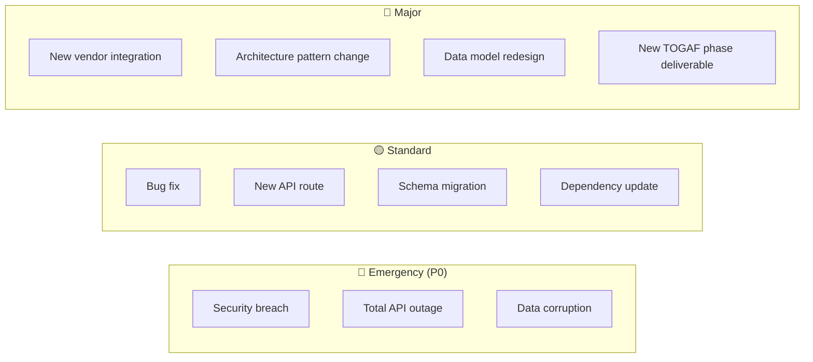
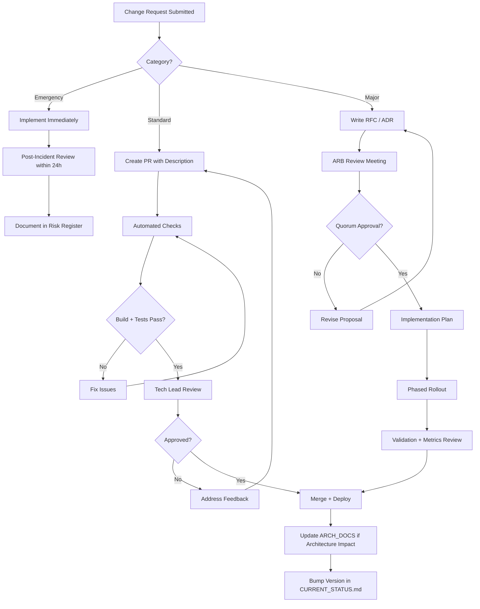

# Change Management Process

**TOGAF Phase:** H — Architecture Change Management  
**Deliverable:** Architecture Change Management Process  
**Version:** 1.0  
**Date:** February 13, 2026  
**Last Reviewed:** February 13, 2026  
**Status:** Active  
**Review Cadence:** Quarterly

---

## Purpose

This document defines workflows, approval matrices, and governance structures for managing changes to the Word Is Bond platform architecture, infrastructure, and codebase.

---

## Change Categories



| Category | Approval Time | Approvers | Examples |
|----------|--------------|-----------|---------|
| **Emergency** | Immediate (post-hoc review within 24h) | Any senior engineer | Security patch, outage fix, data breach response |
| **Standard** | 1 business day | Tech Lead + 1 Reviewer | Bug fixes, new routes, schema additions, dependency bumps |
| **Major** | 5 business days | Architecture Board (3/5 quorum) | Vendor changes, pattern changes, data model redesign |

---

## Governance Board

### Architecture Review Board (ARB)

| Role | Responsibility | Vote Weight |
|------|---------------|-------------|
| CTO / Technical Director | Final authority, tiebreaker | 2 |
| Platform Lead | Infrastructure, Workers, Cloudflare | 1 |
| Security Lead | Compliance, auth, PII | 1 |
| AI Lead | AI pipeline, models, cost | 1 |
| Product Lead | Business requirements, pricing | 1 |

**Quorum:** 3 of 5 members (weighted votes ≥ 3)  
**Meeting Cadence:** Bi-weekly (ad-hoc for Emergency changes)

---

## Change Request Process



---

## Change Request Template

```markdown
## Change Request: [Title]

**Category:** Emergency / Standard / Major
**Requestor:** [Name]
**Date:** [YYYY-MM-DD]
**Priority:** P0 / P1 / P2

### Summary
[One paragraph description of the change]

### Motivation
[Why is this change needed? Link to issue/risk/requirement]

### Scope
- [ ] API (Workers)
- [ ] UI (Next.js)
- [ ] Database (Schema)
- [ ] Infrastructure (Cloudflare/Neon config)
- [ ] AI Pipeline
- [ ] Documentation (ARCH_DOCS)

### Impact Assessment
- **Affected Services:** [list]
- **Affected Tenants:** All / Specific tier
- **Downtime Required:** Yes (duration) / No
- **Rollback Plan:** [describe]

### Architecture Decision
- **ADR Required:** Yes / No
- **If Yes, ADR ID:** ADR-XXX

### Checklist
- [ ] Tests written and passing
- [ ] Security review (if auth/PII changes)
- [ ] ARCH_DOCS updated (if architecture impact)
- [ ] CURRENT_STATUS.md version bumped
- [ ] Audit log entries added for new mutations
- [ ] org_id included in all new queries
```

---

## Deploy Process

All changes follow the canonical deploy chain:

```bash
# 1. Workers (API) first
npm run api:deploy

# 2. Next.js static export
npm run build

# 3. Pages deploy
npm run pages:deploy

# 4. Health check — mandatory before commit
npm run health-check
```

| Rule | Detail |
|------|--------|
| **Deploy order** | Workers → Build → Pages → Health Check |
| **Rollback** | `wrangler rollback` for Workers; Pages auto-rollback via dashboard |
| **Blue-green** | Not implemented; use percentage-based rollout via Cloudflare |
| **Feature flags** | `feature_gates` table + `plan_required` column for tier gating |

---

## Schema Change Protocol

Database schema changes follow a strict process due to multi-tenant RLS:

1. **Draft migration SQL** — include `IF NOT EXISTS`, `IF EXISTS` guards
2. **Test on Neon branch** — create child branch for validation
3. **Run migration on production** — via `scripts/` or manual SQL
4. **Verify RLS** — confirm `organization_id` policies on new tables
5. **Update DATABASE_SCHEMA_REGISTRY.md** — add new table metadata
6. **Update TOGAF Data Flow** — if data lifecycle changes

| Migration Type | Risk Level | Requires ARB? |
|---------------|-----------|---------------|
| Add column (nullable, static default) | Low | No |
| Add column (NOT NULL, function default) | Medium | No |
| Add table | Low | No |
| Add constraint / FK | Medium | No |
| Rename column | High | Yes |
| Drop column / table | Critical | Yes |
| Change data type | High | Yes |

---

## Communication Protocol

| Event | Channel | Audience | Timing |
|-------|---------|----------|--------|
| Emergency change | Slack #incidents + email | All engineering | Immediate |
| Standard deploy | Slack #deploys | Engineering | Post-deploy |
| Major RFC posted | Slack #architecture + email | ARB + Engineering | Pre-review |
| ARB decision | ARCH_DOCS ADR + Slack #architecture | All stakeholders | Within 24h of decision |
| Version bump | CURRENT_STATUS.md commit | All | Every deploy |

---

## Metrics & KPIs

| Metric | Target | Current |
|--------|--------|---------|
| Change lead time (Standard) | < 2 days | — |
| Change lead time (Major) | < 10 days | — |
| Change failure rate | < 5% | — |
| Emergency change frequency | < 2/month | — |
| MTTR (Mean Time to Restore) | < 30 min | — |
| Deploy frequency | Daily (weekdays) | — |

---

## Escalation Path

```
Engineer → Tech Lead → Platform Lead → CTO
                    ↘ Security Lead (if PII/auth)
                    ↘ AI Lead (if AI pipeline)
```

---

## Review Log

| Date | Reviewer | Changes |
|------|----------|---------|
| 2026-02-13 | Architecture Review | Initial process document created |

---

## References

- [ARCHITECTURE_DECISION_LOG.md](../01-CORE/ARCHITECTURE_DECISION_LOG.md) — ADR history
- [RISK_REGISTER.md](RISK_REGISTER.md) — RAID log
- [CURRENT_STATUS.md](../CURRENT_STATUS.md) — Version tracking
- [DATABASE_SCHEMA_REGISTRY.md](../DATABASE_SCHEMA_REGISTRY.md) — Schema catalog
- [CLOUDFLARE_DEPLOYMENT.md](../CLOUDFLARE_DEPLOYMENT.md) — Deploy procedures
