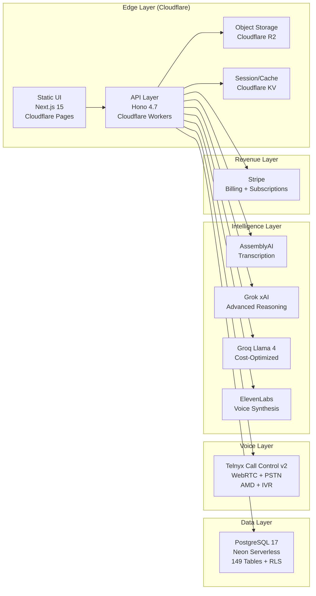

# Architecture Vision — Word Is Bond

**TOGAF Phase:** A — Architecture Vision  
**Version:** 1.0  
**Date:** February 13, 2026  
**Owner:** Latimer + Woods Tech LLC  
**Status:** Approved

---

## 1. Problem Statement

Debt collection and accounts receivable recovery call centers operate in a high-regulation, high-volume, low-trust environment. Agents make thousands of outbound calls daily under strict FDCPA, TCPA, HIPAA, and state-level compliance requirements. Current solutions suffer from:

- **Fragmented tooling** — Separate systems for dialing, recording, transcription, CRM, compliance, and analytics
- **Compliance risk** — Manual compliance tracking leads to violations and lawsuits ($500-$1,500 per FDCPA violation)
- **No evidentiary integrity** — Call recordings lack chain of custody, making them inadmissible in disputes
- **Language barriers** — Spanish-speaking debtors require bilingual agents (25% premium) or skip tracing
- **Opaque AI** — Existing AI tools operate autonomously without audit trails, creating regulatory exposure

---

## 2. Vision Statement

> **Word Is Bond is the System of Record for Business Conversations** — an AI-powered voice intelligence platform that gives call centers a single pane of glass for calling, recording, transcribing, translating, scoring, and proving every conversation, with enterprise-grade security and compliance baked into every layer.

---

## 3. Target Architecture (High-Level)

---

## 4. Business Goals & Objectives

| # | Goal | Measurable Objective | Status |
|---|------|---------------------|--------|
| G1 | Replace fragmented call center tooling | Single platform covering dialer, CRM, recording, analytics, compliance | ✅ Achieved |
| G2 | Eliminate compliance violations | 100% call recording + real-time FDCPA guardrails + audit trails | ✅ Achieved |
| G3 | Reduce language barrier costs | Real-time English↔Spanish translation (no bilingual agent premium) | ✅ Achieved |
| G4 | Establish evidentiary integrity | Immutable chain of custody for all conversation artifacts | ✅ Achieved |
| G5 | AI as notary, not actor | AI observes/records/assists — never initiates calls or modifies evidence | ✅ Achieved |
| G6 | Enterprise-grade security | SOC 2 tracking, RLS on 50+ tables, PII redaction, RBAC (9 roles) | ✅ Achieved |
| G7 | Optimize AI costs | Intelligent routing: 38% cost reduction via Groq for simple tasks | ✅ Achieved |

---

## 5. Stakeholder Map

| Stakeholder | Role | Concern | Architecture Impact |
|-------------|------|---------|-------------------|
| **Call Center Owners** | Business sponsor | ROI, compliance risk reduction, agent productivity | Feature completeness, reporting depth |
| **Collection Agents** | Primary user | Ease of use, call quality, speed | UX design (Cockpit workspace), WebRTC reliability |
| **Compliance Officers** | Governance | FDCPA/TCPA/HIPAA adherence, audit readiness | Audit logging, PII redaction, evidence integrity |
| **IT Administrators** | Operations | Uptime, security, integrations | Infrastructure reliability, RBAC, monitoring |
| **Debtors/Consumers** | End recipient | Fair treatment, language access, privacy | Translation, disclosure compliance, data protection |
| **Legal/Regulatory** | External oversight | Regulatory compliance, evidence admissibility | System of Record, chain of custody, immutability |
| **Development Team** | Build & maintain | Code quality, deploy safety, documentation | Architecture docs, testing, CI/CD |
| **Latimer + Woods** | Product company | Market position, revenue, scalability | Platform architecture, billing, multi-tenancy |

---

## 6. Key Constraints

| Constraint | Rationale | Impact |
|-----------|-----------|--------|
| **Static export only** (Next.js) | Cloudflare Pages doesn't run SSR; avoids Vercel dependency | All server logic lives in Workers |
| **No autonomous AI** | Regulatory and ethical — AI must not make decisions for agents | AI Role Policy; all AI is advisory |
| **Neon before Hyperdrive** | WebSocket (Neon SDK) vs TCP (Hyperdrive) — reversing causes HTTP 530 | Connection string order is immutable |
| **Snake_case everywhere** | PostgreSQL standard + API consistency | All DB columns, API keys, TS interfaces |
| **Multi-tenant isolation** | Every query must include `organization_id` | RLS policies + middleware enforcement |
| **Edge-first deployment** | Cloudflare Workers for global low-latency | No traditional server infrastructure |

---

## 7. Key Assumptions

| # | Assumption | Risk if Wrong |
|---|-----------|--------------|
| A1 | Telnyx provides reliable WebRTC at scale | Voice quality degrades; need fallback PSTN-only mode |
| A2 | Neon serverless handles production DB load | Connection pooling/Hyperdrive mitigates; dedicated Neon plan available |
| A3 | Groq/Grok API availability remains >99.5% | OpenAI fallback chain exists; 3-provider redundancy |
| A4 | Call centers willing to adopt cloud-native platform | On-prem hybrid mode not architected |
| A5 | Spanish is primary translation need | Architecture supports additional languages via AI pipeline |

---

## 8. Architecture Principles

| # | Principle | Rationale |
|---|----------|-----------|
| P1 | **Evidence Integrity** — All conversation artifacts are immutable once sealed | Legal admissibility and compliance |
| P2 | **AI as Notary** — AI observes, records, assists — never acts autonomously | Regulatory safety and accountability |
| P3 | **Tenant Isolation** — Every data access path enforces organization boundaries | Multi-tenant security and privacy |
| P4 | **Edge-First** — Compute at the edge, not in centralized data centers | Performance and global availability |
| P5 | **Parameterized Everything** — No string interpolation in SQL, ever | SQL injection prevention |
| P6 | **Audit Everything** — Every mutation writes to audit_logs | Compliance and forensic capability |
| P7 | **Cost-Aware AI** — Route to cheapest capable provider; track per-org usage | Sustainable unit economics |

---

## 9. Scope

### In Scope (v4.65)
- Voice calling (WebRTC + PSTN) with recording
- Real-time transcription and translation
- Collections CRM with payment tracking
- Campaign management with predictive dialing
- AI-powered analytics, scoring, and assistance
- Compliance center (FDCPA, TCPA, HIPAA, SOC 2 tracking)
- Multi-tenant SaaS with Stripe billing
- Enterprise security (RBAC, RLS, PII redaction)

### Out of Scope (Future)
- On-premise deployment
- Native mobile applications
- Video calling
- Third-party CRM deep integrations (HubSpot/Salesforce — designed, not built)
- Multi-language beyond English/Spanish

---

## 10. Success Criteria

| Metric | Target | Current |
|--------|--------|---------|
| Feature completeness | 100% of roadmap | ✅ 109/109 |
| Test coverage | >85% | ✅ 89% |
| API response time (p95) | <500ms | ✅ <200ms |
| UI load time | <2s | ✅ <50ms (CDN) |
| Security compliance | SOC 2 ready | ✅ Tracking active |
| Uptime | >99.9% | ✅ 99.9% (30-day) |

---

## References

- [MASTER_ARCHITECTURE.md](MASTER_ARCHITECTURE.md) — Detailed system design
- [APPLICATION_FUNCTIONS.md](APPLICATION_FUNCTIONS.md) — Complete feature inventory
- [01-CORE/FINAL_STACK.md](01-CORE/FINAL_STACK.md) — Canonical technology stack
- [01-CORE/AI_ROLE_POLICY.md](01-CORE/AI_ROLE_POLICY.md) — AI governance boundaries
