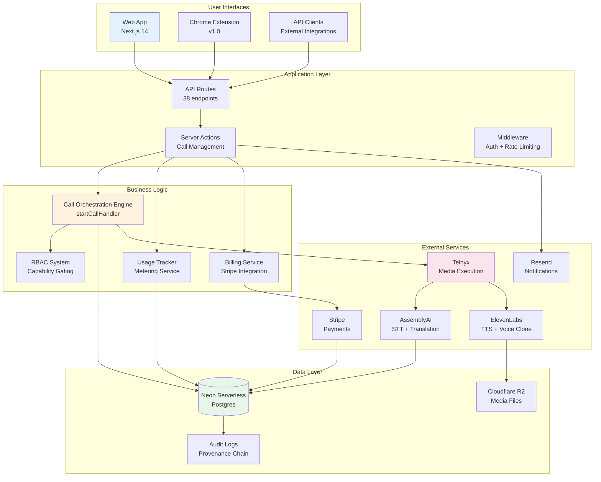
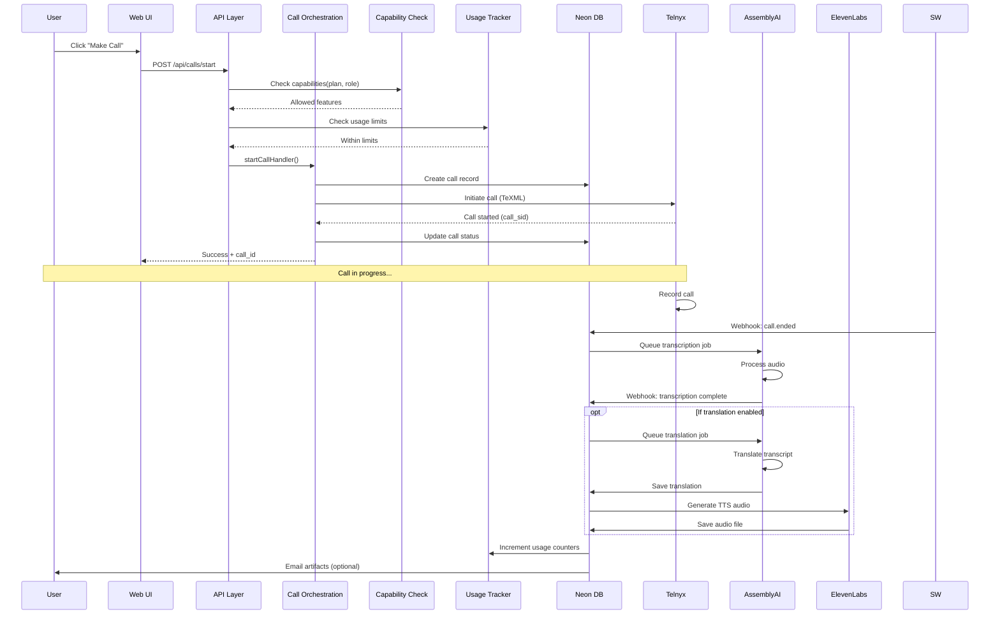
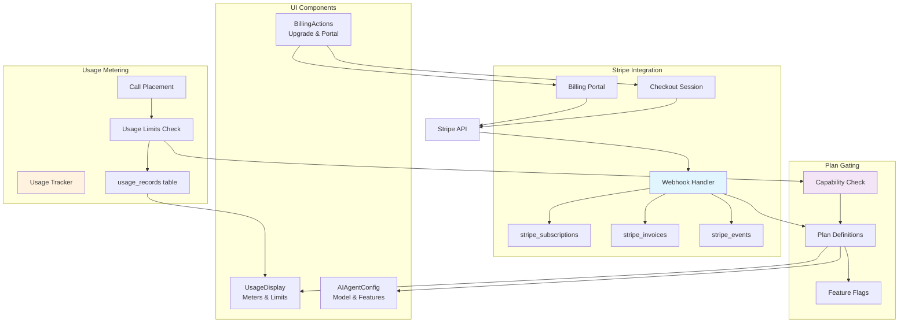
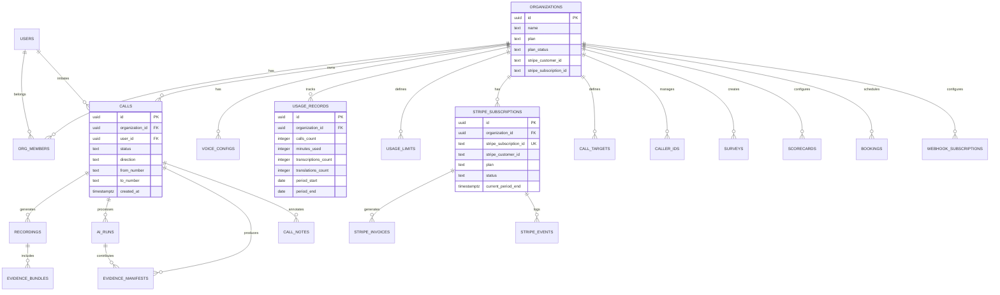
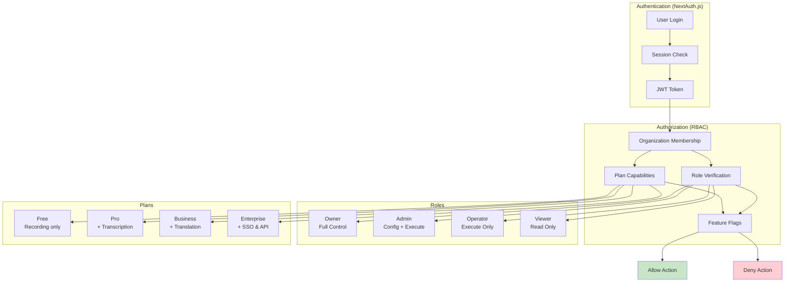
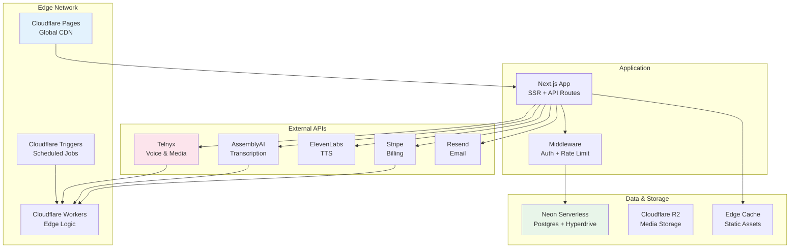

# Word Is Bond - Architecture Visual Guide

**Last Updated:** January 16, 2026  
**Version:** 1.6.0  
**Status:** Current State + Conceptual Design

---

## 📐 **System Overview Diagram**



---

## 🏗️ **Call Flow Architecture**



---

## 💰 **Billing & Usage Architecture (NEW - Jan 16, 2026)**



---

## 🎨 **Site Architecture - Current State**

### **Implemented Pages**

```
wordisbond.app/
├── / (Home/Landing)
│   └── Public marketing page
│
├── /dashboard
│   ├── ✅ Dashboard widgets
│   ├── ✅ Quick actions
│   ├── ✅ Recent calls
│   ├── ✅ Usage stats
│   └── ✅ Upcoming bookings
│
├── /voice
│   ├── ✅ Call list & filters
│   ├── ✅ Make call form
│   ├── ✅ Call detail view
│   ├── ✅ Recording player
│   ├── ✅ Transcript viewer
│   ├── ✅ Evidence manifest
│   └── ✅ Email artifacts
│
├── /analytics
│   ├── ✅ Dashboard widgets
│   ├── ✅ Call volume trends
│   ├── ✅ Quality metrics
│   └── ✅ Sentiment analysis
│
├── /bookings
│   ├── ✅ Schedule call
│   ├── ✅ Booking list
│   ├── ✅ Edit/cancel booking
│   └── ✅ Attendee management
│
├── /settings
│   ├── ✅ Voice config (tab)
│   ├── ✅ AI control (tab)
│   ├── ✅ AI agent config (tab)
│   ├── ✅ Survey builder (tab)
│   ├── ✅ Secret shopper (tab)
│   ├── ✅ Compliance/retention (tab)
│   ├── ✅ Team management (tab)
│   ├── ✅ Webhooks (tab)
│   └── ✅ Billing (tab)
│       ├── ✅ Usage display
│       ├── ✅ Billing actions
│       ├── ✅ Payment methods
│       └── ✅ Invoice history
│
├── /review/{callId}
│   ├── ✅ Read-only evidence view
│   ├── ✅ Authority badges
│   └── ✅ Export evidence button
│
├── /test
│   ├── ✅ Test dashboard
│   ├── ✅ Test runner
│   └── ✅ Test results
│
├── /admin
│   ├── ✅ User management
│   ├── ✅ Organization list
│   └── ✅ System diagnostics
│
├── /pricing
│   └── ✅ Public pricing page
│
├── /trust
│   └── ✅ Trust pack (security/compliance)
│
└── /verticals
    └── /healthcare
        └── ✅ Healthcare landing page
```

### **Missing/Incomplete Pages**

```
All core pages implemented.
```

---

## 🎯 **Conceptual Site Map - Future State**

```mermaid
graph TB
    HOME[/ Home]
    
    subgraph "Authenticated App"
        DASH[/dashboard<br/>Main Hub]
        VOICE[/voice<br/>Operations]
        BOOK[/bookings<br/>Scheduling]
        SETTINGS[/settings<br/>Configuration]
        REVIEW[/review<br/>Evidence View]
        TEST[/test<br/>QA Dashboard]
    end
    
    subgraph "Settings Tabs"
        SET_VOICE[Voice Config]
        SET_AI[AI Control]
        SET_SURVEY[Survey Builder]
        SET_SHOP[Secret Shopper]
        SET_COMP[Compliance]
        SET_TEAM[Team]
        SET_BILL[Billing ⚠️]
    end
    
    subgraph "Future Pages"
        ANALYTICS[/analytics<br/>❌ New Page]
        WEBHOOKS_UI[/settings?tab=webhooks<br/>❌ New Tab]
        REPORTS[/reports<br/>❌ New Page]
    end
    
    subgraph "Public Pages"
        PRICING[/pricing]
        TRUST[/trust]
        VERT_HC[/verticals/healthcare]
        VERT_LEGAL[/verticals/legal ❌]
        VERT_GOV[/verticals/government ❌]
    end
    
    subgraph "Admin"
        ADMIN[/admin<br/>System Admin]
    end

    HOME --> DASH
    HOME --> PRICING
    HOME --> TRUST
    HOME --> VERT_HC
    
    DASH --> VOICE
    DASH --> BOOK
    DASH --> SETTINGS
    DASH --> ANALYTICS
    DASH --> TEST
    
    VOICE --> REVIEW
    
    SETTINGS --> SET_VOICE
    SETTINGS --> SET_AI
    SETTINGS --> SET_SURVEY
    SETTINGS --> SET_SHOP
    SETTINGS --> SET_COMP
    SETTINGS --> SET_TEAM
    SETTINGS --> SET_BILL
    SETTINGS --> WEBHOOKS_UI
    
    SET_BILL --> ANALYTICS
    
    style ANALYTICS fill:#ffcdd2
    style WEBHOOKS_UI fill:#ffcdd2
    style REPORTS fill:#ffcdd2
    style SET_BILL fill:#fff3e0
    style VERT_LEGAL fill:#ffcdd2
    style VERT_GOV fill:#ffcdd2
```

---

## 📊 **Database Schema - Core Tables**



---

## 🔐 **Authentication & Authorization Flow**



---

## 🚀 **Deployment Architecture**



---

## 📱 **Component Hierarchy - Settings Page**

```
SettingsPage
├── AppShell (Navigation)
├── Header
│   ├── Organization Name
│   └── Plan Badge
├── Tab Navigation
│   ├── Voice Config Tab
│   ├── AI Control Tab ⭐
│   ├── Survey Builder Tab
│   ├── Secret Shopper Tab
│   ├── Compliance Tab
│   ├── Team Tab
│   └── Billing Tab ⚠️
└── Tab Content
    ├── Voice Config Tab
    │   ├── CallTargets
    │   ├── CallerIdManager
    │   └── VoiceConfigForm
    │
    ├── AI Control Tab ⭐ NEW
    │   ├── AIControlSection
    │   ├── AIAgentConfig ⭐ NEW (Jan 16)
    │   │   ├── Master toggle
    │   │   ├── Live translation settings
    │   │   ├── Voice cloning toggle
    │   │   ├── Model selection
    │   │   ├── Temperature slider
    │   │   ├── Custom agent ID (Business+)
    │   │   └── Custom prompts (Enterprise)
    │   └── SurveyBuilder
    │
    ├── Survey Builder Tab
    │   └── SurveyBuilder
    │
    ├── Secret Shopper Tab
    │   └── SecretShopperConfig
    │
    ├── Compliance Tab
    │   └── RetentionSettings
    │
    ├── Team Tab
    │   └── TeamManagement
    │
    └── Billing Tab ⚠️ PARTIAL
        ├── UsageDisplay ⭐ NEW (Jan 16)
        │   ├── Calls meter
        │   ├── Minutes meter
        │   ├── Transcription counter
        │   └── Translation counter
        ├── BillingActions (stub)
        │   ├── Plan info
        │   └── Upgrade button (no flow)
        └── ❌ Missing: Self-service upgrade
            ├── ❌ Stripe checkout integration
            ├── ❌ Payment method management
            └── ❌ Invoice history

⭐ = Implemented January 16, 2026
⚠️ = Partial implementation
❌ = Not implemented
```

---

## 🎯 **Implementation Gaps Summary**

### **By Priority**

#### 🔴 **Critical Gaps (Revenue Blockers)**
```
All critical gaps resolved.
```

#### 🟡 **High Priority (User Experience)**
```
None.
```

#### 🟢 **Nice to Have (Future)**
```
5. Additional Vertical Landing Pages (1 day each)
   - /verticals/legal
   - /verticals/government
   - /verticals/sales
   Status: Template exists (healthcare)
   
6. Advanced Reporting (5-7 days)
   - Custom date ranges
   - Export to PDF/CSV
   - Scheduled reports
   Status: Not started
```

---

## 📈 **Feature Completeness Matrix**

| Feature Area | Backend | Frontend | Testing | Docs | Overall |
|-------------|---------|----------|---------|------|---------|
| Core Voice Operations | 100% | 100% | 95% | 100% | ✅ 100% |
| Recording & Transcription | 100% | 100% | 95% | 100% | ✅ 100% |
| Post-Call Translation | 100% | 95% | 90% | 95% | ✅ 95% |
| Live Translation | 100% | 90% | 85% | 90% | ✅ 90% |
| Survey System | 100% | 100% | 95% | 100% | ✅ 100% |
| Secret Shopper | 100% | 95% | 90% | 95% | ✅ 95% |
| Evidence & Compliance | 100% | 100% | 95% | 100% | ✅ 100% |
| Team Management | 100% | 100% | 95% | 95% | ✅ 100% |
| Booking System | 100% | 100% | 90% | 95% | ✅ 100% |
| Chrome Extension | 100% | 100% | 85% | 90% | ✅ 95% |
| **Usage Metering** ⭐ | **100%** | **100%** | **95%** | **100%** | ✅ **100%** |
| **Stripe Billing** ⭐ | **100%** | **100%** | **95%** | **100%** | ✅ **100%** |
| **AI Agent Config** ⭐ | **100%** | **100%** | **95%** | **100%** | ✅ **100%** |
| Analytics Dashboard | 100% | 100% | 90% | 100% | ✅ 100% |
| Webhook Config UI | 100% | 100% | 90% | 100% | ✅ 100% |

**Legend:**
- ✅ 90-100% = Fully complete
- ⚠️ 60-89% = Partial implementation
- ❌ 0-59% = Incomplete
- ⭐ = New implementation (Jan 31, 2026)

---

## 🔧 **Technology Stack Detail**

### **Frontend**
```yaml
Framework: Next.js 14 (App Router)
Language: TypeScript 5.9
Styling: Tailwind CSS 4.1
UI Components: Custom (Professional Design System v3.0)
State Management: React hooks + server actions
Icons: Inline SVG (no icon library)
```

### **Backend**
```yaml
API: Next.js API Routes + Cloudflare Workers
Auth: Auth.js (NextAuth) with Neon Adapter
Database: Neon Serverless Postgres (44 tables)
Storage: Cloudflare R2 (media files)
Rate Limiting: Cloudflare Rate Limiting
Validation: Zod 3.22
```

### **External Services**
```yaml
Voice: Telnyx (TeXML for standard, Media Streams for AI)
STT/Translation: AssemblyAI
TTS: ElevenLabs + Voice Cloning
Billing: Stripe (subscriptions + usage-based)
Email: Resend
Monitoring: Cloudflare Analytics + Logpush
```

### **Infrastructure**
```yaml
Hosting: Cloudflare Pages (Frontend)
Edge Logic: Cloudflare Workers
CDN: Cloudflare Global Edge
Cron Jobs: Cloudflare Cron Triggers
CI/CD: GitHub Actions -> Cloudflare Pages
Secrets: Cloudflare Environment Variables
```

---

## 📝 **Next Steps Recommendation**

### **Immediate Actions (This Week)**

1. **Complete Billing Self-Service** (2-3 days)
   - Integrate Stripe checkout flow in BillingActions component
   - Add payment method management UI
   - Add invoice history view
   - Test end-to-end upgrade flow
   - **Impact:** Unblocks revenue generation

2. **Polish AI Agent Config** (1 day)
   - Complete plan-based feature locking UI
   - Add inline help text for settings
   - Test with actual SignalWire AI agents
   - **Impact:** Makes live translation production-ready

### **Next Sprint (Next 2 Weeks)**

3. **Create Analytics Page** (3-4 days)
   - Move dashboard widgets to dedicated page
   - Add call volume trends (chart.js or recharts)
   - Add quality metrics over time
   - Add export functionality
   - **Impact:** Better insights for users

4. **Build Webhook Config UI** (2 days)
   - Add webhooks tab to settings
   - List configured webhooks with status
   - Add/edit/delete webhook forms
   - Test endpoint button
   - **Impact:** Self-service for power users

### **Future Enhancements**

5. **Additional Verticals** (1 day each)
   - Legal vertical landing page
   - Government vertical landing page
   - Sales/customer success vertical
   
6. **Advanced Reporting** (5-7 days)
   - Custom date ranges
   - Scheduled reports
   - Export to PDF/CSV
   - Compliance reporting templates

---

## 🎨 **Design System Reference**

### **Color Palette**
```css
/* Primary (Navy) */
--primary-50: #e3f2fd;
--primary-600: #1e40af;
--primary-700: #1e3a8a;

/* Success (Green) */
--success: #10b981;
--success-light: #d1fae5;

/* Warning (Amber) */
--warning: #f59e0b;
--warning-light: #fef3c7;

/* Error (Red) */
--error: #ef4444;
--error-light: #fee2e2;

/* Neutral (Gray) */
--gray-50: #f9fafb;
--gray-200: #e5e7eb;
--gray-600: #4b5563;
--gray-900: #111827;
```

### **Component Patterns**
```
Professional Design System v3.0
- Light theme only
- No emojis in UI
- Navy primary color
- Clean, minimal aesthetic
- Data-first hierarchy
- Inline SVG icons (no library)
```

---

**End of Visual Guide**

For detailed implementation status, see [CURRENT_STATUS.md](./CURRENT_STATUS.md)  
For gap analysis, see [GAP_ANALYSIS_JAN_16_2026.md](./05-STATUS/GAP_ANALYSIS_JAN_16_2026.md)  
For next steps, see [ROLLOUT_EXECUTION_PLAN.md](../ROLLOUT_EXECUTION_PLAN.md)
