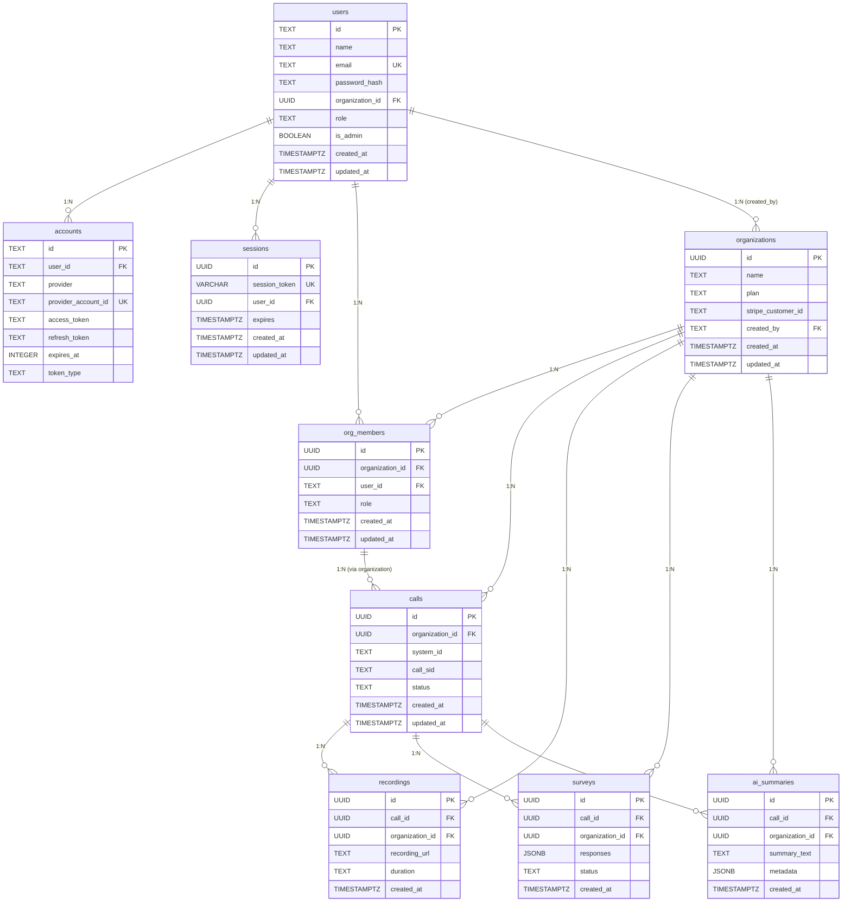

# Database Schema Registry

**Status**: ✅ COMPLIANT | Updated: Feb 3, 2026  
**Version**: 1.1 - Post-Migration  
**Owner**: Platform Team

---

## Overview

This document serves as the **single source of truth** for database schema naming conventions, table relationships, and migration tracking. It ensures cohesion between the database schema, Workers API code, and frontend types.

### Naming Convention Standard

Per [MASTER_ARCHITECTURE.md](MASTER_ARCHITECTURE.md), the mandatory standard is:

> **MANDATORY**: All database columns, API endpoints, and variable names MUST use **snake_case** exclusively.

---

## Current State Audit

### ✅ All Tables Compliant

| Table            | Status       | Notes                                                      |
| ---------------- | ------------ | ---------------------------------------------------------- |
| `sessions`       | ✅ MIGRATED  | Columns renamed from camelCase to snake_case on 2026-02-04 |
| All others (112) | ✅ COMPLIANT | Already using snake_case                                   |

**Total Violations**: 0 columns (was 2, now fixed)

### ✅ Tables Already Compliant (113 total)

All other tables (112) use snake_case column naming. Examples:

- `users`: `id`, `name`, `email`, `email_verified`, `password_hash`, `organization_id`
- `organizations`: `id`, `name`, `plan`, `stripe_customer_id`, `created_at`
- `accounts`: `user_id`, `provider_account_id`, `access_token`, `refresh_token`
- `calls`: `organization_id`, `system_id`, `call_sid`, `created_at`

---

## Core Table Schemas

### Authentication Tables

#### `users`

Primary user identity table.

| Column             | Type        | Nullable | Default | FK     |
| ------------------ | ----------- | -------- | ------- | ------ |
| `id`               | TEXT        | NO       | -       | PK     |
| `name`             | TEXT        | YES      | -       | -      |
| `email`            | TEXT        | YES      | -       | UNIQUE |
| `email_verified`   | TIMESTAMPTZ | YES      | -       | -      |
| `image`            | TEXT        | YES      | -       | -      |
| `password_hash`    | TEXT        | YES      | -       | -      |
| `organization_id`  | UUID        | YES      | -       | -      |
| `role`             | TEXT        | YES      | 'user'  | -      |
| `is_admin`         | BOOLEAN     | YES      | false   | -      |
| `created_at`       | TIMESTAMPTZ | YES      | now()   | -      |
| `updated_at`       | TIMESTAMPTZ | YES      | now()   | -      |
| `normalized_email` | TEXT        | YES      | -       | -      |
| `id_uuid`          | UUID        | YES      | -       | -      |

**Referenced By**: accounts, ai_summaries, call_outcomes, calls, org_members, organizations, recordings, scorecards, test_configs, test_results, tool_access_archived, tool_team_members

#### `sessions` ✅ MIGRATED

Session storage for authentication.

| Column          | Type         | Nullable | Default           | FK     | Status                |
| --------------- | ------------ | -------- | ----------------- | ------ | --------------------- |
| `id`            | UUID         | NO       | gen_random_uuid() | PK     | ✅                    |
| `session_token` | VARCHAR(255) | NO       | -                 | UNIQUE | ✅ (was sessionToken) |
| `user_id`       | UUID         | NO       | -                 | -      | ✅ (was userId)       |
| `expires`       | TIMESTAMPTZ  | NO       | -                 | -      | ✅                    |
| `created_at`    | TIMESTAMPTZ  | YES      | now()             | -      | ✅                    |
| `updated_at`    | TIMESTAMPTZ  | YES      | now()             | -      | ✅                    |

**Indexes**:

- `sessions_pkey`: PRIMARY KEY (id)
- `sessions_session_token_key`: UNIQUE (session_token)
- `idx_sessions_user_id`: INDEX (user_id)
- `idx_sessions_expires`: INDEX (expires)

#### `accounts`

OAuth provider accounts linked to users.

| Column                | Type        | Nullable | Default | FK                |
| --------------------- | ----------- | -------- | ------- | ----------------- |
| `id`                  | TEXT        | NO       | -       | PK                |
| `user_id`             | TEXT        | NO       | -       | FK → users(id)    |
| `type`                | TEXT        | NO       | -       | -                 |
| `provider`            | TEXT        | NO       | -       | -                 |
| `provider_account_id` | TEXT        | NO       | -       | UNIQUE w/provider |
| `refresh_token`       | TEXT        | YES      | -       | -                 |
| `access_token`        | TEXT        | YES      | -       | -                 |
| `expires_at`          | INTEGER     | YES      | -       | -                 |
| `token_type`          | TEXT        | YES      | -       | -                 |
| `scope`               | TEXT        | YES      | -       | -                 |
| `id_token`            | TEXT        | YES      | -       | -                 |
| `session_state`       | TEXT        | YES      | -       | -                 |
| `oauth_token_secret`  | TEXT        | YES      | -       | -                 |
| `oauth_token`         | TEXT        | YES      | -       | -                 |
| `created_at`          | TIMESTAMPTZ | YES      | now()   | -                 |
| `updated_at`          | TIMESTAMPTZ | YES      | now()   | -                 |

### Organization Tables

#### `organizations`

Multi-tenant organization container.

| Column                   | Type        | Nullable | Default            | FK             |
| ------------------------ | ----------- | -------- | ------------------ | -------------- |
| `id`                     | UUID        | NO       | uuid_generate_v4() | PK             |
| `name`                   | TEXT        | NO       | -                  | -              |
| `plan`                   | TEXT        | YES      | -                  | -              |
| `plan_status`            | TEXT        | YES      | 'active'           | CHECK          |
| `stripe_customer_id`     | TEXT        | YES      | -                  | UNIQUE         |
| `stripe_subscription_id` | TEXT        | YES      | -                  | -              |
| `created_by`             | TEXT        | YES      | -                  | FK → users(id) |
| `slug`                   | TEXT        | YES      | -                  | UNIQUE         |
| `tool_id`                | UUID        | YES      | -                  | -              |
| `created_at`             | TIMESTAMPTZ | YES      | now()              | -              |
| `updated_at`             | TIMESTAMPTZ | YES      | now()              | -              |

**Referenced By**: 70+ tables with `organization_id` foreign key

#### `org_members`

Organization membership and roles.

| Column            | Type        | Nullable | Default            | FK                     |
| ----------------- | ----------- | -------- | ------------------ | ---------------------- |
| `id`              | UUID        | NO       | uuid_generate_v4() | PK                     |
| `organization_id` | UUID        | NO       | -                  | FK → organizations(id) |
| `user_id`         | TEXT        | NO       | -                  | FK → users(id)         |
| `role`            | TEXT        | YES      | 'member'           | -                      |
| `created_at`      | TIMESTAMPTZ | YES      | now()              | -                      |
| `updated_at`      | TIMESTAMPTZ | YES      | now()              | -                      |
| `user_id_uuid`    | UUID        | YES      | -                  | -                      |

---

## Table Relationships Diagram



---

## Code-Database Mapping

### Workers API Code References

All code now uses snake_case column names per standard:

| Code File                        | DB Column Reference        | Status |
| -------------------------------- | -------------------------- | ------ |
| `workers/src/routes/auth.ts:351` | `session_token`            | ✅     |
| `workers/src/routes/auth.ts:352` | `user_id`                  | ✅     |
| `workers/src/routes/auth.ts:414` | `session_token`            | ✅     |
| `workers/src/lib/auth.ts:50-55`  | `session_token`, `user_id` | ✅     |

### Frontend Type Mapping

| Frontend Type  | Property          | API Response           | Database Column               |
| -------------- | ----------------- | ---------------------- | ----------------------------- |
| `Session.user` | `id`              | `user.id`              | `users.id`                    |
| `Session.user` | `email`           | `user.email`           | `users.email`                 |
| `Session.user` | `organization_id` | `user.organization_id` | `org_members.organization_id` |

---

## Migration Plan

### Phase 1: Database Migration (Safe)

```sql
-- Migration: Rename sessions columns from camelCase to snake_case
-- Date: 2026-02-04
-- Author: Platform Team
-- Risk: LOW (only 2 columns, with proper transaction)

BEGIN;

-- Step 1: Drop the unique constraint that references camelCase column
ALTER TABLE public.sessions DROP CONSTRAINT IF EXISTS "sessions_sessionToken_key";

-- Step 2: Rename columns
ALTER TABLE public.sessions RENAME COLUMN "sessionToken" TO session_token;
ALTER TABLE public.sessions RENAME COLUMN "userId" TO user_id;

-- Step 3: Recreate the unique constraint with snake_case name
ALTER TABLE public.sessions ADD CONSTRAINT sessions_session_token_key UNIQUE (session_token);

-- Step 4: Update any existing indexes
DROP INDEX IF EXISTS "sessions_sessionToken_key";

COMMIT;

-- Verification query:
-- SELECT column_name FROM information_schema.columns
-- WHERE table_name = 'sessions' AND table_schema = 'public';
```

### Phase 2: Code Updates (Post-Migration)

After database migration, update these files:

1. **`workers/src/routes/auth.ts`**:
   - Line 351: `"sessionToken"` → `session_token`
   - Line 352: `"userId"` → `user_id`
   - Line 353: `"sessionToken"` → `session_token`
   - Line 414: `"sessionToken"` → `session_token`

2. **`workers/src/lib/auth.ts`**:
   - Line 50: `"sessionToken"` → `session_token`
   - Line 53: `"userId"` → `user_id`
   - Line 55: `"sessionToken"` → `session_token`

### Phase 3: Verification

```sql
-- Verify no camelCase columns remain
SELECT table_name, column_name
FROM information_schema.columns
WHERE table_schema = 'public'
  AND column_name ~ '[A-Z]'
ORDER BY table_name, column_name;

-- Expected result: 0 rows
```

---

## Migration Log

| Date       | Migration          | Status      | Notes                                              |
| ---------- | ------------------ | ----------- | -------------------------------------------------- |
| 2026-02-03 | Initial audit      | ✅ Complete | Found 2 camelCase columns in sessions              |
| 2026-02-04 | sessions migration | ✅ Complete | Renamed sessionToken→session_token, userId→user_id |
| 2026-02-04 | Code update        | ✅ Complete | Updated Workers auth.ts and lib/auth.ts            |
| 2026-02-04 | Verification       | ✅ Complete | Tested login flow, confirmed DB+code cohesion      |

---

## Best Practices

### Naming Conventions

1. **Tables**: Plural nouns in snake_case (`users`, `org_members`, `call_outcomes`)
2. **Columns**: Descriptive snake_case (`organization_id`, `created_at`, `session_token`)
3. **Indexes**: `idx_{table}_{columns}` or `{table}_{column}_key`
4. **Foreign Keys**: `{table}_{column}_fkey`
5. **Constraints**: `{table}_{column}_check` or `{table}_{constraint_name}`

### Migration Safety Rules

1. Always wrap migrations in `BEGIN;` / `COMMIT;`
2. Test migrations on a branch database first (Neon supports branching)
3. Have rollback SQL ready for each migration
4. Update code AFTER database migration succeeds
5. Deploy code changes only after verifying database state

---

## References

- [MASTER_ARCHITECTURE.md](MASTER_ARCHITECTURE.md) - Naming convention mandate
- [CLOUDFLARE_DEPLOYMENT.md](CLOUDFLARE_DEPLOYMENT.md) - Deployment procedures
- [supabase/migrations/](../supabase/migrations/) - Migration history
