# Wordis Bond - Complete System Architecture

**Last Updated:** February 3, 2026
**Status:** Production Ready (98% Complete)

```mermaid
graph TB
    subgraph "User Layer"
        Browser[Web Browser<br/>Next.js Static App<br/>React + TypeScript]
        Mobile[Mobile Apps<br/>Future Enhancement]
    end

    subgraph "Cloudflare Edge Network"
        Pages[Cloudflare Pages<br/>Static UI Hosting<br/>Global CDN<br/>No SSR Required]

        Workers[Cloudflare Workers<br/>Hono API Framework<br/>Edge Computing<br/>Auto-scaling]

        WAF[Cloudflare WAF<br/>Security & Rate Limiting<br/>Turnstile CAPTCHA]

        Analytics[Cloudflare Analytics<br/>Real-time Metrics<br/>Logpush to SIEM]
    end

    subgraph "Data Layer"
        Neon[Neon Postgres<br/>Serverless Database<br/>Hyperdrive Pooling<br/>RLS Security<br/>113 Tables]

        R2[Cloudflare R2<br/>Object Storage<br/>Audio Recordings<br/>Evidence Bundles<br/>Versioning & Legal Holds]

        KV[Cloudflare KV<br/>Key-Value Cache<br/>Session Storage<br/>Fast Access]
    end

    subgraph "Communication Services"
        Telnyx[Telnyx<br/>Voice/SMS Platform<br/>Global Numbers<br/>Media Streaming<br/>WebRTC Support]

        SignalWire[SignalWire<br/>Legacy Voice<br/>Migration Target<br/>Webhooks & APIs]
    end

    subgraph "AI & Intelligence Services"
        AssemblyAI[AssemblyAI<br/>Speech-to-Text<br/>Real-time Transcription<br/>Translation Support]

        ElevenLabs[ElevenLabs<br/>Text-to-Speech<br/>Voice Cloning<br/>Neural Voices]

        OpenAI[OpenAI<br/>LLM Processing<br/>Advanced Translation<br/>GPT-4o-mini]

        DeepL[DeepL<br/>Translation Service<br/>High Accuracy<br/>Business Tier]
    end

    subgraph "Business Services"
        Stripe[Stripe<br/>Billing & Subscriptions<br/>Usage Tracking<br/>Payment Processing]

        Resend[Resend<br/>Transactional Email<br/>Templates & Tracking]

        Google[Google OAuth<br/>Social Login<br/>Optional Feature]
    end

    subgraph "Development & CI/CD"
        GitHub[GitHub<br/>Source Control<br/>Issues & PRs<br/>Actions CI/CD]

        GHCR[GitHub Container Registry<br/>Docker Images<br/>Deployment Artifacts]

        Wrangler[Cloudflare Wrangler<br/>CLI Deployment<br/>Workers Management]
    end

    %% User interactions
    Browser --> Pages
    Browser --> Workers
    Mobile --> Workers

    %% Edge network connections
    Pages --> WAF
    Workers --> WAF
    Workers --> Analytics

    %% Data connections
    Workers --> Neon
    Workers --> R2
    Workers --> KV

    %% Service integrations
    Workers --> Telnyx
    Workers --> SignalWire
    Workers --> AssemblyAI
    Workers --> ElevenLabs
    Workers --> OpenAI
    Workers --> DeepL
    Workers --> Stripe
    Workers --> Resend
    Workers --> Google

    %% Development connections
    GitHub --> GHCR
    Wrangler --> Workers
    Wrangler --> Pages

    %% Styling
    style Browser fill:#e1f5fe,stroke:#0277bd,stroke-width:2px
    style Pages fill:#f3e5f5,stroke:#7b1fa2,stroke-width:2px
    style Workers fill:#e8f5e8,stroke:#2e7d32,stroke-width:2px
    style Neon fill:#fff3e0,stroke:#ef6c00,stroke-width:2px
    style R2 fill:#fce4ec,stroke:#c2185b,stroke-width:2px
    style Telnyx fill:#f1f8e9,stroke:#689f38,stroke-width:2px
    style AssemblyAI fill:#ede7f6,stroke:#5e35b1,stroke-width:2px
    style ElevenLabs fill:#fff8e1,stroke:#f57f17,stroke-width:2px
    style Stripe fill:#e0f2f1,stroke:#00695c,stroke-width:2px
    style GitHub fill:#ffebee,stroke:#d32f2f,stroke-width:2px

    %% Add title
    title[Wordis Bond - Complete System Architecture<br/>Hybrid Cloudflare + AI-Powered Voice Platform]
```

## Architecture Overview

This diagram represents the complete Wordis Bond system architecture as of February 2026:

### **Core Principles**

- **Edge-First**: All services deployed on Cloudflare's global edge network
- **Serverless**: No traditional servers, auto-scaling based on demand
- **Compliance-Ready**: HIPAA/SOC2 compliant with audit trails and legal holds
- **AI-Powered**: Real-time transcription, translation, and voice synthesis

### **Key Data Flows**

1. **Outbound Calls**: UI → Workers → Telnyx → AssemblyAI → Translation → ElevenLabs → Back to Telnyx
2. **Inbound Calls**: Telnyx Webhook → Workers → AssemblyAI → R2 Storage + Neon DB
3. **Authentication**: Browser → Workers → Neon (sessions) → RLS enforcement
4. **Billing**: Stripe webhooks → Workers → Neon updates → Email notifications

### **Security & Compliance**

- **Encryption**: TLS 1.3 everywhere, PHI data encrypted at rest/transit
- **Access Control**: Neon RLS, organization-based tenant isolation
- **Audit Trails**: Comprehensive logging for all data access
- **Legal Holds**: R2 object versioning and retention policies

### **Scalability Features**

- **Global CDN**: Pages served from 300+ edge locations
- **Auto-scaling**: Workers scale to zero or thousands of instances
- **Connection Pooling**: Hyperdrive for efficient database connections
- **Caching**: KV for fast session lookups, CDN for static assets

### **Cost Optimization**

- **Usage-Based**: Pay only for actual usage (calls, storage, AI processing)
- **Zero Egress**: All services within Cloudflare ecosystem
- **Efficient Storage**: R2 with lifecycle policies and compression</content>
  <parameter name="filePath">c:\Users\Ultimate Warrior\My project\gemini-project\ARCH_DOCS\DIAGRAMS\COMPLETE_SYSTEM_ARCHITECTURE.md
