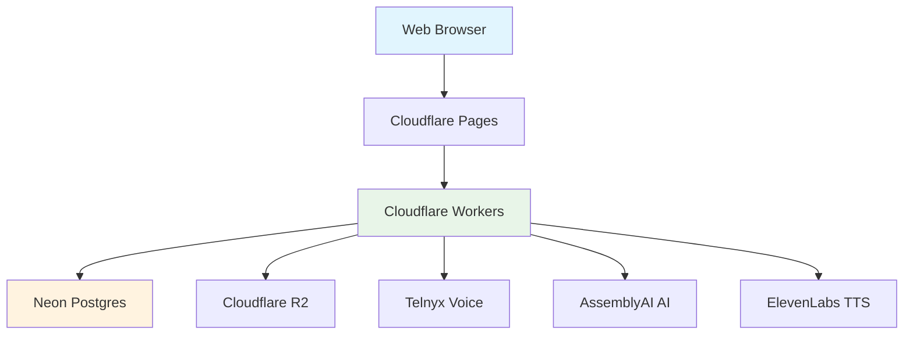
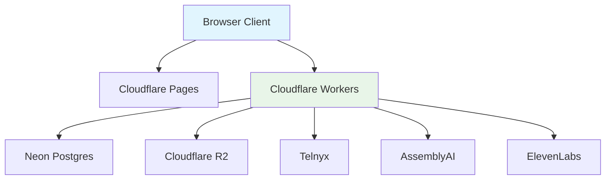
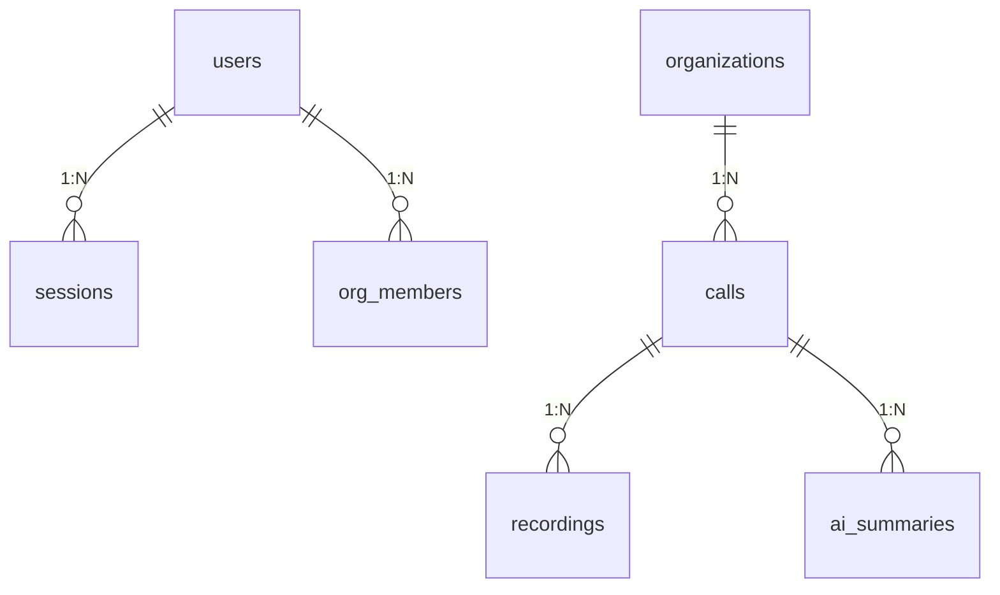
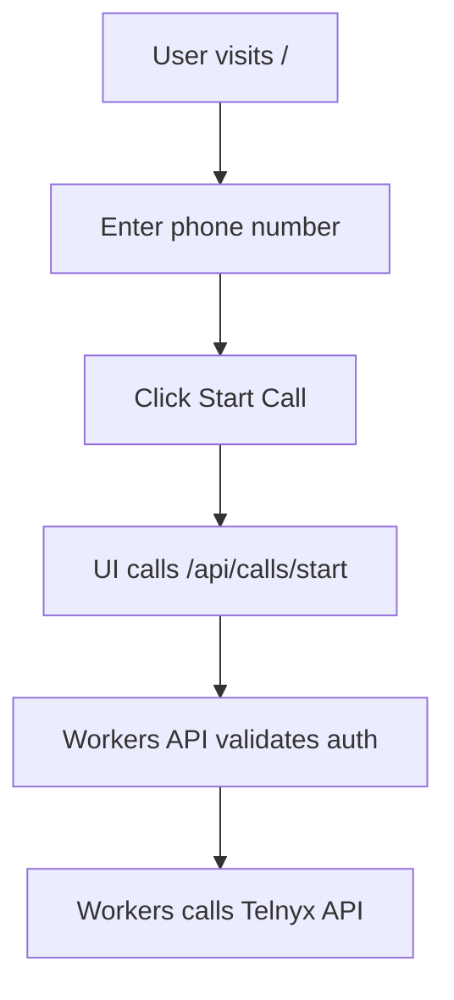
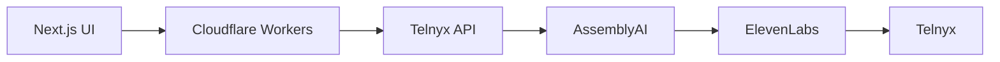
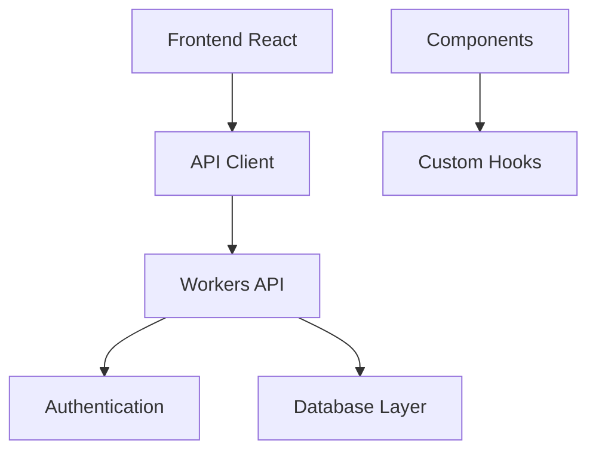
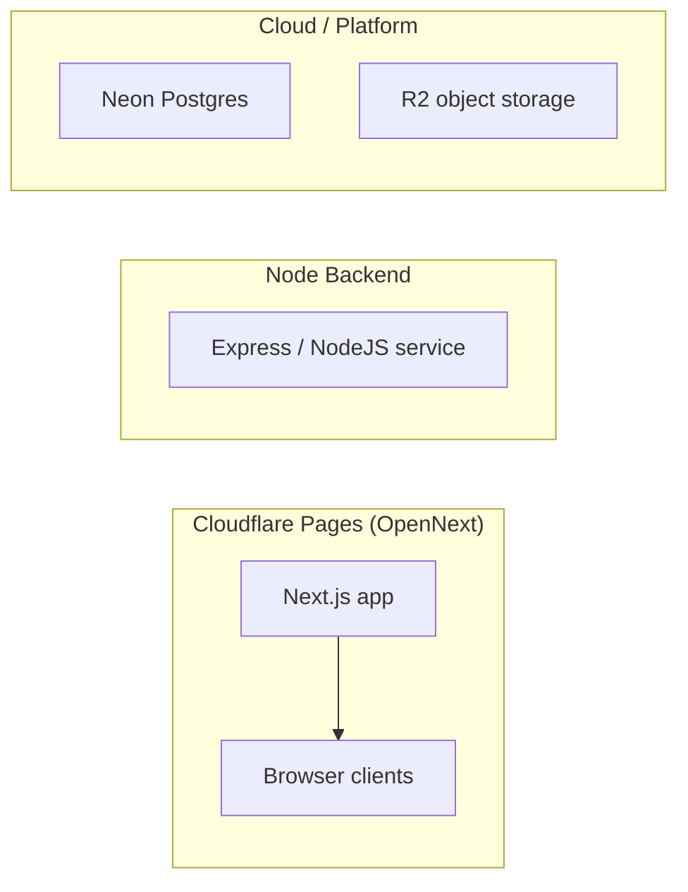

# Architecture Diagrams Index

Central hub for Mermaid diagrams. Clickable previews + source links.

## 1. Complete System Architecture
**[COMPLETE_SYSTEM_ARCHITECTURE.md](COMPLETE_SYSTEM_ARCHITECTURE.md)** - Comprehensive overview of entire Wordis Bond system

## 2. Component Architecture
**[MASTER_ARCHITECTURE.md](MASTER_ARCHITECTURE.md)** - Hybrid Cloudflare architecture with data flows

## 3. Database Schema Relationships
**[DATABASE_SCHEMA_REGISTRY.md](DATABASE_SCHEMA_REGISTRY.md)** - Entity Relationship Diagram for core tables

## 4. Call Flow Diagrams
**[QUICK_REFERENCE.md](QUICK_REFERENCE.md)** - Single call and live translation flows

## 5. High-Level System Flows
**[FINAL_STACK.md](FINAL_STACK.md)** - Outbound calls, inbound calls, and compliance flows

## 6. Codebase Structure
**[SYSTEM_MAP.md](SYSTEM_MAP.md)** - File organization and dependencies

## 7. Split Deployment Architecture
**[SPLIT_DEPLOYMENT_MERMAID.md](SPLIT_DEPLOYMENT_MERMAID.md)** - OpenNext deployment strategy

