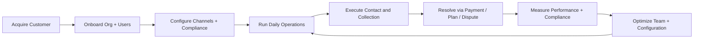

# Flow Map and Validation Plan

Date: 2026-02-16  
Scope: Business flows, workflow flows, feature flows, and documentation required to confirm correctness.

---

## 1) Big-picture flow map

## 1.1 End-to-end business value stream

Interpretation:

- This loop is coherent: onboarding enables operations, operations produce outcomes, outcomes feed analytics/coaching/admin, and then cycle back to better operations.
- The platform is operationally centered on `work` and `command` shells, with `admin/settings` governing controls.

---

## 2) Business flows (what the business is trying to accomplish)

## BF-01 Organization activation

Goal: activate a new organization for production use.

- Trigger: owner/admin creates or enters organization
- Core path: sign in → onboarding setup → number provisioning → compliance baseline
- Exit criteria:
  - Users can access role shell
  - Outbound voice/SMS available
  - Compliance defaults set

## BF-02 Daily collections operations

Goal: maximize productive outreach with complete documentation.

- Trigger: agent starts shift
- Core path: queue selection → call/message action → note/callback/dispute/payment link
- Exit criteria:
  - Every touched account has a disposition
  - Unresolved accounts have next step

## BF-03 Payment recovery and settlement

Goal: convert commitment into payment while preserving account context.

- Trigger: customer payment intent
- Core path: payment link or plan creation → send/track → reconciliation
- Exit criteria:
  - Payment status reflected in account/payment views

## BF-04 Risk and compliance control

Goal: prevent non-compliant contacts and preserve auditability.

- Trigger: pre-contact or post-contact review
- Core path: pre-dial checks + DNC/consent + legal hold/dispute handling + audit logging
- Exit criteria:
  - Blocked contacts are prevented
  - Violations are visible and actionable

## BF-05 Team performance optimization

Goal: improve agent outcomes and quality.

- Trigger: manager review cycle
- Core path: command center → scorecards/coaching → analytics trend review
- Exit criteria:
  - Coaching actions issued
  - KPI deltas reviewed

## BF-06 Platform governance

Goal: maintain secure, stable, cost-effective operations.

- Trigger: admin weekly cadence or change event
- Core path: role/access review → integration health → billing/usage review → retention/compliance review
- Exit criteria:
  - Access and integration posture confirmed

---

## 3) Workflow flows (role-shell runbooks)

## WF-AGENT (Agent shell)

Primary routes:

- `/work`, `/work/queue`, `/work/call`, `/work/payments`, `/accounts`

Standard workflow:

1. Open queue
2. Select account
3. Contact attempt
4. Record outcome (note/callback/dispute/payment link)
5. Move to next account

Control points:

- Pre-contact compliance checks
- Required account context before payment/dispute actions

## WF-MANAGER (Manager shell)

Primary routes:

- `/command`, `/command/live`, `/command/scorecards`, `/command/coaching`, `/analytics`

Standard workflow:

1. Monitor live team activity
2. Identify throughput/quality exceptions
3. Coach using scorecards and review data
4. Validate campaign and performance trends

## WF-ADMIN (Admin shell)

Primary routes:

- `/settings`, `/teams`, `/admin`, `/admin/billing`, `/admin/api`

Standard workflow:

1. Validate access and role assignments
2. Verify integrations and notifications
3. Confirm telephony/payment/compliance configurations
4. Review usage, billing, retention posture

---

## 4) Feature flows (system behavior)

## FF-01 Authentication/session

- Input: credentials/token
- Output: authenticated session with organization context
- Critical correctness checks:
  - deterministic active organization resolution
  - role-based access enforced per mutation routes

## FF-02 Voice calling lifecycle

- Input: call request
- Processing: call create → webhook events → status updates
- Output: call record, timeline, notes/outcomes
- Critical correctness checks:
  - stable call state transitions
  - webhook signature validation
  - proper org scoping for updates

## FF-03 Messaging lifecycle

- Input: single/bulk SMS or email intent
- Processing: consent/compliance validation + send
- Output: message logs, campaign/account linkage
- Critical correctness checks:
  - sender number selection
  - campaign/account scoping
  - opt-out handling

## FF-04 Collections account lifecycle

- Input: account create/import + interactions
- Processing: notes/tasks/callbacks/disputes/payments
- Output: account status evolution and portfolio metrics
- Critical correctness checks:
  - consistent schema usage
  - account-level org isolation

## FF-05 Payment links and plans

- Input: payment intent
- Processing: link/plan creation, optional Stripe flow
- Output: payable artifact and tracking state
- Critical correctness checks:
  - account binding and amount integrity
  - payment state reconciliation

## FF-06 Campaign and sequence automation

- Input: campaign + sequence definitions
- Processing: enrollment + step execution + due action generation
- Output: outbound tasks/messages/call actions
- Critical correctness checks:
  - step conditions evaluated correctly
  - idempotent/duplicate-safe execution

## FF-07 Compliance gating

- Input: pre-contact context
- Processing: DNC + consent + time windows + legal hold + frequency checks
- Output: allow/block + audit trail
- Critical correctness checks:
  - hard block behavior for prohibited contacts
  - reason traceability

## FF-08 Integrations/webhooks

- Input: provider events and outbound subscriptions
- Processing: secure token handling + delivery/retry
- Output: synced entities, notification side effects
- Critical correctness checks:
  - RBAC on mutation/test endpoints
  - stable request/response contracts for frontend hooks

---

## 5) Big-picture coherence check

Current architecture largely makes sense. The loop from operations to management to admin governance is structurally complete.

Most important coherence risks observed:

1. Documentation drift between old and new navigation/workflow models.
2. Contract drift risk between frontend hooks and backend payload/response shapes.
3. Flow ownership and acceptance criteria not consistently documented per flow.

Example drift to resolve now:

- `ARCH_DOCS/04-DESIGN/UX_WORKFLOW_PATTERNS.md` still describes legacy navigation (`/voice-operations`, `/review`, `/bookings`) as primary shell model, while implemented role-shell navigation uses `work/command/admin` routing.

---

## 6) Documentation required to confirm flows are correct

Use this as the minimum documentation stack.

## Tier 1 — Required (authoritative flow validation set)

1. **Flow Catalog (business + workflow + feature)**
   - Canonical IDs (BF-*, WF-*, FF-*)
   - Trigger, preconditions, happy path, exceptions, exit criteria

2. **Route and Contract Matrix**
   - UI route ↔ API endpoint(s) ↔ database entities
   - request/response schema and auth level

3. **State Transition Specs**
   - Calls, messages, disputes, callbacks, payments, campaign enrollments
   - Allowed transitions + invalid transition behavior

4. **Role Authorization Matrix**
   - action-by-action permission table (agent/manager/admin)
   - required middleware and expected denial response

5. **Exception and Failure Handling Matrix**
   - user-facing behavior for auth errors, validation errors, provider failures, rate limits
   - retry behavior and escalation paths

6. **Flow-to-Test Traceability Matrix**
   - every BF/WF/FF mapped to unit/integration/e2e/production tests
   - explicit pass/fail acceptance criteria

## Tier 2 — Strongly recommended

7. **Data Lineage and Ownership Map**
   - authoritative table/entity per flow step
   - ownership by team/function

8. **Operational Runbooks per flow cluster**
   - onboarding runbook, collections runbook, payment runbook, integrations runbook

9. **Versioned change log for flow-impacting changes**
   - route changes, schema changes, role changes, feature-flag changes

10. **UAT scripts by role shell**
    - day-in-the-life scripts for agent, manager, admin

---

## 7) Immediate documentation actions

Priority 0 (this week):

1. Update `ARCH_DOCS/04-DESIGN/UX_WORKFLOW_PATTERNS.md` to role-shell model.
2. Create a flow-to-test traceability matrix file and seed with top 20 critical flows.
3. Create a route/contract matrix for `work/call`, `collections`, `payments`, `webhooks`, `auth`.

Priority 1 (next):

4. Add explicit state-transition docs for calls, messages, payments, disputes.
5. Add role authorization matrix aligned to mounted API routes.

---

## 8) Proposed document set (new files)

- `ARCH_DOCS/01-CORE/FLOW_CATALOG.md`
- `ARCH_DOCS/01-CORE/FLOW_TRACEABILITY_MATRIX.md`
- `ARCH_DOCS/01-CORE/ROLE_AUTHORIZATION_MATRIX.md`
- `ARCH_DOCS/02-FEATURES/ROUTE_CONTRACT_MATRIX.md`
- `ARCH_DOCS/02-FEATURES/STATE_TRANSITIONS.md`
- `ARCH_DOCS/06-REFERENCE/FLOW_UAT_RUNBOOKS.md`

Current status:

- ✅ `ARCH_DOCS/01-CORE/FLOW_CATALOG.md` created
- ✅ `ARCH_DOCS/01-CORE/FLOW_TRACEABILITY_MATRIX.md` created
- ⏳ Remaining documents in this list are still pending creation

---

## 9) Definition of “flow is correct”

A flow is considered correct only if all are true:

1. Business intent is documented with clear exit criteria.
2. Role permissions are explicit and enforced.
3. UI route, API contracts, and data writes are consistent.
4. State transitions are valid and auditable.
5. Failure handling is predictable and documented.
6. Automated tests cover happy path + key exception paths.
7. Production runbook exists for diagnosis/escalation.
