# Codebase System Map

**Updated:** February 13, 2026 | **Version:** 4.56

```mermaid
graph TB
    subgraph "Frontend (Next.js Static)"
        UI[UI Pages<br/>app/page.tsx<br/>app/dashboard/*<br/>app/signin/*<br/>app/voice/*<br/>app/analytics/*<br/>app/settings/*<br/>app/admin/*<br/>app/campaigns/*]
        Components[Reusable Components<br/>components/ui/*<br/>components/AuthProvider.tsx<br/>components/voice/*<br/>components/Navigation.tsx]
        Hooks[Custom Hooks<br/>hooks/useWebRTC.ts<br/>hooks/useAuth.ts<br/>hooks/useRBAC.ts]
    end

    subgraph "Backend (Cloudflare Workers — 48 route files)"
        WorkersAPI[API Layer<br/>workers/src/index.ts<br/>workers/src/routes/* — 48 files]
        Auth[Authentication<br/>auth.ts + lib/auth.ts]
        Voice[Voice & Telephony<br/>voice.ts, calls.ts, webrtc.ts<br/>live-translation.ts, tts.ts<br/>dialer.ts, ivr.ts, caller-id.ts]
        AI[AI & Intelligence<br/>ai-llm.ts, ai-router.ts, ai-transcribe.ts<br/>bond-ai.ts, ai-config.ts, ai-toggle.ts<br/>audio.ts, sentiment.ts]
        Business[Business Logic<br/>billing.ts, campaigns.ts, collections.ts<br/>compliance.ts, bookings.ts, surveys.ts<br/>productivity.ts, scorecards.ts]
        Admin[Admin & Analytics<br/>admin.ts, admin-metrics.ts<br/>analytics.ts, reports.ts, usage.ts<br/>audit.ts, health.ts, reliability.ts]
        DB[Database Layer<br/>workers/src/lib/db.ts]
    end

    subgraph "Worker Libraries (34 files)"
        CoreLibs[Core: db.ts, auth.ts, audit.ts<br/>logger.ts, errors.ts, utils.ts]
        AILibs[AI: ai-router.ts, groq-client.ts<br/>grok-voice-client.ts, bond-ai.ts<br/>prompt-sanitizer.ts, pii-redactor.ts]
        VoiceLibs[Voice: translation-processor.ts<br/>tts-processor.ts, sentiment-processor.ts<br/>audio-injector.ts, ivr-flow-engine.ts<br/>ai-call-engine.ts, dialer-engine.ts]
        SecurityLibs[Security: rate-limit.ts, idempotency.ts<br/>schemas.ts, validate.ts, compliance-checker.ts]
        ProcessingLibs[Processing: queue-consumer.ts<br/>post-transcription-processor.ts<br/>likelihood-scorer.ts, webhook-retry.ts<br/>payment-scheduler.ts]
    end

    subgraph "Shared Client Libraries"
        APIClient[API Client<br/>lib/apiClient.ts]
    end

    subgraph "External Services"
        Neon[Neon Postgres — 149 tables]
        R2[Cloudflare R2 — Recordings]
        KV[Cloudflare KV — Sessions/Rate Limits]
        Telnyx[Telnyx — Voice/SMS]
        Stripe[Stripe — Billing]
        AssemblyAI[AssemblyAI — Transcription]
        ElevenLabs[ElevenLabs — TTS]
        Grok[Grok xAI — Advanced LLM]
        Groq[Groq — Cost-Opt LLM]
    end

    UI --> APIClient
    Components --> Hooks
    Hooks --> APIClient
    APIClient --> WorkersAPI
    WorkersAPI --> Auth
    WorkersAPI --> Voice
    WorkersAPI --> AI
    WorkersAPI --> Business
    WorkersAPI --> Admin
    WorkersAPI --> DB
    Auth --> CoreLibs
    Voice --> VoiceLibs
    AI --> AILibs
    DB --> Neon
    WorkersAPI --> SecurityLibs
    WorkersAPI --> ProcessingLibs
    Voice --> Telnyx
    AI --> Grok
    AI --> Groq
    AI --> AssemblyAI
    Voice --> ElevenLabs
    Business --> Stripe
    Admin --> R2
    Auth --> KV

    style UI fill:#e1f5fe
    style Components fill:#f3e5f5
    style Hooks fill:#e8f5e8
    style WorkersAPI fill:#fff3e0
    style Auth fill:#fce4ec
    style Voice fill:#f1f8e9
    style AI fill:#ede7f6
    style Business fill:#e0f2f1
    style Admin fill:#fff8e1
    style DB fill:#f1f8e9
    style CoreLibs fill:#e8eaf6
    style AILibs fill:#ede7f6
    style VoiceLibs fill:#e8f5e9
    style SecurityLibs fill:#fce4ec
    style ProcessingLibs fill:#fff3e0
    style APIClient fill:#e0f2f1
    style Neon fill:#fff3e0
    style R2 fill:#fce4ec
    style KV fill:#e8eaf6
    style Telnyx fill:#f1f8e9
    style Stripe fill:#e0f2f1
    style AssemblyAI fill:#ede7f6
    style ElevenLabs fill:#fff8e1
    style Grok fill:#fce4ec
    style Groq fill:#e8f5e8
```

## 1. Backend API (Cloudflare Workers — 48 Route Files)

**Purpose**: Edge API, auth, DB, voice, AI, billing, compliance.

**Route Files** (workers/src/routes/):
- **Core**: auth.ts, health.ts, organizations.ts, users.ts, team.ts, teams.ts, admin.ts, admin-metrics.ts, audit.ts, onboarding.ts, internal.ts, test.ts
- **Voice**: voice.ts, calls.ts, webrtc.ts, live-translation.ts, tts.ts, dialer.ts, ivr.ts, caller-id.ts, call-capabilities.ts, capabilities.ts, audio.ts, recordings.ts
- **AI**: ai-llm.ts, ai-router.ts, ai-transcribe.ts, bond-ai.ts, ai-config.ts, ai-toggle.ts, sentiment.ts
- **Business**: billing.ts, campaigns.ts, collections.ts, compliance.ts, bookings.ts, surveys.ts, productivity.ts, scorecards.ts, shopper.ts, retention.ts
- **Analytics**: analytics.ts, reports.ts, usage.ts, reliability.ts
- **Integrations**: webhooks.ts, rbac-v2.ts, manager.ts

**Lib Files** (workers/src/lib/ — 34 files):
- **Core**: db.ts, auth.ts, audit.ts, logger.ts, errors.ts, utils.ts
- **AI**: ai-router.ts, groq-client.ts, grok-voice-client.ts, bond-ai.ts, prompt-sanitizer.ts, pii-redactor.ts
- **Voice**: translation-processor.ts, tts-processor.ts, sentiment-processor.ts, audio-injector.ts, ivr-flow-engine.ts, ai-call-engine.ts, dialer-engine.ts
- **Security**: rate-limit.ts, idempotency.ts, schemas.ts, validate.ts, compliance-checker.ts, compliance-guides.ts, capabilities.ts, plan-gating.ts
- **Processing**: queue-consumer.ts, post-transcription-processor.ts, likelihood-scorer.ts, webhook-retry.ts, payment-scheduler.ts, email.ts

## 2. Frontend App (Next.js Static)

**Purpose**: UI pages — static export on Cloudflare Pages.

**Key Pages**: landing, signin, signup, dashboard, voice, voice-operations, analytics, settings, admin, campaigns, bookings, reports, teams, pricing, compare, trust, case-studies, api-docs, verticals

## 3. UI Components

**Purpose**: Reusable UI (shadcn/ui + custom voice components).

**Key Components**: AuthProvider, Navigation, voice/* (CallDetailView, BridgedCallView, DailyPlanner, PaymentCalculator, ObjectionLibrary, NoteTemplates, CompliancePanel)

## 4. External Services

| Service | Purpose | Integration |
|---------|---------|-------------|
| Neon PostgreSQL | 149-table multi-tenant DB | Hyperdrive pooling, RLS |
| Cloudflare R2 | Recording storage | Signed URLs, versioning |
| Cloudflare KV | Sessions, rate limits, idempotency | Edge-native key-value |
| Telnyx | Voice/SMS, Call Control v2 | Webhooks + API |
| Stripe | Billing, subscriptions | Webhooks + API |
| AssemblyAI | Transcription (batch + real-time) | Webhooks + API |
| ElevenLabs | Text-to-Speech | Streaming API |
| Grok (xAI) | Advanced LLM reasoning | API (Bond AI Chat/Copilot) |
| Groq (Llama 4 Scout) | Cost-optimized LLM | API (translation, simple tasks) |

## 5. Testing

**Framework**: Vitest (unit/production), Playwright (E2E)

**Structure**: tests/unit/, tests/production/ (feature-registry + deep-functional), tests/e2e/, tests/load/

## 6. Deploy/Config

- `workers/wrangler.toml`: Workers API config
- `wrangler.pages.toml`: Pages config
- `package.json`: Scripts (api:deploy, build, pages:deploy, health-check)
