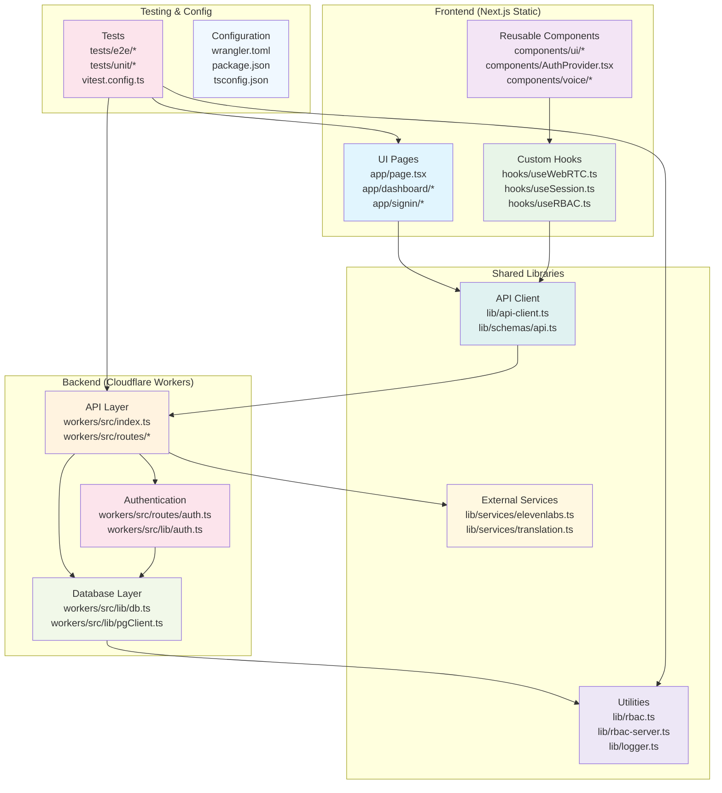

# Codebase System Map

## 1. Backend API (Cloudflare Workers)
**Purpose**: Edge API, auth, DB, voice.

**Files**:
- `workers/src/index.ts`: App entry, routes mount
- `workers/src/routes/auth.ts`: Signup/login/session
- `workers/src/routes/organizations.ts`: Org create/current
- `workers/src/routes/calls.ts`: Call start/end
- `workers/src/lib/auth.ts`: Session verify
- `workers/src/lib/db.ts`: Neon getDb
- `workers/src/scheduled.ts`: Cron jobs

## 2. Frontend App (Next.js Static)
**Purpose**: UI pages.

**Files**:
- `app/layout.tsx`: Root + AuthProvider
- `app/page.tsx`: Landing
- `app/signin/page.tsx`: Login
- `app/dashboard/page.tsx`: Main
- `app/voice/*`: Dialer
- `app/settings/*`: Config

## 3. UI Components
**Purpose**: Reusable UI (shadcn).

**Files**:
- `components/ui/*`: Button, Input etc.
- `components/AuthProvider.tsx`: Session context
- `components/voice/*`: Voice/WebRTC UI
- `components/Navigation.tsx`: Nav bar

## 4. Custom Hooks
**Purpose**: Logic.

**Files**:
- `hooks/useWebRTC.ts`: SIP connect/call
- `hooks/useSession` via AuthProvider
- `hooks/useRBAC.ts`: Permissions

## 5. Lib/Utils
**Purpose**: Shared.

**Files**:
- `lib/api-client.ts`: Typed fetch
- `lib/schemas/api.ts`: Zod
- `lib/logger.ts`: Logs

## 6. Testing
**Files**:
- `tests/e2e/login.spec.ts`
- `tests/production/*`

## 7. Deploy/Config
**Files**:
- `wrangler.toml`: Pages
- `workers/wrangler.toml`: API
- `package.json`: Scripts
- `.cf_put.ps1`: Deploy

Audit for excellence next.