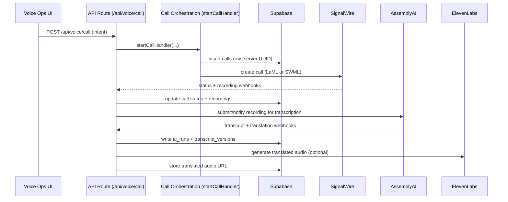
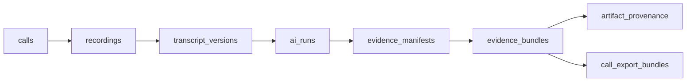
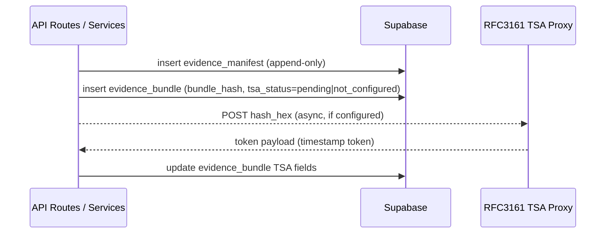
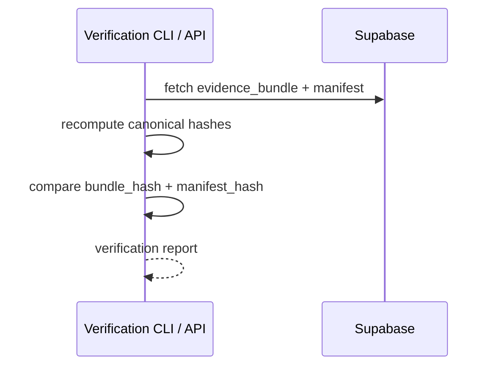

# Graphical Architecture Overview (Current State)

**Product:** Wordis Bond  
**Company:** Latimer + Woods Tech LLC  
**Doc Type:** Graphical design document + architectural summary  
**Version:** 1.2  
**Last Updated:** January 17, 2026  
**Status:** Current (v1 SignalWire-first)

> **Brand:** "The System of Record for Business Conversations"

> **Note:** For full system architecture with gap analysis, see:
> - `FULL_SYSTEM_ARCHITECTURE.md` - Comprehensive architecture with site maps
> - `GAP_ANALYSIS.md` - Detailed gap analysis and resolution plan

---

## 1) System Context (Who talks to what)

```mermaid
flowchart LR
  subgraph Users
    U1[Operators / Admins / Analysts]
    U2[External Call Targets]
  end

  subgraph Clients
    UI[Web UI (Next.js App)]
    EXT[Chrome Extension]
  end

  subgraph Platform
    API[Next.js API Routes + Server Actions]
    SRV[Core Services\n(Call Orchestration, Evidence, Translation, Scoring)]
    DB[(Supabase Postgres + Storage)]
  end

  subgraph Vendors
    SW[SignalWire\nMedia Plane + LaML/SWML]
    AAI[AssemblyAI\nTranscription/Translation]
    EL[ElevenLabs\nTTS + Voice Cloning]
    RS[Resend\nEmail]
    ST[Stripe\nBilling - Planned]
  end

  U1 --> UI
  U1 --> EXT
  UI --> API
  EXT --> API
  API --> SRV
  SRV --> DB
  API --> DB
  API --> SW
  SW --> U2
  SW --> API
  AAI --> API
  SRV --> AAI
  SRV --> EL
  SRV --> RS
```

---

## 2) Core Application Architecture (Runtime)

```mermaid
flowchart TB
  subgraph Presentation
    P1[Next.js App Router Pages]
    P2[Components / Hooks]
  end

  subgraph Control Plane
    C1[API Routes]
    C2[Server Actions]
    C3[Auth (NextAuth + Supabase Adapter)]
  end

  subgraph Services
    S1[Call Orchestration]
    S2[Evidence Manifest + Provenance]
    S3[Translation + TTS]
    S4[Scoring / Secret Shopper]
    S5[Email Artifacts]
  end

  subgraph Data Plane
    D1[(Supabase Postgres)]
    D2[(Supabase Storage)]
  end

  subgraph External
    E1[SignalWire]
    E2[AssemblyAI]
    E3[ElevenLabs]
    E4[Resend]
  end

  P1 --> C1
  P2 --> C2
  C1 --> S1
  C2 --> S1
  C1 --> S2
  C2 --> S2
  C1 --> S3
  C1 --> S4
  C1 --> S5
  S1 --> D1
  S2 --> D1
  S3 --> D1
  S4 --> D1
  S5 --> D2
  S1 --> E1
  S3 --> E2
  S3 --> E3
  S5 --> E4
  E1 --> C1
  E2 --> C1
```

---

## 3) End-to-End Call Execution (Authoritative Flow)



---

## 4) Artifact Lifecycle (System of Record)



---

## 5) Evidence Bundle + RFC3161 (Custody Flow)



---

## 5b) Verification & Reconstitution (Third-Party)



---

## 6) Security & Permission Gates (Request Path)

```mermaid
flowchart TD
  REQ[API Request] --> AUTH[requireAuth()]
  AUTH --> ROLE[RBAC + Plan Gate]
  ROLE --> VALIDATE[Schema + Idempotency + Rate Limit]
  VALIDATE --> WRITE[Server-side Writes Only]
  WRITE --> AUDIT[audit_logs + provenance]
```

---

## 7) Deployment Topology (Current v1)

```mermaid
flowchart LR
  VERCEL[Vercel (Next.js)]
  SUPA[Supabase (Postgres + Storage)]
  SW[SignalWire]
  AAI[AssemblyAI]
  EL[ElevenLabs]
  RS[Resend]

  VERCEL --> SUPA
  VERCEL --> SW
  VERCEL --> AAI
  VERCEL --> EL
  VERCEL --> RS
  SW --> VERCEL
  AAI --> VERCEL
```

---

## 8) Design System Flow (UI Architecture)

```mermaid
flowchart TB
  TOK[Design Tokens\n(Color, Type, Spacing)] --> DS[Design System Specs]
  DS --> COMP[UI Components]
  COMP --> PAGES[App Router Pages]
  PAGES --> UX[User Flows (Voice Ops, Settings, Tests)]
```

---

## 9) Detailed Summary — How Everything Works

### 7.1 Product Surfaces
- **Web UI (Next.js App Router)** drives all configuration and execution; the UI submits intent and never writes tables directly.
- **Voice Operations** page is the single operational surface for calls, modulations, and artifacts.
- **Settings** controls voice configuration (recording, transcription, translation, surveys, live translation).
- **Test Dashboard** provides system health signals and operational checks.
- **Chrome Extension** uses the same API surface for click-to-call and scheduling.

### 7.2 Call Orchestration (Server-Controlled)
- `POST /api/voice/call` performs rate limiting and idempotency, then invokes `startCallHandler` to create a call record, validate org membership, and place the SignalWire call. The server rejects any client-supplied call IDs.  
- Call IDs are generated server-side and written to `calls`, then updated as SignalWire status callbacks arrive.  
- This keeps the **call** as the single root entity for all downstream artifacts.  

### 7.3 Media Execution (SignalWire v1)
- SignalWire is the authoritative media plane for v1: call origination, recording, LaML/SWML control, and webhook callbacks.  
- For live translation preview (Business+ plan + feature flag), SignalWire SWML routes are used, but the output is **non-authoritative**.  

### 7.4 Intelligence Plane (AssemblyAI + Optional OpenAI)
- AssemblyAI produces canonical transcripts (post-call) and translation payloads.  
- Translation uses OpenAI for text translation and ElevenLabs for TTS audio, with optional voice cloning from the original recording.  
- All AI artifacts are written via server-side services into `ai_runs` and `transcript_versions`.  

### 7.5 Evidence & System-of-Record
- Evidence manifests are immutable, append-only records that stitch together recordings, transcripts, translations, surveys, and scores.  
- Evidence bundles package manifests + artifact hashes into custody-grade bundles with bundle-level hashing.  
- Provenance is recorded per artifact and bundle, including producer, version, and input references; hashes are canonicalized for integrity.  
- RFC3161 timestamp tokens are stored when configured (via TSA proxy) to provide external time anchors.  

### 7.6 Data Layer (Supabase)
- **Postgres** holds call-rooted tables (`calls`, `recordings`, `ai_runs`, `evidence_manifests`, etc.).  
- **Storage** holds media assets (recordings, translated audio).  
- RLS policies enforce tenant isolation; server uses the service-role key.  

### 7.7 Security & Governance
- NextAuth handles authentication with a Supabase adapter and optional OAuth providers.  
- RBAC and plan gating are enforced in API handlers and server actions.  
- All operational writes are logged to `audit_logs` with actor attribution.  

### 7.8 Operational & Quality Systems
- Rate limiting and idempotency protect execution endpoints.  
- Test dashboard exposes a comprehensive health and integration check suite.  
- Deployment is Vercel serverless + managed Supabase, with vendor webhooks for SignalWire and AssemblyAI.

---

## 10) Architectural Guarantees (Current State)
- **Single call root:** every artifact attaches to `calls.id`.
- **UI never orchestrates:** all execution is server-controlled.
- **SignalWire-first v1:** no FreeSWITCH dependency in production.
- **Canonical transcripts:** AssemblyAI is authoritative.
- **Custody-grade hashing:** manifests + bundles are canonicalized and hashed.
- **Immutability:** evidence, bundles, and provenance are append-only with triggers.
- **Capability-driven:** plan and role gates decide execution, not UI visibility.

