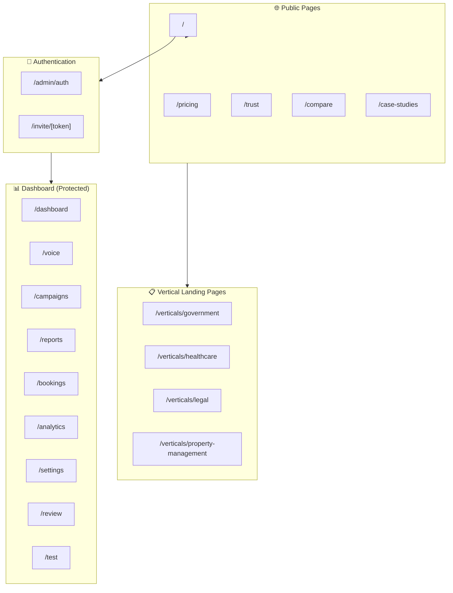
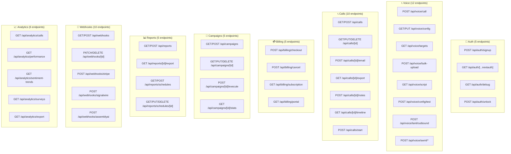
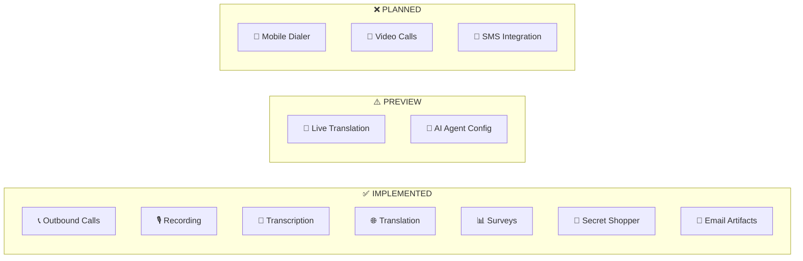
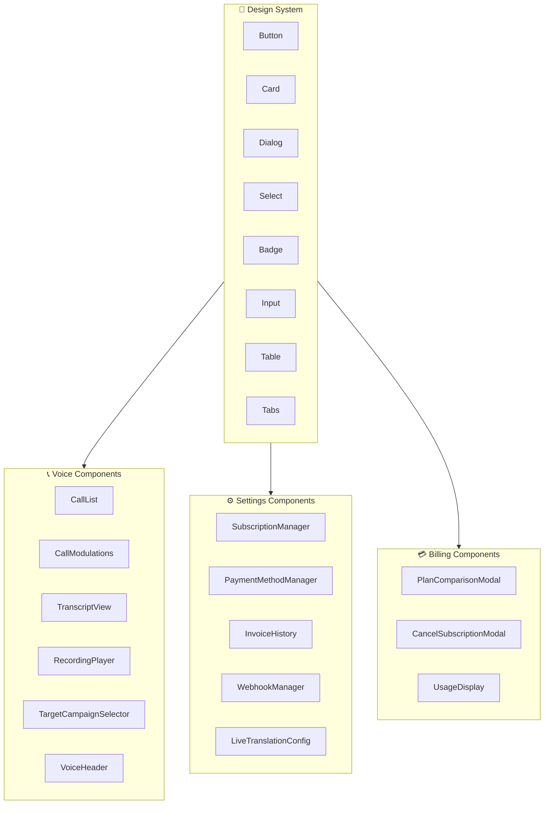
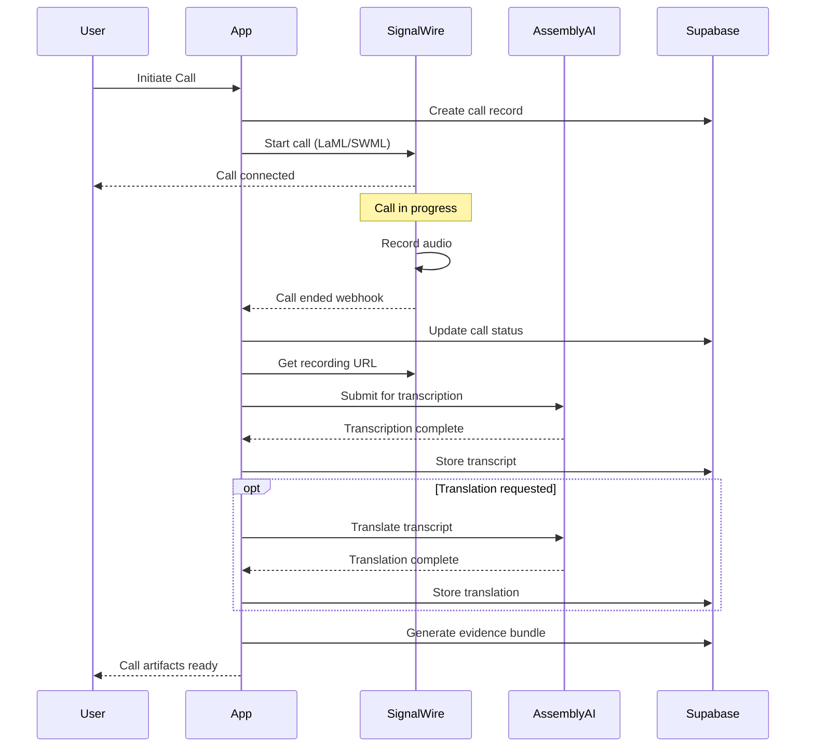
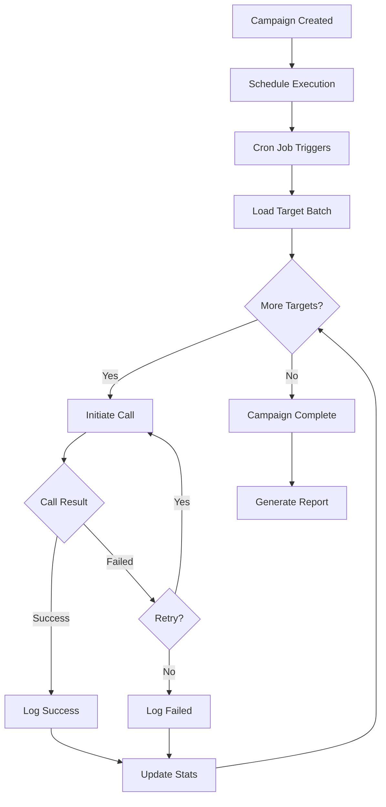
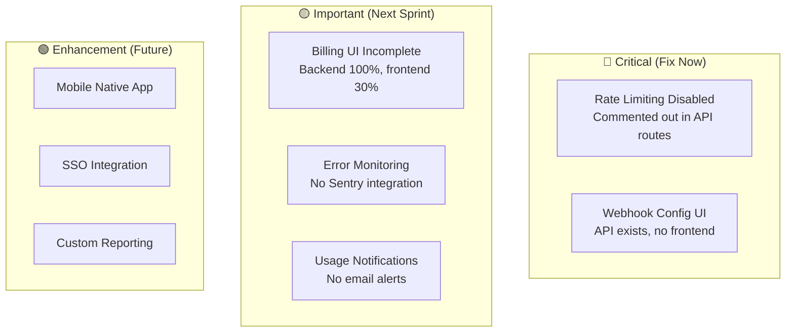
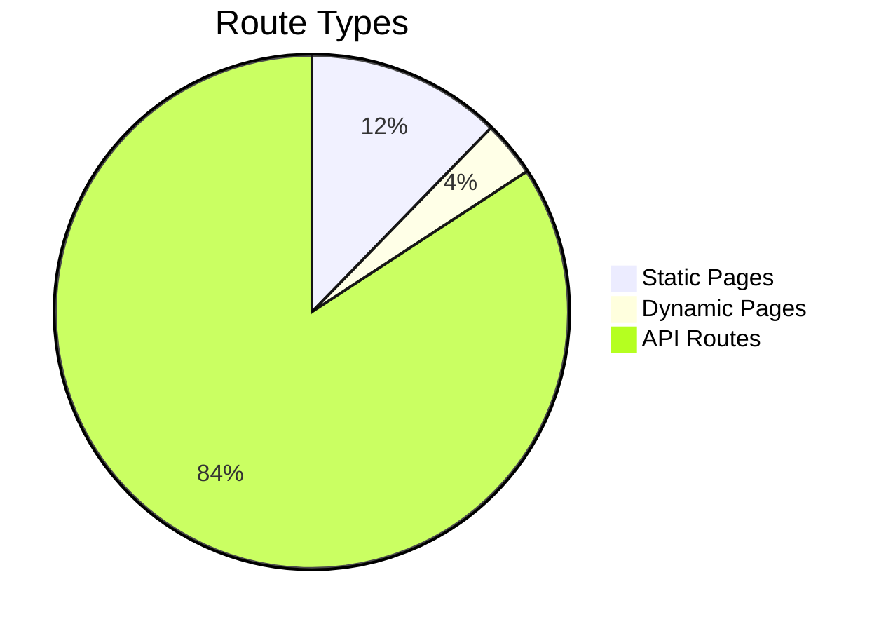

# Wordis Bond - Site Architecture Visual Guide

**Version:** 3.0  
**Date:** January 17, 2026  
**Build Status:** ✅ PASSING

---

## 🗺️ Site Map - Actual Implementation



---

## 📱 Page Inventory

### Public Pages (No Auth Required)

| Route | Status | Purpose |
|-------|--------|---------|
| `/` | ✅ Static | Landing page |
| `/pricing` | ✅ Static | Plan comparison |
| `/trust` | ✅ Static | Security & compliance |
| `/compare` | ✅ Static | Competitor comparison |
| `/case-studies` | ✅ Static | Customer stories |
| `/verticals/government` | ✅ Static | Government vertical |
| `/verticals/healthcare` | ✅ Static | Healthcare vertical |
| `/verticals/legal` | ✅ Static | Legal vertical |
| `/verticals/property-management` | ✅ Static | Property management |

### Protected Pages (Auth Required)

| Route | Status | Purpose | Bundle Size |
|-------|--------|---------|-------------|
| `/dashboard` | ✅ Dynamic | Main dashboard | 160 kB |
| `/voice` | ✅ Dynamic | Voice operations | 209 kB |
| `/campaigns` | ✅ Static | Campaign management | 122 kB |
| `/reports` | ✅ Static | Report builder | 122 kB |
| `/bookings` | ✅ Static | Scheduled calls | 93.9 kB |
| `/analytics` | ✅ Static | Analytics dashboard | 220 kB |
| `/settings` | ✅ Static | User/org settings | 165 kB |
| `/review` | ✅ Static | Evidence review | 104 kB |
| `/test` | ✅ Static | Test runner | 91.6 kB |

---

## 🔌 API Architecture - Actual vs Conceptual

### Actual API Endpoints (96+ routes)



---

## 🎯 Feature Matrix - Actual vs Conceptual

### Voice Features



### Feature Implementation Status

| Feature | Status | Notes |
|---------|--------|-------|
| **Outbound Calls** | ✅ 100% | SignalWire integration complete |
| **Recording** | ✅ 100% | Auto-record all calls |
| **Transcription** | ✅ 100% | AssemblyAI post-call |
| **Translation** | ✅ 95% | Post-call via AssemblyAI |
| **Live Translation** | ⚠️ 80% | SignalWire AI Agents (Business+ only) |
| **Surveys** | ✅ 100% | IVR + AI bot surveys |
| **Secret Shopper** | ✅ 95% | AI call scoring |
| **Campaigns** | ✅ 100% | Bulk call management |
| **Reports** | ✅ 90% | Custom report builder |
| **Analytics** | ✅ 100% | Full dashboard |
| **Billing** | ⚠️ 70% | Backend 100%, UI partial |
| **Webhooks** | ⚠️ 50% | API exists, no config UI |

---

## 🏢 Component Architecture

### UI Component Library



---

## 🔄 Data Flow Architecture

### Call Lifecycle



### Campaign Execution Flow



---

## 🚧 Gap Analysis

### Critical Gaps



### Gap Details

| Gap | Impact | Recommendation |
|-----|--------|----------------|
| **Rate Limiting Disabled** | 🔴 Security risk | Re-implement using proper Supabase-based limiter |
| **Webhook Config UI** | 🟡 User friction | Build UI in Settings → Webhooks tab |
| **Billing UI** | 🟡 Revenue impact | Complete subscription management UI |
| **Error Monitoring** | 🟡 Operations | Add Sentry for production monitoring |
| **Usage Alerts** | 🟡 User experience | Email when approaching limits |

---

## 📊 Build Output Analysis

### Route Distribution



### Bundle Size Analysis

```mermaid
bar title Page Bundle Sizes (KB)
    "/analytics" : 220
    "/voice" : 209
    "/settings" : 165
    "/dashboard" : 160
    "/campaigns" : 122
    "/reports" : 122
```

---

## ✅ Current State Summary

| Component | Status | Health |
|-----------|--------|--------|
| **Build** | ✅ Passing | 🟢 |
| **TypeScript** | ✅ No errors | 🟢 |
| **Pages** | 31 routes | 🟢 |
| **API** | 96+ endpoints | 🟢 |
| **Components** | 50+ components | 🟢 |
| **Database** | 47 tables | 🟢 |
| **Tests** | 98.5% passing | 🟢 |
| **Rate Limiting** | ⚠️ Disabled | 🟡 |
| **Webhook UI** | ⚠️ Missing | 🟡 |
| **Billing UI** | ⚠️ Partial | 🟡 |

---

*Generated from successful build on January 17, 2026*
