# Database Schema ERD

> Auto-generated from Workers route analysis  
> Last updated: 2026-02-06  
> **49 active tables**, ~64 additional (legacy/unused)

## Core Entity-Relationship Diagram

```mermaid
erDiagram
    %% ─── Auth / Identity ─────────────────────────────────────────
    users {
        text id PK
        text email UK
        text name
        timestamptz created_at
    }
    accounts {
        text id PK
        text user_id FK
        text provider
        text provider_account_id
    }
    sessions {
        text id PK
        text session_token UK
        text user_id FK
        timestamptz expires
    }
    api_keys {
        uuid id PK
        text user_id FK
        text key_hash
    }

    users ||--o{ accounts : "has"
    users ||--o{ sessions : "has"
    users ||--o{ api_keys : "has"

    %% ─── Tenancy ─────────────────────────────────────────────────
    organizations {
        uuid id PK
        text name
        text plan
        text plan_status
        text stripe_customer_id UK
        text created_by FK
    }
    org_members {
        uuid id PK
        uuid organization_id FK
        text user_id FK
        text role
    }

    users ||--o{ org_members : "belongs_to"
    organizations ||--o{ org_members : "has"
    users ||--o| organizations : "created"

    %% ─── Core: Calls ─────────────────────────────────────────────
    calls {
        uuid id PK
        uuid organization_id FK
        text created_by FK
        text status
        text disposition
        timestamptz started_at
        timestamptz ended_at
        boolean legal_hold_flag
    }
    call_outcomes {
        uuid id PK
        uuid call_id FK
        text outcome_type
    }
    call_outcome_history {
        uuid id PK
        uuid call_id FK
        text previous_outcome
        text new_outcome
    }
    call_notes {
        uuid id PK
        uuid call_id FK
        text user_id FK
        text content
    }
    call_confirmations {
        uuid id PK
        uuid call_id FK
        jsonb checklist
    }
    call_timeline_events {
        uuid id PK
        uuid call_id FK
        text event_type
        timestamptz occurred_at
    }

    organizations ||--o{ calls : "owns"
    users ||--o{ calls : "created"
    calls ||--o| call_outcomes : "has"
    calls ||--o{ call_outcome_history : "tracks"
    calls ||--o{ call_notes : "has"
    calls ||--o{ call_confirmations : "has"
    calls ||--o{ call_timeline_events : "has"

    %% ─── Recordings & Transcriptions ─────────────────────────────
    recordings {
        uuid id PK
        uuid organization_id FK
        uuid call_id FK
        text recording_url
        integer duration_seconds
        text storage_path
    }
    transcriptions {
        uuid id PK
        uuid recording_id FK
        text content
        text status
    }
    ai_summaries {
        uuid id PK
        uuid call_id FK
        text summary
    }

    calls ||--o{ recordings : "has"
    organizations ||--o{ recordings : "owns"
    recordings ||--o| transcriptions : "has"
    calls ||--o| ai_summaries : "has"

    %% ─── Voice & Telephony ──────────────────────────────────────
    voice_configs {
        uuid id PK
        uuid organization_id FK
        jsonb config
    }
    voice_targets {
        uuid id PK
        uuid organization_id FK
        text phone_number
        text label
    }
    caller_ids {
        uuid id PK
        uuid organization_id FK
        text phone_number
        boolean verified
    }
    audio_files {
        uuid id PK
        uuid organization_id FK
        text storage_path
    }
    tts_audio {
        uuid id PK
        uuid organization_id FK
        text text_hash
        text storage_path
    }

    organizations ||--o| voice_configs : "has"
    organizations ||--o{ voice_targets : "has"
    organizations ||--o{ caller_ids : "has"
    organizations ||--o{ audio_files : "has"
    organizations ||--o{ tts_audio : "has"

    %% ─── Campaigns ──────────────────────────────────────────────
    campaigns {
        uuid id PK
        uuid organization_id FK
        text name
        text status
    }

    organizations ||--o{ campaigns : "owns"

    %% ─── Team ───────────────────────────────────────────────────
    teams {
        uuid id PK
        uuid organization_id FK
        text name
    }
    team_members {
        uuid id PK
        uuid team_id FK
        text user_id FK
    }
    team_invites {
        uuid id PK
        uuid organization_id FK
        text email
        text token
        text status
    }

    organizations ||--o{ teams : "has"
    teams ||--o{ team_members : "has"
    users ||--o{ team_members : "member_of"
    organizations ||--o{ team_invites : "has"

    %% ─── Billing ────────────────────────────────────────────────
    billing_events {
        uuid id PK
        uuid organization_id FK
        text event_type
        text stripe_event_id UK
    }

    organizations ||--o{ billing_events : "has"

    %% ─── Compliance & Audit ─────────────────────────────────────
    audit_logs {
        uuid id PK
        uuid organization_id FK
        text user_id FK
        text resource_type
        text action
        jsonb old_value
        jsonb new_value
        timestamptz created_at
    }
    retention_policies {
        uuid id PK
        uuid organization_id FK
        integer retention_days
    }
    legal_holds {
        uuid id PK
        uuid organization_id FK
        uuid call_id FK
        text reason
    }
    compliance_violations {
        uuid id PK
        uuid organization_id FK
        text violation_type
    }

    organizations ||--o{ audit_logs : "has"
    users ||--o{ audit_logs : "authored"
    organizations ||--o{ retention_policies : "has"
    organizations ||--o{ legal_holds : "has"
    calls ||--o{ legal_holds : "held_by"
    organizations ||--o{ compliance_violations : "has"

    %% ─── AI & Bond AI ──────────────────────────────────────────
    ai_configs {
        uuid id PK
        uuid organization_id FK
        jsonb config
    }
    bond_ai_conversations {
        uuid id PK
        text user_id FK
        uuid organization_id FK
    }
    bond_ai_messages {
        uuid id PK
        uuid conversation_id FK
        text role
        text content
    }
    bond_ai_alerts {
        uuid id PK
        uuid organization_id FK
        text alert_type
        text status
    }
    bond_ai_alert_rules {
        uuid id PK
        uuid organization_id FK
        text rule_type
    }

    organizations ||--o| ai_configs : "has"
    users ||--o{ bond_ai_conversations : "has"
    organizations ||--o{ bond_ai_conversations : "owns"
    bond_ai_conversations ||--o{ bond_ai_messages : "contains"
    organizations ||--o{ bond_ai_alerts : "has"
    organizations ||--o{ bond_ai_alert_rules : "has"

    %% ─── Scorecards ────────────────────────────────────────────
    scorecards {
        uuid id PK
        uuid organization_id FK
        uuid call_id FK
        integer overall_score
    }
    scorecard_templates {
        uuid id PK
        uuid organization_id FK
        text name
    }
    scorecard_alerts {
        uuid id PK
        uuid organization_id FK
        text alert_type
    }

    organizations ||--o{ scorecards : "has"
    calls ||--o{ scorecards : "scored_by"
    organizations ||--o{ scorecard_templates : "has"
    organizations ||--o{ scorecard_alerts : "has"

    %% ─── Webhooks ───────────────────────────────────────────────
    webhook_subscriptions {
        uuid id PK
        uuid organization_id FK
        text url
        boolean active
    }
    webhook_deliveries {
        uuid id PK
        uuid subscription_id FK
        integer status_code
    }
    webhook_failures {
        uuid id PK
        uuid subscription_id FK
        text error
    }

    organizations ||--o{ webhook_subscriptions : "has"
    webhook_subscriptions ||--o{ webhook_deliveries : "has"
    webhook_subscriptions ||--o{ webhook_failures : "has"

    %% ─── RBAC ───────────────────────────────────────────────────
    rbac_permissions {
        uuid id PK
        text role
        text resource
        text action
        jsonb conditions
    }

    %% ─── Surveys & Shopping ─────────────────────────────────────
    surveys {
        uuid id PK
        uuid organization_id FK
        text title
    }
    survey_responses {
        uuid id PK
        uuid survey_id FK
        jsonb answers
    }
    shopper_scripts {
        uuid id PK
        uuid organization_id FK
        text name
    }

    organizations ||--o{ surveys : "has"
    surveys ||--o{ survey_responses : "has"
    organizations ||--o{ shopper_scripts : "has"

    %% ─── Reports ────────────────────────────────────────────────
    reports {
        uuid id PK
        uuid organization_id FK
        text report_type
    }
    report_schedules {
        uuid id PK
        uuid report_id FK
        text cron
    }

    organizations ||--o{ reports : "has"
    reports ||--o| report_schedules : "scheduled_by"

    %% ─── Auth Providers (Admin) ─────────────────────────────────
    auth_providers {
        uuid id PK
        text name
        boolean enabled
    }
```

## Table Count Summary

| Category           | Tables | Key Tables                                                     |
| ------------------ | ------ | -------------------------------------------------------------- |
| Auth / Identity    | 4      | `users`, `accounts`, `sessions`, `api_keys`                    |
| Tenancy            | 2      | `organizations`, `org_members`                                 |
| Core Calls         | 6      | `calls`, `call_outcomes`, `call_notes`, `call_timeline_events` |
| Recordings         | 3      | `recordings`, `transcriptions`, `ai_summaries`                 |
| Voice / Telephony  | 5      | `voice_configs`, `voice_targets`, `caller_ids`, `tts_audio`    |
| Campaigns          | 1      | `campaigns`                                                    |
| Team               | 3      | `teams`, `team_members`, `team_invites`                        |
| Billing            | 1      | `billing_events`                                               |
| Compliance & Audit | 4      | `audit_logs`, `retention_policies`, `legal_holds`              |
| AI / Bond AI       | 5      | `bond_ai_conversations`, `bond_ai_messages`, `bond_ai_alerts`  |
| Scorecards         | 3      | `scorecards`, `scorecard_templates`, `scorecard_alerts`        |
| Webhooks           | 3      | `webhook_subscriptions`, `webhook_deliveries`                  |
| RBAC               | 1      | `rbac_permissions`                                             |
| Surveys/Shopping   | 3      | `surveys`, `survey_responses`, `shopper_scripts`               |
| Reports            | 2      | `reports`, `report_schedules`                                  |
| Admin              | 1      | `auth_providers`                                               |
| **Total Active**   | **47** |                                                                |
| Legacy/Unused      | ~64    | See `public_schema.sql` for full list                          |

## Multi-Tenant Isolation

All org-scoped tables use `organization_id` FK to `organizations.id`.  
RLS policies enforce `current_setting('app.current_organization_id')` at the database level.

See [scripts/rls-audit.sql](../scripts/rls-audit.sql) for gap analysis.
